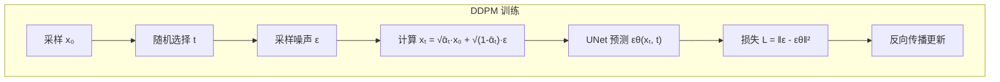

# Diffusion Model 原理

## 概念说明

**Diffusion Model**（扩散模型）是一类基于概率的生成模型，通过学习逐步去噪的过程来生成数据。核心思想：先将数据逐步加噪声直到变成纯噪声（前向过程），再学习从噪声逐步恢复数据（反向过程）。Stable Diffusion、DALL-E、Midjourney 等图像生成模型都基于 Diffusion。

### 为什么 Diffusion Model 如此成功？

- **生成质量高**：超越 GAN，成为图像生成 SOTA
- **训练稳定**：不像 GAN 有模式崩塌问题
- **可控性强**：支持文本引导、图像引导等多种条件控制
- **理论优美**：基于严格的概率论推导

### Diffusion 核心流程

```mermaid
graph LR
    subgraph 前向过程（加噪）
        A[原始图像 x₀] -->|加噪声| B[x₁]
        B -->|加噪声| C[x₂]
        C -->|...| D[xₜ]
        D -->|加噪声| E[纯噪声 xₜ]
    end
    
    subgraph 反向过程（去噪）
        E -->|预测噪声| F[x̂ₜ₋₁]
        F -->|预测噪声| G[x̂ₜ₋₂]
        G -->|...| H[x̂₁]
        H -->|预测噪声| I[生成图像 x̂₀]
    end
    
    style A fill:#e8f5e9
    style E fill:#ffebee
    style I fill:#e8f5e9
```

## 核心原理

### 1. 前向过程（Forward Process）

前向过程逐步向数据添加高斯噪声：

```
q(xₜ | xₜ₋₁) = N(xₜ; √(1-βₜ) · xₜ₋₁, βₜ · I)
```

- βₜ：噪声调度（noise schedule），控制每步加多少噪声
- 经过 T 步后，数据变成近似标准高斯噪声

**重参数化技巧**（一步到位）：

```
xₜ = √(ᾱₜ) · x₀ + √(1-ᾱₜ) · ε,  ε ~ N(0, I)
```

其中 ᾱₜ = ∏(1-βᵢ)，可以直接从 x₀ 计算任意时间步的 xₜ。

### 2. 反向过程（Reverse Process）

反向过程学习从噪声恢复数据：

```
pθ(xₜ₋₁ | xₜ) = N(xₜ₋₁; μθ(xₜ, t), σₜ² · I)
```

**训练目标**：训练一个神经网络 εθ 预测添加的噪声：

```
L = E[‖ε - εθ(xₜ, t)‖²]
```

即：给定加噪后的图像 xₜ 和时间步 t，预测添加的噪声 ε。

### 3. DDPM（Denoising Diffusion Probabilistic Models）



**DDPM 采样（生成）：**
- 从纯噪声 xₜ 开始
- 逐步去噪 T 步（通常 T=1000）
- 每步用 UNet 预测噪声，然后减去
- 缺点：需要 1000 步，生成很慢

### 4. DDIM（Denoising Diffusion Implicit Models）

DDIM 是 DDPM 的加速版本，允许跳步采样：

| 特性 | DDPM | DDIM |
|------|------|------|
| 采样步数 | 1000 | 20-50（可调） |
| 生成速度 | 慢 | 快 20-50 倍 |
| 随机性 | 随机采样 | 确定性采样（η=0） |
| 质量 | 基准 | 接近 DDPM |

```python
# DDIM 采样伪代码
# 选择子序列 [τ₁, τ₂, ..., τₛ]，S << T
# 例如 T=1000, S=50: [1, 21, 41, ..., 981]
for i in range(S, 0, -1):
    t = subsequence[i]
    t_prev = subsequence[i-1]
    
    # UNet 预测噪声
    predicted_noise = model(x_t, t)
    
    # DDIM 更新（确定性）
    x_t_prev = ddim_step(x_t, predicted_noise, t, t_prev)
```

### 5. Classifier-Free Guidance（CFG）

CFG 是控制生成质量和多样性的关键技术：

```
ε̃ = εθ(xₜ, ∅) + w · (εθ(xₜ, c) - εθ(xₜ, ∅))
```

- c：条件（如文本 prompt）
- ∅：无条件（空 prompt）
- w：引导强度（guidance scale）

| w 值 | 效果 |
|------|------|
| 1.0 | 无引导，多样性高但可能偏离 prompt |
| 7.5 | 默认值，平衡质量和多样性 |
| 15+ | 强引导，严格遵循 prompt 但可能过饱和 |

### 6. 噪声调度（Noise Schedule）

```python
# 线性调度
betas = np.linspace(0.0001, 0.02, T)

# 余弦调度（效果更好）
def cosine_schedule(T, s=0.008):
    steps = np.arange(T + 1)
    alphas_bar = np.cos((steps / T + s) / (1 + s) * np.pi / 2) ** 2
    alphas_bar = alphas_bar / alphas_bar[0]
    betas = 1 - alphas_bar[1:] / alphas_bar[:-1]
    return np.clip(betas, 0.0001, 0.999)
```

## 代码示例

> 💻 完整可运行代码：[code-examples/04-cv/diffusion/01_diffusers_basics.py](https://github.com/skyhe58/guide-ai/tree/main/code-examples/04-cv/diffusion/01_diffusers_basics.py)
> 🐍 Python 版本：3.11+

## 实战要点

**理解 Diffusion 的关键：**
- 前向过程是固定的（不需要学习），反向过程是学习的
- UNet 预测的是噪声，不是图像本身
- CFG 是控制生成质量的核心参数
- DDIM 让采样步数从 1000 降到 20-50，是实用化的关键

**常见误解：**
- Diffusion 不是"逐步画图"，而是"逐步去噪"
- 训练时不需要按顺序加噪，可以直接跳到任意时间步
- CFG 不是越大越好，太大会导致过饱和和伪影

## 常见面试题

### Q1: Diffusion Model 的核心原理是什么？

**难度**：⭐⭐⭐ | **频率**：🔥🔥🔥

**答题思路**：前向过程 → 反向过程 → 训练目标 → 采样

**标准答案**：Diffusion Model 包含前向和反向两个过程。前向过程逐步向数据添加高斯噪声，经过 T 步后数据变成纯噪声。反向过程训练一个 UNet 网络学习预测每步添加的噪声，从而逐步去噪恢复数据。训练目标是最小化预测噪声与真实噪声的 MSE 损失。生成时从纯噪声开始，逐步去噪得到生成图像。DDIM 通过跳步采样将步数从 1000 降到 20-50。

**深入追问**：
- DDPM 和 DDIM 的区别？（DDIM 确定性采样，可跳步加速）
- CFG 的作用和原理？（无条件和有条件预测的加权组合，控制引导强度）
- Diffusion 和 GAN 的优劣对比？（Diffusion 训练稳定质量高但慢，GAN 快但训练不稳定）

## 推荐工具

> 📌 以下工具可帮助你更高效地学习和实践本知识点，详见 [模块 7：AI 使用与实践](/7-ai-tools/)

| 工具 | 用途 | 详情 |
|------|------|------|
| Cursor | 辅助编写 Diffusion 代码 | [AI 编程辅助](/7-ai-tools/7.1-efficiency/ai-coding) |
| ChatGPT | 解释数学推导 | [AI 对话助手](/7-ai-tools/7.1-efficiency/ai-chat) |
| Perplexity | 搜索最新论文 | [AI 搜索](/7-ai-tools/7.1-efficiency/ai-search) |

## 参考资料

- [DDPM 论文 — Ho et al. 2020](https://arxiv.org/abs/2006.11239)
- [DDIM 论文 — Song et al. 2020](https://arxiv.org/abs/2010.02502)
- [Classifier-Free Guidance 论文](https://arxiv.org/abs/2207.12598)
- [Lil'Log — What are Diffusion Models?](https://lilianweng.github.io/posts/2021-07-11-diffusion-models/)
- [The Annotated Diffusion Model](https://huggingface.co/blog/annotated-diffusion)
