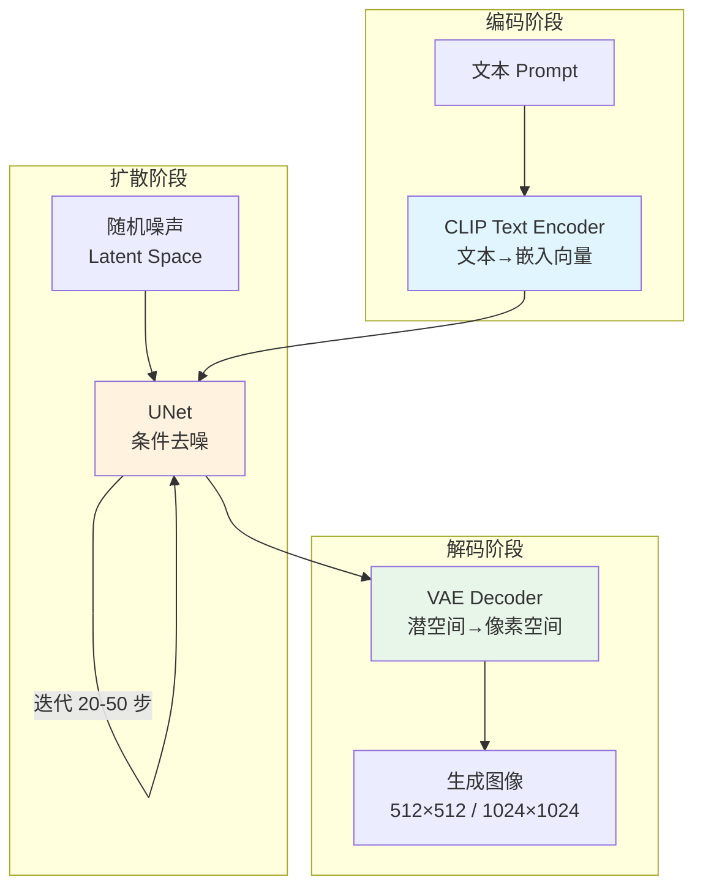
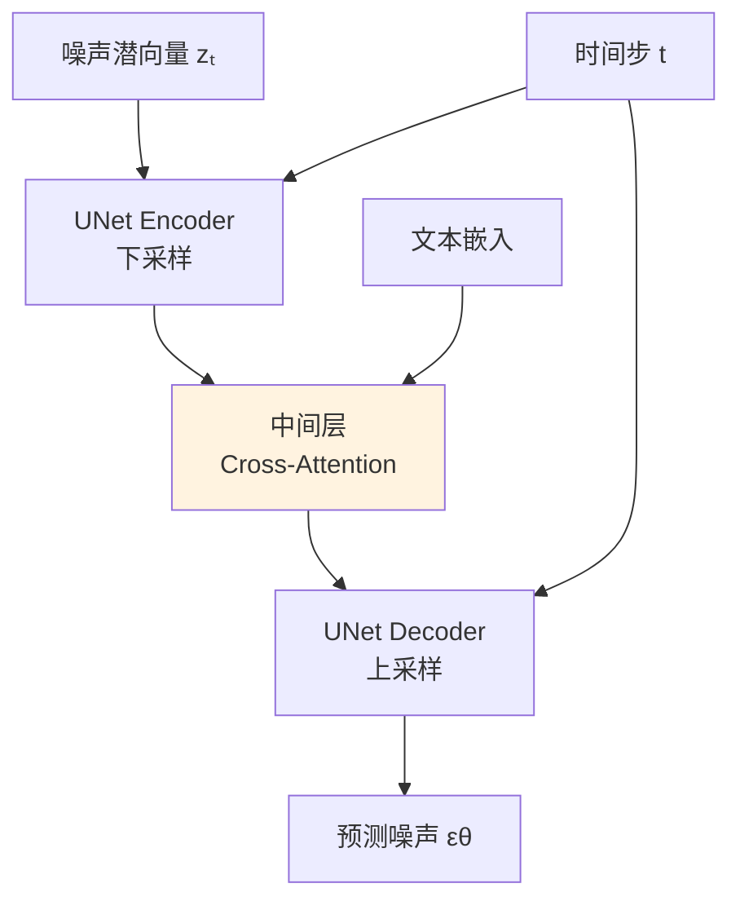

# Stable Diffusion

## 概念说明

**Stable Diffusion**（SD）是 Stability AI 发布的开源文生图模型，是目前最流行的图像生成模型之一。SD 的核心创新是在**潜空间**（Latent Space）而非像素空间进行扩散，大幅降低了计算成本。

### SD 架构总览



## 核心原理

### 1. 三大核心组件

| 组件 | 作用 | 模型 | 参数量 |
|------|------|------|--------|
| **CLIP Text Encoder** | 将文本转为嵌入向量 | OpenCLIP ViT-L/14 | ~400M |
| **UNet** | 在潜空间去噪 | 条件 UNet + Cross-Attention | ~860M |
| **VAE** | 像素空间 ↔ 潜空间 | KL-VAE | ~80M |

### 2. VAE（Variational Autoencoder）

VAE 负责图像和潜空间之间的转换：

```
编码：512×512×3 图像 → 64×64×4 潜向量（压缩 48 倍）
解码：64×64×4 潜向量 → 512×512×3 图像
```

在潜空间做扩散的优势：
- 计算量降低 48 倍（64×64 vs 512×512）
- 潜空间更紧凑，语义信息更集中
- 使得在消费级 GPU 上运行成为可能

### 3. CLIP Text Encoder

CLIP 将文本 prompt 编码为条件向量：

```python
# 文本编码流程
prompt = "a photo of a cat sitting on a sofa"
# 1. Tokenize: 文本 → token IDs
tokens = tokenizer(prompt)  # [49406, 320, 1125, ...]
# 2. Text Encoder: token IDs → 嵌入向量
text_embeddings = text_encoder(tokens)  # shape: (77, 768)
# 77 = 最大 token 长度, 768 = 嵌入维度
```

### 4. UNet 条件去噪

UNet 是 SD 的核心，通过 Cross-Attention 机制融合文本条件：



**Cross-Attention 机制：**
- Q（Query）：来自 UNet 的图像特征
- K（Key）、V（Value）：来自 CLIP 的文本嵌入
- 作用：让图像特征"关注"文本描述的相关部分

### 5. 文生图（Text-to-Image）流程

```python
# 文生图完整流程
# 1. 文本编码
text_emb = clip_encode(prompt)
uncond_emb = clip_encode("")  # 空 prompt（用于 CFG）

# 2. 初始化随机噪声
latent = torch.randn(1, 4, 64, 64)

# 3. 迭代去噪
for t in scheduler.timesteps:  # 例如 50 步
    # CFG: 同时预测有条件和无条件噪声
    noise_cond = unet(latent, t, text_emb)
    noise_uncond = unet(latent, t, uncond_emb)
    noise_pred = noise_uncond + guidance_scale * (noise_cond - noise_uncond)
    
    # 更新潜向量
    latent = scheduler.step(noise_pred, t, latent)

# 4. VAE 解码
image = vae.decode(latent)
```

### 6. 图生图（Image-to-Image）

```python
# 图生图：在原图基础上加噪再去噪
# 1. 原图编码到潜空间
init_latent = vae.encode(init_image)

# 2. 加噪到指定强度（strength 控制）
noisy_latent = scheduler.add_noise(init_latent, noise, start_timestep)
# strength=0.8: 从 80% 噪声开始去噪（改变大）
# strength=0.3: 从 30% 噪声开始去噪（改变小）

# 3. 从 start_timestep 开始去噪
for t in scheduler.timesteps[start_index:]:
    # ... 同文生图
```

### 7. ControlNet 条件控制

ControlNet 在 SD 基础上添加额外的空间条件控制：

| 条件类型 | 输入 | 控制内容 |
|---------|------|---------|
| Canny Edge | 边缘图 | 物体轮廓 |
| Depth | 深度图 | 空间布局 |
| OpenPose | 骨骼图 | 人体姿态 |
| Segmentation | 分割图 | 区域语义 |
| Scribble | 涂鸦 | 粗略形状 |

### 8. SD 版本演进

| 版本 | 分辨率 | 特点 |
|------|--------|------|
| SD 1.5 | 512×512 | 社区生态最丰富 |
| SD 2.1 | 768×768 | 改进 CLIP，效果争议 |
| SDXL | 1024×1024 | 双 UNet，质量大幅提升 |
| SD 3 | 1024×1024 | DiT 架构，MMDiT |
| FLUX | 1024×1024 | Black Forest Labs，最新 |

## 代码示例

> 💻 完整可运行代码：[code-examples/04-cv/diffusion/02_stable_diffusion.py](https://github.com/skyhe58/guide-ai/tree/main/code-examples/04-cv/diffusion/02_stable_diffusion.py)
> 🐍 Python 版本：3.11+
> 📦 依赖：diffusers>=0.25, transformers>=4.36（完整模式）

## 实战要点

**Prompt 工程（SD 专用）：**
- 正向 prompt：描述想要的内容，越具体越好
- 负向 prompt：描述不想要的内容（"blurry, low quality, deformed"）
- 权重语法：`(keyword:1.5)` 增加权重，`(keyword:0.5)` 降低权重
- 质量词：`masterpiece, best quality, highly detailed`

**参数调优：**
- `guidance_scale`：7.5 是默认值，5-15 范围调整
- `num_inference_steps`：20-50 步，越多质量越高但越慢
- `seed`：固定种子可复现结果

## 常见面试题

### Q1: Stable Diffusion 的架构是什么？为什么在潜空间做扩散？

**难度**：⭐⭐⭐ | **频率**：🔥🔥🔥

**答题思路**：三大组件 → 潜空间优势 → 工作流程

**标准答案**：SD 由三个核心组件组成：(1) VAE 将图像压缩到潜空间（512×512→64×64，压缩 48 倍）；(2) UNet 在潜空间进行条件去噪，通过 Cross-Attention 融合文本条件；(3) CLIP Text Encoder 将文本编码为条件向量。在潜空间做扩散的优势：计算量降低 48 倍，使消费级 GPU 可运行；潜空间语义更紧凑，生成质量更好。

**深入追问**：
- Cross-Attention 在 UNet 中的作用？（让图像特征关注文本描述的相关部分）
- CFG 如何控制生成质量？（无条件和有条件预测的加权组合）

## 推荐工具

> 📌 以下工具可帮助你更高效地学习和实践本知识点，详见 [模块 7：AI 使用与实践](/7-ai-tools/)

| 工具 | 用途 | 详情 |
|------|------|------|
| Cursor | 辅助编写 SD 代码 | [AI 编程辅助](/7-ai-tools/7.1-efficiency/ai-coding) |
| ChatGPT | 解释 SD 架构原理 | [AI 对话助手](/7-ai-tools/7.1-efficiency/ai-chat) |
| Perplexity | 搜索 SD 最新进展 | [AI 搜索](/7-ai-tools/7.1-efficiency/ai-search) |

## 参考资料

- [Stable Diffusion 论文 — Rombach et al. 2022](https://arxiv.org/abs/2112.10752)
- [ControlNet 论文 — Zhang et al. 2023](https://arxiv.org/abs/2302.05543)
- [Hugging Face Diffusers 文档](https://huggingface.co/docs/diffusers/)
- [Stability AI](https://stability.ai/)
- [SDXL 论文](https://arxiv.org/abs/2307.01952)
