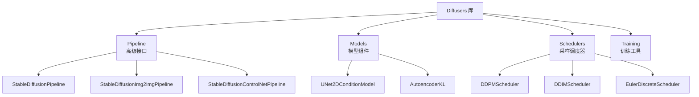

# Diffusers 库

## 概念说明

**Diffusers** 是 Hugging Face 推出的扩散模型库，提供了预训练模型、Pipeline 接口和训练工具。它是使用 Stable Diffusion 等扩散模型的标准方式，支持文生图、图生图、ControlNet、LoRA 微调等功能。

### Diffusers 架构



## 核心原理

### 1. Pipeline 快速使用

```python
from diffusers import StableDiffusionPipeline
import torch

# 加载模型
pipe = StableDiffusionPipeline.from_pretrained(
    "runwayml/stable-diffusion-v1-5",
    torch_dtype=torch.float16,
)
pipe = pipe.to("cuda")

# 文生图
image = pipe(
    prompt="a photo of a cat wearing sunglasses",
    negative_prompt="blurry, low quality",
    num_inference_steps=30,
    guidance_scale=7.5,
    width=512,
    height=512,
).images[0]

image.save("output.png")
```

### 2. 图生图 Pipeline

```python
from diffusers import StableDiffusionImg2ImgPipeline
from PIL import Image

pipe = StableDiffusionImg2ImgPipeline.from_pretrained(
    "runwayml/stable-diffusion-v1-5",
    torch_dtype=torch.float16,
)
pipe = pipe.to("cuda")

init_image = Image.open("input.png").resize((512, 512))

image = pipe(
    prompt="a watercolor painting of a cat",
    image=init_image,
    strength=0.75,      # 0=不变, 1=完全重绘
    guidance_scale=7.5,
).images[0]
```

### 3. ControlNet 条件控制

```python
from diffusers import StableDiffusionControlNetPipeline, ControlNetModel

# 加载 ControlNet（Canny 边缘控制）
controlnet = ControlNetModel.from_pretrained(
    "lllyasviel/sd-controlnet-canny",
    torch_dtype=torch.float16,
)

pipe = StableDiffusionControlNetPipeline.from_pretrained(
    "runwayml/stable-diffusion-v1-5",
    controlnet=controlnet,
    torch_dtype=torch.float16,
)
pipe = pipe.to("cuda")

# 使用边缘图控制生成
canny_image = get_canny_edges(input_image)
image = pipe(
    prompt="a beautiful landscape",
    image=canny_image,
    num_inference_steps=30,
).images[0]
```

### 4. Scheduler（采样调度器）

| Scheduler | 步数 | 质量 | 速度 | 特点 |
|-----------|------|------|------|------|
| DDPMScheduler | 1000 | 高 | 慢 | 原始 DDPM |
| DDIMScheduler | 20-50 | 高 | 快 | 确定性采样 |
| EulerDiscreteScheduler | 20-30 | 高 | 快 | 社区推荐 |
| DPMSolverMultistepScheduler | 15-25 | 高 | 最快 | 最新高效 |

```python
from diffusers import DPMSolverMultistepScheduler

# 更换 Scheduler
pipe.scheduler = DPMSolverMultistepScheduler.from_config(
    pipe.scheduler.config
)
# 现在只需 20 步就能获得好效果
```

### 5. LoRA 微调 SD

```python
from diffusers import StableDiffusionPipeline
from peft import LoraConfig

# 加载基础模型
pipe = StableDiffusionPipeline.from_pretrained(
    "runwayml/stable-diffusion-v1-5",
    torch_dtype=torch.float16,
)

# 加载 LoRA 权重
pipe.load_lora_weights("path/to/lora/weights")

# 调整 LoRA 强度
pipe.fuse_lora(lora_scale=0.8)

# 生成
image = pipe("a photo in my custom style").images[0]
```

**LoRA 训练配置：**

```python
# LoRA 微调 SD 的关键参数
training_config = {
    "pretrained_model": "runwayml/stable-diffusion-v1-5",
    "train_data_dir": "path/to/images",
    "resolution": 512,
    "train_batch_size": 1,
    "gradient_accumulation_steps": 4,
    "learning_rate": 1e-4,
    "lr_scheduler": "cosine",
    "max_train_steps": 1000,
    "lora_rank": 4,           # LoRA 秩
    "lora_alpha": 4,          # LoRA alpha
}
```

### 6. 内存优化

```python
# 启用注意力切片（减少显存）
pipe.enable_attention_slicing()

# 启用 VAE 切片
pipe.enable_vae_slicing()

# 启用模型 CPU 卸载（显存不足时）
pipe.enable_model_cpu_offload()

# 启用 xFormers 加速（需安装 xformers）
pipe.enable_xformers_memory_efficient_attention()

# 使用 float16 减少显存
pipe = pipe.to(torch.float16)
```

## 代码示例

> 💻 完整可运行代码：
> - [code-examples/04-cv/diffusion/01_diffusers_basics.py](https://github.com/your-repo/tree/main/code-examples/04-cv/diffusion/01_diffusers_basics.py)
> - [code-examples/04-cv/diffusion/02_stable_diffusion.py](https://github.com/your-repo/tree/main/code-examples/04-cv/diffusion/02_stable_diffusion.py)
> - [code-examples/04-cv/diffusion/03_controlnet.py](https://github.com/your-repo/tree/main/code-examples/04-cv/diffusion/03_controlnet.py)
> 🐍 Python 版本：3.11+
> 📦 依赖：diffusers>=0.25, transformers>=4.36（完整模式）

## 实战要点

**Diffusers 使用技巧：**
- **模型缓存**：首次下载后模型缓存在 `~/.cache/huggingface/`
- **显存管理**：8GB 显存用 float16 + attention_slicing
- **批量生成**：设置 `num_images_per_prompt` 一次生成多张
- **种子控制**：`generator=torch.Generator().manual_seed(42)` 复现结果

**常见陷阱：**
- 忘记转 float16 导致显存不足
- ControlNet 条件图尺寸必须与输出尺寸一致
- LoRA 权重与基础模型版本不匹配

## 常见面试题

### Q1: Diffusers 库的 Pipeline 和底层组件有什么区别？

**难度**：⭐⭐ | **频率**：🔥🔥

**答题思路**：Pipeline 定位 → 底层组件 → 何时用哪个

**标准答案**：Pipeline 是高级封装，一行代码完成文生图/图生图等任务，适合快速使用和原型开发。底层组件（UNet、VAE、Scheduler）提供细粒度控制，可以自定义采样过程、修改中间结果、实现新功能。生产环境通常用 Pipeline 快速验证，需要定制时拆解为底层组件。

**深入追问**：
- 如何自定义采样过程？（手动调用 UNet 和 Scheduler 的 step 方法）
- Scheduler 如何选择？（DPMSolver 最快，DDIM 最稳定）

## 推荐工具

> 📌 以下工具可帮助你更高效地学习和实践本知识点，详见 [模块 7：AI 使用与实践](/7-ai-tools/)

| 工具 | 用途 | 详情 |
|------|------|------|
| Cursor | 辅助编写 Diffusers 代码 | [AI 编程辅助](/7-ai-tools/7.1-efficiency/ai-coding) |
| ChatGPT | 解释 Diffusers API | [AI 对话助手](/7-ai-tools/7.1-efficiency/ai-chat) |
| Perplexity | 搜索社区模型和 LoRA | [AI 搜索](/7-ai-tools/7.1-efficiency/ai-search) |

## 参考资料

- [Hugging Face Diffusers 文档](https://huggingface.co/docs/diffusers/)
- [Diffusers GitHub](https://github.com/huggingface/diffusers)
- [LoRA 微调 SD 教程](https://huggingface.co/docs/diffusers/training/lora)
- [Civitai — 社区模型](https://civitai.com/)
