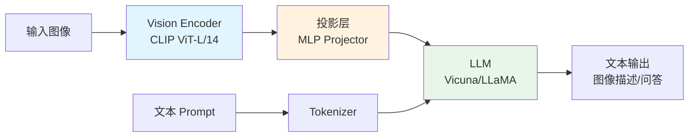

# LLaVA 多模态

## 概念说明

**LLaVA**（Large Language and Vision Assistant）是一种视觉-语言模型（VLM），将视觉编码器与大语言模型连接，实现图文理解、视觉问答等多模态任务。LLaVA 的架构简洁高效，是理解多模态模型的最佳入门。

### 多模态模型的意义

- **突破文本限制**：LLM 只能处理文本，VLM 可以"看图说话"
- **应用广泛**：图文理解、视觉问答、文档分析、医学影像
- **趋势明确**：GPT-4V、Gemini、Claude 3 都支持多模态

### LLaVA 架构



## 核心原理

### 1. 架构组成

| 组件 | 作用 | 模型 |
|------|------|------|
| Vision Encoder | 提取图像特征 | CLIP ViT-L/14（336px） |
| Projector | 对齐视觉和语言特征空间 | 2 层 MLP |
| LLM | 理解和生成文本 | Vicuna-7B/13B 或 LLaMA |

### 2. 训练策略（两阶段）

```mermaid
graph LR
    subgraph 阶段 1：预训练
        A[图文对数据<br/>CC3M 595K] --> B[冻结 Vision Encoder<br/>冻结 LLM<br/>只训练 Projector]
    end
    
    subgraph 阶段 2：指令微调
        C[视觉指令数据<br/>LLaVA-Instruct 158K] --> D[冻结 Vision Encoder<br/>训练 Projector + LLM]
    end
    
    B --> C
    
    style B fill:#e1f5fe
    style D fill:#e8f5e9
```

**阶段 1 — 特征对齐预训练：**
- 数据：595K 图文对（CC3M 子集）
- 目标：训练 Projector 对齐视觉和语言特征空间
- 冻结 Vision Encoder 和 LLM，只训练 Projector

**阶段 2 — 视觉指令微调：**
- 数据：158K 视觉指令数据（GPT-4 生成）
- 目标：让模型学会遵循视觉相关的指令
- 冻结 Vision Encoder，训练 Projector 和 LLM

### 3. 视觉 Token 处理

```python
# LLaVA 的输入构造
# 图像 → Vision Encoder → 576 个视觉 token（24×24 patch）
# 文本 → Tokenizer → N 个文本 token
# 最终输入 = [视觉 tokens] + [文本 tokens]

# 示例 prompt 格式
prompt = """<image>
USER: 请描述这张图片的内容。
ASSISTANT:"""
```

### 4. LLaVA 版本演进

| 版本 | Vision Encoder | LLM | 分辨率 | 特点 |
|------|---------------|-----|--------|------|
| LLaVA 1.0 | CLIP ViT-L | Vicuna-7B | 224 | 初始版本 |
| LLaVA 1.5 | CLIP ViT-L | Vicuna-7B/13B | 336 | MLP Projector |
| LLaVA 1.6 | CLIP ViT-L | Mistral-7B | 动态 | 动态分辨率 |
| LLaVA-NeXT | SigLIP | Qwen2-7B | 动态 | 最新版本 |

### 5. 本地部署

```python
# 使用 transformers 加载 LLaVA
from transformers import LlavaForConditionalGeneration, AutoProcessor

model = LlavaForConditionalGeneration.from_pretrained(
    "llava-hf/llava-1.5-7b-hf",
    torch_dtype=torch.float16,
    device_map="auto",
)
processor = AutoProcessor.from_pretrained("llava-hf/llava-1.5-7b-hf")

# 推理
prompt = "USER: <image>\n请描述这张图片。\nASSISTANT:"
inputs = processor(text=prompt, images=image, return_tensors="pt")
output = model.generate(**inputs, max_new_tokens=200)
response = processor.decode(output[0], skip_special_tokens=True)
```

### 6. 应用场景

| 场景 | 输入 | 输出 | 示例 |
|------|------|------|------|
| 图像描述 | 图片 + "描述图片" | 文本描述 | 自动生成 alt text |
| 视觉问答 | 图片 + 问题 | 答案 | "图中有几个人？" |
| 文档理解 | 文档截图 + 问题 | 提取信息 | 发票信息提取 |
| 代码理解 | 代码截图 + 问题 | 代码解释 | UI 截图生成代码 |

## 代码示例

> 💻 完整可运行代码：[code-examples/04-cv/multimodal/01_llava.py](https://github.com/your-repo/tree/main/code-examples/04-cv/multimodal/01_llava.py)
> 🐍 Python 版本：3.11+
> 📦 依赖：transformers>=4.36（完整模式）

## 实战要点

**部署建议：**
- 7B 模型需要 ~16GB 显存（FP16），量化后 ~8GB
- 本地部署推荐 Ollama（支持 LLaVA）
- API 服务推荐 vLLM（支持多模态模型）

**Prompt 技巧：**
- 明确指定任务类型（"描述"、"分析"、"提取"）
- 提供输出格式要求（JSON、列表等）
- 对于复杂图像，分步提问效果更好

## 常见面试题

### Q1: LLaVA 的架构和训练策略是什么？

**难度**：⭐⭐⭐ | **频率**：🔥🔥🔥

**答题思路**：架构组成 → 两阶段训练 → 关键设计

**标准答案**：LLaVA 由三部分组成：CLIP Vision Encoder 提取图像特征，MLP Projector 对齐视觉和语言特征空间，LLM 进行理解和生成。训练分两阶段：(1) 预训练阶段，冻结 Vision Encoder 和 LLM，只训练 Projector 对齐特征空间；(2) 指令微调阶段，冻结 Vision Encoder，训练 Projector 和 LLM。关键设计：用 MLP 替代线性投影层效果更好；两阶段训练策略高效且有效。

**深入追问**：
- 为什么用 CLIP 作为 Vision Encoder？（CLIP 已经学习了视觉-语言对齐）
- Projector 的作用是什么？（将视觉特征映射到 LLM 的输入空间）
- 如何处理不同分辨率的图像？（LLaVA 1.6 引入动态分辨率）

## 推荐工具

> 📌 以下工具可帮助你更高效地学习和实践本知识点，详见 [模块 7：AI 使用与实践](/7-ai-tools/)

| 工具 | 用途 | 详情 |
|------|------|------|
| Cursor | 辅助编写多模态代码 | [AI 编程辅助](/7-ai-tools/7.1-efficiency/ai-coding) |
| ChatGPT | 解释多模态架构 | [AI 对话助手](/7-ai-tools/7.1-efficiency/ai-chat) |
| Perplexity | 搜索多模态进展 | [AI 搜索](/7-ai-tools/7.1-efficiency/ai-search) |

## 参考资料

- [LLaVA 论文 — Liu et al. 2023](https://arxiv.org/abs/2304.08485)
- [LLaVA 1.5 论文](https://arxiv.org/abs/2310.03744)
- [LLaVA GitHub](https://github.com/haotian-liu/LLaVA)
- [Hugging Face LLaVA 模型](https://huggingface.co/llava-hf)
