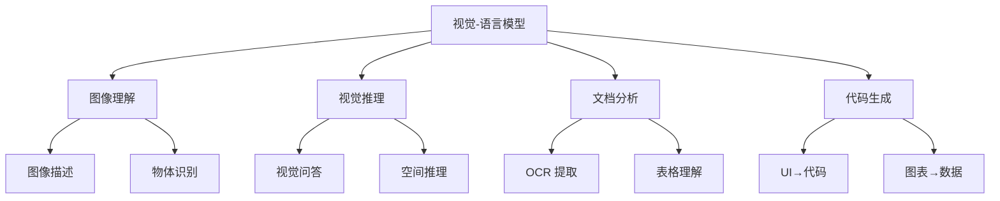
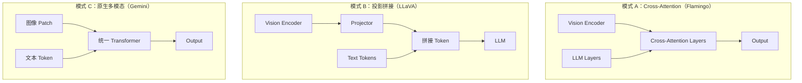

# 视觉-语言模型

## 概念说明

**视觉-语言模型**（Vision-Language Model, VLM）是能同时理解图像和文本的多模态大模型。2023-2024 年，GPT-4V、Gemini、Claude 3、Qwen-VL 等模型将多模态能力推向新高度，成为 AI 应用的重要方向。

### VLM 能力全景



## 核心原理

### 1. 主流 VLM 对比

| 模型 | 厂商 | 开源 | 图像理解 | 文档分析 | 中文 | 部署方式 |
|------|------|------|---------|---------|------|---------|
| GPT-4V/4o | OpenAI | ❌ | ⭐⭐⭐⭐⭐ | ⭐⭐⭐⭐⭐ | ⭐⭐⭐⭐ | API |
| Gemini Pro Vision | Google | ❌ | ⭐⭐⭐⭐ | ⭐⭐⭐⭐ | ⭐⭐⭐ | API |
| Claude 3 Vision | Anthropic | ❌ | ⭐⭐⭐⭐⭐ | ⭐⭐⭐⭐⭐ | ⭐⭐⭐⭐ | API |
| Qwen-VL | 阿里 | ✅ | ⭐⭐⭐⭐ | ⭐⭐⭐⭐ | ⭐⭐⭐⭐⭐ | 本地/API |
| LLaVA 1.6 | 开源社区 | ✅ | ⭐⭐⭐ | ⭐⭐⭐ | ⭐⭐⭐ | 本地 |
| InternVL2 | 上海 AI Lab | ✅ | ⭐⭐⭐⭐ | ⭐⭐⭐⭐ | ⭐⭐⭐⭐⭐ | 本地 |

### 2. GPT-4V / GPT-4o

```python
from openai import OpenAI
import base64

client = OpenAI()

# 方式 1：URL 图像
response = client.chat.completions.create(
    model="gpt-4o",
    messages=[{
        "role": "user",
        "content": [
            {"type": "text", "text": "请描述这张图片的内容"},
            {"type": "image_url", "image_url": {"url": "https://example.com/image.jpg"}},
        ],
    }],
)

# 方式 2：Base64 编码图像
with open("image.jpg", "rb") as f:
    base64_image = base64.b64encode(f.read()).decode()

response = client.chat.completions.create(
    model="gpt-4o",
    messages=[{
        "role": "user",
        "content": [
            {"type": "text", "text": "分析这张图表的数据趋势"},
            {"type": "image_url", "image_url": {
                "url": f"data:image/jpeg;base64,{base64_image}",
                "detail": "high",  # low/high/auto
            }},
        ],
    }],
)
```

### 3. Qwen-VL（中文最强开源 VLM）

```python
from transformers import AutoModelForCausalLM, AutoTokenizer

model = AutoModelForCausalLM.from_pretrained(
    "Qwen/Qwen-VL-Chat",
    device_map="auto",
    trust_remote_code=True,
)
tokenizer = AutoTokenizer.from_pretrained(
    "Qwen/Qwen-VL-Chat",
    trust_remote_code=True,
)

# 图文对话
query = tokenizer.from_list_format([
    {"image": "image.jpg"},
    {"text": "请详细描述这张图片的内容"},
])
response, history = model.chat(tokenizer, query=query, history=None)
print(response)
```

### 4. VLM 架构模式对比



### 5. 应用场景与选型

| 场景 | 推荐模型 | 原因 |
|------|---------|------|
| 通用图文理解 | GPT-4o / Claude 3 | 能力最强 |
| 中文文档分析 | Qwen-VL / InternVL2 | 中文优化 |
| 本地部署 | Qwen-VL / LLaVA | 开源可控 |
| 低成本 | LLaVA 7B | 资源需求低 |
| 医学影像 | 专用微调模型 | 领域适配 |

### 6. VLM 评估基准

| 基准 | 评估内容 | 主要指标 |
|------|---------|---------|
| MMBench | 综合多模态能力 | 准确率 |
| MMMU | 多学科多模态理解 | 准确率 |
| TextVQA | 图像中文字理解 | 准确率 |
| DocVQA | 文档理解 | ANLS |
| ChartQA | 图表理解 | 准确率 |

## 代码示例

> 💻 完整可运行代码：[code-examples/04-cv/multimodal/02_vision_language.py](https://github.com/your-repo/tree/main/code-examples/04-cv/multimodal/02_vision_language.py)
> 🐍 Python 版本：3.11+

## 实战要点

**VLM 使用技巧：**
- **图像质量**：高分辨率图像效果更好，但成本更高
- **Prompt 设计**：明确指定任务和输出格式
- **多图输入**：GPT-4o 支持多图对比分析
- **成本控制**：`detail: "low"` 可降低 Token 消耗

**选型建议：**
- 预算充足 + 最佳效果 → GPT-4o / Claude 3
- 中文场景 + 本地部署 → Qwen-VL
- 快速原型 + 低成本 → LLaVA + Ollama

## 常见面试题

### Q1: 主流视觉-语言模型的架构有哪些模式？

**难度**：⭐⭐⭐ | **频率**：🔥🔥🔥

**答题思路**：三种架构模式 → 各自特点 → 代表模型

**标准答案**：三种主要架构：(1) Cross-Attention 模式（Flamingo）——在 LLM 层间插入交叉注意力层融合视觉特征；(2) 投影拼接模式（LLaVA）——用 Projector 将视觉 token 映射到 LLM 输入空间后拼接；(3) 原生多模态模式（Gemini）——从头训练统一的多模态 Transformer。模式 2 最简单高效，模式 3 理论上限最高但训练成本极大。

**深入追问**：
- 为什么 LLaVA 用 MLP 而不是线性层做 Projector？（MLP 非线性映射能力更强）
- 视觉 token 数量如何影响性能？（更多 token 保留更多细节但增加计算量）

## 推荐工具

> 📌 以下工具可帮助你更高效地学习和实践本知识点，详见 [模块 7：AI 使用与实践](/7-ai-tools/)

| 工具 | 用途 | 详情 |
|------|------|------|
| Cursor | 辅助编写 VLM 代码 | [AI 编程辅助](/7-ai-tools/7.1-efficiency/ai-coding) |
| ChatGPT | 对比 VLM 能力 | [AI 对话助手](/7-ai-tools/7.1-efficiency/ai-chat) |
| Perplexity | 搜索 VLM 评测 | [AI 搜索](/7-ai-tools/7.1-efficiency/ai-search) |

## 参考资料

- [GPT-4V 技术报告](https://openai.com/research/gpt-4v-system-card)
- [Gemini 技术报告](https://arxiv.org/abs/2312.11805)
- [Qwen-VL 论文](https://arxiv.org/abs/2308.12966)
- [InternVL2 论文](https://arxiv.org/abs/2404.16821)
- [MMBench 排行榜](https://mmbench.opencompass.org.cn/)
