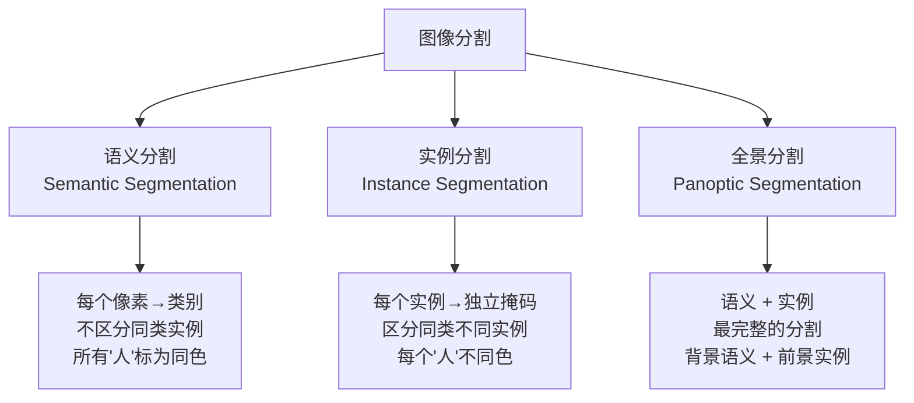
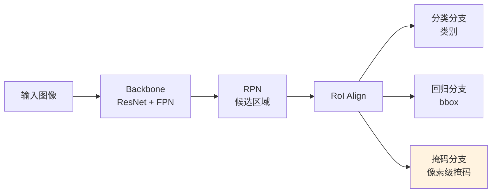

# 语义分割

## 概念说明

图像分割是将图像中的每个像素分配到特定类别或实例的任务。根据粒度不同，分为语义分割、实例分割和全景分割三种类型。分割是自动驾驶、医学影像、遥感等领域的核心技术。

### 三种分割类型对比



| 类型 | 区分实例 | 背景分割 | 代表模型 | 应用场景 |
|------|---------|---------|---------|---------|
| 语义分割 | ❌ | ✅ | FCN, DeepLab | 自动驾驶场景理解 |
| 实例分割 | ✅ | ❌ | Mask R-CNN, YOLO-Seg | 物体计数、交互 |
| 全景分割 | ✅ | ✅ | Panoptic FPN | 完整场景理解 |

## 核心原理

### 1. 语义分割经典模型

**FCN（Fully Convolutional Network）：**
- 将分类网络的全连接层替换为卷积层
- 输出与输入同尺寸的分割图
- 开创性工作，但分割边缘粗糙

**DeepLab 系列：**
- 空洞卷积（Atrous Convolution）：不降低分辨率的情况下扩大感受野
- ASPP（Atrous Spatial Pyramid Pooling）：多尺度特征融合
- CRF 后处理：优化分割边缘

```python
# DeepLabV3+ 使用示例（torchvision）
import torchvision.models.segmentation as seg

model = seg.deeplabv3_resnet101(pretrained=True)
model.eval()

# 推理
output = model(input_tensor)
predictions = output["out"].argmax(dim=1)  # (B, H, W) 类别图
```

### 2. Mask R-CNN（实例分割）

Mask R-CNN 在 Faster R-CNN 基础上添加了掩码分支：



**关键改进：**
- **RoI Align**：替代 RoI Pooling，避免量化误差
- **掩码分支**：对每个 RoI 预测 28×28 的二值掩码
- **解耦设计**：分类和掩码独立预测

### 3. YOLO 实例分割

```python
from ultralytics import YOLO

# 加载分割模型
model = YOLO("yolov8n-seg.pt")

# 推理
results = model("image.jpg")

for result in results:
    masks = result.masks        # 分割掩码
    boxes = result.boxes        # 检测框
    
    if masks is not None:
        for mask, box in zip(masks.data, boxes):
            # mask: 二值掩码 (H, W)
            # box: 检测框信息
            cls = int(box.cls[0])
            conf = float(box.conf[0])
            name = result.names[cls]
            print(f"{name}: {conf:.2f}")
```

### 4. 分割评估指标

| 指标 | 公式 | 说明 |
|------|------|------|
| Pixel Accuracy | 正确像素 / 总像素 | 最简单，类别不平衡时不可靠 |
| mIoU | 各类 IoU 的平均 | 最常用，语义分割标准指标 |
| Dice Score | 2×交集 / (A+B) | 医学影像常用 |
| AP（mask） | 掩码级 AP | 实例分割标准指标 |

```python
def calculate_miou(pred, target, num_classes):
    """计算 mIoU。"""
    ious = []
    for cls in range(num_classes):
        pred_mask = (pred == cls)
        target_mask = (target == cls)
        intersection = (pred_mask & target_mask).sum()
        union = (pred_mask | target_mask).sum()
        if union > 0:
            ious.append(intersection / union)
    return sum(ious) / len(ious) if ious else 0
```

### 5. 分割数据集

| 数据集 | 类别数 | 图像数 | 任务 |
|--------|--------|--------|------|
| PASCAL VOC | 21 | 11K | 语义分割 |
| COCO | 80+53 | 200K | 实例/全景分割 |
| Cityscapes | 30 | 5K | 自动驾驶场景 |
| ADE20K | 150 | 25K | 场景理解 |

## 代码示例

> 💻 完整可运行代码：[code-examples/04-cv/yolo/01_detection.py](https://github.com/skyhe58/guide-ai/tree/main/code-examples/04-cv/yolo/01_detection.py)
> 🐍 Python 版本：3.11+

## 实战要点

**分割任务选择：**
- 只需要知道"哪里是路、哪里是建筑" → 语义分割
- 需要区分"每个人" → 实例分割
- 需要完整场景理解 → 全景分割

**性能优化：**
- 语义分割：DeepLabV3+ 精度高，BiSeNet 速度快
- 实例分割：YOLO-Seg 速度快，Mask R-CNN 精度高
- 推理加速：TensorRT 导出 + FP16

## 常见面试题

### Q1: 语义分割、实例分割和全景分割的区别？

**难度**：⭐⭐ | **频率**：🔥🔥🔥

**答题思路**：三者定义 → 区别 → 应用场景

**标准答案**：语义分割为每个像素分配类别标签，不区分同类的不同实例（所有"人"标为同色）。实例分割在检测的基础上为每个实例生成独立掩码，区分同类不同实例（每个"人"不同色），但不处理背景。全景分割结合两者，对前景物体做实例分割，对背景做语义分割，是最完整的分割任务。

**深入追问**：
- Mask R-CNN 的 RoI Align 相比 RoI Pooling 有什么改进？（避免量化误差，双线性插值）
- mIoU 和 Pixel Accuracy 哪个更可靠？（mIoU，因为 Pixel Accuracy 受类别不平衡影响大）

## 推荐工具

> 📌 以下工具可帮助你更高效地学习和实践本知识点，详见 [模块 7：AI 使用与实践](/7-ai-tools/)

| 工具 | 用途 | 详情 |
|------|------|------|
| Cursor | 辅助编写分割代码 | [AI 编程辅助](/7-ai-tools/7.1-efficiency/ai-coding) |
| ChatGPT | 解释分割算法原理 | [AI 对话助手](/7-ai-tools/7.1-efficiency/ai-chat) |
| Perplexity | 搜索分割模型进展 | [AI 搜索](/7-ai-tools/7.1-efficiency/ai-search) |

## 参考资料

- [Mask R-CNN 论文 — He et al. 2017](https://arxiv.org/abs/1703.06870)
- [DeepLabV3+ 论文](https://arxiv.org/abs/1802.02611)
- [Ultralytics 分割文档](https://docs.ultralytics.com/tasks/segment/)
- [COCO 分割评估](https://cocodataset.org/#detection-eval)
