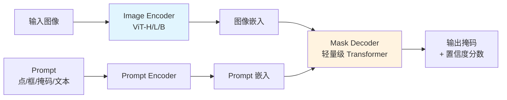

# Segment Anything (SAM)

## 概念说明

**SAM**（Segment Anything Model）是 Meta AI 发布的通用分割模型，能够在零样本（zero-shot）条件下分割任意物体。SAM 的核心创新是引入了 Prompt 机制——通过点、框、文本等提示来指定要分割的目标。

### SAM 的革命性意义

- **零样本分割**：无需针对特定类别训练，开箱即用
- **Prompt 驱动**：点击、框选、文本描述都能指定分割目标
- **通用性强**：在 11M 图像、1B 掩码上训练，泛化能力极强
- **辅助标注**：大幅加速数据标注流程

### SAM 架构



## 核心原理

### 1. 三大组件

| 组件 | 作用 | 模型 | 特点 |
|------|------|------|------|
| Image Encoder | 提取图像特征 | ViT-H（默认） | 重量级，只需运行一次 |
| Prompt Encoder | 编码用户提示 | 稀疏/密集编码 | 轻量级 |
| Mask Decoder | 生成分割掩码 | 2 层 Transformer | 轻量级，实时运行 |

### 2. Prompt 类型

| Prompt 类型 | 输入 | 编码方式 | 适用场景 |
|------------|------|---------|---------|
| 点（Point） | (x, y) + 正/负标签 | 位置编码 + 学习嵌入 | 精确指定目标 |
| 框（Box） | (x1, y1, x2, y2) | 两个角点编码 | 框选目标区域 |
| 掩码（Mask） | 粗略掩码 | 卷积编码 | 迭代细化 |
| 文本（Text） | 文本描述 | CLIP 编码 | SAM 2 支持 |

```python
# SAM 使用示例
from segment_anything import SamPredictor, sam_model_registry

# 加载模型
sam = sam_model_registry["vit_h"](checkpoint="sam_vit_h.pth")
predictor = SamPredictor(sam)

# 设置图像（Image Encoder 只运行一次）
predictor.set_image(image)

# 点 Prompt
masks, scores, logits = predictor.predict(
    point_coords=np.array([[500, 375]]),  # 点坐标
    point_labels=np.array([1]),            # 1=前景, 0=背景
    multimask_output=True,                 # 输出多个候选掩码
)

# 框 Prompt
masks, scores, logits = predictor.predict(
    box=np.array([100, 100, 400, 400]),   # [x1, y1, x2, y2]
    multimask_output=False,
)

# 点 + 框组合
masks, scores, logits = predictor.predict(
    point_coords=np.array([[500, 375]]),
    point_labels=np.array([1]),
    box=np.array([100, 100, 400, 400]),
    multimask_output=False,
)
```

### 3. 自动分割（Segment Everything）

```python
from segment_anything import SamAutomaticMaskGenerator

# 自动分割整张图像
mask_generator = SamAutomaticMaskGenerator(
    model=sam,
    points_per_side=32,        # 网格点密度
    pred_iou_thresh=0.88,      # IoU 阈值
    stability_score_thresh=0.95,# 稳定性阈值
    min_mask_region_area=100,  # 最小掩码面积
)

masks = mask_generator.generate(image)
# 返回所有检测到的掩码列表
for mask in masks:
    segmentation = mask["segmentation"]  # 二值掩码
    area = mask["area"]                  # 面积
    bbox = mask["bbox"]                  # 边界框
    score = mask["predicted_iou"]        # 预测 IoU
```

### 4. SAM 2（视频分割）

SAM 2 扩展到视频领域，支持时序一致的分割：

| 特性 | SAM 1 | SAM 2 |
|------|-------|-------|
| 输入 | 单张图像 | 图像 + 视频 |
| 时序 | 不支持 | 支持帧间传播 |
| 速度 | 基准 | 6x 更快 |
| 精度 | 基准 | 更高 |
| 架构 | ViT + Decoder | Hiera + Memory |

### 5. SAM 模型规格

| 模型 | 参数量 | Image Encoder | 速度 | 精度 |
|------|--------|--------------|------|------|
| SAM ViT-B | 91M | ViT-Base | 快 | 一般 |
| SAM ViT-L | 308M | ViT-Large | 中等 | 较好 |
| SAM ViT-H | 636M | ViT-Huge | 慢 | 最好 |
| MobileSAM | 10M | TinyViT | 最快 | 一般 |
| FastSAM | — | YOLOv8-Seg | 最快 | 一般 |

### 6. SAM + YOLO 组合

```python
# YOLO 检测 + SAM 分割 = 精确实例分割
from ultralytics import YOLO

# 1. YOLO 检测目标
yolo = YOLO("yolov8n.pt")
results = yolo("image.jpg")
boxes = results[0].boxes.xyxy.cpu().numpy()

# 2. SAM 对每个检测框精确分割
predictor.set_image(image)
for box in boxes:
    masks, scores, _ = predictor.predict(
        box=box,
        multimask_output=False,
    )
    # 获得精确的实例掩码
```

## 代码示例

> 💻 完整可运行代码：[code-examples/04-cv/yolo/01_detection.py](https://github.com/your-repo/tree/main/code-examples/04-cv/yolo/01_detection.py)
> 🐍 Python 版本：3.11+
> 📦 依赖：segment-anything>=1.0（完整模式）

## 实战要点

**SAM 使用技巧：**
- Image Encoder 是瓶颈，对同一图像多次分割时只需编码一次
- 多个正负点组合比单点效果好
- 框 Prompt 通常比点 Prompt 更稳定
- MobileSAM/FastSAM 适合实时场景

**应用场景：**
- 数据标注加速（SAM 辅助 + 人工校正）
- 交互式图像编辑（点击分割 + 替换背景）
- 自动驾驶场景理解（SAM + 语义标签）

## 常见面试题

### Q1: SAM 的架构和 Prompt 机制是什么？

**难度**：⭐⭐⭐ | **频率**：🔥🔥🔥

**答题思路**：三大组件 → Prompt 类型 → 零样本能力

**标准答案**：SAM 由三部分组成：(1) Image Encoder（ViT-H）提取图像特征，只需运行一次；(2) Prompt Encoder 编码用户提示（点、框、掩码、文本）；(3) Mask Decoder（轻量 Transformer）融合图像和 Prompt 特征生成掩码。Prompt 机制让 SAM 实现零样本分割——不需要针对特定类别训练，通过用户提示指定分割目标。在 11M 图像、1B 掩码上训练，泛化能力极强。

**深入追问**：
- SAM 为什么能实现零样本分割？（大规模数据训练 + Prompt 机制）
- SAM 和传统分割模型的区别？（传统模型需要类别标签训练，SAM 通过 Prompt 指定）
- SAM 2 相比 SAM 1 有什么改进？（支持视频、更快、Memory 机制）

## 推荐工具

> 📌 以下工具可帮助你更高效地学习和实践本知识点，详见 [模块 7：AI 使用与实践](/7-ai-tools/)

| 工具 | 用途 | 详情 |
|------|------|------|
| Cursor | 辅助编写 SAM 代码 | [AI 编程辅助](/7-ai-tools/7.1-efficiency/ai-coding) |
| ChatGPT | 解释 SAM 架构 | [AI 对话助手](/7-ai-tools/7.1-efficiency/ai-chat) |
| Perplexity | 搜索 SAM 应用 | [AI 搜索](/7-ai-tools/7.1-efficiency/ai-search) |

## 参考资料

- [SAM 论文 — Kirillov et al. 2023](https://arxiv.org/abs/2304.02643)
- [SAM 2 论文](https://arxiv.org/abs/2408.00714)
- [SAM GitHub](https://github.com/facebookresearch/segment-anything)
- [SAM Demo](https://segment-anything.com/)
- [MobileSAM](https://github.com/ChaoningZhang/MobileSAM)
