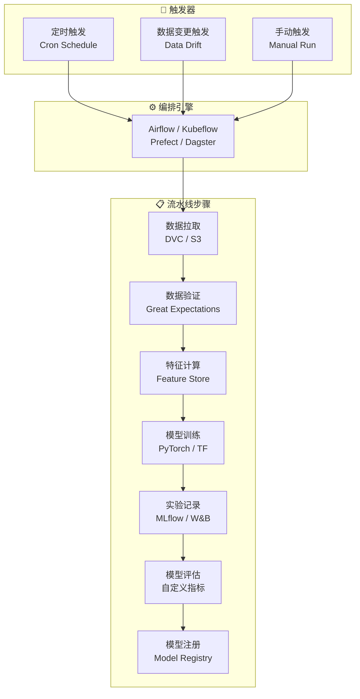
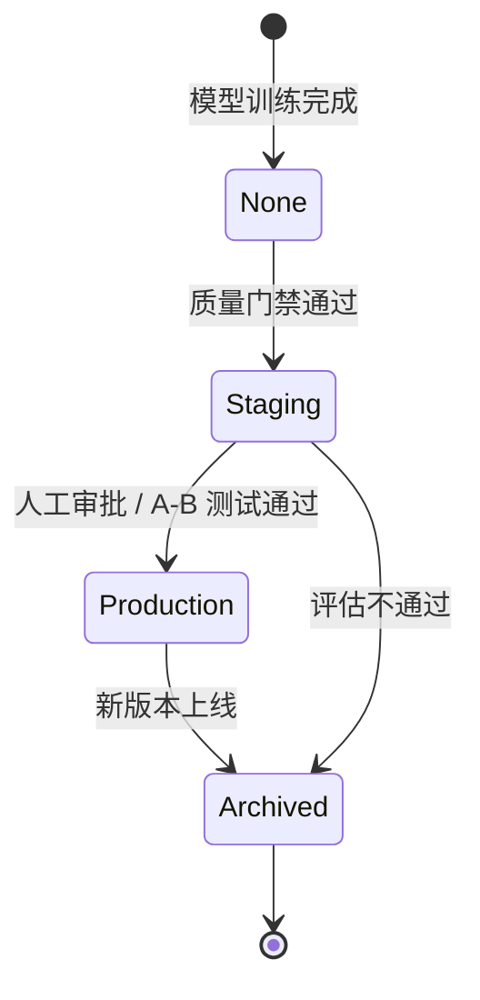

# MLOps 训练流水线

## 概念说明

**MLOps**（Machine Learning Operations）是将 DevOps 理念应用于机器学习系统的实践，核心目标是实现 ML 模型从开发到生产的自动化、可复现、可监控的全生命周期管理。训练流水线是 MLOps 的核心组件，覆盖数据准备、模型训练、评估验证、模型注册四个关键阶段。

### 为什么需要 MLOps 训练流水线？

- **可复现性**：每次训练的数据版本、超参数、代码版本都可追溯
- **自动化**：从数据变更到模型上线全流程自动触发，减少人工干预
- **质量保障**：自动化评估和验证确保模型质量达标才能上线
- **团队协作**：统一的流水线让数据科学家和工程师高效协作
- **快速迭代**：从实验到生产的周期从数周缩短到数小时

### 训练流水线的核心阶段


### 端到端流水线架构



## 核心原理

### 1. 数据准备阶段

数据是 ML 流水线的基础，数据质量直接决定模型质量：

```python
# 数据版本管理（DVC 示例）
# dvc.yaml
"""
stages:
  prepare:
    cmd: python src/prepare.py
    deps:
      - src/prepare.py
      - data/raw/
    outs:
      - data/processed/
    params:
      - prepare.split_ratio
      - prepare.seed
"""

# 数据验证（Great Expectations 风格）
def validate_training_data(df):
    """训练数据质量检查"""
    checks = {
        "非空检查": df.shape[0] > 0,
        "特征完整性": df.isnull().sum().sum() == 0,
        "标签分布": df["label"].nunique() >= 2,
        "数据量充足": df.shape[0] >= 1000,
    }
    failed = [k for k, v in checks.items() if not v]
    if failed:
        raise ValueError(f"数据验证失败: {failed}")
    return True
```

### 2. 模型训练阶段

训练阶段需要记录所有超参数和环境信息，确保可复现：

```python
import mlflow

def train_model(config: dict):
    """标准化训练流程"""
    with mlflow.start_run():
        # 记录超参数
        mlflow.log_params(config)

        # 记录环境信息
        mlflow.log_param("python_version", sys.version)
        mlflow.log_param("gpu_count", torch.cuda.device_count())

        # 训练循环
        model = build_model(config)
        for epoch in range(config["epochs"]):
            loss = train_epoch(model, train_loader)
            val_metrics = evaluate(model, val_loader)

            # 记录指标
            mlflow.log_metrics({
                "train_loss": loss,
                "val_accuracy": val_metrics["accuracy"],
                "val_f1": val_metrics["f1"],
            }, step=epoch)

        # 保存模型
        mlflow.pytorch.log_model(model, "model")
```

### 3. 评估与质量门禁

自动化评估确保只有达标的模型才能进入注册阶段：

```python
def quality_gate(metrics: dict, thresholds: dict) -> bool:
    """模型质量门禁检查"""
    results = {}
    for metric, threshold in thresholds.items():
        actual = metrics.get(metric, 0)
        passed = actual >= threshold
        results[metric] = {
            "actual": actual,
            "threshold": threshold,
            "passed": passed,
        }

    all_passed = all(r["passed"] for r in results.values())
    return all_passed, results

# 使用示例
thresholds = {
    "accuracy": 0.95,
    "f1_score": 0.90,
    "latency_p99_ms": 100,  # 推理延迟
}
passed, details = quality_gate(eval_metrics, thresholds)
```

### 4. 模型注册与版本管理



### 5. 流水线编排工具对比

| 工具 | 特点 | 适用场景 | 学习曲线 |
|------|------|----------|----------|
| **Airflow** | 成熟稳定、社区大 | 通用数据/ML 流水线 | 中等 |
| **Kubeflow** | K8s 原生、GPU 支持好 | 大规模 ML 训练 | 较高 |
| **Prefect** | Python 原生、易上手 | 中小规模 ML 项目 | 低 |
| **Dagster** | 数据资产导向 | 数据密集型 ML 项目 | 中等 |
| **ZenML** | MLOps 专用 | 端到端 ML 流水线 | 低 |

## 代码示例

> 💻 完整可运行代码：[code-examples/05-ai-engineering/mlops/01_mlflow_tracking.py](/code-examples/05-ai-engineering/mlops/01_mlflow_tracking.py)
> 🐍 Python 版本：3.11+
> 📦 依赖：mlflow>=2.0（可选，服务模式）

```python
# 简化的 MLOps 流水线示例
class MLPipeline:
    """端到端 ML 训练流水线"""

    def __init__(self, config):
        self.config = config
        self.stages = ["data_prep", "train", "evaluate", "register"]

    def run(self):
        for stage in self.stages:
            print(f"执行阶段: {stage}")
            getattr(self, f"stage_{stage}")()

    def stage_data_prep(self):
        """数据准备：拉取、验证、预处理"""
        ...

    def stage_train(self):
        """模型训练：配置超参、训练、记录实验"""
        ...

    def stage_evaluate(self):
        """模型评估：离线指标、基准对比、质量门禁"""
        ...

    def stage_register(self):
        """模型注册：打包、版本化、阶段推进"""
        ...
```

## 实战要点

**流水线设计原则：**
- **幂等性**：同样的输入和配置，多次运行结果一致
- **可观测性**：每个阶段都有日志、指标、产物记录
- **失败恢复**：支持从失败的阶段重新开始，不需要从头运行
- **参数化**：所有配置通过参数传入，不硬编码
- **版本化**：数据、代码、配置、模型都有版本追踪

**常见陷阱：**
- 训练数据和评估数据有泄漏（时间序列数据尤其注意）
- 没有记录数据预处理步骤，导致线上线下不一致
- 评估指标和业务指标脱节（准确率高但用户体验差）
- 流水线太复杂，调试困难（建议先简单后复杂）
- 忽略数据漂移检测，模型上线后性能逐渐下降

**生产环境建议：**
- 使用 DVC 或类似工具管理数据版本
- 训练和推理使用相同的预处理代码（避免 training-serving skew）
- 设置自动化的数据漂移检测和模型性能监控
- 保留所有历史模型版本，支持快速回滚

## 常见面试题

### Q1: 请描述一个完整的 MLOps 训练流水线包含哪些阶段？

**难度**：⭐⭐⭐ | **频率**：🔥🔥🔥

**答题思路**：按阶段展开 → 每个阶段的关键操作 → 阶段间的衔接

**标准答案**：完整的 MLOps 训练流水线包含四个核心阶段：(1) 数据准备——数据拉取、版本管理（DVC）、质量验证（Great Expectations）、特征工程；(2) 模型训练——超参数配置、分布式训练、实验追踪（MLflow/W&B）；(3) 模型评估——离线指标计算、与基准模型对比、质量门禁检查；(4) 模型注册——模型打包、版本注册、阶段推进（Staging → Production）。整个流水线由编排引擎（Airflow/Kubeflow）管理，支持定时触发、数据变更触发和手动触发。

**深入追问**：
- 如何保证训练的可复现性？（数据版本 + 代码版本 + 环境版本 + 随机种子）
- 如何处理训练流水线中的失败？（检查点恢复 + 阶段重试 + 告警通知）
- 如何检测数据漂移？（统计检验 + 特征分布对比 + 模型性能监控）

### Q2: Training-Serving Skew 是什么？如何避免？

**难度**：⭐⭐⭐ | **频率**：🔥🔥🔥

**答题思路**：定义问题 → 常见原因 → 解决方案

**标准答案**：Training-Serving Skew 指训练时和推理时的数据处理逻辑不一致，导致模型在生产环境表现与离线评估不符。常见原因：(1) 训练用 Pandas 预处理，推理用不同的代码；(2) 特征计算逻辑不一致；(3) 数据归一化参数不同。解决方案：(1) 使用统一的预处理 Pipeline（如 sklearn Pipeline）；(2) 将预处理逻辑打包到模型中；(3) 使用 Feature Store 统一特征计算；(4) 端到端测试验证训练和推理输出一致。

**深入追问**：
- Feature Store 的作用是什么？（统一特征定义、计算、存储和服务）
- 如何做端到端的一致性测试？（用训练数据子集做推理，对比结果）

### Q3: 如何设计模型的质量门禁？

**难度**：⭐⭐⭐⭐ | **频率**：🔥🔥

**答题思路**：门禁维度 → 阈值设定 → 自动化集成

**标准答案**：质量门禁从多个维度评估模型：(1) 性能指标——准确率、F1、AUC 等必须超过阈值；(2) 对比基准——新模型必须优于当前生产模型；(3) 推理性能——延迟 P99、吞吐量满足 SLA；(4) 公平性——不同群体的表现差异在可接受范围内；(5) 鲁棒性——对抗样本和边界情况的表现。阈值设定需要结合业务需求，建议从宽松开始逐步收紧。门禁检查集成到 CI/CD 流水线中自动执行。

**深入追问**：
- 如何处理门禁不通过的情况？（自动通知 + 详细报告 + 人工审查）
- A/B 测试和离线评估的关系？（离线评估是必要条件，A/B 测试验证线上效果）

## 推荐工具

> 📌 以下工具可帮助你更高效地学习和实践本知识点，详见 [模块 7：AI 使用与实践](/7-ai-tools/)

| 工具 | 用途 | 详情 |
|------|------|------|
| Cursor | 辅助编写 MLOps 流水线代码 | [AI 编程辅助](/7-ai-tools/7.1-efficiency/ai-coding) |
| ChatGPT | 讨论 MLOps 架构设计方案 | [AI 对话助手](/7-ai-tools/7.1-efficiency/ai-chat) |
| Perplexity | 搜索 MLOps 最新实践和工具 | [AI 搜索](/7-ai-tools/7.1-efficiency/ai-search) |

## 参考资料

- [Google — MLOps: Continuous delivery for ML](https://cloud.google.com/architecture/mlops-continuous-delivery-and-automation-pipelines-in-machine-learning)
- [MLflow Documentation](https://mlflow.org/docs/latest/index.html)
- [Kubeflow Pipelines](https://www.kubeflow.org/docs/components/pipelines/)
- [DVC — Data Version Control](https://dvc.org/doc)
- [Made With ML — MLOps](https://madewithml.com/courses/mlops/)
