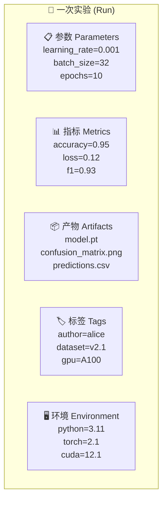
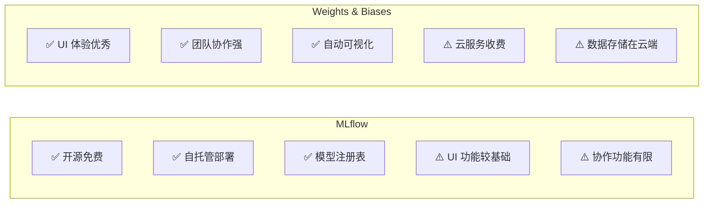
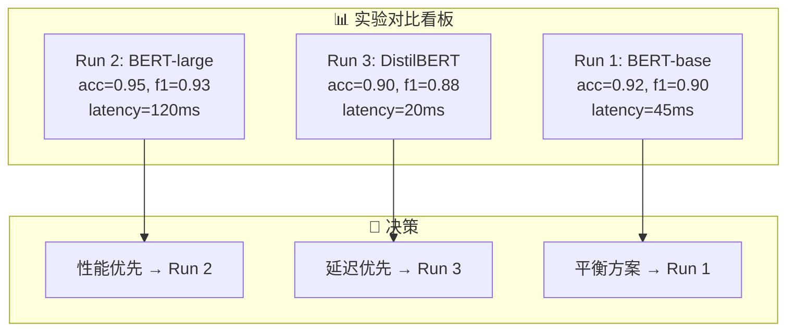

# 实验追踪

## 概念说明

**实验追踪**（Experiment Tracking）是 MLOps 的基础能力，用于系统化记录每次模型训练的超参数、指标、产物和环境信息。没有实验追踪，ML 项目很快就会陷入"哪个模型效果最好？用了什么参数？"的混乱中。

### 为什么需要实验追踪？

- **可复现性**：完整记录每次实验的所有配置，随时可以复现
- **对比分析**：多个实验的指标并排对比，快速找到最优方案
- **团队协作**：团队成员共享实验结果，避免重复工作
- **决策依据**：基于数据而非记忆做模型选择决策
- **审计合规**：金融、医疗等行业要求模型决策可追溯

### 实验追踪的核心要素



### MLflow vs Weights & Biases 对比



## 核心原理

### 1. MLflow 实验追踪

MLflow 是最流行的开源实验追踪工具，提供四大组件：

```python
import mlflow

# 设置追踪服务器
mlflow.set_tracking_uri("http://localhost:5000")

# 创建或获取实验
mlflow.set_experiment("text-classification")

# 开始一次实验运行
with mlflow.start_run(run_name="bert-base-v1"):
    # 记录参数
    mlflow.log_params({
        "model_name": "bert-base-chinese",
        "learning_rate": 3e-5,
        "batch_size": 32,
        "max_length": 512,
        "epochs": 5,
    })

    # 训练循环中记录指标
    for epoch in range(5):
        train_loss = train_one_epoch(model, train_loader)
        val_acc = evaluate(model, val_loader)
        mlflow.log_metrics({
            "train_loss": train_loss,
            "val_accuracy": val_acc,
        }, step=epoch)

    # 记录产物
    mlflow.log_artifact("confusion_matrix.png")
    mlflow.pytorch.log_model(model, "model")

    # 记录标签
    mlflow.set_tags({
        "author": "alice",
        "dataset_version": "v2.1",
    })
```

### 2. Weights & Biases 实验追踪

W&B 提供更丰富的可视化和协作功能：

```python
import wandb

# 初始化项目
wandb.init(
    project="text-classification",
    name="bert-base-v1",
    config={
        "model_name": "bert-base-chinese",
        "learning_rate": 3e-5,
        "batch_size": 32,
        "epochs": 5,
    },
)

# 训练循环中记录
for epoch in range(5):
    train_loss = train_one_epoch(model, train_loader)
    val_acc = evaluate(model, val_loader)
    wandb.log({
        "train_loss": train_loss,
        "val_accuracy": val_acc,
        "epoch": epoch,
    })

# 记录表格数据
table = wandb.Table(columns=["text", "pred", "label"])
for sample in eval_samples:
    table.add_data(sample.text, sample.pred, sample.label)
wandb.log({"predictions": table})

wandb.finish()
```

### 3. 超参数搜索与追踪

```python
# MLflow + Optuna 超参数搜索
import optuna

def objective(trial):
    params = {
        "learning_rate": trial.suggest_float("lr", 1e-5, 1e-3, log=True),
        "batch_size": trial.suggest_categorical("batch_size", [16, 32, 64]),
        "dropout": trial.suggest_float("dropout", 0.1, 0.5),
    }

    with mlflow.start_run(nested=True):
        mlflow.log_params(params)
        model = train_model(params)
        score = evaluate(model)
        mlflow.log_metric("val_f1", score)
        return score

with mlflow.start_run(run_name="hyperparam-search"):
    study = optuna.create_study(direction="maximize")
    study.optimize(objective, n_trials=50)
    mlflow.log_params(study.best_params)
    mlflow.log_metric("best_f1", study.best_value)
```

### 4. 实验对比与分析



### 5. 实验追踪最佳实践

| 实践 | 说明 | 重要性 |
|------|------|--------|
| **命名规范** | 统一的 run name 格式：`{model}-{dataset}-{date}` | ⭐⭐⭐ |
| **参数完整** | 记录所有影响结果的参数，包括随机种子 | ⭐⭐⭐ |
| **指标分步** | 按 epoch/step 记录指标，不只记录最终值 | ⭐⭐⭐ |
| **产物管理** | 保存模型、配置文件、评估报告 | ⭐⭐ |
| **环境记录** | 记录 Python 版本、依赖版本、GPU 型号 | ⭐⭐ |
| **标签分类** | 用标签区分实验类型、负责人、数据集版本 | ⭐⭐ |

## 代码示例

> 💻 完整可运行代码：
> - [code-examples/05-ai-engineering/mlops/01_mlflow_tracking.py](/code-examples/05-ai-engineering/mlops/01_mlflow_tracking.py)
> - [code-examples/05-ai-engineering/mlops/02_wandb_experiment.py](/code-examples/05-ai-engineering/mlops/02_wandb_experiment.py)
> 🐍 Python 版本：3.11+
> 📦 依赖：mlflow>=2.0, wandb>=0.15

## 实战要点

**MLflow 部署建议：**
- 开发环境用本地文件存储（`mlflow ui`）
- 团队环境部署 MLflow Tracking Server + PostgreSQL + S3
- 生产环境考虑 Databricks Managed MLflow

**W&B 使用建议：**
- 个人项目用免费版足够
- 团队项目评估 W&B Teams
- 敏感数据考虑 W&B Server（私有部署）

**常见陷阱：**
- 只记录最终指标，不记录训练过程（无法分析过拟合）
- 参数记录不完整（漏掉数据预处理参数）
- 实验命名混乱（"test1"、"final_v2_really_final"）
- 不清理失败的实验运行（占用存储空间）
- 忽略环境信息记录（换机器后无法复现）

## 常见面试题

### Q1: MLflow 和 W&B 的区别？如何选择？

**难度**：⭐⭐ | **频率**：🔥🔥🔥

**答题思路**：从部署方式、功能、成本三个维度对比

**标准答案**：MLflow 是开源工具，支持自托管，数据完全可控，适合对数据安全要求高的企业；W&B 是 SaaS 服务，UI 体验更好，自动可视化和团队协作功能更强，适合快速迭代的团队。选择建议：(1) 数据敏感、需要私有部署 → MLflow；(2) 重视可视化和协作 → W&B；(3) 预算有限 → MLflow（免费）；(4) 大型团队 → 两者都可以，看具体需求。

**深入追问**：
- MLflow 的四大组件分别是什么？（Tracking、Projects、Models、Registry）
- W&B 的 Sweep 功能是什么？（自动化超参数搜索）
- 如何从 MLflow 迁移到 W&B？（导出实验数据 + 适配 API）

### Q2: 实验追踪应该记录哪些信息？

**难度**：⭐⭐ | **频率**：🔥🔥🔥

**答题思路**：按类别列举 → 说明每类的重要性

**标准答案**：实验追踪应记录五类信息：(1) 参数——所有超参数、数据预处理参数、随机种子；(2) 指标——训练损失、验证指标（按 step 记录）、最终评估指标；(3) 产物——模型文件、配置文件、评估报告、混淆矩阵图；(4) 环境——Python 版本、依赖版本、GPU 型号、CUDA 版本；(5) 元数据——实验者、数据集版本、代码 commit hash、实验目的说明。

**深入追问**：
- 如何处理大量实验的存储问题？（定期清理 + 只保留重要产物）
- 如何实现实验的自动对比？（MLflow 的 compare runs / W&B 的 parallel coordinates）

### Q3: 如何设计超参数搜索策略？

**难度**：⭐⭐⭐ | **频率**：🔥🔥

**答题思路**：搜索方法对比 → 实践建议 → 与实验追踪结合

**标准答案**：超参数搜索策略包括：(1) 网格搜索——穷举所有组合，适合参数少的情况；(2) 随机搜索——随机采样，效率比网格搜索高；(3) 贝叶斯优化（Optuna）——基于历史结果智能选择下一组参数，效率最高；(4) 早停策略——表现差的实验提前终止，节省资源。实践建议：先用随机搜索确定大致范围，再用贝叶斯优化精细搜索。所有搜索过程都要通过实验追踪记录。

**深入追问**：
- Optuna 的 TPE 采样器原理？（Tree-structured Parzen Estimator）
- 如何在分布式环境下做超参数搜索？（Optuna 支持分布式 study）

## 推荐工具

> 📌 以下工具可帮助你更高效地学习和实践本知识点，详见 [模块 7：AI 使用与实践](/7-ai-tools/)

| 工具 | 用途 | 详情 |
|------|------|------|
| Cursor | 辅助编写实验追踪代码 | [AI 编程辅助](/7-ai-tools/7.1-efficiency/ai-coding) |
| ChatGPT | 讨论实验设计和超参数策略 | [AI 对话助手](/7-ai-tools/7.1-efficiency/ai-chat) |
| Perplexity | 搜索 MLflow/W&B 最新功能 | [AI 搜索](/7-ai-tools/7.1-efficiency/ai-search) |

## 参考资料

- [MLflow — Tracking](https://mlflow.org/docs/latest/tracking.html)
- [Weights & Biases — Documentation](https://docs.wandb.ai/)
- [Optuna — Hyperparameter Optimization](https://optuna.readthedocs.io/)
- [Neptune.ai — Experiment Tracking Best Practices](https://neptune.ai/blog/ml-experiment-tracking)
