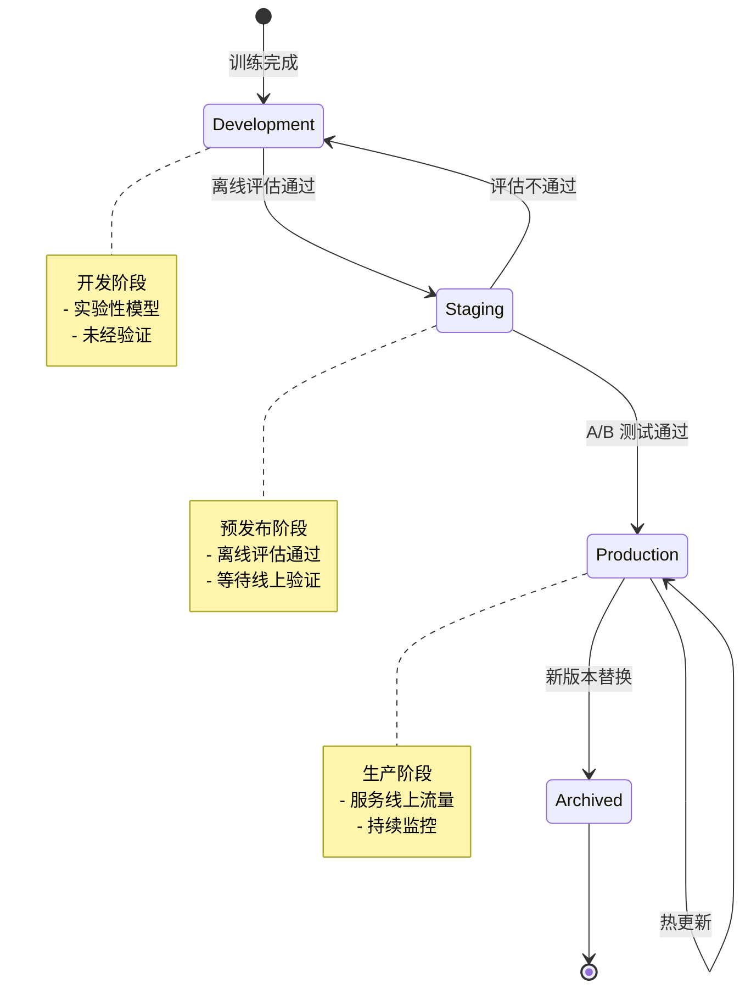
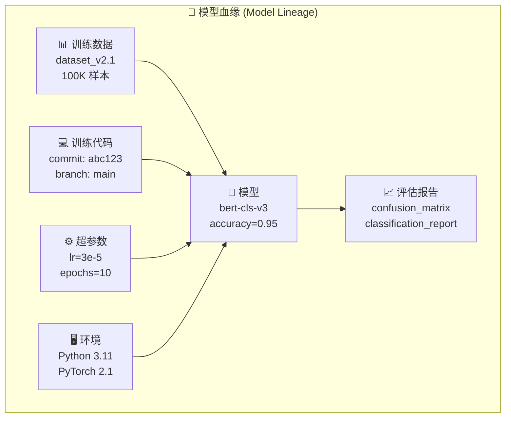
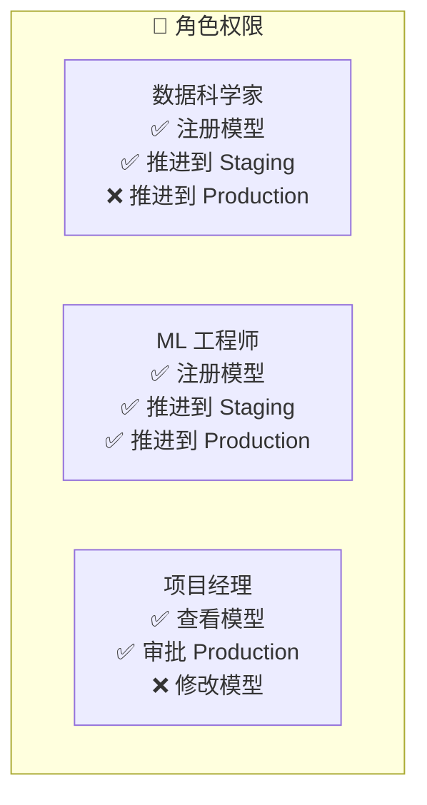

# 模型版本管理

## 概念说明

**模型版本管理**（Model Registry）是 MLOps 中管理模型生命周期的核心组件，类似于代码的 Git 仓库，但专门针对 ML 模型。它提供模型的版本化存储、阶段管理（Staging/Production/Archived）、血缘追踪和访问控制。

### 为什么需要模型版本管理？

- **版本追溯**：随时回滚到任意历史版本
- **阶段管理**：模型从开发到生产的规范化流转
- **血缘追踪**：每个模型版本关联训练数据、代码、超参数
- **团队协作**：多人协作时避免模型覆盖和混乱
- **合规审计**：满足金融、医疗等行业的模型治理要求

### 模型生命周期



### 模型血缘追踪



## 核心原理

### 1. MLflow Model Registry

```python
import mlflow
from mlflow.tracking import MlflowClient

client = MlflowClient()

# 注册模型
model_uri = f"runs:/{run_id}/model"
result = mlflow.register_model(model_uri, "text-classifier")
print(f"模型版本: {result.version}")

# 添加模型描述
client.update_model_version(
    name="text-classifier",
    version=result.version,
    description="BERT-base 中文文本分类模型，训练数据 v2.1",
)

# 阶段推进
client.transition_model_version_stage(
    name="text-classifier",
    version=result.version,
    stage="Staging",
)

# 加载特定阶段的模型
model = mlflow.pyfunc.load_model("models:/text-classifier/Staging")
```

### 2. 模型版本策略

| 策略 | 说明 | 适用场景 |
|------|------|----------|
| **语义版本** | v1.0.0（主版本.次版本.补丁） | 正式发布的模型 |
| **自增版本** | v1, v2, v3... | 快速迭代的实验 |
| **时间戳版本** | 20241201-143000 | 自动化流水线 |
| **Git 关联** | commit hash | 代码-模型强关联 |

### 3. 模型打包与格式

```python
# MLflow 模型打包（包含推理逻辑）
class TextClassifierWrapper(mlflow.pyfunc.PythonModel):
    """自定义模型包装器，包含预处理和后处理"""

    def load_context(self, context):
        import torch
        self.model = torch.load(context.artifacts["model_path"])
        self.tokenizer = load_tokenizer(context.artifacts["tokenizer_path"])

    def predict(self, context, model_input):
        # 预处理
        tokens = self.tokenizer(model_input["text"].tolist())
        # 推理
        with torch.no_grad():
            outputs = self.model(**tokens)
        # 后处理
        predictions = outputs.logits.argmax(dim=-1)
        return predictions.numpy()

# 注册自定义模型
mlflow.pyfunc.log_model(
    artifact_path="model",
    python_model=TextClassifierWrapper(),
    artifacts={
        "model_path": "model.pt",
        "tokenizer_path": "tokenizer/",
    },
    pip_requirements=["torch==2.1.0", "transformers==4.35.0"],
)
```

### 4. 模型访问控制



### 5. 模型回滚策略

```python
def rollback_model(model_name: str, target_version: int):
    """模型回滚到指定版本"""
    client = MlflowClient()

    # 获取当前生产版本
    current_prod = client.get_latest_versions(model_name, stages=["Production"])

    if current_prod:
        # 将当前版本归档
        client.transition_model_version_stage(
            name=model_name,
            version=current_prod[0].version,
            stage="Archived",
        )

    # 将目标版本推进到生产
    client.transition_model_version_stage(
        name=model_name,
        version=target_version,
        stage="Production",
    )
    print(f"已回滚到版本 {target_version}")
```

## 代码示例

> 💻 完整可运行代码：[code-examples/05-ai-engineering/mlops/03_model_registry.py](/code-examples/05-ai-engineering/mlops/03_model_registry.py)
> 🐍 Python 版本：3.11+
> 📦 依赖：mlflow>=2.0

## 实战要点

**模型注册最佳实践：**
- 每个注册的模型都要有完整的描述和标签
- 模型版本关联训练实验的 run_id，确保血缘可追溯
- 生产模型推进需要至少两人审批
- 保留最近 N 个版本的模型文件，旧版本只保留元数据

**常见陷阱：**
- 模型文件太大导致注册缓慢（使用模型压缩或外部存储）
- 没有记录模型的依赖版本（推理时版本不匹配）
- 回滚时忘记同步更新推理服务配置
- 多个团队使用同一个模型名称导致冲突

## 常见面试题

### Q1: 模型版本管理和代码版本管理有什么区别？

**难度**：⭐⭐ | **频率**：🔥🔥🔥

**答题思路**：对比维度 → 关键差异 → 为什么需要专门的工具

**标准答案**：模型版本管理和代码版本管理的核心区别：(1) 文件大小——模型文件通常 GB 级别，Git 不适合管理大文件；(2) 依赖关系——模型版本需要关联训练数据、超参数、代码版本（血缘追踪）；(3) 生命周期——模型有 Staging/Production/Archived 等阶段，代码没有；(4) 评估维度——模型需要性能指标评估，代码用测试覆盖率；(5) 回滚复杂度——模型回滚需要考虑推理服务、缓存、A/B 测试等。

**深入追问**：
- 如何实现模型和代码的联合版本管理？（Git + DVC + MLflow）
- 模型的血缘追踪包含哪些信息？（数据版本、代码 commit、超参数、环境）

### Q2: 如何设计模型的阶段推进流程？

**难度**：⭐⭐⭐ | **频率**：🔥🔥

**答题思路**：阶段定义 → 推进条件 → 自动化集成

**标准答案**：标准的模型阶段推进流程：(1) Development → Staging：离线评估指标达标、代码审查通过；(2) Staging → Production：A/B 测试验证线上效果、性能测试通过（延迟/吞吐量）、安全审查通过；(3) Production → Archived：新版本上线后自动归档旧版本。推进条件可以集成到 CI/CD 流水线中自动检查，关键阶段（如推进到 Production）需要人工审批。

**深入追问**：
- 如何处理紧急回滚？（预设回滚脚本 + 一键回滚 + 自动通知）
- 多模型依赖时如何管理版本？（模型依赖图 + 兼容性矩阵）

### Q3: 模型注册表应该存储哪些元数据？

**难度**：⭐⭐ | **频率**：🔥🔥

**答题思路**：元数据分类 → 每类的作用 → 查询场景

**标准答案**：模型注册表应存储：(1) 基本信息——模型名称、版本号、描述、创建时间、创建者；(2) 训练信息——训练实验 ID、超参数、训练数据版本、训练时长；(3) 评估信息——各项指标值、评估数据集、评估报告；(4) 部署信息——模型格式、依赖列表、推理配置、资源需求；(5) 治理信息——审批记录、阶段变更历史、访问权限。这些元数据支持模型搜索、对比、审计等场景。

**深入追问**：
- 如何实现模型的全文搜索？（Elasticsearch 索引模型元数据）
- 如何处理模型元数据的一致性？（事务性更新 + 乐观锁）

## 推荐工具

> 📌 以下工具可帮助你更高效地学习和实践本知识点，详见 [模块 7：AI 使用与实践](/7-ai-tools/)

| 工具 | 用途 | 详情 |
|------|------|------|
| Cursor | 辅助编写模型注册代码 | [AI 编程辅助](/7-ai-tools/7.1-efficiency/ai-coding) |
| ChatGPT | 讨论模型版本管理策略 | [AI 对话助手](/7-ai-tools/7.1-efficiency/ai-chat) |
| Perplexity | 搜索 Model Registry 最佳实践 | [AI 搜索](/7-ai-tools/7.1-efficiency/ai-search) |

## 参考资料

- [MLflow — Model Registry](https://mlflow.org/docs/latest/model-registry.html)
- [DVC — Model Registry](https://dvc.org/doc/use-cases/model-registry)
- [Google — ML Metadata](https://www.tensorflow.org/tfx/guide/mlmd)
- [Hugging Face — Model Hub](https://huggingface.co/docs/hub/models)
