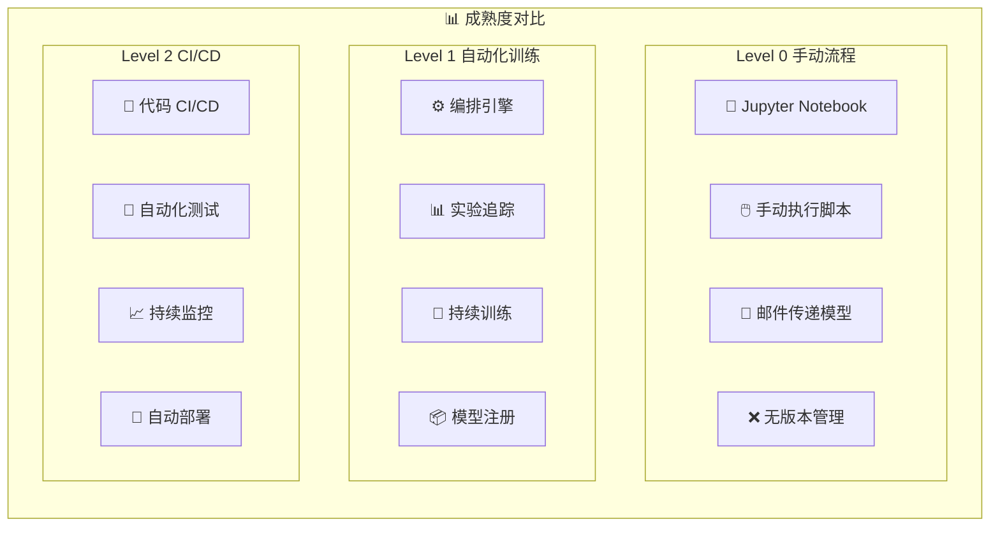
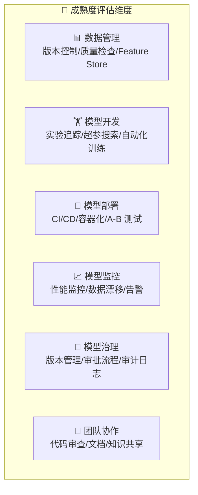

# MLOps 成熟度模型

## 概念说明

**MLOps 成熟度模型**是评估组织 ML 工程化水平的框架，由 Google 提出，分为 Level 0（手动）、Level 1（自动化训练）、Level 2（自动化 CI/CD）三个级别。理解成熟度模型有助于团队制定渐进式的 MLOps 改进路线图。

### 三个成熟度级别概览


### 各级别详细对比



## 核心原理

### 1. Level 0 — 手动流程

这是大多数 ML 团队的起点，所有步骤都是手动执行：

```python
# Level 0 典型工作流（反面教材）
# 1. 数据科学家在 Jupyter Notebook 中训练模型
# 2. 手动调参，凭记忆记录结果
# 3. 导出模型文件，通过邮件/Slack 发给工程师
# 4. 工程师手动部署到服务器
# 5. 没有监控，出问题才发现

# 问题：
# - 无法复现实验结果
# - 部署周期长（数天到数周）
# - 模型质量无保障
# - 团队协作困难
```

**Level 0 的特征：**
| 维度 | 状态 |
|------|------|
| 训练 | 手动执行脚本/Notebook |
| 实验管理 | 无或手动记录 |
| 模型部署 | 手动复制文件 |
| 监控 | 无 |
| 数据管理 | 无版本控制 |
| 测试 | 无自动化测试 |

### 2. Level 1 — 自动化训练

引入流水线编排和实验追踪，实现训练过程自动化：

```python
# Level 1 典型工作流
# 1. 数据变更自动触发训练流水线
# 2. 流水线自动执行：数据验证 → 训练 → 评估 → 注册
# 3. 实验追踪记录所有参数和指标
# 4. 模型注册到 Model Registry
# 5. 部署仍需手动触发

class Level1Pipeline:
    """Level 1 自动化训练流水线"""

    def __init__(self):
        self.stages = [
            ("data_validation", self.validate_data),
            ("feature_engineering", self.compute_features),
            ("model_training", self.train_model),
            ("model_evaluation", self.evaluate_model),
            ("model_registration", self.register_model),
        ]

    def run(self, trigger: str):
        print(f"流水线触发: {trigger}")
        for name, stage_fn in self.stages:
            print(f"  执行阶段: {name}")
            stage_fn()
        print("流水线完成")
```

**Level 1 的关键改进：**
| 维度 | Level 0 → Level 1 |
|------|-------------------|
| 训练 | 手动 → 自动化流水线 |
| 实验管理 | 无 → MLflow/W&B |
| 触发方式 | 手动 → 定时/数据驱动 |
| 模型管理 | 文件传递 → Model Registry |
| 特征管理 | 临时脚本 → Feature Store |

### 3. Level 2 — 自动化 CI/CD

在 Level 1 基础上增加 CI/CD 流水线，实现从代码提交到模型部署的全自动化：

```python
# Level 2 典型工作流
# 1. 数据科学家提交代码 PR
# 2. CI 自动运行：代码检查 → 单元测试 → 集成测试
# 3. 训练流水线自动执行
# 4. 模型评估通过质量门禁
# 5. CD 自动部署到 Staging → A/B 测试 → Production
# 6. 持续监控模型性能，异常自动告警

class Level2CICD:
    """Level 2 CI/CD 流水线"""

    def ci_pipeline(self, commit_hash: str):
        """持续集成"""
        self.run_linting()          # 代码规范检查
        self.run_unit_tests()       # 单元测试
        self.run_integration_tests() # 集成测试
        self.validate_data_schema()  # 数据 Schema 验证
        self.run_training_pipeline() # 训练流水线

    def cd_pipeline(self, model_version: str):
        """持续部署"""
        self.deploy_to_staging()     # 部署到预发布
        self.run_smoke_tests()       # 冒烟测试
        self.run_ab_test()           # A/B 测试
        self.promote_to_production() # 推进到生产
        self.setup_monitoring()      # 配置监控
```

### 4. 成熟度评估维度



### 5. 从 Level 0 到 Level 2 的路线图

| 阶段 | 时间 | 关键行动 | 工具 |
|------|------|----------|------|
| **L0 → L1 基础** | 1-2 月 | 引入实验追踪 | MLflow |
| **L1 初级** | 2-3 月 | 构建训练流水线 | Airflow/Prefect |
| **L1 中级** | 3-4 月 | 引入 Model Registry | MLflow Registry |
| **L1 高级** | 4-6 月 | 持续训练 + Feature Store | Feast |
| **L1 → L2 基础** | 6-8 月 | CI/CD 集成 | GitHub Actions |
| **L2 初级** | 8-10 月 | 自动化测试 | pytest + Great Expectations |
| **L2 中级** | 10-12 月 | 自动部署 + A/B 测试 | Kubernetes + Istio |
| **L2 高级** | 12+ 月 | 持续监控 + 自动回滚 | Prometheus + Grafana |

## 代码示例

> 💻 完整可运行代码：[code-examples/05-ai-engineering/milestone_projects/cicd_pipeline/main.py](/code-examples/05-ai-engineering/milestone_projects/cicd_pipeline/main.py)
> 🐍 Python 版本：3.11+

## 实战要点

**成熟度提升建议：**
- 不要试图一步到位，从 Level 0 直接跳到 Level 2
- 每个级别都要稳定运行一段时间再升级
- 优先解决团队最痛的问题（通常是可复现性）
- 工具选择要考虑团队技术栈和学习成本

**常见陷阱：**
- 过度工程化：小团队不需要 Kubeflow + Kubernetes
- 忽略文化变革：工具只是手段，流程和习惯更重要
- 没有度量改进效果：需要量化指标证明 MLOps 投入的价值
- 一次引入太多工具：团队消化不了，反而降低效率

## 常见面试题

### Q1: 请描述 MLOps 的三个成熟度级别

**难度**：⭐⭐⭐ | **频率**：🔥🔥🔥

**答题思路**：逐级描述 → 关键差异 → 升级路径

**标准答案**：MLOps 成熟度分三级：Level 0（手动）——所有步骤手动执行，Notebook 开发，无实验追踪，手动部署，无监控；Level 1（自动化训练）——引入流水线编排（Airflow）、实验追踪（MLflow）、持续训练、Model Registry，但部署仍需手动；Level 2（自动化 CI/CD）——在 Level 1 基础上增加代码 CI/CD、自动化测试、自动部署、A/B 测试、持续监控，实现从代码提交到模型上线的全自动化。

**深入追问**：
- 你们团队目前在哪个级别？如何改进？（结合实际经验回答）
- Level 1 到 Level 2 最大的挑战是什么？（自动化测试和监控体系建设）
- 小团队（3-5 人）应该追求哪个级别？（Level 1 足够，重点是可复现性）

### Q2: 如何评估一个团队的 MLOps 成熟度？

**难度**：⭐⭐⭐ | **频率**：🔥🔥

**答题思路**：评估维度 → 评估方法 → 改进建议

**标准答案**：从六个维度评估：(1) 数据管理——是否有数据版本控制和质量检查；(2) 模型开发——是否有实验追踪和自动化训练；(3) 模型部署——是否有 CI/CD 和容器化部署；(4) 模型监控——是否有性能监控和数据漂移检测；(5) 模型治理——是否有版本管理和审批流程；(6) 团队协作——是否有代码审查和文档规范。每个维度按 0-2 分评估，总分反映整体成熟度。

**深入追问**：
- 如何量化 MLOps 投入的 ROI？（模型上线周期、故障恢复时间、实验效率）
- 哪个维度最容易被忽视？（模型监控和数据漂移检测）

### Q3: 持续训练（Continuous Training）和持续部署（Continuous Deployment）的区别？

**难度**：⭐⭐⭐ | **频率**：🔥🔥

**答题思路**：定义区别 → 触发条件 → 实现方式

**标准答案**：持续训练（CT）是当数据变化或模型性能下降时自动触发模型重新训练，属于 Level 1；持续部署（CD）是训练完成后自动经过测试、验证、部署到生产环境，属于 Level 2。CT 的触发条件：定时触发、数据漂移检测、性能指标下降。CD 的触发条件：新模型版本注册且通过质量门禁。两者结合实现"数据变化 → 自动训练 → 自动部署"的闭环。

**深入追问**：
- 如何检测数据漂移来触发重训练？（PSI、KS 检验、特征分布监控）
- 自动部署的风险如何控制？（金丝雀发布、A/B 测试、自动回滚）

## 推荐工具

> 📌 以下工具可帮助你更高效地学习和实践本知识点，详见 [模块 7：AI 使用与实践](/7-ai-tools/)

| 工具 | 用途 | 详情 |
|------|------|------|
| Cursor | 辅助编写 MLOps 自动化脚本 | [AI 编程辅助](/7-ai-tools/7.1-efficiency/ai-coding) |
| ChatGPT | 评估团队 MLOps 成熟度 | [AI 对话助手](/7-ai-tools/7.1-efficiency/ai-chat) |
| Perplexity | 搜索 MLOps 成熟度案例 | [AI 搜索](/7-ai-tools/7.1-efficiency/ai-search) |

## 参考资料

- [Google — MLOps: Continuous delivery and automation pipelines](https://cloud.google.com/architecture/mlops-continuous-delivery-and-automation-pipelines-in-machine-learning)
- [Microsoft — MLOps Maturity Model](https://learn.microsoft.com/en-us/azure/architecture/ai-ml/guide/mlops-maturity-model)
- [Neptune.ai — MLOps Maturity Assessment](https://neptune.ai/blog/mlops-maturity-model)
