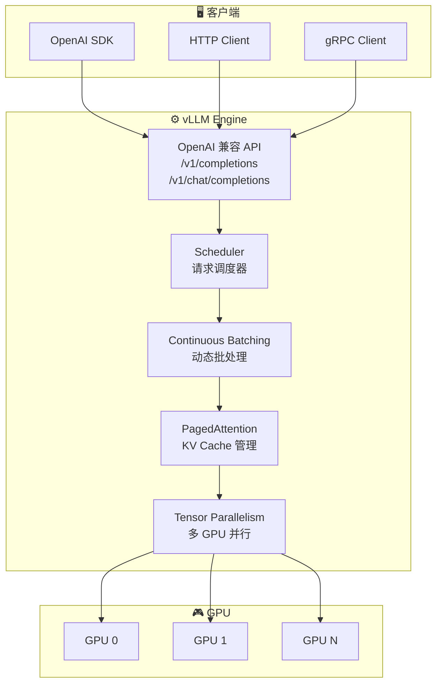
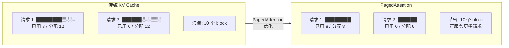
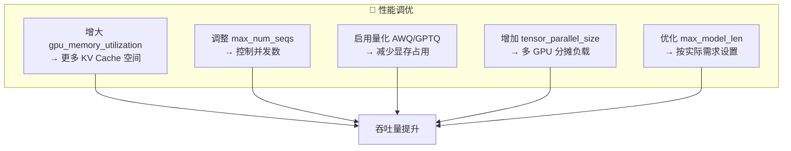

# vLLM 推理服务

## 概念说明

**vLLM** 是一个高性能的 LLM 推理和服务框架，核心创新是 **PagedAttention** 技术，通过类似操作系统虚拟内存的方式管理 KV Cache，显著提升推理吞吐量。vLLM 提供 OpenAI 兼容的 API 接口，是目前生产环境部署 LLM 的首选方案之一。

### 为什么选择 vLLM？

- **高吞吐量**：PagedAttention 减少显存浪费，支持更多并发请求
- **低延迟**：Continuous Batching 动态合并请求，减少等待时间
- **OpenAI 兼容**：直接替换 OpenAI API，无需修改客户端代码
- **多模型支持**：支持 Llama、Qwen、ChatGLM 等主流开源模型
- **Tensor Parallelism**：多 GPU 并行推理，支持大模型部署

### vLLM 架构概览



### PagedAttention 原理



## 核心原理

### 1. vLLM 部署配置

```bash
# Docker 启动 vLLM
docker run --gpus all \
    -v ~/.cache/huggingface:/root/.cache/huggingface \
    -p 8000:8000 \
    vllm/vllm-openai:latest \
    --model Qwen/Qwen2-7B-Instruct \
    --tensor-parallel-size 1 \
    --max-model-len 4096 \
    --gpu-memory-utilization 0.9
```

```python
# Python API 启动
from vllm import LLM, SamplingParams

# 加载模型
llm = LLM(
    model="Qwen/Qwen2-7B-Instruct",
    tensor_parallel_size=1,       # GPU 数量
    max_model_len=4096,           # 最大序列长度
    gpu_memory_utilization=0.9,   # GPU 显存利用率
    trust_remote_code=True,
)

# 推理
sampling_params = SamplingParams(
    temperature=0.7,
    top_p=0.9,
    max_tokens=512,
)
outputs = llm.generate(["你好，请介绍一下自己"], sampling_params)
```

### 2. OpenAI 兼容 API

```python
from openai import OpenAI

# 连接 vLLM 服务（与 OpenAI API 完全兼容）
client = OpenAI(
    base_url="http://localhost:8000/v1",
    api_key="not-needed",  # vLLM 不需要 API Key
)

response = client.chat.completions.create(
    model="Qwen/Qwen2-7B-Instruct",
    messages=[
        {"role": "system", "content": "你是一个有帮助的助手"},
        {"role": "user", "content": "什么是 RAG？"},
    ],
    temperature=0.7,
    max_tokens=512,
    stream=True,  # 支持流式输出
)

for chunk in response:
    if chunk.choices[0].delta.content:
        print(chunk.choices[0].delta.content, end="")
```

### 3. Tensor Parallelism 多 GPU 部署

```python
# 多 GPU 部署（70B 模型需要多卡）
llm = LLM(
    model="Qwen/Qwen2-72B-Instruct",
    tensor_parallel_size=4,       # 4 张 GPU
    max_model_len=8192,
    gpu_memory_utilization=0.95,
    dtype="bfloat16",
)
```

### 4. 关键配置参数

| 参数 | 说明 | 推荐值 |
|------|------|--------|
| `tensor_parallel_size` | GPU 并行数 | 模型大小决定 |
| `max_model_len` | 最大序列长度 | 按需设置 |
| `gpu_memory_utilization` | 显存利用率 | 0.85-0.95 |
| `max_num_seqs` | 最大并发序列数 | 256 |
| `max_num_batched_tokens` | 批处理最大 token 数 | 根据显存调整 |
| `dtype` | 数据类型 | auto/bfloat16 |
| `quantization` | 量化方式 | awq/gptq/None |

### 5. 性能调优策略



## 代码示例

> 💻 完整可运行代码：[code-examples/05-ai-engineering/serving/01_vllm_config.py](/code-examples/05-ai-engineering/serving/01_vllm_config.py)
> 🐍 Python 版本：3.11+
> 📦 依赖：vllm>=0.4.0, openai>=1.0
> 🐳 Docker：`docker run --gpus all -p 8000:8000 vllm/vllm-openai:latest --model Qwen/Qwen2-7B-Instruct`

## 实战要点

**部署建议：**
- 7B 模型：单张 A100-40G 或 RTX 4090 即可
- 13B 模型：单张 A100-80G 或 2x RTX 4090
- 70B 模型：4x A100-80G（Tensor Parallelism）
- 生产环境建议使用 AWQ 量化减少显存占用

**常见陷阱：**
- `max_model_len` 设置过大导致 OOM（按实际需求设置）
- 忘记设置 `trust_remote_code=True`（部分模型需要）
- 没有预热（第一次请求延迟高，需要 warmup）
- 并发数设置过高导致延迟飙升（需要压测确定最优值）

**监控指标：**
- 吞吐量（tokens/s）
- 首 token 延迟（Time to First Token, TTFT）
- 端到端延迟（P50/P95/P99）
- GPU 利用率和显存使用率
- 请求队列长度

## 常见面试题

### Q1: vLLM 的 PagedAttention 原理是什么？

**难度**：⭐⭐⭐⭐ | **频率**：🔥🔥🔥

**答题思路**：类比操作系统 → 解决什么问题 → 具体实现

**标准答案**：PagedAttention 借鉴操作系统虚拟内存的分页机制来管理 KV Cache。传统方式为每个请求预分配连续的 KV Cache 空间，导致内存碎片和浪费（平均浪费 60-80%）。PagedAttention 将 KV Cache 分成固定大小的 block（类似内存页），按需分配，不需要连续空间。这样：(1) 消除内存碎片，提高显存利用率；(2) 支持更多并发请求；(3) 支持 KV Cache 共享（如 beam search 中多个候选共享前缀的 KV Cache）。

**深入追问**：
- PagedAttention 的 block size 如何选择？（通常 16，太小增加管理开销，太大浪费空间）
- Continuous Batching 和 Static Batching 的区别？（动态 vs 静态，请求完成即释放 vs 等所有请求完成）

### Q2: 如何选择 vLLM 的部署配置？

**难度**：⭐⭐⭐ | **频率**：🔥🔥🔥

**答题思路**：模型大小 → GPU 选择 → 关键参数 → 压测验证

**标准答案**：部署配置选择步骤：(1) 根据模型大小确定 GPU 数量——7B 模型约需 14GB 显存（FP16），70B 约需 140GB；(2) 选择 `tensor_parallel_size`——等于 GPU 数量；(3) 设置 `gpu_memory_utilization`——生产环境 0.85-0.90，留余量防 OOM；(4) 设置 `max_model_len`——按业务需求，不要设太大；(5) 考虑量化——AWQ/GPTQ 可减少约 50% 显存；(6) 压测验证——用实际请求模式测试吞吐量和延迟。

**深入追问**：
- AWQ 和 GPTQ 量化的区别？（AWQ 更快，GPTQ 精度略高）
- 如何做 vLLM 的压力测试？（使用 vLLM benchmark 工具或自定义脚本）

### Q3: vLLM 和 TGI 的区别？

**难度**：⭐⭐⭐ | **频率**：🔥🔥

**答题思路**：架构差异 → 性能对比 → 选择建议

**标准答案**：vLLM 核心优势是 PagedAttention，吞吐量更高；TGI 是 Hugging Face 官方推理框架，生态集成更好。性能上 vLLM 在高并发场景吞吐量通常高 2-4 倍。功能上 TGI 支持更多模型格式和 Hugging Face Hub 集成。选择建议：追求极致性能 → vLLM；需要 Hugging Face 生态集成 → TGI；需要简单部署 → TGI（Docker 一键启动）。

**深入追问**：
- 还有哪些 LLM 推理框架？（TensorRT-LLM、llama.cpp、Ollama）
- 如何评估推理框架的性能？（TTFT、吞吐量、并发数、显存效率）

## 推荐工具

> 📌 以下工具可帮助你更高效地学习和实践本知识点，详见 [模块 7：AI 使用与实践](/7-ai-tools/)

| 工具 | 用途 | 详情 |
|------|------|------|
| Cursor | 辅助编写 vLLM 配置和部署脚本 | [AI 编程辅助](/7-ai-tools/7.1-efficiency/ai-coding) |
| ChatGPT | 讨论 vLLM 性能调优策略 | [AI 对话助手](/7-ai-tools/7.1-efficiency/ai-chat) |
| Perplexity | 搜索 vLLM 最新版本和基准测试 | [AI 搜索](/7-ai-tools/7.1-efficiency/ai-search) |

## 参考资料

- [vLLM — Documentation](https://docs.vllm.ai/)
- [vLLM — PagedAttention Paper](https://arxiv.org/abs/2309.06180)
- [vLLM — GitHub](https://github.com/vllm-project/vllm)
- [Hugging Face — Text Generation Inference](https://huggingface.co/docs/text-generation-inference)
