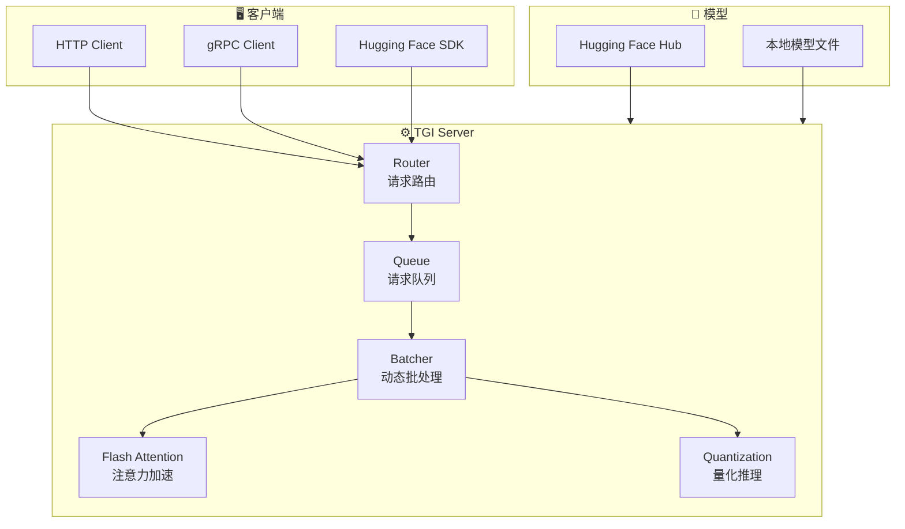
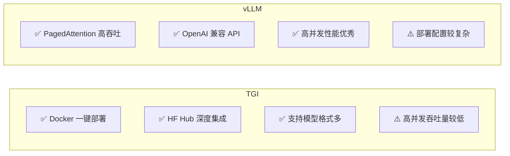

# TGI 推理服务

## 概念说明

**TGI**（Text Generation Inference）是 Hugging Face 官方推出的高性能文本生成推理框架，专为生产环境设计。它提供 Docker 一键部署、Flash Attention 加速、Continuous Batching、量化支持等特性，与 Hugging Face 生态深度集成。

### TGI 的核心特性

- **Docker 一键部署**：无需复杂配置，Docker 命令即可启动
- **Flash Attention**：优化的注意力计算，减少显存占用
- **Continuous Batching**：动态批处理，提升吞吐量
- **量化支持**：GPTQ、AWQ、bitsandbytes 量化
- **Hugging Face Hub 集成**：直接从 Hub 加载模型
- **Token Streaming**：支持流式输出，降低首 token 延迟

### TGI 架构



## 核心原理

### 1. Docker 部署

```bash
# 基础部署
docker run --gpus all \
    -v /data/models:/data \
    -p 8080:80 \
    ghcr.io/huggingface/text-generation-inference:latest \
    --model-id Qwen/Qwen2-7B-Instruct \
    --max-input-length 2048 \
    --max-total-tokens 4096 \
    --max-batch-prefill-tokens 4096

# 量化部署（减少显存）
docker run --gpus all \
    -v /data/models:/data \
    -p 8080:80 \
    ghcr.io/huggingface/text-generation-inference:latest \
    --model-id Qwen/Qwen2-7B-Instruct \
    --quantize gptq \
    --max-input-length 2048 \
    --max-total-tokens 4096

# 多 GPU 部署
docker run --gpus all \
    -v /data/models:/data \
    -p 8080:80 \
    ghcr.io/huggingface/text-generation-inference:latest \
    --model-id Qwen/Qwen2-72B-Instruct \
    --num-shard 4 \
    --max-input-length 4096 \
    --max-total-tokens 8192
```

### 2. 客户端调用

```python
import requests

# HTTP 调用
response = requests.post(
    "http://localhost:8080/generate",
    json={
        "inputs": "什么是 RAG？",
        "parameters": {
            "max_new_tokens": 512,
            "temperature": 0.7,
            "top_p": 0.9,
            "do_sample": True,
        },
    },
)
print(response.json()["generated_text"])

# 流式调用
response = requests.post(
    "http://localhost:8080/generate_stream",
    json={
        "inputs": "请解释 Transformer 架构",
        "parameters": {"max_new_tokens": 512},
    },
    stream=True,
)
for line in response.iter_lines():
    if line:
        print(line.decode(), end="")

# Hugging Face SDK
from huggingface_hub import InferenceClient

client = InferenceClient("http://localhost:8080")
output = client.text_generation(
    "什么是向量数据库？",
    max_new_tokens=512,
    stream=True,
)
for token in output:
    print(token, end="")
```

### 3. TGI 关键参数

| 参数 | 说明 | 推荐值 |
|------|------|--------|
| `--model-id` | 模型 ID 或路径 | HF Hub ID |
| `--num-shard` | GPU 分片数 | GPU 数量 |
| `--max-input-length` | 最大输入长度 | 2048-4096 |
| `--max-total-tokens` | 最大总 token 数 | 4096-8192 |
| `--max-batch-prefill-tokens` | 预填充最大 token | 4096 |
| `--quantize` | 量化方式 | gptq/awq/None |
| `--max-concurrent-requests` | 最大并发数 | 128 |
| `--waiting-served-ratio` | 等待/服务比 | 1.2 |

### 4. TGI vs vLLM 对比



### 5. 健康检查与监控

```python
# 健康检查
health = requests.get("http://localhost:8080/health")
assert health.status_code == 200

# 获取模型信息
info = requests.get("http://localhost:8080/info")
print(info.json())
# {"model_id": "Qwen/Qwen2-7B-Instruct", "model_dtype": "float16", ...}

# 获取运行指标
metrics = requests.get("http://localhost:8080/metrics")
print(metrics.text)  # Prometheus 格式指标
```

## 代码示例

> 💻 完整可运行代码：[code-examples/05-ai-engineering/serving/01_vllm_config.py](/code-examples/05-ai-engineering/serving/01_vllm_config.py)
> 🐍 Python 版本：3.11+
> 🐳 Docker：`docker run --gpus all -p 8080:80 ghcr.io/huggingface/text-generation-inference:latest --model-id Qwen/Qwen2-7B-Instruct`

## 实战要点

**部署建议：**
- 开发环境用 Docker 快速启动，生产环境用 Kubernetes 编排
- 优先使用 Flash Attention 2（需要 GPU 支持）
- 量化模型可以显著减少显存占用（约 50%）
- 设置合理的 `max-concurrent-requests` 防止过载

**常见陷阱：**
- 忘记挂载模型缓存目录（每次启动都要重新下载）
- `max-total-tokens` 设置过大导致 OOM
- 没有设置健康检查导致负载均衡器路由到不健康实例
- 忽略 `--waiting-served-ratio` 导致请求排队过长

## 常见面试题

### Q1: TGI 的 Continuous Batching 是如何工作的？

**难度**：⭐⭐⭐ | **频率**：🔥🔥

**答题思路**：对比 Static Batching → 动态调度原理 → 性能优势

**标准答案**：传统 Static Batching 等所有请求生成完毕才处理下一批，短请求被长请求拖慢。Continuous Batching 在每个生成步骤后检查是否有请求完成，完成的请求立即返回，空出的位置立即填入新请求。这样：(1) 短请求不会被长请求阻塞；(2) GPU 利用率更高；(3) 整体吞吐量提升 2-5 倍。TGI 的实现还包括预填充和生成阶段的分离调度。

**深入追问**：
- 预填充（Prefill）和生成（Decode）阶段有什么区别？（Prefill 是计算密集型，Decode 是内存密集型）
- 如何处理不同长度请求的批处理？（动态 padding + 注意力 mask）

### Q2: 如何选择 TGI 的部署参数？

**难度**：⭐⭐⭐ | **频率**：🔥🔥

**答题思路**：关键参数 → 调优策略 → 压测验证

**标准答案**：关键参数选择：(1) `max-input-length` 和 `max-total-tokens` 根据业务场景设置，不要过大浪费显存；(2) `max-concurrent-requests` 根据 GPU 显存和模型大小确定，通常 64-256；(3) `quantize` 在显存不足时启用 GPTQ/AWQ 量化；(4) `num-shard` 等于可用 GPU 数量。调优流程：先用默认参数启动，然后通过压测逐步调整，找到吞吐量和延迟的最佳平衡点。

**深入追问**：
- 如何做 TGI 的压力测试？（使用 hey/wrk 工具或自定义脚本）
- 量化对模型质量的影响有多大？（通常 GPTQ 4bit 精度损失 < 1%）

### Q3: 生产环境部署 TGI 需要注意什么？

**难度**：⭐⭐⭐ | **频率**：🔥🔥

**答题思路**：高可用 → 监控 → 安全 → 运维

**标准答案**：生产环境注意事项：(1) 高可用——多实例部署 + 负载均衡 + 健康检查；(2) 监控——接入 Prometheus 采集 TGI 指标（QPS、延迟、GPU 利用率）；(3) 安全——API 认证、速率限制、输入长度限制；(4) 运维——模型缓存持久化、日志收集、自动扩缩容；(5) 性能——预热请求、合理的超时设置、优雅关闭。

**深入追问**：
- 如何实现 TGI 的自动扩缩容？（基于 GPU 利用率或请求队列长度）
- 如何处理 TGI 的优雅关闭？（等待当前请求完成 + 拒绝新请求）

## 推荐工具

> 📌 以下工具可帮助你更高效地学习和实践本知识点，详见 [模块 7：AI 使用与实践](/7-ai-tools/)

| 工具 | 用途 | 详情 |
|------|------|------|
| Cursor | 辅助编写 TGI 配置和客户端代码 | [AI 编程辅助](/7-ai-tools/7.1-efficiency/ai-coding) |
| ChatGPT | 讨论 TGI 部署方案 | [AI 对话助手](/7-ai-tools/7.1-efficiency/ai-chat) |
| Perplexity | 搜索 TGI 最新版本特性 | [AI 搜索](/7-ai-tools/7.1-efficiency/ai-search) |

## 参考资料

- [Hugging Face — Text Generation Inference](https://huggingface.co/docs/text-generation-inference)
- [TGI — GitHub](https://github.com/huggingface/text-generation-inference)
- [Hugging Face — Inference Endpoints](https://huggingface.co/docs/inference-endpoints)
- [Flash Attention Paper](https://arxiv.org/abs/2205.14135)
