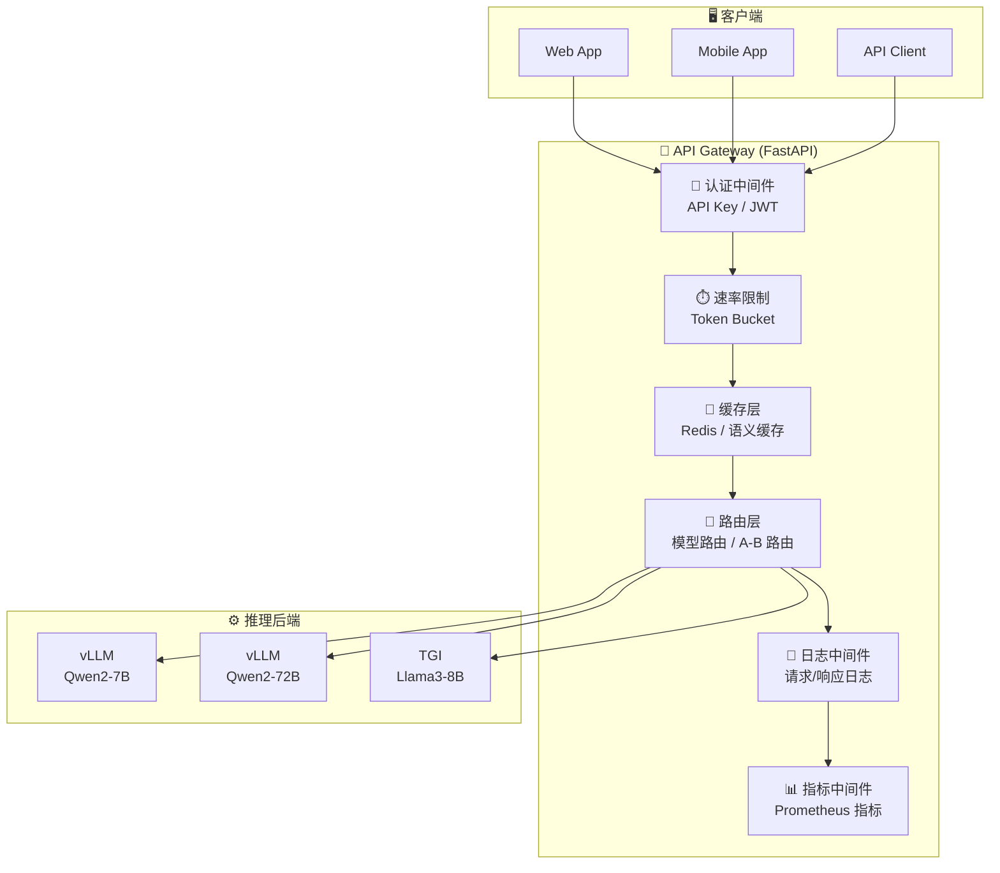
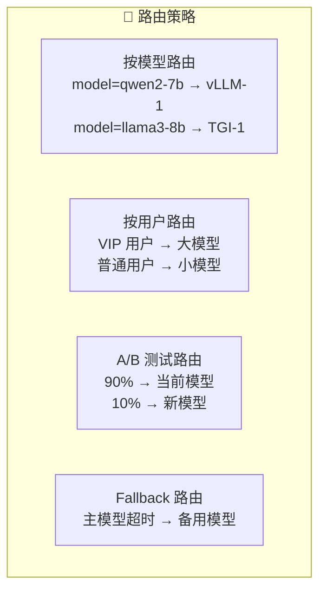

# API 网关

## 概念说明

**API 网关**是 LLM 推理服务的统一入口，负责请求路由、认证鉴权、速率限制、负载均衡、缓存、日志等横切关注点。在生产环境中，API 网关是推理后端（vLLM/TGI）和客户端之间的关键中间层。

### 为什么需要 API 网关？

- **统一入口**：多个推理后端通过一个 API 对外暴露
- **安全控制**：API Key 认证、IP 白名单、输入过滤
- **流量管理**：速率限制、请求排队、优雅降级
- **可观测性**：统一的请求日志、指标采集、链路追踪
- **灵活路由**：按模型、用户、请求类型路由到不同后端

### API 网关架构



## 核心原理

### 1. FastAPI 网关基础结构

```python
from fastapi import FastAPI, Request, HTTPException, Depends
from fastapi.middleware.cors import CORSMiddleware
import time

app = FastAPI(title="LLM API Gateway")

# CORS 中间件
app.add_middleware(
    CORSMiddleware,
    allow_origins=["*"],
    allow_methods=["*"],
    allow_headers=["*"],
)

# 请求计时中间件
@app.middleware("http")
async def timing_middleware(request: Request, call_next):
    start = time.time()
    response = await call_next(request)
    duration = time.time() - start
    response.headers["X-Response-Time"] = f"{duration:.3f}s"
    return response
```

### 2. API Key 认证

```python
from fastapi import Security
from fastapi.security import APIKeyHeader

API_KEYS = {"sk-abc123": "user_1", "sk-def456": "user_2"}
api_key_header = APIKeyHeader(name="Authorization")

async def verify_api_key(api_key: str = Security(api_key_header)):
    key = api_key.replace("Bearer ", "")
    if key not in API_KEYS:
        raise HTTPException(status_code=401, detail="无效的 API Key")
    return API_KEYS[key]
```

### 3. 速率限制

```python
from collections import defaultdict
import asyncio

class RateLimiter:
    """令牌桶速率限制器"""

    def __init__(self, rate: int, burst: int):
        self.rate = rate      # 每秒补充的令牌数
        self.burst = burst    # 桶的最大容量
        self.buckets = defaultdict(lambda: burst)
        self.last_check = defaultdict(time.time)

    def allow(self, key: str) -> bool:
        now = time.time()
        elapsed = now - self.last_check[key]
        self.last_check[key] = now
        # 补充令牌
        self.buckets[key] = min(
            self.burst,
            self.buckets[key] + elapsed * self.rate,
        )
        # 消耗令牌
        if self.buckets[key] >= 1:
            self.buckets[key] -= 1
            return True
        return False

rate_limiter = RateLimiter(rate=10, burst=20)  # 每秒 10 请求，突发 20
```

### 4. 请求路由策略



### 5. 输入验证与安全

```python
from pydantic import BaseModel, Field, validator

class ChatRequest(BaseModel):
    model: str = Field(..., description="模型名称")
    messages: list[dict] = Field(..., min_length=1)
    temperature: float = Field(0.7, ge=0, le=2)
    max_tokens: int = Field(512, ge=1, le=4096)

    @validator("messages")
    def validate_messages(cls, v):
        for msg in v:
            if msg.get("role") not in ("system", "user", "assistant"):
                raise ValueError(f"无效的角色: {msg.get('role')}")
            if len(msg.get("content", "")) > 10000:
                raise ValueError("消息内容过长")
        return v
```

## 代码示例

> 💻 完整可运行代码：[code-examples/05-ai-engineering/serving/02_fastapi_gateway.py](/code-examples/05-ai-engineering/serving/02_fastapi_gateway.py)
> 🐍 Python 版本：3.11+
> 📦 依赖：fastapi>=0.100, uvicorn>=0.20, httpx>=0.24

## 实战要点

**网关设计原则：**
- 网关层尽量轻量，不做复杂业务逻辑
- 所有中间件都要有超时控制，防止阻塞
- 错误响应格式统一，方便客户端处理
- 敏感信息（API Key、用户数据）不要记录到日志

**常见陷阱：**
- 速率限制没有区分用户（所有用户共享限额）
- 没有设置请求体大小限制（大请求导致 OOM）
- 流式响应没有正确处理（需要 StreamingResponse）
- 后端超时没有合理设置（LLM 推理可能需要较长时间）

## 常见面试题

### Q1: LLM API 网关需要哪些核心功能？

**难度**：⭐⭐⭐ | **频率**：🔥🔥🔥

**答题思路**：按功能分类 → 每个功能的实现要点

**标准答案**：LLM API 网关核心功能：(1) 认证鉴权——API Key/JWT 验证、用户身份识别；(2) 速率限制——按用户/IP 限制请求频率，防止滥用；(3) 请求路由——按模型名称、用户等级路由到不同后端；(4) 缓存——相同请求的响应缓存，减少推理成本；(5) 输入验证——请求格式校验、内容长度限制、安全过滤；(6) 可观测性——请求日志、延迟指标、错误率统计；(7) 流量管理——优雅降级、熔断、Fallback。

**深入追问**：
- 如何实现 LLM 的流式响应透传？（SSE + StreamingResponse）
- 如何处理长时间运行的推理请求？（异步处理 + WebSocket + 回调）

### Q2: 如何设计 LLM API 的速率限制策略？

**难度**：⭐⭐⭐ | **频率**：🔥🔥

**答题思路**：限制维度 → 算法选择 → 实现方案

**标准答案**：速率限制策略：(1) 限制维度——按 API Key（用户级）、按 IP（防爬虫）、按模型（保护资源）；(2) 限制指标——RPM（每分钟请求数）、TPM（每分钟 Token 数）；(3) 算法——令牌桶（允许突发）、滑动窗口（更精确）；(4) 实现——单机用内存，分布式用 Redis；(5) 响应——返回 429 状态码 + Retry-After 头 + 剩余配额信息。

**深入追问**：
- Token 级别的速率限制如何实现？（预估输入 token 数 + 实际输出 token 数）
- 分布式环境下如何保证速率限制的准确性？（Redis Lua 脚本原子操作）

### Q3: API 网关如何实现优雅降级？

**难度**：⭐⭐⭐⭐ | **频率**：🔥🔥

**答题思路**：降级场景 → 降级策略 → 实现方式

**标准答案**：优雅降级策略：(1) 模型降级——大模型不可用时自动切换到小模型（72B → 7B）；(2) 功能降级——关闭非核心功能（如语义缓存）保证核心服务；(3) 限流降级——超过容量时排队或返回友好提示；(4) 缓存降级——后端不可用时返回缓存的历史响应；(5) 熔断——后端错误率超过阈值时暂停请求，定期探测恢复。实现方式：Circuit Breaker 模式 + Fallback 链。

**深入追问**：
- 熔断器的三种状态是什么？（Closed/Open/Half-Open）
- 如何测试降级策略？（混沌工程 + 故障注入）

## 推荐工具

> 📌 以下工具可帮助你更高效地学习和实践本知识点，详见 [模块 7：AI 使用与实践](/7-ai-tools/)

| 工具 | 用途 | 详情 |
|------|------|------|
| Cursor | 辅助编写 FastAPI 网关代码 | [AI 编程辅助](/7-ai-tools/7.1-efficiency/ai-coding) |
| ChatGPT | 讨论 API 网关架构设计 | [AI 对话助手](/7-ai-tools/7.1-efficiency/ai-chat) |
| Perplexity | 搜索 API 网关最佳实践 | [AI 搜索](/7-ai-tools/7.1-efficiency/ai-search) |

## 参考资料

- [FastAPI — Documentation](https://fastapi.tiangolo.com/)
- [Kong — API Gateway](https://docs.konghq.com/)
- [NGINX — API Gateway](https://www.nginx.com/solutions/api-gateway/)
- [OpenAI — API Reference](https://platform.openai.com/docs/api-reference)
