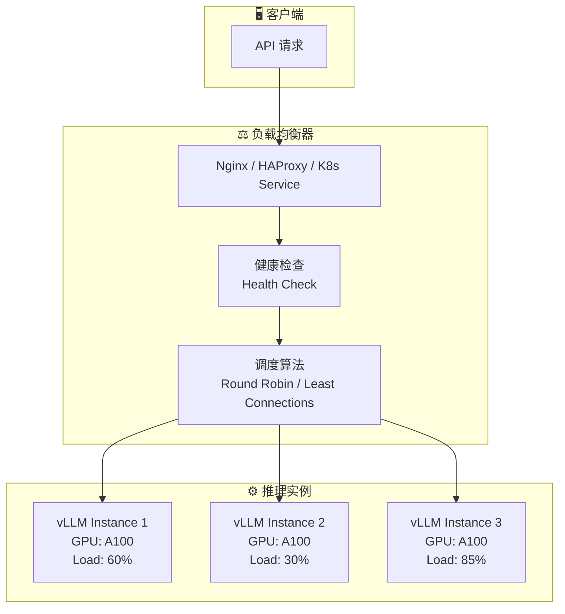
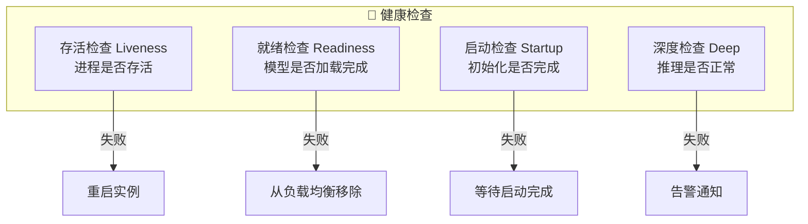
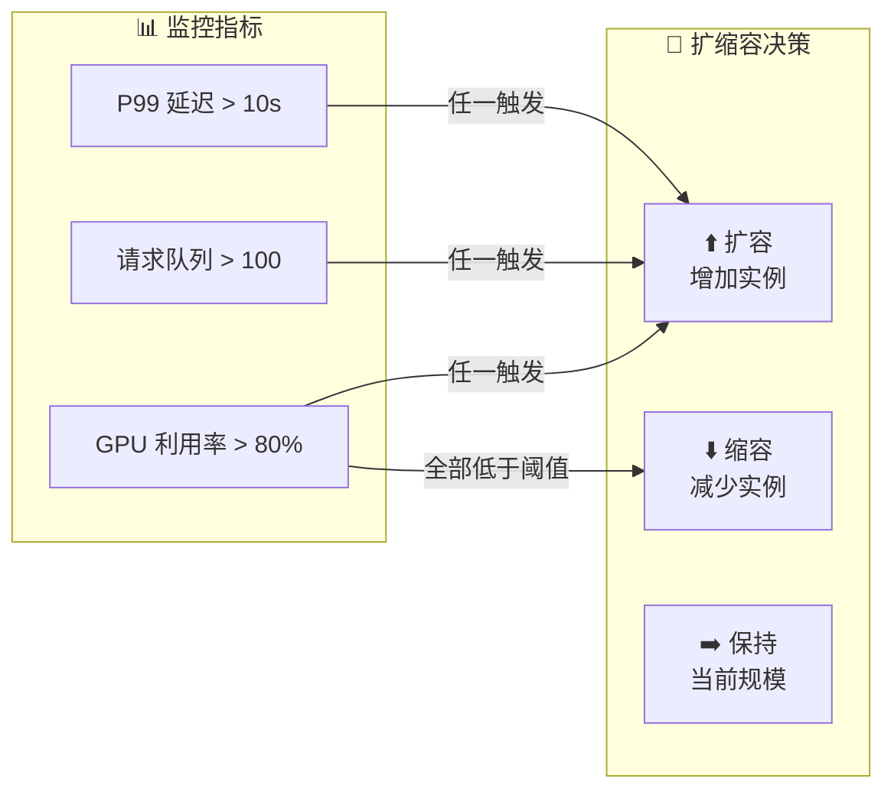

# 负载均衡

## 概念说明

**负载均衡**（Load Balancing）是将请求分发到多个推理服务实例的技术，目标是提高系统吞吐量、降低延迟、实现高可用。对于 LLM 推理服务，负载均衡需要考虑 GPU 资源利用率、请求长度差异、模型加载状态等特殊因素。

### 为什么 LLM 推理需要特殊的负载均衡？

- **请求异构性**：不同请求的输入/输出长度差异巨大（10 tokens vs 4096 tokens）
- **GPU 资源约束**：每个实例的 GPU 显存有限，并发数受限
- **长尾延迟**：长文本生成可能需要数十秒，影响其他请求
- **预热需求**：模型加载需要时间，冷启动实例不能立即服务
- **状态性**：KV Cache 使得请求在实例间不完全无状态

### 负载均衡架构



## 核心原理

### 1. 负载均衡算法对比

| 算法 | 原理 | 适用场景 | LLM 推理适用性 |
|------|------|----------|----------------|
| **轮询** | 依次分发 | 实例性能一致 | ⭐⭐ |
| **加权轮询** | 按权重分发 | 实例性能不同 | ⭐⭐⭐ |
| **最少连接** | 分发到连接最少的实例 | 请求处理时间差异大 | ⭐⭐⭐⭐ |
| **加权最少连接** | 结合权重和连接数 | 异构 GPU 集群 | ⭐⭐⭐⭐⭐ |
| **IP Hash** | 按 IP 固定路由 | 需要会话保持 | ⭐⭐ |
| **自定义指标** | 按 GPU 利用率/队列长度 | LLM 推理专用 | ⭐⭐⭐⭐⭐ |

### 2. Nginx 负载均衡配置

```nginx
# nginx.conf — LLM 推理服务负载均衡
upstream llm_backend {
    least_conn;  # 最少连接算法

    server 10.0.0.1:8000 weight=3;  # A100-80G
    server 10.0.0.2:8000 weight=2;  # A100-40G
    server 10.0.0.3:8000 weight=1;  # RTX 4090

    # 健康检查
    keepalive 32;
}

server {
    listen 80;

    location /v1/ {
        proxy_pass http://llm_backend;
        proxy_set_header Host $host;
        proxy_set_header X-Real-IP $remote_addr;

        # LLM 推理超时设置（较长）
        proxy_read_timeout 120s;
        proxy_send_timeout 30s;
        proxy_connect_timeout 10s;

        # 流式响应支持
        proxy_buffering off;
        proxy_cache off;
        chunked_transfer_encoding on;
    }

    location /health {
        proxy_pass http://llm_backend/health;
        proxy_read_timeout 5s;
    }
}
```

### 3. 健康检查机制



### 4. 基于 GPU 指标的智能路由

```python
class GPUAwareLoadBalancer:
    """基于 GPU 指标的智能负载均衡器"""

    def __init__(self, backends: list[str]):
        self.backends = backends

    async def get_backend_metrics(self, backend: str) -> dict:
        """获取后端 GPU 指标"""
        # 从 Prometheus 或直接查询获取
        return {
            "gpu_utilization": 0.65,
            "gpu_memory_used": 0.70,
            "queue_length": 5,
            "active_requests": 10,
        }

    async def select_backend(self) -> str:
        """选择最优后端"""
        best_backend = None
        best_score = float("inf")

        for backend in self.backends:
            metrics = await self.get_backend_metrics(backend)
            # 综合评分：GPU 利用率 + 队列长度
            score = (
                metrics["gpu_utilization"] * 0.4
                + metrics["gpu_memory_used"] * 0.3
                + metrics["queue_length"] * 0.3
            )
            if score < best_score:
                best_score = score
                best_backend = backend

        return best_backend
```

### 5. 自动扩缩容策略



## 代码示例

> 💻 完整可运行代码：[code-examples/05-ai-engineering/serving/03_load_balancer.py](/code-examples/05-ai-engineering/serving/03_load_balancer.py)
> 🐍 Python 版本：3.11+
> 📦 依赖：httpx>=0.24, fastapi>=0.100

## 实战要点

**LLM 负载均衡特殊考虑：**
- 流式响应需要关闭 Nginx 的 `proxy_buffering`
- 超时时间要比普通 API 长（LLM 生成可能需要 30-120 秒）
- 健康检查要包含模型加载状态（模型未加载完不接收请求）
- 考虑请求长度感知的路由（长请求路由到空闲实例）

**常见陷阱：**
- Nginx 默认超时太短导致长文本生成被中断
- 没有关闭 proxy_buffering 导致流式响应失效
- 健康检查间隔太长导致请求路由到已故障的实例
- 扩容时新实例模型加载未完成就接收请求

## 常见面试题

### Q1: LLM 推理服务的负载均衡和传统 Web 服务有什么区别？

**难度**：⭐⭐⭐ | **频率**：🔥🔥🔥

**答题思路**：对比差异 → LLM 特殊需求 → 解决方案

**标准答案**：核心区别：(1) 请求处理时间——传统 Web 毫秒级，LLM 推理秒级到分钟级，需要更长的超时和更智能的调度；(2) 资源消耗——LLM 推理消耗 GPU 显存，需要基于 GPU 指标的路由；(3) 请求异构性——不同请求的 token 数差异巨大，简单轮询效果差；(4) 流式响应——LLM 通常使用 SSE 流式输出，需要关闭代理缓冲；(5) 冷启动——模型加载需要数分钟，新实例不能立即服务。

**深入追问**：
- 如何实现请求长度感知的负载均衡？（预估 token 数 + 加权路由）
- 如何处理 GPU OOM 导致的实例故障？（健康检查 + 自动重启 + 告警）

### Q2: 如何设计 LLM 推理服务的健康检查？

**难度**：⭐⭐⭐ | **频率**：🔥🔥

**答题思路**：检查类型 → 检查内容 → 实现方式

**标准答案**：LLM 推理服务需要多层健康检查：(1) 存活检查——进程是否存活，HTTP 端口是否响应；(2) 就绪检查——模型是否加载完成，能否接受推理请求；(3) 深度检查——发送测试 prompt 验证推理是否正常，检查 GPU 状态；(4) 性能检查——延迟是否在可接受范围内，队列是否过长。检查频率：存活检查 5s，就绪检查 10s，深度检查 60s。

**深入追问**：
- 健康检查本身会消耗 GPU 资源吗？（深度检查会，需要控制频率）
- 如何避免健康检查的误判？（连续失败 N 次才标记不健康）

### Q3: 如何实现 LLM 推理服务的自动扩缩容？

**难度**：⭐⭐⭐⭐ | **频率**：🔥🔥

**答题思路**：扩缩容指标 → 策略设计 → 实现方式

**标准答案**：自动扩缩容设计：(1) 扩容指标——GPU 利用率 > 80%、请求队列 > 阈值、P99 延迟 > SLA；(2) 缩容指标——GPU 利用率 < 30% 持续 10 分钟；(3) 扩容策略——预测性扩容（基于历史流量模式）+ 响应式扩容（基于实时指标）；(4) 缩容策略——缓慢缩容（每次减少一个实例）+ 冷却期（防止频繁扩缩）；(5) 实现——Kubernetes HPA + 自定义指标（GPU 利用率）。

**深入追问**：
- LLM 推理服务扩容的最大挑战是什么？（模型加载时间长，冷启动慢）
- 如何缩短冷启动时间？（模型预加载、镜像预热、模型缓存）

## 推荐工具

> 📌 以下工具可帮助你更高效地学习和实践本知识点，详见 [模块 7：AI 使用与实践](/7-ai-tools/)

| 工具 | 用途 | 详情 |
|------|------|------|
| Cursor | 辅助编写负载均衡配置 | [AI 编程辅助](/7-ai-tools/7.1-efficiency/ai-coding) |
| ChatGPT | 讨论高可用架构设计 | [AI 对话助手](/7-ai-tools/7.1-efficiency/ai-chat) |
| Perplexity | 搜索 LLM 负载均衡实践 | [AI 搜索](/7-ai-tools/7.1-efficiency/ai-search) |

## 参考资料

- [Nginx — Load Balancing](https://docs.nginx.com/nginx/admin-guide/load-balancer/http-load-balancer/)
- [HAProxy — Documentation](https://www.haproxy.org/documentation/)
- [Kubernetes — Horizontal Pod Autoscaler](https://kubernetes.io/docs/tasks/run-application/horizontal-pod-autoscale/)
- [vLLM — Distributed Serving](https://docs.vllm.ai/en/latest/serving/distributed_serving.html)
