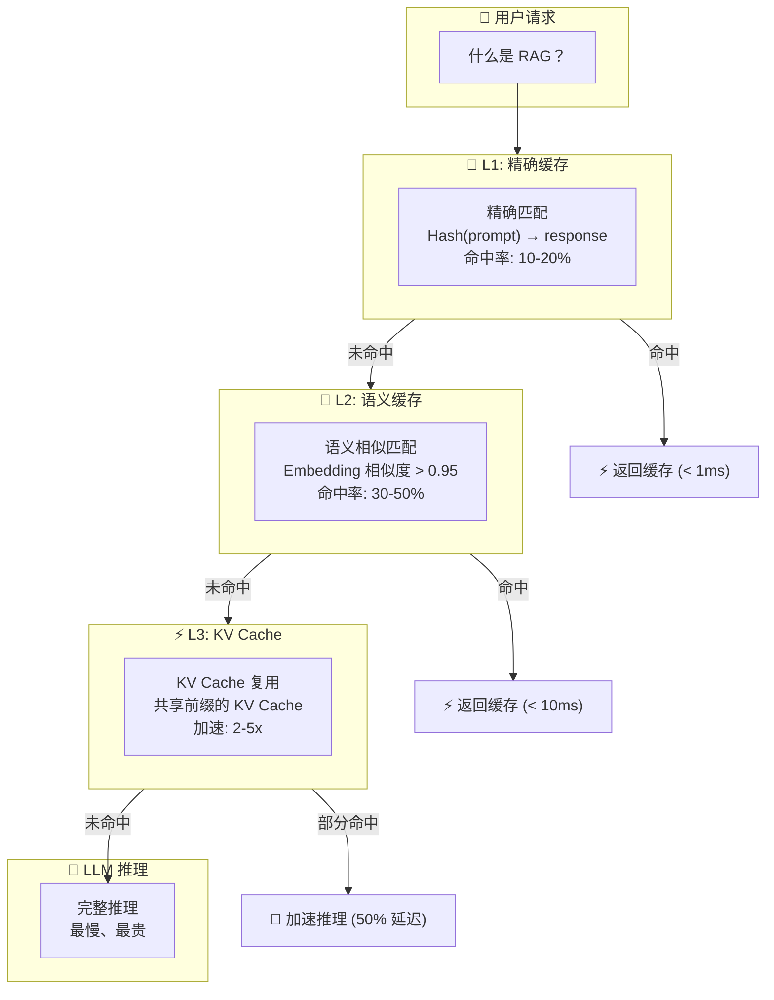
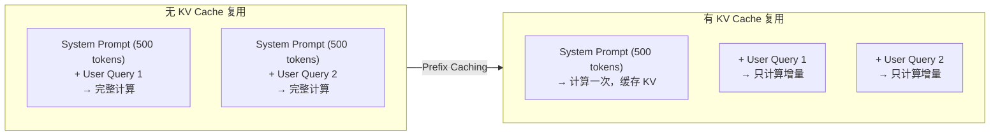
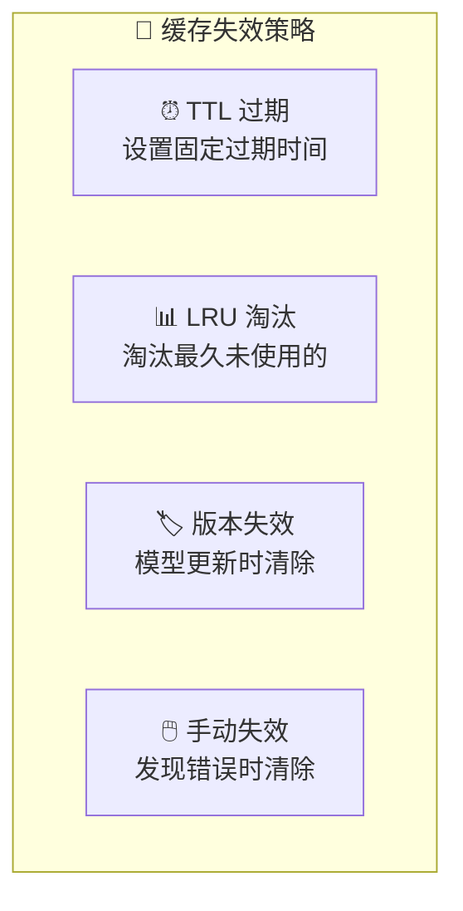

# 缓存策略

## 概念说明

**缓存策略**是 LLM 推理服务中降低延迟和成本的关键技术。LLM 推理成本高（GPU 计算 + Token 计费），通过缓存可以避免重复计算，显著降低成本和延迟。LLM 缓存分为三个层次：精确缓存、语义缓存和 KV Cache 复用。

### 三层缓存架构



## 核心原理

### 1. 精确缓存（Exact Cache）

```python
import hashlib
import json
import redis

class ExactCache:
    """精确匹配缓存 — 相同请求返回相同结果"""

    def __init__(self, redis_url: str = "redis://localhost:6379"):
        self.redis = redis.from_url(redis_url)
        self.ttl = 3600  # 1 小时过期

    def _make_key(self, prompt: str, params: dict) -> str:
        """生成缓存键（包含参数，确保 temperature=0 才缓存）"""
        content = json.dumps({"prompt": prompt, **params}, sort_keys=True)
        return f"llm:exact:{hashlib.sha256(content.encode()).hexdigest()}"

    def get(self, prompt: str, params: dict) -> str | None:
        key = self._make_key(prompt, params)
        cached = self.redis.get(key)
        return cached.decode() if cached else None

    def set(self, prompt: str, params: dict, response: str):
        if params.get("temperature", 0) > 0:
            return  # 非确定性输出不缓存
        key = self._make_key(prompt, params)
        self.redis.setex(key, self.ttl, response)
```

### 2. 语义缓存（Semantic Cache）

```python
import numpy as np

class SemanticCache:
    """语义缓存 — 语义相似的请求返回缓存结果"""

    def __init__(self, similarity_threshold: float = 0.95):
        self.threshold = similarity_threshold
        self.embeddings = []   # 缓存的 embedding
        self.responses = []    # 对应的响应

    def _get_embedding(self, text: str) -> np.ndarray:
        """获取文本的 embedding 向量"""
        # 使用轻量级 embedding 模型
        # 实际使用 sentence-transformers 或 OpenAI embedding
        ...

    def get(self, prompt: str) -> str | None:
        query_emb = self._get_embedding(prompt)
        if not self.embeddings:
            return None

        # 计算余弦相似度
        similarities = np.dot(self.embeddings, query_emb)
        max_idx = np.argmax(similarities)
        max_sim = similarities[max_idx]

        if max_sim >= self.threshold:
            return self.responses[max_idx]
        return None

    def set(self, prompt: str, response: str):
        emb = self._get_embedding(prompt)
        self.embeddings.append(emb)
        self.responses.append(response)
```

### 3. KV Cache 复用



```python
# vLLM 启用 Prefix Caching
from vllm import LLM

llm = LLM(
    model="Qwen/Qwen2-7B-Instruct",
    enable_prefix_caching=True,  # 启用前缀缓存
)

# 共享相同 System Prompt 的请求会自动复用 KV Cache
system_prompt = "你是一个专业的 AI 助手..."
queries = ["什么是 RAG？", "什么是 Fine-tuning？", "什么是 Agent？"]

for query in queries:
    prompt = f"{system_prompt}\n\n用户: {query}\n助手:"
    # 第 2、3 个请求会复用 system_prompt 的 KV Cache
    output = llm.generate([prompt], sampling_params)
```

### 4. 缓存策略对比

| 策略 | 命中率 | 延迟节省 | 成本节省 | 实现复杂度 |
|------|--------|----------|----------|------------|
| **精确缓存** | 10-20% | 99% | 99% | 低 |
| **语义缓存** | 30-50% | 95% | 95% | 中 |
| **KV Cache** | 60-80% | 30-60% | 30-60% | 低（框架内置） |
| **Prompt Cache** | 40-70% | 40-60% | 40-60% | 低 |

### 5. 缓存失效策略



## 代码示例

> 💻 完整可运行代码：[code-examples/05-ai-engineering/serving/02_fastapi_gateway.py](/code-examples/05-ai-engineering/serving/02_fastapi_gateway.py)
> 🐍 Python 版本：3.11+
> 📦 依赖：redis>=4.0, numpy>=1.24

## 实战要点

**缓存设计原则：**
- 只缓存确定性输出（temperature=0）
- 语义缓存的相似度阈值要保守（0.95+），避免返回不相关的结果
- 缓存 key 要包含所有影响输出的参数（model、temperature、system_prompt）
- 设置合理的 TTL，模型更新时清除缓存

**常见陷阱：**
- 缓存了 temperature > 0 的结果（每次应该不同）
- 语义缓存阈值太低导致返回错误结果
- 缓存没有考虑 system prompt 的变化
- 缓存占用过多内存没有设置上限

## 常见面试题

### Q1: LLM 推理服务有哪些缓存策略？

**难度**：⭐⭐⭐ | **频率**：🔥🔥🔥

**答题思路**：分层介绍 → 各层特点 → 组合使用

**标准答案**：LLM 缓存分三层：(1) 精确缓存——Hash(prompt+params) 作为 key，完全相同的请求直接返回缓存，命中率 10-20%，延迟 < 1ms；(2) 语义缓存——用 Embedding 计算语义相似度，相似请求返回缓存，命中率 30-50%，需要设置高阈值（0.95+）避免误匹配；(3) KV Cache 复用——共享前缀的请求复用 KV Cache，vLLM 的 Prefix Caching 可自动实现，加速 30-60%。生产环境建议三层组合使用。

**深入追问**：
- 语义缓存的 Embedding 模型如何选择？（轻量级模型如 all-MiniLM-L6-v2）
- 如何评估缓存的效果？（命中率、延迟降低、成本节省）

### Q2: 什么是 KV Cache？为什么它对 LLM 推理很重要？

**难度**：⭐⭐⭐⭐ | **频率**：🔥🔥🔥

**答题思路**：KV Cache 原理 → 为什么需要 → 优化方式

**标准答案**：KV Cache 是 Transformer 推理时缓存已计算的 Key 和 Value 矩阵，避免重复计算。在自回归生成中，每生成一个 token 都需要 attention 计算，如果不缓存 KV，每次都要重新计算所有历史 token 的 KV，复杂度从 O(n) 变成 O(n²)。KV Cache 的优化方式：(1) PagedAttention——分页管理减少碎片；(2) Prefix Caching——共享前缀复用；(3) 量化 KV Cache——用 FP8/INT8 减少显存占用；(4) 滑动窗口——只保留最近 N 个 token 的 KV。

**深入追问**：
- KV Cache 占用多少显存？（与模型大小、序列长度、并发数成正比）
- Multi-Query Attention 如何减少 KV Cache？（多个 Query 共享一组 KV）

### Q3: 如何设计语义缓存的相似度阈值？

**难度**：⭐⭐⭐ | **频率**：🔥🔥

**答题思路**：阈值选择 → 评估方法 → 动态调整

**标准答案**：语义缓存阈值设计：(1) 初始值——建议 0.95 以上，宁可漏缓存也不要返回错误结果；(2) 评估方法——收集一批请求对，人工标注是否应该命中缓存，计算不同阈值下的准确率和召回率；(3) 按场景调整——FAQ 类场景可以降低到 0.90（问题变体多），创意类场景提高到 0.98（细微差异影响大）；(4) 动态调整——监控用户反馈，如果缓存返回的结果被用户否定，自动提高阈值。

**深入追问**：
- 如何处理语义缓存的冷启动问题？（预热常见问题 + 渐进式启用）
- 语义缓存和 RAG 的区别？（缓存返回完整答案，RAG 返回参考文档）

## 推荐工具

> 📌 以下工具可帮助你更高效地学习和实践本知识点，详见 [模块 7：AI 使用与实践](/7-ai-tools/)

| 工具 | 用途 | 详情 |
|------|------|------|
| Cursor | 辅助编写缓存策略代码 | [AI 编程辅助](/7-ai-tools/7.1-efficiency/ai-coding) |
| ChatGPT | 讨论缓存策略设计 | [AI 对话助手](/7-ai-tools/7.1-efficiency/ai-chat) |
| Perplexity | 搜索 LLM 缓存最新方案 | [AI 搜索](/7-ai-tools/7.1-efficiency/ai-search) |

## 参考资料

- [GPTCache — Semantic Cache for LLMs](https://github.com/zilliztech/GPTCache)
- [vLLM — Automatic Prefix Caching](https://docs.vllm.ai/en/latest/automatic_prefix_caching/apc.html)
- [Redis — Caching Best Practices](https://redis.io/docs/manual/patterns/)
- [Anthropic — Prompt Caching](https://docs.anthropic.com/en/docs/build-with-claude/prompt-caching)
