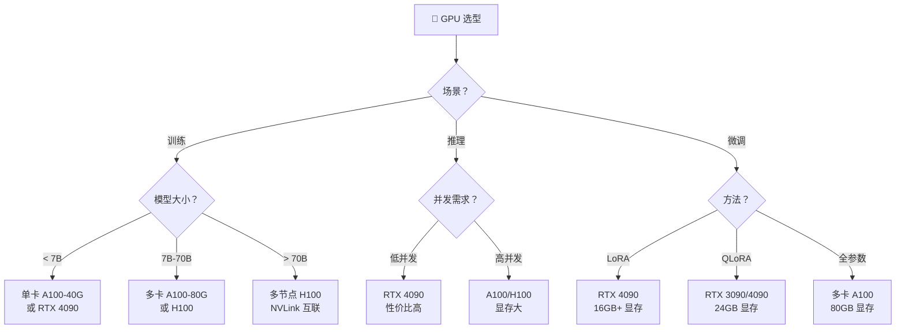
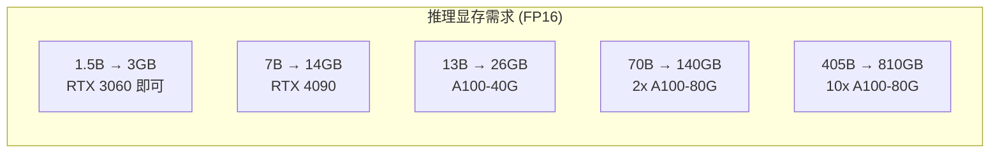
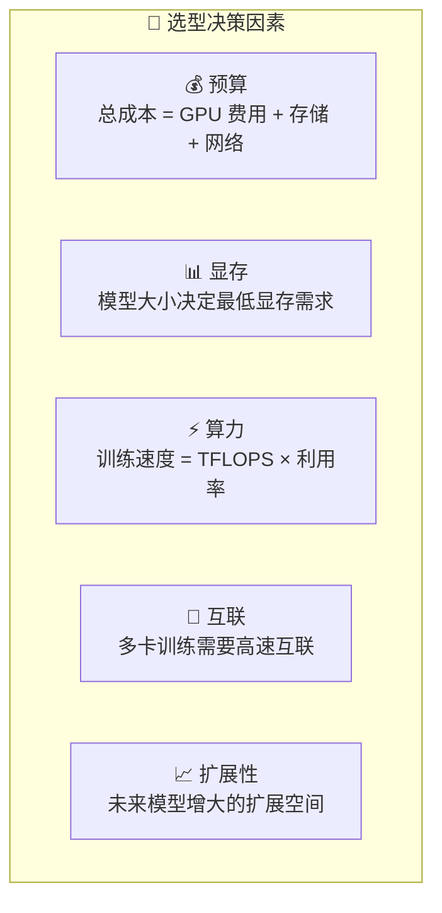

# GPU 选型

## 概念说明

**GPU 选型**是 AI 工程中的关键决策，直接影响训练速度、推理性能和成本。不同的 GPU 在显存容量、计算能力、互联带宽等方面差异巨大，需要根据具体场景（训练/推理/微调）选择最合适的方案。

### GPU 选型决策树



### 主流 GPU 对比

| GPU | 显存 | FP16 算力 | 价格（云） | 适用场景 |
|-----|------|-----------|-----------|----------|
| **RTX 4090** | 24GB | 82.6 TFLOPS | $0.4-0.8/h | 推理、LoRA 微调 |
| **A100-40G** | 40GB | 312 TFLOPS | $1.5-2.5/h | 训练、推理 |
| **A100-80G** | 80GB | 312 TFLOPS | $2.5-4.0/h | 大模型训练 |
| **H100-80G** | 80GB | 989 TFLOPS | $3.5-5.0/h | 大规模训练 |
| **L40S** | 48GB | 362 TFLOPS | $1.2-2.0/h | 推理、微调 |
| **RTX 3090** | 24GB | 35.6 TFLOPS | $0.3-0.5/h | 学习、小规模实验 |

## 核心原理

### 1. 显存需求估算

```python
def estimate_gpu_memory(
    model_params_b: float,  # 模型参数量（十亿）
    precision: str = "fp16",  # 精度
    batch_size: int = 1,
    seq_length: int = 2048,
) -> dict:
    """估算 GPU 显存需求"""
    # 模型权重显存
    bytes_per_param = {"fp32": 4, "fp16": 2, "bf16": 2, "int8": 1, "int4": 0.5}
    model_memory_gb = model_params_b * bytes_per_param[precision]

    # KV Cache 显存（推理时）
    # 假设 hidden_size ≈ model_params_b * 1024, num_layers ≈ model_params_b * 4
    kv_cache_gb = (
        2 * batch_size * seq_length * model_params_b * 1024 * model_params_b * 4
        * bytes_per_param[precision] / (1024**3)
    )

    # 激活值显存（训练时）
    activation_gb = model_memory_gb * 0.5 * batch_size  # 粗略估算

    return {
        "model_memory_gb": round(model_memory_gb, 1),
        "kv_cache_gb": round(kv_cache_gb, 1),
        "activation_gb": round(activation_gb, 1),
        "total_inference_gb": round(model_memory_gb + kv_cache_gb + 2, 1),
        "total_training_gb": round(model_memory_gb * 4 + activation_gb, 1),
    }
```

### 2. 模型大小与 GPU 需求



### 3. 云 GPU 平台对比

| 平台 | 特点 | GPU 类型 | 价格区间 |
|------|------|----------|----------|
| **AWS** | 最全面、企业级 | A100, H100, Inf2 | $$$ |
| **GCP** | TPU 独家、ML 生态好 | A100, H100, TPU | $$$ |
| **Azure** | 企业级、OpenAI 集成 | A100, H100 | $$$ |
| **Lambda** | GPU 专注、价格优 | A100, H100 | $$ |
| **RunPod** | 按需租用、灵活 | A100, RTX 4090 | $ |
| **Vast.ai** | 社区 GPU、最便宜 | 各种 | $ |
| **AutoDL** | 国内平台、中文支持 | A100, RTX 4090 | $ |

### 4. 选型决策因素



### 5. 成本优化策略

| 策略 | 节省比例 | 适用场景 |
|------|----------|----------|
| **Spot/抢占实例** | 60-80% | 可中断的训练任务 |
| **预留实例** | 30-50% | 长期稳定使用 |
| **量化推理** | 50% GPU | 推理服务 |
| **混合精度训练** | 30% 显存 | 所有训练任务 |
| **梯度检查点** | 50% 显存 | 大 batch 训练 |

## 代码示例

> 💻 完整可运行代码：[code-examples/05-ai-engineering/gpu_optimization/01_mixed_precision.py](/code-examples/05-ai-engineering/gpu_optimization/01_mixed_precision.py)
> 🐍 Python 版本：3.11+

## 实战要点

**选型建议：**
- 学习和实验：RTX 4090（24GB，性价比最高）
- 7B 模型微调：单卡 RTX 4090（QLoRA）或 A100-40G（LoRA）
- 7B 模型推理：RTX 4090 或 L40S
- 70B 模型推理：2-4x A100-80G
- 大规模训练：H100 集群（NVLink 互联）

**常见陷阱：**
- 只看 TFLOPS 不看显存（显存不够模型加载不了）
- 忽略多卡互联带宽（PCIe 比 NVLink 慢 5-10 倍）
- 没有考虑 Spot 实例被回收的风险（需要检查点保存）
- 过度配置（7B 模型不需要 H100）

## 常见面试题

### Q1: 如何估算一个模型需要多少 GPU 显存？

**难度**：⭐⭐⭐ | **频率**：🔥🔥🔥

**答题思路**：公式推导 → 各部分占用 → 实际案例

**标准答案**：GPU 显存占用分几部分：(1) 模型权重——参数量 × 每参数字节数（FP16 = 2B，INT4 = 0.5B），7B 模型 FP16 约 14GB；(2) KV Cache——推理时缓存注意力的 Key/Value，与序列长度和并发数成正比；(3) 激活值——训练时的中间计算结果，约等于模型权重的 1-2 倍；(4) 优化器状态——Adam 优化器需要额外 2 倍模型权重的显存。总结：推理约需 1.2x 模型权重，训练约需 4-6x 模型权重。

**深入追问**：
- 如何减少显存占用？（量化、梯度检查点、混合精度、DeepSpeed ZeRO）
- 70B 模型最少需要几张 A100-80G？（推理 2 张，训练 8 张以上）

### Q2: A100 和 H100 的主要区别？

**难度**：⭐⭐ | **频率**：🔥🔥🔥

**答题思路**：硬件规格对比 → 性能差异 → 选择建议

**标准答案**：H100 相比 A100 的主要提升：(1) 算力——FP16 算力从 312 TFLOPS 提升到 989 TFLOPS（3x）；(2) 显存带宽——从 2TB/s 提升到 3.35TB/s；(3) 互联——NVLink 带宽从 600GB/s 提升到 900GB/s；(4) Transformer Engine——H100 新增 FP8 支持，进一步加速 Transformer 计算；(5) 价格——H100 约为 A100 的 1.5-2 倍。选择建议：预算充足且需要大规模训练选 H100，性价比优先选 A100。

**深入追问**：
- FP8 训练的优势和风险？（速度快但精度可能下降，需要仔细验证）
- NVLink 和 PCIe 的区别对训练的影响？（多卡通信瓶颈，NVLink 快 5-10 倍）

### Q3: 如何选择云 GPU 平台？

**难度**：⭐⭐ | **频率**：🔥🔥

**答题思路**：评估维度 → 平台对比 → 场景推荐

**标准答案**：选择云 GPU 平台考虑：(1) 价格——Spot 实例价格差异大，Lambda/RunPod 通常比 AWS 便宜 30-50%；(2) GPU 可用性——热门 GPU（H100）经常缺货，需要提前预留；(3) 生态集成——AWS/GCP 有完整的 ML 工具链；(4) 数据合规——企业级需求选 AWS/Azure/GCP；(5) 灵活性——短期实验选按需计费（RunPod），长期使用选预留实例。

**深入追问**：
- Spot 实例训练如何处理中断？（定期保存检查点 + 自动恢复）
- 如何估算训练成本？（GPU 小时 × 单价 + 存储 + 网络）

## 推荐工具

> 📌 以下工具可帮助你更高效地学习和实践本知识点，详见 [模块 7：AI 使用与实践](/7-ai-tools/)

| 工具 | 用途 | 详情 |
|------|------|------|
| Cursor | 辅助编写 GPU 基准测试脚本 | [AI 编程辅助](/7-ai-tools/7.1-efficiency/ai-coding) |
| ChatGPT | 讨论 GPU 选型方案 | [AI 对话助手](/7-ai-tools/7.1-efficiency/ai-chat) |
| Perplexity | 搜索最新 GPU 价格和性能 | [AI 搜索](/7-ai-tools/7.1-efficiency/ai-search) |

## 参考资料

- [NVIDIA — Data Center GPUs](https://www.nvidia.com/en-us/data-center/products/)
- [Lambda — GPU Cloud](https://lambdalabs.com/service/gpu-cloud)
- [Tim Dettmers — Which GPU for Deep Learning](https://timdettmers.com/2023/01/30/which-gpu-for-deep-learning/)
- [Hugging Face — Model Memory Calculator](https://huggingface.co/spaces/hf-accelerate/model-memory-usage)
