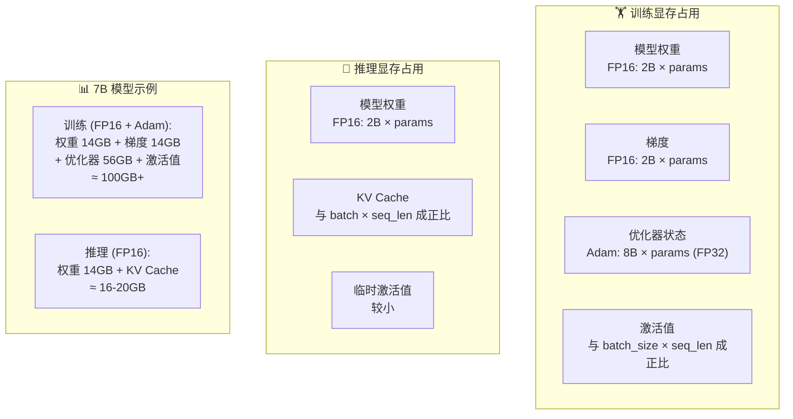
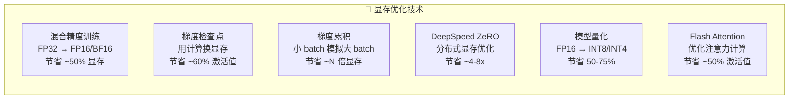
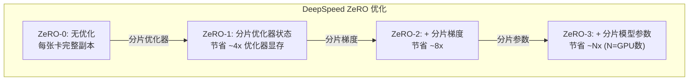

# 显存优化

## 概念说明

**显存优化**是大模型训练和推理中的核心挑战。GPU 显存是最稀缺的资源，模型参数、优化器状态、激活值、KV Cache 都需要占用显存。通过梯度检查点、混合精度、梯度累积、DeepSpeed ZeRO 等技术，可以在有限显存下训练更大的模型。

### 显存占用分析



### 显存优化技术全景



## 核心原理

### 1. 梯度检查点（Gradient Checkpointing）

```python
import torch
from torch.utils.checkpoint import checkpoint

class TransformerBlock(torch.nn.Module):
    def __init__(self, hidden_size):
        super().__init__()
        self.attention = MultiHeadAttention(hidden_size)
        self.ffn = FeedForward(hidden_size)

    def forward(self, x):
        # 正常前向传播：保存所有中间激活值
        x = x + self.attention(x)
        x = x + self.ffn(x)
        return x

class CheckpointedTransformer(torch.nn.Module):
    def __init__(self, hidden_size, num_layers):
        super().__init__()
        self.layers = torch.nn.ModuleList([
            TransformerBlock(hidden_size) for _ in range(num_layers)
        ])

    def forward(self, x):
        for layer in self.layers:
            # 梯度检查点：不保存中间激活值，反向传播时重新计算
            x = checkpoint(layer, x, use_reentrant=False)
        return x
```

### 2. 梯度累积（Gradient Accumulation）

```python
# 梯度累积：用小 batch 模拟大 batch
accumulation_steps = 8  # 累积 8 步
effective_batch_size = batch_size * accumulation_steps  # 等效 batch size

optimizer.zero_grad()
for i, batch in enumerate(dataloader):
    loss = model(batch) / accumulation_steps  # 损失除以累积步数
    loss.backward()  # 梯度累积

    if (i + 1) % accumulation_steps == 0:
        optimizer.step()  # 每 N 步更新一次参数
        optimizer.zero_grad()
```

### 3. DeepSpeed ZeRO 三阶段



### 4. Flash Attention

```python
# Flash Attention 2 使用
from flash_attn import flash_attn_func

# 标准注意力：O(N²) 显存
# Flash Attention：O(N) 显存，速度更快

# 使用 PyTorch 内置的 scaled_dot_product_attention
# （自动选择 Flash Attention 后端）
import torch.nn.functional as F

output = F.scaled_dot_product_attention(
    query, key, value,
    attn_mask=None,
    dropout_p=0.0,
    is_causal=True,  # 因果注意力（自回归生成）
)
```

### 5. 显存优化组合策略

| 场景 | 推荐组合 | 预期效果 |
|------|----------|----------|
| **单卡训练 7B** | 混合精度 + 梯度检查点 + 梯度累积 | 24GB GPU 可训练 |
| **单卡微调 7B** | QLoRA (4bit) + 梯度累积 | 16GB GPU 可微调 |
| **多卡训练 70B** | DeepSpeed ZeRO-3 + 混合精度 + Flash Attention | 8x A100-80G |
| **推理 70B** | INT4 量化 + PagedAttention | 2x A100-80G |

## 代码示例

> 💻 完整可运行代码：
> - [code-examples/05-ai-engineering/gpu_optimization/02_gradient_checkpoint.py](/code-examples/05-ai-engineering/gpu_optimization/02_gradient_checkpoint.py)
> - [code-examples/05-ai-engineering/gpu_optimization/03_deepspeed_config.py](/code-examples/05-ai-engineering/gpu_optimization/03_deepspeed_config.py)
> 🐍 Python 版本：3.11+
> 📦 依赖：torch>=2.0, deepspeed>=0.12

## 实战要点

**优化优先级（从易到难）：**
1. 混合精度训练（几乎无成本，效果显著）
2. Flash Attention（替换注意力实现即可）
3. 梯度累积（代码改动小）
4. 梯度检查点（增加约 30% 训练时间）
5. DeepSpeed ZeRO（需要多卡，配置较复杂）
6. 模型量化（可能影响精度）

**常见陷阱：**
- 混合精度训练时忘记使用 GradScaler（FP16 可能溢出）
- 梯度累积时忘记除以累积步数（等效学习率变大）
- DeepSpeed ZeRO-3 通信开销大（小集群可能反而更慢）
- 量化后没有验证模型质量（精度可能下降）

## 常见面试题

### Q1: 训练一个 7B 模型需要多少显存？如何优化？

**难度**：⭐⭐⭐⭐ | **频率**：🔥🔥🔥

**答题思路**：显存组成分析 → 各部分占用 → 优化方案

**标准答案**：7B 模型全参数训练显存分析：(1) 模型权重 FP16 = 14GB；(2) 梯度 FP16 = 14GB；(3) Adam 优化器状态 FP32 = 56GB（momentum + variance）；(4) 激活值 ≈ 10-30GB（取决于 batch size 和序列长度）。总计约 100GB+。优化方案：混合精度训练节省约 30%；梯度检查点减少 60% 激活值显存；DeepSpeed ZeRO-2 分片梯度和优化器状态；QLoRA 只训练 0.1% 参数，16GB 显存即可微调。

**深入追问**：
- 为什么 Adam 优化器需要这么多显存？（需要存储 momentum 和 variance，各一份 FP32）
- DeepSpeed ZeRO 的三个阶段分别优化什么？（ZeRO-1 优化器、ZeRO-2 梯度、ZeRO-3 参数）

### Q2: 梯度检查点的原理和代价？

**难度**：⭐⭐⭐ | **频率**：🔥🔥🔥

**答题思路**：原理 → 节省多少 → 代价 → 使用建议

**标准答案**：梯度检查点的原理是在前向传播时不保存中间激活值，只保存少数检查点；反向传播时从最近的检查点重新计算激活值。这样用计算时间换显存空间。效果：可以减少约 60-70% 的激活值显存。代价：训练时间增加约 30%（需要重新计算前向传播）。使用建议：当显存不足以容纳完整激活值时启用，通常对 Transformer 的每一层设置检查点。

**深入追问**：
- 如何选择检查点的位置？（通常每个 Transformer 层设一个检查点）
- 梯度检查点和梯度累积可以同时使用吗？（可以，效果叠加）

### Q3: DeepSpeed ZeRO 和 FSDP 的区别？

**难度**：⭐⭐⭐⭐ | **频率**：🔥🔥

**答题思路**：原理对比 → 性能差异 → 选择建议

**标准答案**：DeepSpeed ZeRO 和 PyTorch FSDP 都是分布式训练的显存优化方案。ZeRO 由 Microsoft 开发，分三个阶段逐步分片优化器状态、梯度和参数；FSDP 是 PyTorch 原生实现，类似 ZeRO-3。区别：(1) ZeRO 更灵活，可以选择优化级别；(2) FSDP 与 PyTorch 生态集成更好；(3) ZeRO 有 ZeRO-Offload 支持 CPU 卸载；(4) FSDP 配置更简单。选择建议：PyTorch 生态优先选 FSDP，需要更多优化选项选 DeepSpeed。

**深入追问**：
- ZeRO-Offload 是什么？（将优化器状态卸载到 CPU 内存）
- 什么时候不应该使用 ZeRO-3？（小模型、少量 GPU 时通信开销大于收益）

## 推荐工具

> 📌 以下工具可帮助你更高效地学习和实践本知识点，详见 [模块 7：AI 使用与实践](/7-ai-tools/)

| 工具 | 用途 | 详情 |
|------|------|------|
| Cursor | 辅助编写显存优化代码 | [AI 编程辅助](/7-ai-tools/7.1-efficiency/ai-coding) |
| ChatGPT | 讨论 DeepSpeed 配置 | [AI 对话助手](/7-ai-tools/7.1-efficiency/ai-chat) |
| Perplexity | 搜索显存优化最新技术 | [AI 搜索](/7-ai-tools/7.1-efficiency/ai-search) |

## 参考资料

- [DeepSpeed — ZeRO Documentation](https://www.deepspeed.ai/tutorials/zero/)
- [PyTorch — FSDP Tutorial](https://pytorch.org/tutorials/intermediate/FSDP_tutorial.html)
- [Hugging Face — Performance and Scalability](https://huggingface.co/docs/transformers/perf_train_gpu_one)
- [Flash Attention Paper](https://arxiv.org/abs/2205.14135)
