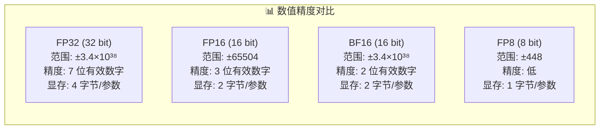
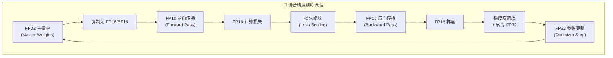
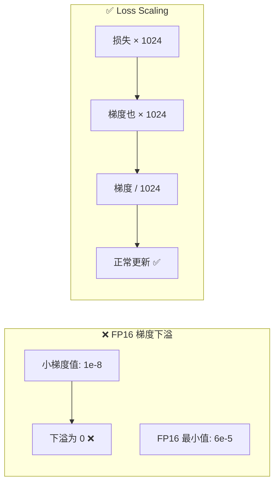

# 混合精度训练

## 概念说明

**混合精度训练**（Mixed Precision Training）是在训练过程中同时使用 FP32 和 FP16/BF16 两种精度的技术。核心思想是：前向传播和反向传播用低精度（FP16/BF16）加速计算，参数更新用高精度（FP32）保证精度。这样既能加速训练、减少显存，又不损失模型质量。

### 数值精度对比



### 混合精度训练流程



## 核心原理

### 1. PyTorch AMP 自动混合精度

```python
import torch
from torch.cuda.amp import autocast, GradScaler

model = MyModel().cuda()
optimizer = torch.optim.Adam(model.parameters(), lr=1e-4)
scaler = GradScaler()  # 梯度缩放器（FP16 需要）

for batch in dataloader:
    optimizer.zero_grad()

    # 自动混合精度：前向传播用 FP16
    with autocast(dtype=torch.float16):
        output = model(batch["input"].cuda())
        loss = criterion(output, batch["label"].cuda())

    # 梯度缩放 + 反向传播
    scaler.scale(loss).backward()

    # 梯度反缩放 + 参数更新
    scaler.step(optimizer)
    scaler.update()
```

### 2. FP16 vs BF16 选择

| 特性 | FP16 | BF16 |
|------|------|------|
| **数值范围** | ±65504（小） | ±3.4×10³⁸（大） |
| **精度** | 3 位有效数字 | 2 位有效数字 |
| **溢出风险** | 高（需要 Loss Scaling） | 低（范围和 FP32 相同） |
| **GPU 支持** | 所有现代 GPU | A100+（Ampere 架构） |
| **推荐场景** | 旧 GPU、推理 | 训练（更稳定） |

```python
# BF16 训练（A100+ GPU，不需要 GradScaler）
with autocast(dtype=torch.bfloat16):
    output = model(input_data)
    loss = criterion(output, labels)

loss.backward()
optimizer.step()
# BF16 不需要 GradScaler，因为数值范围和 FP32 相同
```

### 3. Loss Scaling 原理



### 4. Hugging Face Trainer 混合精度

```python
from transformers import TrainingArguments, Trainer

training_args = TrainingArguments(
    output_dir="./output",
    fp16=True,           # 启用 FP16 混合精度
    # bf16=True,         # 或启用 BF16（A100+ GPU）
    fp16_full_eval=True, # 评估也用 FP16
    per_device_train_batch_size=16,
    gradient_accumulation_steps=4,
)

trainer = Trainer(
    model=model,
    args=training_args,
    train_dataset=train_dataset,
)
trainer.train()
```

### 5. 混合精度的性能收益

| 指标 | FP32 | FP16/BF16 | 提升 |
|------|------|-----------|------|
| **显存占用** | 100% | ~50% | 2x |
| **训练速度** | 1x | 1.5-2x | 50-100% |
| **模型质量** | 基准 | ≈ 基准 | 无损失 |
| **Tensor Core 利用** | 否 | 是 | 显著 |

## 代码示例

> 💻 完整可运行代码：[code-examples/05-ai-engineering/gpu_optimization/01_mixed_precision.py](/code-examples/05-ai-engineering/gpu_optimization/01_mixed_precision.py)
> 🐍 Python 版本：3.11+
> 📦 依赖：torch>=2.0

## 实战要点

**使用建议：**
- A100/H100 GPU 优先使用 BF16（更稳定，不需要 Loss Scaling）
- RTX 30/40 系列可以使用 FP16 或 BF16
- 推理时直接用 FP16/BF16，不需要 GradScaler
- 混合精度几乎是"免费的午餐"，所有训练都应该启用

**常见陷阱：**
- FP16 训练忘记使用 GradScaler（梯度下溢导致训练不收敛）
- BF16 在不支持的 GPU 上使用（会报错或 fallback 到 FP32）
- Loss Scaling 因子设置不当（太大溢出，太小下溢）
- 某些操作不支持低精度（如 LayerNorm 需要 FP32）

## 常见面试题

### Q1: 混合精度训练的原理是什么？为什么能加速？

**难度**：⭐⭐⭐ | **频率**：🔥🔥🔥

**答题思路**：原理 → 为什么加速 → 为什么不损失精度

**标准答案**：混合精度训练在前向和反向传播中使用 FP16/BF16 低精度计算，在参数更新时使用 FP32 高精度。加速原因：(1) FP16 计算量是 FP32 的一半，GPU Tensor Core 对 FP16 有硬件加速；(2) 显存减半，可以用更大的 batch size；(3) 数据传输量减半，减少内存带宽瓶颈。不损失精度的原因：参数更新用 FP32 主权重（Master Weights），保证累积的小梯度不会丢失。

**深入追问**：
- Loss Scaling 的作用是什么？（防止 FP16 梯度下溢）
- 为什么 BF16 不需要 Loss Scaling？（BF16 数值范围和 FP32 相同）
- 哪些操作必须用 FP32？（Softmax、LayerNorm、损失计算）

### Q2: FP16 和 BF16 如何选择？

**难度**：⭐⭐⭐ | **频率**：🔥🔥🔥

**答题思路**：数值特性对比 → GPU 支持 → 选择建议

**标准答案**：FP16 精度更高（3 位有效数字 vs BF16 的 2 位），但数值范围小（±65504），容易溢出，需要 Loss Scaling。BF16 数值范围和 FP32 相同（±3.4×10³⁸），训练更稳定，不需要 Loss Scaling，但精度略低。选择建议：(1) A100/H100 GPU → BF16（更稳定）；(2) 旧 GPU（V100 等）→ FP16（不支持 BF16）；(3) 推理 → FP16（精度更重要）；(4) 训练 → BF16（稳定性更重要）。

**深入追问**：
- FP8 训练的现状？（H100 支持，精度损失需要仔细验证）
- INT8 推理和 FP16 推理的区别？（INT8 更快但精度更低）

### Q3: 混合精度训练中 GradScaler 的工作原理？

**难度**：⭐⭐⭐⭐ | **频率**：🔥🔥

**答题思路**：为什么需要 → 工作流程 → 动态调整

**标准答案**：GradScaler 解决 FP16 梯度下溢问题。工作流程：(1) 前向传播后将 loss 乘以一个缩放因子（如 1024）；(2) 反向传播得到放大的梯度；(3) 参数更新前将梯度除以缩放因子恢复原始值；(4) 检查梯度是否有 inf/nan，如果有则跳过本次更新并减小缩放因子；(5) 如果连续多步没有 inf/nan，则增大缩放因子。这种动态调整确保缩放因子始终在合适的范围内。

**深入追问**：
- 缩放因子的初始值和调整策略？（初始 2¹⁶，每 2000 步尝试翻倍）
- 如果频繁出现 inf/nan 怎么办？（检查学习率、数据、模型结构）

## 推荐工具

> 📌 以下工具可帮助你更高效地学习和实践本知识点，详见 [模块 7：AI 使用与实践](/7-ai-tools/)

| 工具 | 用途 | 详情 |
|------|------|------|
| Cursor | 辅助编写混合精度训练代码 | [AI 编程辅助](/7-ai-tools/7.1-efficiency/ai-coding) |
| ChatGPT | 讨论精度选择策略 | [AI 对话助手](/7-ai-tools/7.1-efficiency/ai-chat) |
| Perplexity | 搜索混合精度最新实践 | [AI 搜索](/7-ai-tools/7.1-efficiency/ai-search) |

## 参考资料

- [NVIDIA — Mixed Precision Training](https://docs.nvidia.com/deeplearning/performance/mixed-precision-training/)
- [PyTorch — Automatic Mixed Precision](https://pytorch.org/docs/stable/amp.html)
- [Hugging Face — Training with Mixed Precision](https://huggingface.co/docs/transformers/perf_train_gpu_one#mixed-precision-training)
- [Mixed Precision Training Paper](https://arxiv.org/abs/1710.03740)
