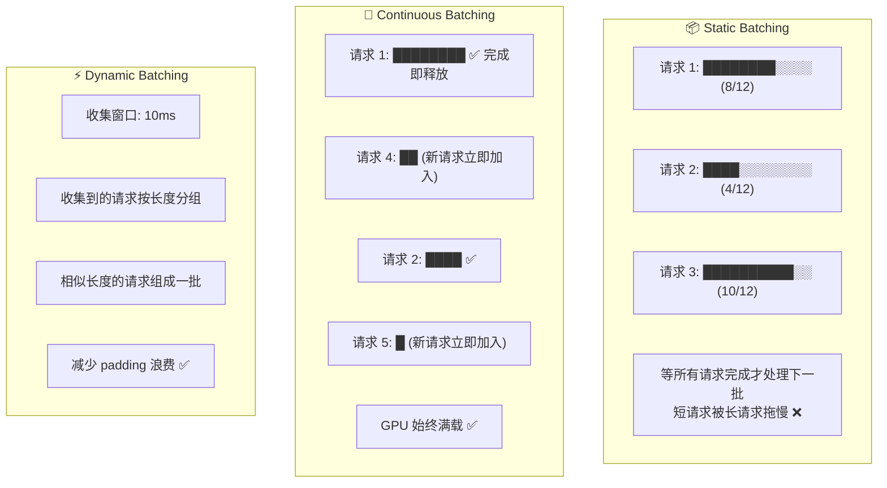
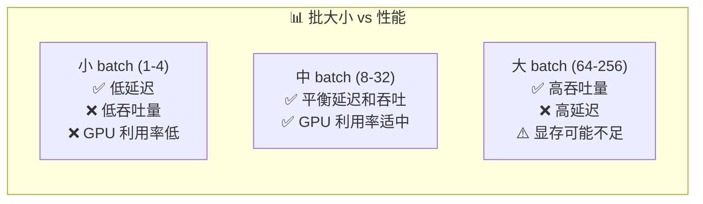
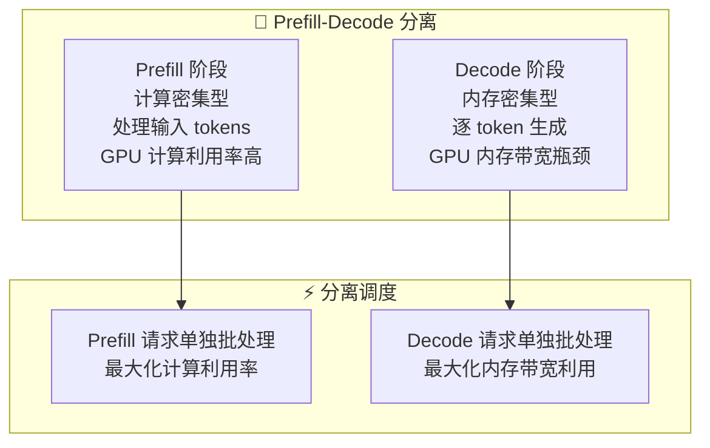

# 批处理策略

## 概念说明

**批处理策略**（Batching Strategies）是 LLM 推理服务中提升吞吐量的关键技术。通过将多个请求合并为一个批次处理，可以充分利用 GPU 的并行计算能力。LLM 推理的批处理比传统 ML 更复杂，因为不同请求的输入/输出长度差异巨大。

### 三种批处理策略对比



## 核心原理

### 1. Static Batching（静态批处理）

```python
class StaticBatcher:
    """静态批处理 — 固定批大小，等所有请求完成"""

    def __init__(self, batch_size: int = 8):
        self.batch_size = batch_size
        self.queue = []

    def add_request(self, request):
        self.queue.append(request)

    def process(self):
        while len(self.queue) >= self.batch_size:
            batch = self.queue[:self.batch_size]
            self.queue = self.queue[self.batch_size:]

            # 所有请求 padding 到最长长度
            max_len = max(len(r.tokens) for r in batch)
            padded = [pad(r.tokens, max_len) for r in batch]

            # 批量推理 — 等所有请求生成完毕
            results = model.generate(padded, max_new_tokens=512)
            # 短请求也要等长请求完成 ❌
            return results
```

### 2. Continuous Batching（连续批处理）

```python
class ContinuousBatcher:
    """连续批处理 — 请求完成即释放，新请求立即加入"""

    def __init__(self, max_batch_size: int = 32):
        self.max_batch_size = max_batch_size
        self.active_requests = []
        self.waiting_queue = []

    def step(self):
        """每个生成步骤执行一次"""
        # 1. 移除已完成的请求
        completed = [r for r in self.active_requests if r.is_done()]
        for r in completed:
            self.active_requests.remove(r)
            r.return_result()  # 立即返回结果

        # 2. 从等待队列填充空位
        available_slots = self.max_batch_size - len(self.active_requests)
        new_requests = self.waiting_queue[:available_slots]
        self.waiting_queue = self.waiting_queue[available_slots:]
        self.active_requests.extend(new_requests)

        # 3. 批量执行一个生成步骤
        if self.active_requests:
            self._generate_one_token(self.active_requests)
```

### 3. 批大小调优



### 4. 训练 vs 推理的批处理差异

| 维度 | 训练批处理 | 推理批处理 |
|------|-----------|-----------|
| **目标** | 收敛速度和稳定性 | 吞吐量和延迟 |
| **批大小** | 固定（超参数） | 动态（按负载调整） |
| **长度处理** | Padding + Mask | Continuous Batching |
| **显存瓶颈** | 激活值 + 优化器 | KV Cache |
| **调优方向** | 更大 batch → 更好收敛 | 更大 batch → 更高吞吐 |

### 5. Prefill 和 Decode 分离



## 代码示例

> 💻 完整可运行代码：[code-examples/05-ai-engineering/serving/03_load_balancer.py](/code-examples/05-ai-engineering/serving/03_load_balancer.py)
> 🐍 Python 版本：3.11+

## 实战要点

**批处理选择建议：**
- 在线推理服务：Continuous Batching（vLLM/TGI 默认）
- 离线批量推理：Static Batching + 按长度排序
- 训练：固定 batch size + 梯度累积

**常见陷阱：**
- 批大小设置过大导致 OOM（需要考虑 KV Cache 显存）
- 没有按长度排序导致 padding 浪费严重
- Continuous Batching 的最大并发数设置不当
- 忽略 Prefill 和 Decode 阶段的不同特性

## 常见面试题

### Q1: Static Batching 和 Continuous Batching 的区别？

**难度**：⭐⭐⭐ | **频率**：🔥🔥🔥

**答题思路**：原理对比 → 性能差异 → 适用场景

**标准答案**：Static Batching 将固定数量的请求组成一批，等所有请求生成完毕才处理下一批，短请求被长请求拖慢，GPU 利用率低。Continuous Batching 在每个生成步骤后检查完成的请求，完成即释放，空位立即填入新请求。优势：(1) 短请求不被阻塞，延迟更低；(2) GPU 始终满载，吞吐量提升 2-5 倍；(3) 更好的资源利用率。vLLM 和 TGI 都默认使用 Continuous Batching。

**深入追问**：
- Continuous Batching 的实现难点？（KV Cache 管理、动态内存分配）
- 如何确定最大并发数？（显存限制 / 单请求 KV Cache 大小）

### Q2: 如何选择推理服务的批大小？

**难度**：⭐⭐⭐ | **频率**：🔥🔥

**答题思路**：影响因素 → 调优方法 → 经验值

**标准答案**：批大小选择考虑：(1) 显存限制——batch_size × KV_cache_per_request ≤ 可用显存；(2) 延迟要求——更大 batch 意味着更高延迟；(3) 吞吐量目标——更大 batch 通常更高吞吐；(4) 请求模式——突发流量需要更大的 max_batch_size。调优方法：从小 batch 开始，逐步增大，监控延迟和吞吐量，找到拐点。经验值：7B 模型在 A100-80G 上通常 max_batch_size=64-128。

**深入追问**：
- 批大小和延迟的关系是线性的吗？（不是，有拐点）
- 如何处理突发流量？（请求队列 + 动态批大小 + 自动扩容）

### Q3: Prefill 和 Decode 阶段有什么区别？

**难度**：⭐⭐⭐⭐ | **频率**：🔥🔥

**答题思路**：计算特性 → 瓶颈差异 → 优化策略

**标准答案**：Prefill 阶段处理所有输入 tokens，是计算密集型（compute-bound），GPU 计算单元是瓶颈；Decode 阶段逐 token 生成，是内存密集型（memory-bound），GPU 内存带宽是瓶颈。优化策略不同：Prefill 优化计算效率（Flash Attention、Tensor Core）；Decode 优化内存访问（KV Cache 管理、量化 KV Cache）。先进的推理框架（如 Sarathi-Serve）会将 Prefill 和 Decode 分离调度，避免互相干扰。

**深入追问**：
- TTFT（Time to First Token）主要由哪个阶段决定？（Prefill 阶段）
- 如何优化长输入的 Prefill 延迟？（Chunked Prefill、并行 Prefill）

## 推荐工具

> 📌 以下工具可帮助你更高效地学习和实践本知识点，详见 [模块 7：AI 使用与实践](/7-ai-tools/)

| 工具 | 用途 | 详情 |
|------|------|------|
| Cursor | 辅助编写批处理策略代码 | [AI 编程辅助](/7-ai-tools/7.1-efficiency/ai-coding) |
| ChatGPT | 讨论批处理策略选择 | [AI 对话助手](/7-ai-tools/7.1-efficiency/ai-chat) |
| Perplexity | 搜索 LLM 批处理优化方案 | [AI 搜索](/7-ai-tools/7.1-efficiency/ai-search) |

## 参考资料

- [vLLM — Continuous Batching](https://docs.vllm.ai/)
- [Orca — Continuous Batching Paper](https://www.usenix.org/conference/osdi22/presentation/yu)
- [Sarathi-Serve — Efficient LLM Inference](https://arxiv.org/abs/2308.16369)
- [NVIDIA — Dynamic Batching in Triton](https://docs.nvidia.com/deeplearning/triton-inference-server/user-guide/docs/user_guide/model_configuration.html)
