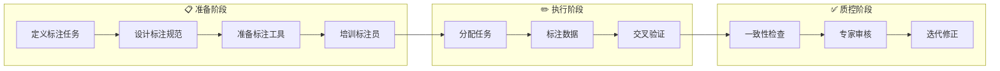
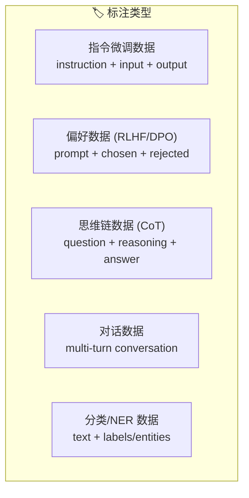
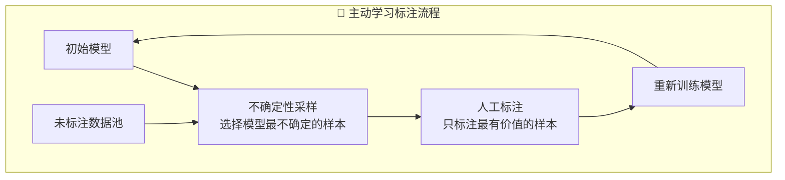

# 数据标注

## 概念说明

**数据标注**（Data Labeling）是为原始数据添加标签或注释的过程，是监督学习和指令微调的基础。高质量的标注数据直接决定模型的上限——"Garbage In, Garbage Out"。在 LLM 时代，数据标注的形式从传统的分类标签扩展到指令-回答对、偏好排序、思维链标注等。

### 数据标注流程



### LLM 时代的标注类型



## 核心原理

### 1. 标注规范设计

```python
# 标注规范示例（JSON Schema）
LABELING_GUIDELINE = {
    "task": "文本情感分类",
    "labels": ["正面", "负面", "中性"],
    "rules": [
        "只根据文本内容判断，不要推测作者意图",
        "包含讽刺的文本标注为'负面'",
        "纯事实陈述标注为'中性'",
        "不确定时标注为'中性'并添加备注",
    ],
    "examples": [
        {"text": "这个产品太好用了！", "label": "正面", "reason": "明确的正面评价"},
        {"text": "今天天气不错", "label": "中性", "reason": "事实陈述"},
        {"text": "又涨价了，真是服了", "label": "负面", "reason": "讽刺表达"},
    ],
}
```

### 2. 标注工具对比

| 工具 | 类型 | 特点 | 适用场景 | 价格 |
|------|------|------|----------|------|
| **Label Studio** | 开源 | 功能全面、可自托管 | 通用标注 | 免费 |
| **Prodigy** | 商业 | 主动学习、效率高 | NLP 标注 | $390+ |
| **Doccano** | 开源 | 轻量、易上手 | 文本标注 | 免费 |
| **Argilla** | 开源 | LLM 数据标注专用 | LLM 微调数据 | 免费 |
| **Scale AI** | 服务 | 专业标注团队 | 大规模标注 | 按量计费 |

### 3. 标注质量控制

```python
class QualityController:
    """标注质量控制"""

    def __init__(self, min_agreement: float = 0.8):
        self.min_agreement = min_agreement

    def inter_annotator_agreement(self, annotations: list[list]) -> float:
        """计算标注者间一致性 (Cohen's Kappa)"""
        from sklearn.metrics import cohen_kappa_score
        if len(annotations) < 2:
            return 1.0
        return cohen_kappa_score(annotations[0], annotations[1])

    def check_quality(self, sample_annotations: list[list]) -> dict:
        """质量检查"""
        kappa = self.inter_annotator_agreement(sample_annotations)
        return {
            "kappa_score": kappa,
            "passed": kappa >= self.min_agreement,
            "recommendation": (
                "质量达标" if kappa >= self.min_agreement
                else "需要重新培训标注员或修改标注规范"
            ),
        }
```

### 4. 主动学习标注



### 5. LLM 辅助标注

```python
def llm_assisted_labeling(text: str, task: str) -> dict:
    """LLM 辅助标注 — 人机协作"""
    # 1. LLM 预标注
    llm_label = llm.predict(f"请对以下文本进行{task}标注：\n{text}")

    # 2. 人工审核和修正
    # 在标注工具中展示 LLM 预标注结果
    # 标注员只需确认或修正

    return {
        "text": text,
        "llm_label": llm_label,
        "human_label": None,  # 待人工填写
        "status": "pending_review",
    }
```

## 代码示例

> 💻 完整可运行代码：[code-examples/05-ai-engineering/data_engineering/01_data_labeling.py](/code-examples/05-ai-engineering/data_engineering/01_data_labeling.py)
> 🐍 Python 版本：3.11+

## 实战要点

**标注效率提升：**
- 使用 LLM 预标注 + 人工审核，效率提升 3-5 倍
- 主动学习选择最有价值的样本标注
- 设计清晰的标注规范，减少歧义
- 使用快捷键和批量操作提升标注速度

**常见陷阱：**
- 标注规范不清晰导致标注不一致
- 没有交叉验证导致质量无法保证
- 标注数据分布不均衡（某些类别样本太少）
- 过度依赖 LLM 预标注而忽略人工审核

## 常见面试题

### Q1: 如何保证数据标注的质量？

**难度**：⭐⭐⭐ | **频率**：🔥🔥🔥

**答题思路**：质量维度 → 控制方法 → 度量指标

**标准答案**：标注质量保证方法：(1) 标注规范——详细的标注指南 + 正反例 + 边界情况说明；(2) 培训考核——标注员培训 + 考核通过才能正式标注；(3) 交叉验证——每条数据至少 2 人标注，计算一致性（Cohen's Kappa > 0.8）；(4) 专家审核——随机抽样由专家审核，不合格的退回重标；(5) 持续监控——监控标注速度和质量指标，异常时及时干预。度量指标：标注者间一致性（Kappa）、准确率（与金标准对比）、标注速度。

**深入追问**：
- Cohen's Kappa 和简单一致率的区别？（Kappa 排除了随机一致的影响）
- 如何处理标注者之间的分歧？（讨论 + 修改规范 + 专家仲裁）

### Q2: LLM 辅助标注的优缺点？

**难度**：⭐⭐⭐ | **频率**：🔥🔥

**答题思路**：优势 → 风险 → 最佳实践

**标准答案**：优势：(1) 效率提升 3-5 倍（人工只需审核而非从零标注）；(2) 一致性更好（LLM 不会疲劳）；(3) 成本降低。风险：(1) LLM 偏见传递到标注数据；(2) 标注员过度信任 LLM 结果（确认偏差）；(3) 边界情况 LLM 可能标错。最佳实践：LLM 预标注 + 人工审核 + 随机抽样全人工标注作为质量基准。

**深入追问**：
- 如何检测 LLM 标注的偏见？（对比 LLM 标注和人工标注的分布差异）
- 什么场景不适合 LLM 辅助标注？（主观性强、需要领域专家知识）

## 推荐工具

> 📌 以下工具可帮助你更高效地学习和实践本知识点，详见 [模块 7：AI 使用与实践](/7-ai-tools/)

| 工具 | 用途 | 详情 |
|------|------|------|
| Cursor | 辅助编写标注工具配置 | [AI 编程辅助](/7-ai-tools/7.1-efficiency/ai-coding) |
| ChatGPT | 辅助设计标注规范 | [AI 对话助手](/7-ai-tools/7.1-efficiency/ai-chat) |
| Perplexity | 搜索标注工具对比 | [AI 搜索](/7-ai-tools/7.1-efficiency/ai-search) |

## 参考资料

- [Label Studio — Documentation](https://labelstud.io/guide/)
- [Argilla — LLM Data Annotation](https://docs.argilla.io/)
- [Prodigy — Active Learning Annotation](https://prodi.gy/docs)
- [Snorkel — Programmatic Labeling](https://www.snorkel.org/)
