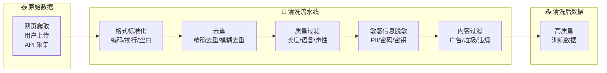

# 数据清洗

## 概念说明

**数据清洗**（Data Cleaning）是将原始数据转化为高质量训练数据的过程，包括文本去重、格式标准化、质量过滤、敏感信息脱敏等步骤。对于 LLM 训练和微调，数据质量比数据数量更重要——少量高质量数据的效果往往优于大量低质量数据。

### 数据清洗流水线



## 核心原理

### 1. 文本去重

```python
import hashlib
from datasketch import MinHash, MinHashLSH

class TextDeduplicator:
    """文本去重器 — 支持精确去重和模糊去重"""

    def __init__(self, threshold: float = 0.8):
        self.threshold = threshold
        self.seen_hashes = set()
        self.lsh = MinHashLSH(threshold=threshold, num_perm=128)

    def exact_dedup(self, text: str) -> bool:
        """精确去重 — 基于 hash"""
        text_hash = hashlib.md5(text.strip().encode()).hexdigest()
        if text_hash in self.seen_hashes:
            return True  # 重复
        self.seen_hashes.add(text_hash)
        return False

    def fuzzy_dedup(self, text: str, doc_id: str) -> bool:
        """模糊去重 — 基于 MinHash LSH"""
        minhash = MinHash(num_perm=128)
        for word in text.split():
            minhash.update(word.encode())
        # 查询相似文档
        result = self.lsh.query(minhash)
        if result:
            return True  # 存在相似文档
        self.lsh.insert(doc_id, minhash)
        return False
```

### 2. 质量过滤

```python
class QualityFilter:
    """文本质量过滤器"""

    def __init__(self):
        self.min_length = 50       # 最小字符数
        self.max_length = 100000   # 最大字符数
        self.min_word_count = 10   # 最小词数
        self.max_repeat_ratio = 0.3  # 最大重复比例

    def filter(self, text: str) -> tuple[bool, str]:
        """过滤低质量文本，返回 (是否保留, 原因)"""
        if len(text) < self.min_length:
            return False, "文本过短"
        if len(text) > self.max_length:
            return False, "文本过长"

        words = text.split()
        if len(words) < self.min_word_count:
            return False, "词数过少"

        # 检查重复内容
        unique_words = set(words)
        repeat_ratio = 1 - len(unique_words) / len(words)
        if repeat_ratio > self.max_repeat_ratio:
            return False, f"重复率过高: {repeat_ratio:.2%}"

        return True, "通过"
```

### 3. 敏感信息脱敏

```python
import re

class PIIAnonymizer:
    """个人敏感信息脱敏"""

    PATTERNS = {
        "email": (r'\b[\w.-]+@[\w.-]+\.\w+\b', "[EMAIL]"),
        "phone": (r'\b1[3-9]\d{9}\b', "[PHONE]"),
        "id_card": (r'\b\d{17}[\dXx]\b', "[ID_CARD]"),
        "ip_address": (r'\b\d{1,3}\.\d{1,3}\.\d{1,3}\.\d{1,3}\b', "[IP]"),
        "api_key": (r'\b(sk-|ak-|key-)[a-zA-Z0-9]{20,}\b', "[API_KEY]"),
    }

    def anonymize(self, text: str) -> tuple[str, dict]:
        """脱敏处理，返回 (脱敏文本, 统计信息)"""
        stats = {}
        for name, (pattern, replacement) in self.PATTERNS.items():
            matches = re.findall(pattern, text)
            if matches:
                stats[name] = len(matches)
                text = re.sub(pattern, replacement, text)
        return text, stats
```

### 4. 清洗质量评估

| 指标 | 说明 | 目标值 |
|------|------|--------|
| **去重率** | 去除的重复数据比例 | 记录即可 |
| **过滤率** | 被质量过滤的比例 | < 50% |
| **脱敏覆盖率** | PII 检测的召回率 | > 99% |
| **数据保留率** | 清洗后保留的数据比例 | > 50% |

## 代码示例

> 💻 完整可运行代码：[code-examples/05-ai-engineering/data_engineering/02_data_cleaning.py](/code-examples/05-ai-engineering/data_engineering/02_data_cleaning.py)
> 🐍 Python 版本：3.11+

## 实战要点

**清洗优先级：**
1. 去重（减少数据量，避免模型记忆重复内容）
2. 敏感信息脱敏（合规要求，必须优先处理）
3. 格式标准化（统一编码、换行符）
4. 质量过滤（去除低质量内容）
5. 内容过滤（去除有害内容）

**常见陷阱：**
- 只做精确去重不做模糊去重（大量近似重复内容）
- 脱敏不彻底（遗漏非标准格式的敏感信息）
- 过滤规则太严格导致数据量不足
- 没有保留清洗日志（无法追溯数据变化）

## 常见面试题

### Q1: LLM 训练数据清洗的关键步骤？

**难度**：⭐⭐⭐ | **频率**：🔥🔥🔥

**答题思路**：按步骤展开 → 每步的方法 → 质量评估

**标准答案**：LLM 训练数据清洗关键步骤：(1) 格式标准化——统一编码（UTF-8）、换行符、去除 HTML 标签；(2) 去重——精确去重（Hash）+ 模糊去重（MinHash LSH），LLM 预训练数据通常有 30-50% 重复；(3) 质量过滤——长度过滤、语言检测、困惑度过滤（PPL 过高的文本质量差）；(4) 敏感信息脱敏——PII 检测和替换；(5) 有害内容过滤——毒性检测、违规内容过滤。

**深入追问**：
- MinHash LSH 的原理？（局部敏感哈希，相似文档有更高概率映射到同一桶）
- 困惑度过滤的原理？（用小模型计算 PPL，PPL 过高说明文本不通顺）

### Q2: 如何处理训练数据中的敏感信息？

**难度**：⭐⭐⭐ | **频率**：🔥🔥

**答题思路**：敏感信息类型 → 检测方法 → 处理策略

**标准答案**：敏感信息处理：(1) 类型识别——PII（姓名、电话、身份证）、密钥（API Key、密码）、商业机密；(2) 检测方法——正则表达式（结构化信息）、NER 模型（姓名、地址）、关键词匹配；(3) 处理策略——替换为占位符（[EMAIL]、[PHONE]）、泛化（具体地址 → 城市级别）、删除整条数据；(4) 验证——人工抽样检查脱敏效果，确保召回率 > 99%。

**深入追问**：
- 脱敏后的数据还能用于训练吗？（可以，占位符不影响模型学习语言模式）
- 如何处理非结构化的敏感信息？（NER 模型 + 上下文分析）

## 推荐工具

> 📌 以下工具可帮助你更高效地学习和实践本知识点，详见 [模块 7：AI 使用与实践](/7-ai-tools/)

| 工具 | 用途 | 详情 |
|------|------|------|
| Cursor | 辅助编写数据清洗脚本 | [AI 编程辅助](/7-ai-tools/7.1-efficiency/ai-coding) |
| ChatGPT | 讨论清洗策略和正则 | [AI 对话助手](/7-ai-tools/7.1-efficiency/ai-chat) |
| Perplexity | 搜索数据清洗工具 | [AI 搜索](/7-ai-tools/7.1-efficiency/ai-search) |

## 参考资料

- [Hugging Face — Data Preprocessing](https://huggingface.co/docs/datasets/process)
- [RedPajama — Data Cleaning Pipeline](https://github.com/togethercomputer/RedPajama-Data)
- [CCNet — Deduplication at Scale](https://github.com/facebookresearch/cc_net)
- [DataTrove — LLM Data Processing](https://github.com/huggingface/datatrove)
