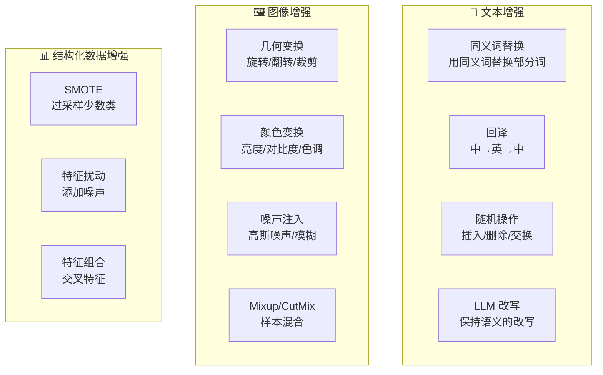
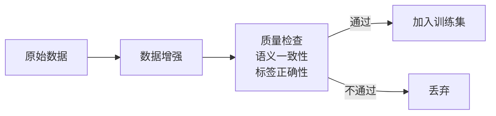

# 数据增强

## 概念说明

**数据增强**（Data Augmentation）是通过对现有数据进行变换来生成新训练样本的技术，目的是增加数据多样性、减少过拟合、提升模型泛化能力。在 NLP 领域，常用的增强方法包括同义词替换、回译、随机插入/删除、LLM 改写等。

### 数据增强方法全景



## 核心原理

### 1. 文本增强方法

```python
import random

class TextAugmenter:
    """文本数据增强器"""

    def __init__(self):
        self.synonyms = {
            "好": ["优秀", "出色", "不错", "棒"],
            "快": ["迅速", "高效", "敏捷"],
            "大": ["巨大", "庞大", "宏大"],
        }

    def synonym_replace(self, text: str, n: int = 2) -> str:
        """同义词替换"""
        words = list(text)
        replaced = 0
        for i, word in enumerate(words):
            if word in self.synonyms and replaced < n:
                words[i] = random.choice(self.synonyms[word])
                replaced += 1
        return "".join(words)

    def random_delete(self, text: str, p: float = 0.1) -> str:
        """随机删除"""
        words = text.split()
        if len(words) <= 1:
            return text
        remaining = [w for w in words if random.random() > p]
        return " ".join(remaining) if remaining else words[0]

    def random_swap(self, text: str, n: int = 1) -> str:
        """随机交换"""
        words = text.split()
        for _ in range(n):
            if len(words) >= 2:
                i, j = random.sample(range(len(words)), 2)
                words[i], words[j] = words[j], words[i]
        return " ".join(words)
```

### 2. 回译增强

```python
async def back_translation(text: str, mid_lang: str = "en") -> str:
    """回译增强：中文 → 英文 → 中文"""
    # 使用翻译 API 或本地模型
    english = await translate(text, src="zh", tgt=mid_lang)
    back_chinese = await translate(english, src=mid_lang, tgt="zh")
    return back_chinese

# 示例
# 原文: "这个产品的用户体验非常好"
# 回译: "这款产品的用户体验非常出色"
```

### 3. LLM 改写增强

```python
def llm_augment(text: str, label: str, n: int = 3) -> list[str]:
    """使用 LLM 生成增强数据"""
    prompt = f"""请改写以下文本，保持相同的语义和情感（{label}），
生成 {n} 个不同的版本。每个版本用换行分隔。

原文：{text}

改写版本："""
    response = llm.generate(prompt)
    return response.strip().split("\n")
```

### 4. 增强策略选择

| 方法 | 质量 | 多样性 | 成本 | 适用场景 |
|------|------|--------|------|----------|
| **同义词替换** | 中 | 低 | 低 | 快速增强 |
| **回译** | 高 | 中 | 中 | 句子级增强 |
| **LLM 改写** | 高 | 高 | 高 | 高质量增强 |
| **随机操作** | 低 | 低 | 低 | 鲁棒性训练 |
| **Mixup** | 中 | 中 | 低 | 分类任务 |

### 5. 增强数据质量验证



## 代码示例

> 💻 完整可运行代码：[code-examples/05-ai-engineering/data_engineering/01_data_labeling.py](/code-examples/05-ai-engineering/data_engineering/01_data_labeling.py)
> 🐍 Python 版本：3.11+

## 实战要点

**增强建议：**
- 数据量少时优先使用回译和 LLM 改写（质量高）
- 增强后的数据需要人工抽样检查质量
- 增强比例建议 1:2 到 1:5（原始:增强）
- 不同增强方法可以组合使用

**常见陷阱：**
- 增强后标签不正确（语义变化导致标签改变）
- 增强数据质量太低引入噪声
- 过度增强导致模型过拟合增强模式
- 测试集也做了增强（数据泄漏）

## 常见面试题

### Q1: NLP 数据增强有哪些常用方法？

**难度**：⭐⭐ | **频率**：🔥🔥🔥

**答题思路**：按方法分类 → 各自优劣 → 选择建议

**标准答案**：NLP 数据增强方法：(1) 词级别——同义词替换、随机插入/删除/交换（EDA 方法）；(2) 句子级别——回译（中→英→中）、句子改写；(3) 文档级别——段落重排、摘要扩展；(4) 模型级别——LLM 改写、对抗样本生成；(5) 特征级别——Embedding 空间插值（Mixup）。选择建议：数据量极少用 LLM 改写，中等数据量用回译，大数据量用简单的词级别增强。

**深入追问**：
- 数据增强和合成数据的区别？（增强基于现有数据变换，合成从零生成）
- 如何评估增强数据的质量？（语义相似度 + 人工抽样 + 下游任务效果）

### Q2: 回译增强的原理和局限性？

**难度**：⭐⭐ | **频率**：🔥🔥

**答题思路**：原理 → 优势 → 局限 → 改进

**标准答案**：回译通过"源语言→目标语言→源语言"的翻译链生成语义相同但表达不同的文本。优势：保持语义一致性好，生成的文本自然流畅。局限：(1) 依赖翻译质量；(2) 多样性有限（同一中间语言生成的变体相似）；(3) 专业术语可能翻译错误；(4) 成本较高（需要调用翻译 API）。改进：使用多种中间语言（英、日、法）增加多样性。

**深入追问**：
- 如何选择中间语言？（语系差异大的语言效果更好）
- 回译适合什么类型的任务？（分类、情感分析等，不适合精确匹配任务）

## 推荐工具

> 📌 以下工具可帮助你更高效地学习和实践本知识点，详见 [模块 7：AI 使用与实践](/7-ai-tools/)

| 工具 | 用途 | 详情 |
|------|------|------|
| Cursor | 辅助编写数据增强代码 | [AI 编程辅助](/7-ai-tools/7.1-efficiency/ai-coding) |
| ChatGPT | 生成增强数据 | [AI 对话助手](/7-ai-tools/7.1-efficiency/ai-chat) |
| Perplexity | 搜索增强技术 | [AI 搜索](/7-ai-tools/7.1-efficiency/ai-search) |

## 参考资料

- [NLPAug — Text Augmentation Library](https://github.com/makcedward/nlpaug)
- [EDA — Easy Data Augmentation](https://arxiv.org/abs/1901.11196)
- [Albumentations — Image Augmentation](https://albumentations.ai/)
- [TextAttack — NLP Augmentation](https://github.com/QData/TextAttack)
