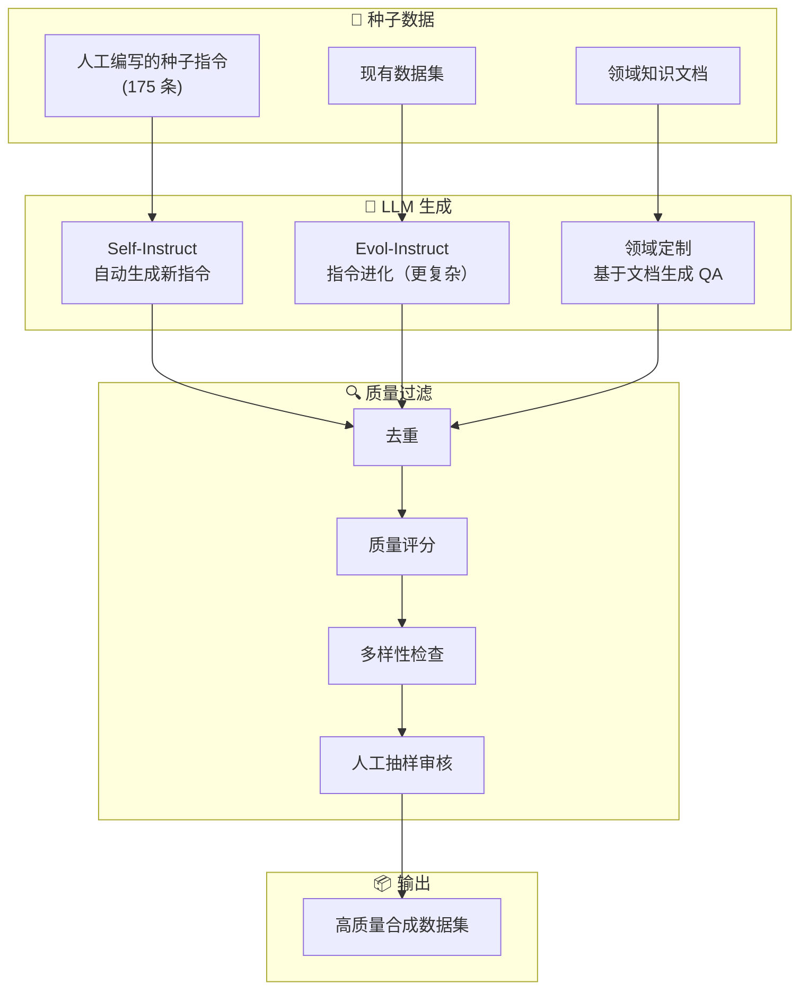
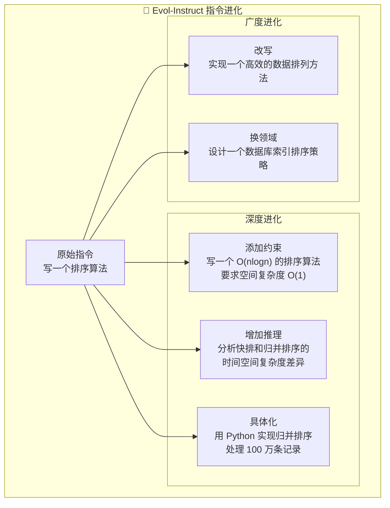
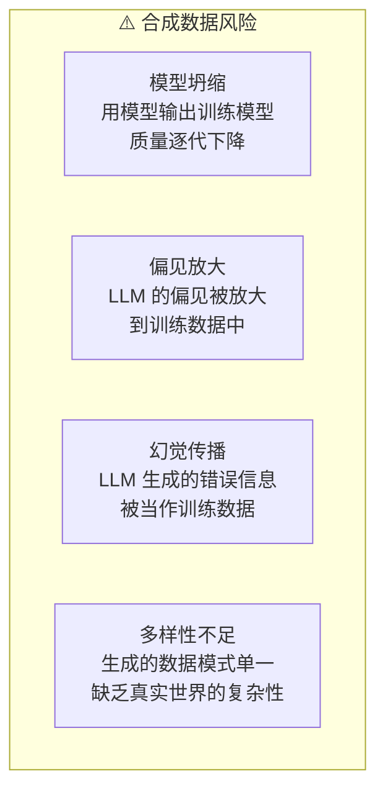

# 合成数据

## 概念说明

**合成数据**（Synthetic Data）是使用 LLM 或其他生成模型从零创建的训练数据。在 LLM 时代，合成数据已成为模型训练的重要数据来源——Alpaca、Vicuna、WizardLM 等知名模型都大量使用了合成数据。核心方法包括 Self-Instruct、Evol-Instruct 等。

### 合成数据生成流程



## 核心原理

### 1. Self-Instruct 方法

```python
class SelfInstruct:
    """Self-Instruct: 从种子指令自动生成新指令"""

    def __init__(self, seed_instructions: list[str]):
        self.seed_pool = seed_instructions
        self.generated = []

    def generate_instruction(self, n_examples: int = 3) -> str:
        """从种子池中采样示例，生成新指令"""
        examples = random.sample(self.seed_pool, n_examples)
        prompt = f"""以下是一些任务指令的示例：

{chr(10).join(f'{i+1}. {ex}' for i, ex in enumerate(examples))}

请生成一个新的、不同的任务指令。要求：
- 与示例不重复
- 清晰具体
- 可以被 AI 助手完成

新指令："""
        return llm.generate(prompt)

    def generate_response(self, instruction: str) -> str:
        """为指令生成回答"""
        prompt = f"请回答以下问题或完成以下任务：\n\n{instruction}"
        return llm.generate(prompt)

    def run(self, target_count: int = 1000):
        """批量生成"""
        while len(self.generated) < target_count:
            instruction = self.generate_instruction()
            if self._is_valid(instruction):
                response = self.generate_response(instruction)
                self.generated.append({
                    "instruction": instruction,
                    "output": response,
                })
                self.seed_pool.append(instruction)
```

### 2. Evol-Instruct 方法



### 3. 领域定制合成数据

```python
def generate_domain_qa(document: str, n_pairs: int = 5) -> list[dict]:
    """基于领域文档生成 QA 对"""
    prompt = f"""基于以下文档内容，生成 {n_pairs} 个高质量的问答对。

文档：
{document}

要求：
1. 问题要多样化（事实型、推理型、应用型）
2. 答案要准确，基于文档内容
3. 包含不同难度级别

请以 JSON 格式输出：
[{{"question": "...", "answer": "...", "difficulty": "easy/medium/hard"}}]"""

    return json.loads(llm.generate(prompt))
```

### 4. 合成数据质量评估

| 维度 | 评估方法 | 目标 |
|------|----------|------|
| **准确性** | 人工抽样 + LLM 评分 | > 90% 正确 |
| **多样性** | 指令 embedding 聚类分析 | 覆盖多个主题 |
| **难度分布** | 难度标注统计 | 均匀分布 |
| **自然度** | 困惑度 + 人工评估 | 接近人类写作 |
| **去重率** | MinHash 去重 | < 5% 重复 |

### 5. 合成数据的风险



## 代码示例

> 💻 完整可运行代码：[code-examples/05-ai-engineering/data_engineering/03_synthetic_data.py](/code-examples/05-ai-engineering/data_engineering/03_synthetic_data.py)
> 🐍 Python 版本：3.11+

## 实战要点

**合成数据最佳实践：**
- 使用强模型（GPT-4/Claude）生成数据训练弱模型
- 合成数据和真实数据混合使用（建议比例 1:1 到 3:1）
- 多轮生成 + 严格过滤，质量优先于数量
- 定期人工审核合成数据质量

**常见陷阱：**
- 用弱模型生成数据训练弱模型（质量无法提升）
- 没有去重导致大量重复数据
- 忽略合成数据的偏见和幻觉
- 合成数据比例过高导致模型"不接地气"

## 常见面试题

### Q1: Self-Instruct 和 Evol-Instruct 的区别？

**难度**：⭐⭐⭐ | **频率**：🔥🔥🔥

**答题思路**：方法对比 → 各自优势 → 适用场景

**标准答案**：Self-Instruct 从种子指令出发，让 LLM 生成新的指令和回答，重点是数量扩展；Evol-Instruct 对现有指令进行"进化"——深度进化（添加约束、增加推理步骤）和广度进化（改写、换领域），重点是质量和复杂度提升。Self-Instruct 适合快速扩充数据量，Evol-Instruct 适合生成高难度、高质量的训练数据。WizardLM 使用 Evol-Instruct 在复杂任务上显著优于 Self-Instruct 生成的数据。

**深入追问**：
- 如何避免合成数据的模型坍缩？（使用更强的模型生成 + 混合真实数据）
- 合成数据的版权问题？（目前法律尚不明确，建议谨慎使用）

### Q2: 如何评估合成数据的质量？

**难度**：⭐⭐⭐ | **频率**：🔥🔥

**答题思路**：评估维度 → 评估方法 → 自动化评估

**标准答案**：合成数据质量评估从五个维度：(1) 准确性——人工抽样检查 + LLM-as-Judge 自动评分；(2) 多样性——计算指令 embedding 的聚类数和覆盖度；(3) 难度分布——统计不同难度级别的比例；(4) 自然度——用困惑度模型评估文本流畅度；(5) 下游效果——用合成数据训练模型，在真实测试集上评估。最终以下游任务效果为准。

**深入追问**：
- LLM-as-Judge 评估可靠吗？（有偏见，但和人工评估相关性较高）
- 如何提高合成数据的多样性？（多种种子 + 多种进化策略 + 温度采样）

## 推荐工具

> 📌 以下工具可帮助你更高效地学习和实践本知识点，详见 [模块 7：AI 使用与实践](/7-ai-tools/)

| 工具 | 用途 | 详情 |
|------|------|------|
| Cursor | 辅助编写合成数据脚本 | [AI 编程辅助](/7-ai-tools/7.1-efficiency/ai-coding) |
| ChatGPT | 生成高质量合成数据 | [AI 对话助手](/7-ai-tools/7.1-efficiency/ai-chat) |
| Perplexity | 搜索合成数据方法 | [AI 搜索](/7-ai-tools/7.1-efficiency/ai-search) |

## 参考资料

- [Self-Instruct Paper](https://arxiv.org/abs/2212.10560)
- [WizardLM — Evol-Instruct](https://arxiv.org/abs/2304.12244)
- [Alpaca — Stanford](https://crfm.stanford.edu/2023/03/13/alpaca.html)
- [Magpie — Synthetic Data Generation](https://arxiv.org/abs/2406.08464)
