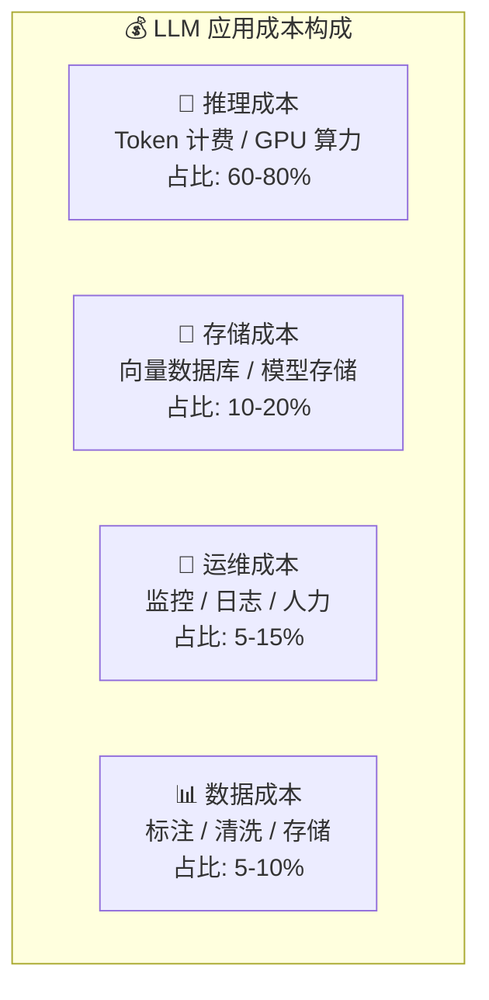
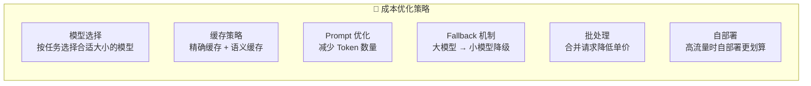
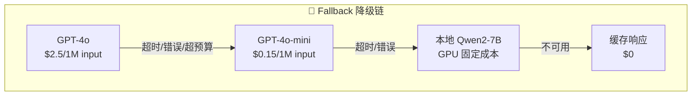

# 成本优化

## 概念说明

**成本优化**是 LLM 应用生产化的关键挑战。LLM 的成本主要来自 Token 计费（API 调用）和 GPU 算力（自部署），需要从模型选择、缓存策略、Prompt 优化、Fallback 机制等多个维度进行优化。

### 成本构成分析



### 成本优化策略全景



## 核心原理

### 1. 模型选择策略

```python
class ModelRouter:
    """智能模型路由 — 按任务复杂度选择模型"""

    MODELS = {
        "simple": {"name": "gpt-4o-mini", "input_cost": 0.15, "output_cost": 0.6},
        "medium": {"name": "gpt-4o", "input_cost": 2.5, "output_cost": 10},
        "complex": {"name": "gpt-4-turbo", "input_cost": 10, "output_cost": 30},
    }

    def classify_complexity(self, prompt: str) -> str:
        """判断任务复杂度"""
        # 简单规则（生产环境可用分类模型）
        if len(prompt) < 100:
            return "simple"
        if any(kw in prompt for kw in ["分析", "推理", "对比", "设计"]):
            return "complex"
        return "medium"

    def route(self, prompt: str) -> dict:
        complexity = self.classify_complexity(prompt)
        return self.MODELS[complexity]
```

### 2. Prompt 优化降低成本

```python
class PromptOptimizer:
    """Prompt 优化器 — 减少 Token 消耗"""

    def compress_prompt(self, prompt: str) -> str:
        """压缩 Prompt"""
        # 1. 去除多余空白
        prompt = " ".join(prompt.split())
        # 2. 缩写常见指令
        replacements = {
            "请你作为一个": "作为",
            "请详细地": "请",
            "以下是": "",
        }
        for old, new in replacements.items():
            prompt = prompt.replace(old, new)
        return prompt

    def estimate_cost(self, prompt: str, model: str = "gpt-4o") -> dict:
        """估算成本"""
        # 粗略估算：1 token ≈ 1.5 个中文字符
        input_tokens = len(prompt) / 1.5
        output_tokens = input_tokens * 0.5  # 假设输出是输入的一半
        costs = {"gpt-4o": (2.5, 10), "gpt-4o-mini": (0.15, 0.6)}
        in_cost, out_cost = costs.get(model, (2.5, 10))
        total = (input_tokens * in_cost + output_tokens * out_cost) / 1_000_000
        return {"input_tokens": int(input_tokens), "estimated_cost_usd": round(total, 6)}
```

### 3. Fallback 机制



### 4. API vs 自部署成本对比

| 维度 | API 调用 | 自部署 |
|------|----------|--------|
| **计费方式** | 按 Token | 按 GPU 小时 |
| **适合场景** | 低流量、多模型 | 高流量、固定模型 |
| **盈亏平衡** | < 100K 请求/天 | > 100K 请求/天 |
| **运维成本** | 无 | 需要运维团队 |
| **延迟** | 网络延迟 | 可控 |
| **数据安全** | 数据发送到第三方 | 数据不出内网 |

### 5. 成本监控仪表板

```python
class CostTracker:
    """成本追踪器"""

    def __init__(self):
        self.daily_budget = 100.0  # 每日预算 $100
        self.daily_spent = 0.0

    def track(self, model: str, input_tokens: int, output_tokens: int):
        """记录一次调用的成本"""
        cost = self._calculate_cost(model, input_tokens, output_tokens)
        self.daily_spent += cost

        if self.daily_spent > self.daily_budget * 0.8:
            self._alert("成本预警：已使用 80% 日预算")
        if self.daily_spent > self.daily_budget:
            self._alert("成本超限：已超出日预算，启动降级")
            self._enable_fallback()

        return cost
```

## 代码示例

> 💻 完整可运行代码：[code-examples/05-ai-engineering/monitoring/02_alerting.py](/code-examples/05-ai-engineering/monitoring/02_alerting.py)
> 🐍 Python 版本：3.11+

## 实战要点

**成本优化优先级：**
1. 缓存（最高 ROI，相同请求零成本）
2. 模型选择（简单任务用小模型，节省 90%+）
3. Prompt 优化（减少 Token 数量）
4. 批处理（合并请求降低开销）
5. 自部署（高流量时考虑）

**常见陷阱：**
- 所有请求都用最贵的模型
- 没有设置成本预算和告警
- 忽略输出 Token 成本（通常比输入贵 2-4 倍）
- 没有监控每个用户/功能的成本分布

## 常见面试题

### Q1: LLM 应用如何控制成本？

**难度**：⭐⭐⭐ | **频率**：🔥🔥🔥

**答题思路**：成本构成 → 优化策略 → 监控机制

**标准答案**：LLM 成本控制策略：(1) 模型路由——按任务复杂度选择模型，简单任务用 GPT-4o-mini（成本降低 95%）；(2) 缓存——精确缓存 + 语义缓存，命中率 30-50% 可节省对应比例成本；(3) Prompt 优化——精简 Prompt、使用 Prompt 缓存（Anthropic）；(4) Fallback——大模型超时/超预算时降级到小模型；(5) 批处理——合并请求利用批量 API 折扣；(6) 自部署——日请求量超过 10 万时自部署更划算。同时需要成本监控和预算告警。

**深入追问**：
- 如何估算 LLM 应用的月度成本？（日均请求量 × 平均 Token 数 × 单价 × 30）
- API 和自部署的盈亏平衡点在哪里？（取决于模型大小和请求量，通常 10-50 万请求/天）

### Q2: 如何设计 LLM 的 Fallback 机制？

**难度**：⭐⭐⭐ | **频率**：🔥🔥

**答题思路**：触发条件 → 降级链 → 质量保障

**标准答案**：Fallback 机制设计：(1) 触发条件——API 超时（> 30s）、错误率 > 5%、成本超预算、服务不可用；(2) 降级链——GPT-4 → GPT-4o-mini → 本地模型 → 缓存响应 → 友好提示；(3) 质量保障——降级后监控输出质量，如果质量下降严重则通知人工介入；(4) 自动恢复——定期探测主模型是否恢复，自动切回。

**深入追问**：
- 如何评估降级后的输出质量？（LLM-as-Judge + 用户反馈）
- 如何避免降级风暴？（熔断器 + 冷却期 + 渐进恢复）

## 推荐工具

> 📌 以下工具可帮助你更高效地学习和实践本知识点，详见 [模块 7：AI 使用与实践](/7-ai-tools/)

| 工具 | 用途 | 详情 |
|------|------|------|
| Cursor | 辅助编写成本优化代码 | [AI 编程辅助](/7-ai-tools/7.1-efficiency/ai-coding) |
| ChatGPT | 讨论成本优化策略 | [AI 对话助手](/7-ai-tools/7.1-efficiency/ai-chat) |
| Perplexity | 搜索 LLM 最新定价 | [AI 搜索](/7-ai-tools/7.1-efficiency/ai-search) |

## 参考资料

- [OpenAI — Pricing](https://openai.com/pricing)
- [Anthropic — Pricing](https://www.anthropic.com/pricing)
- [LiteLLM — Multi-Provider Cost Tracking](https://docs.litellm.ai/)
- [Helicone — LLM Cost Monitoring](https://www.helicone.ai/)
