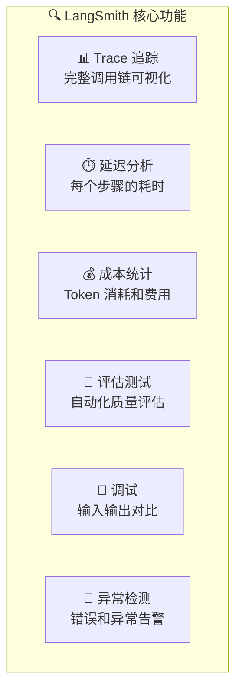
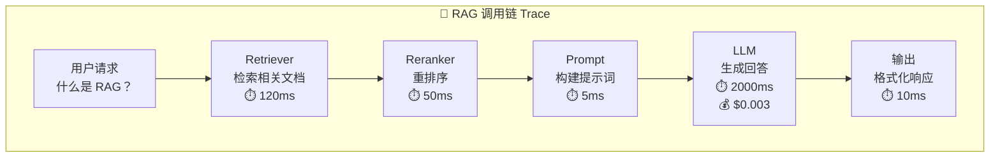

# LangSmith 生产监控

## 概念说明

**LangSmith** 是 LangChain 团队推出的 LLM 应用监控和调试平台，提供 Trace 追踪、延迟分析、成本统计、异常检测、评估测试等功能。它是目前最成熟的 LLM 专用可观测性工具之一。

### LangSmith 核心功能



### Trace 追踪架构



## 核心原理

### 1. LangSmith 集成

```python
import os
from langsmith import Client
from langchain_core.tracers import LangChainTracer

# 配置 LangSmith
os.environ["LANGCHAIN_TRACING_V2"] = "true"
os.environ["LANGCHAIN_API_KEY"] = "ls-..."
os.environ["LANGCHAIN_PROJECT"] = "my-rag-app"

# 自动追踪 LangChain 调用
from langchain_openai import ChatOpenAI
from langchain_core.prompts import ChatPromptTemplate

llm = ChatOpenAI(model="gpt-4o-mini")
prompt = ChatPromptTemplate.from_messages([
    ("system", "你是一个有帮助的助手"),
    ("user", "{question}"),
])
chain = prompt | llm

# 所有调用自动记录到 LangSmith
result = chain.invoke({"question": "什么是 RAG？"})
```

### 2. 自定义 Trace

```python
from langsmith import traceable

@traceable(name="rag_pipeline", tags=["production"])
def rag_pipeline(question: str) -> str:
    """RAG 流水线 — 自动追踪每个步骤"""
    docs = retrieve_documents(question)
    context = format_context(docs)
    response = generate_answer(question, context)
    return response

@traceable(name="retrieve")
def retrieve_documents(question: str) -> list:
    """检索文档"""
    ...

@traceable(name="generate")
def generate_answer(question: str, context: str) -> str:
    """生成回答"""
    ...
```

### 3. 监控指标

| 指标 | 说明 | 告警阈值 |
|------|------|----------|
| **延迟 P50** | 50% 请求的延迟 | < 2s |
| **延迟 P99** | 99% 请求的延迟 | < 10s |
| **错误率** | 失败请求比例 | < 1% |
| **Token 消耗** | 每日 Token 使用量 | 预算内 |
| **成本** | 每日/每月费用 | 预算内 |
| **用户满意度** | 用户反馈评分 | > 4.0/5.0 |

### 4. 评估测试

```python
from langsmith.evaluation import evaluate

# 定义评估数据集
dataset = client.create_dataset("rag-eval")
client.create_examples(
    inputs=[{"question": "什么是 RAG？"}],
    outputs=[{"answer": "RAG 是检索增强生成..."}],
    dataset_id=dataset.id,
)

# 定义评估器
def correctness_evaluator(run, example):
    """正确性评估"""
    prediction = run.outputs["output"]
    reference = example.outputs["answer"]
    # 使用 LLM 评估
    score = llm_judge(prediction, reference)
    return {"score": score, "key": "correctness"}

# 运行评估
results = evaluate(
    rag_pipeline,
    data=dataset,
    evaluators=[correctness_evaluator],
)
```

### 5. LangSmith 替代方案

| 工具 | 特点 | 价格 |
|------|------|------|
| **LangSmith** | LangChain 原生、功能全面 | 免费 + 付费 |
| **LangFuse** | 开源、可自托管 | 免费 |
| **Helicone** | 代理模式、零代码集成 | 免费 + 付费 |
| **Phoenix (Arize)** | 开源、ML 监控背景 | 免费 |
| **Weights & Biases** | 实验追踪 + LLM 监控 | 免费 + 付费 |

## 代码示例

> 💻 完整可运行代码：[code-examples/05-ai-engineering/monitoring/01_prometheus_metrics.py](/code-examples/05-ai-engineering/monitoring/01_prometheus_metrics.py)
> 🐍 Python 版本：3.11+
> 📦 依赖：langsmith>=0.1, langchain>=0.2

## 实战要点

**监控建议：**
- 生产环境必须开启 Trace 追踪
- 设置延迟和错误率告警
- 定期运行评估测试检查质量
- 监控成本趋势，设置预算告警

**常见陷阱：**
- Trace 数据量太大导致存储成本高（设置采样率）
- 只监控延迟不监控质量（需要评估测试）
- 没有区分不同功能/用户的指标
- 告警阈值设置不合理（太敏感或太迟钝）

## 常见面试题

### Q1: LLM 应用需要监控哪些指标？

**难度**：⭐⭐⭐ | **频率**：🔥🔥🔥

**答题思路**：按维度分类 → 每个指标的意义 → 告警策略

**标准答案**：LLM 应用监控指标分四类：(1) 性能指标——延迟（P50/P95/P99）、吞吐量（QPS）、首 Token 延迟（TTFT）；(2) 质量指标——回答准确率、用户满意度、幻觉率；(3) 成本指标——Token 消耗、API 费用、GPU 利用率；(4) 可用性指标——错误率、超时率、服务可用性（SLA）。每类指标都需要设置告警阈值和升级策略。

**深入追问**：
- 如何监控 LLM 的幻觉率？（事实核查 + 用户反馈 + 自动评估）
- Trace 采样率如何设置？（生产环境 10-100%，按流量和成本平衡）

### Q2: LangSmith 和 Prometheus 的区别？

**难度**：⭐⭐ | **频率**：🔥🔥

**答题思路**：定位差异 → 功能对比 → 组合使用

**标准答案**：LangSmith 是 LLM 专用监控工具，关注调用链追踪、Token 统计、质量评估；Prometheus 是通用监控系统，关注系统指标（CPU、内存、QPS、延迟）。两者互补：LangSmith 监控 LLM 应用层（Prompt、Token、质量），Prometheus 监控基础设施层（GPU、网络、服务健康）。生产环境建议两者结合使用。

**深入追问**：
- 如何将 LangSmith 的指标导出到 Prometheus？（自定义 exporter）
- 开源替代方案有哪些？（LangFuse、Phoenix）

## 推荐工具

> 📌 以下工具可帮助你更高效地学习和实践本知识点，详见 [模块 7：AI 使用与实践](/7-ai-tools/)

| 工具 | 用途 | 详情 |
|------|------|------|
| Cursor | 辅助编写监控集成代码 | [AI 编程辅助](/7-ai-tools/7.1-efficiency/ai-coding) |
| ChatGPT | 讨论监控策略设计 | [AI 对话助手](/7-ai-tools/7.1-efficiency/ai-chat) |
| Perplexity | 搜索 LLM 监控工具 | [AI 搜索](/7-ai-tools/7.1-efficiency/ai-search) |

## 参考资料

- [LangSmith — Documentation](https://docs.smith.langchain.com/)
- [LangFuse — Open Source LLM Observability](https://langfuse.com/docs)
- [Arize Phoenix — LLM Observability](https://docs.arize.com/phoenix)
- [Helicone — LLM Monitoring](https://docs.helicone.ai/)
