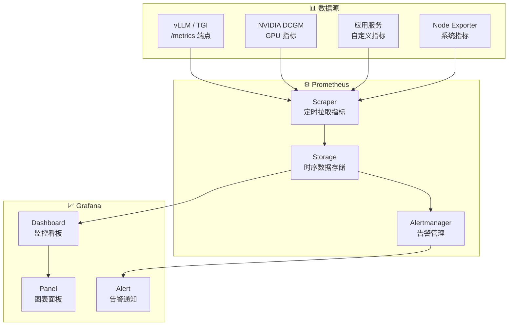
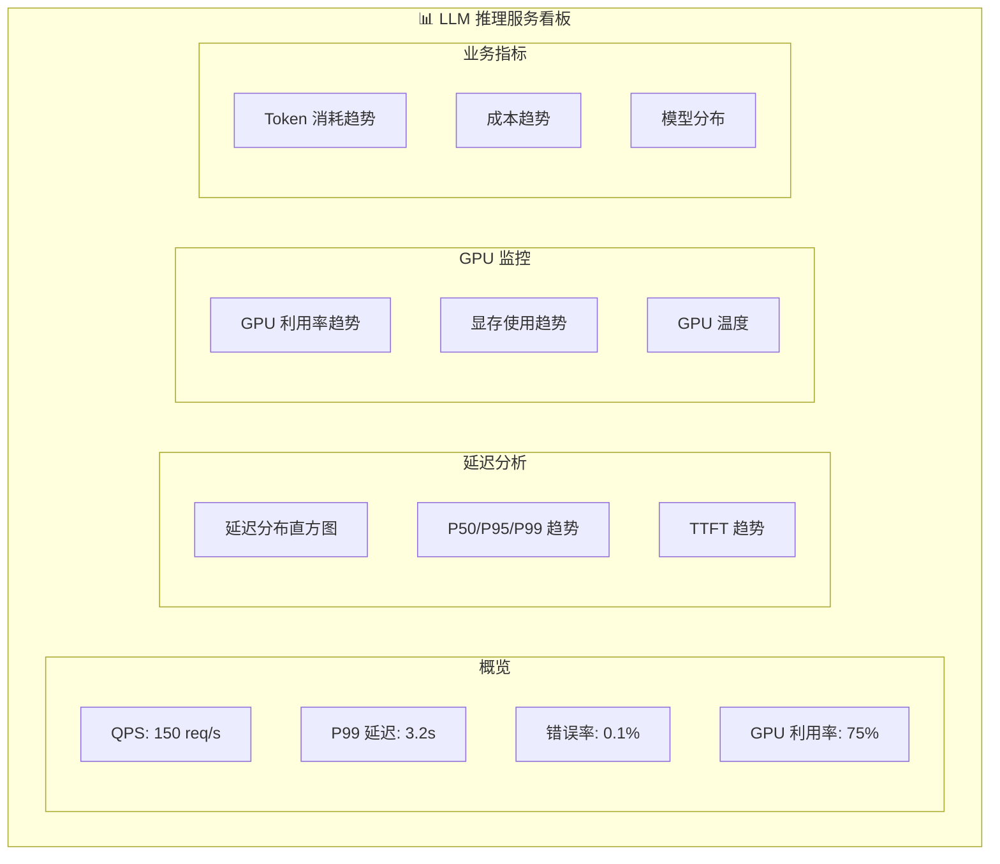

# Prometheus + Grafana

## 概念说明

**Prometheus** 是开源的时序数据库和监控系统，**Grafana** 是开源的可视化看板工具。两者组合是监控 LLM 推理服务的标准方案，可以采集 GPU 利用率、推理延迟、QPS、错误率等关键指标，并通过看板实时展示和告警。

### 监控架构



## 核心原理

### 1. Python 应用暴露 Prometheus 指标

```python
from prometheus_client import (
    Counter, Histogram, Gauge, start_http_server, REGISTRY
)

# 定义指标
REQUEST_COUNT = Counter(
    "llm_requests_total",
    "LLM 请求总数",
    ["model", "status"],
)
REQUEST_LATENCY = Histogram(
    "llm_request_duration_seconds",
    "LLM 请求延迟",
    ["model"],
    buckets=[0.1, 0.5, 1, 2, 5, 10, 30, 60],
)
GPU_UTILIZATION = Gauge(
    "gpu_utilization_percent",
    "GPU 利用率",
    ["gpu_id"],
)
ACTIVE_REQUESTS = Gauge(
    "llm_active_requests",
    "当前活跃请求数",
)

# 在请求处理中记录指标
async def handle_request(request):
    ACTIVE_REQUESTS.inc()
    with REQUEST_LATENCY.labels(model=request.model).time():
        try:
            result = await inference(request)
            REQUEST_COUNT.labels(model=request.model, status="success").inc()
            return result
        except Exception as e:
            REQUEST_COUNT.labels(model=request.model, status="error").inc()
            raise
        finally:
            ACTIVE_REQUESTS.dec()

# 启动指标 HTTP 服务
start_http_server(9090)  # http://localhost:9090/metrics
```

### 2. Prometheus 配置

```yaml
# prometheus.yml
global:
  scrape_interval: 15s
  evaluation_interval: 15s

scrape_configs:
  - job_name: "llm-gateway"
    static_configs:
      - targets: ["gateway:9090"]

  - job_name: "vllm"
    static_configs:
      - targets: ["vllm-1:8000", "vllm-2:8000"]
    metrics_path: "/metrics"

  - job_name: "nvidia-dcgm"
    static_configs:
      - targets: ["dcgm-exporter:9400"]

rule_files:
  - "alert_rules.yml"

alerting:
  alertmanagers:
    - static_configs:
        - targets: ["alertmanager:9093"]
```

### 3. 常用 PromQL 查询

```promql
# QPS（每秒请求数）
rate(llm_requests_total[5m])

# 平均延迟
rate(llm_request_duration_seconds_sum[5m])
/ rate(llm_request_duration_seconds_count[5m])

# P99 延迟
histogram_quantile(0.99, rate(llm_request_duration_seconds_bucket[5m]))

# 错误率
rate(llm_requests_total{status="error"}[5m])
/ rate(llm_requests_total[5m])

# GPU 利用率
avg(gpu_utilization_percent) by (gpu_id)
```

### 4. Grafana 看板设计



### 5. Docker Compose 部署

```yaml
# docker-compose.monitoring.yml
version: "3.8"
services:
  prometheus:
    image: prom/prometheus:latest
    ports:
      - "9090:9090"
    volumes:
      - ./prometheus.yml:/etc/prometheus/prometheus.yml

  grafana:
    image: grafana/grafana:latest
    ports:
      - "3000:3000"
    environment:
      - GF_SECURITY_ADMIN_PASSWORD=admin

  dcgm-exporter:
    image: nvcr.io/nvidia/k8s/dcgm-exporter:latest
    runtime: nvidia
    ports:
      - "9400:9400"
```

## 代码示例

> 💻 完整可运行代码：[code-examples/05-ai-engineering/monitoring/01_prometheus_metrics.py](/code-examples/05-ai-engineering/monitoring/01_prometheus_metrics.py)
> 🐍 Python 版本：3.11+
> 📦 依赖：prometheus-client>=0.17
> 🐳 Docker：`docker compose -f docker-compose.monitoring.yml up -d`

## 实战要点

**监控设计原则：**
- 四个黄金信号：延迟、流量、错误率、饱和度
- 指标命名遵循 Prometheus 命名规范
- 看板分层：概览 → 详情 → 调试
- 告警分级：P0（立即处理）→ P1（1 小时内）→ P2（工作日内）

**常见陷阱：**
- 指标太多导致 Prometheus 存储压力大（只采集有用的指标）
- 看板太复杂无人查看（保持简洁，突出关键指标）
- 告警太多导致"告警疲劳"（合理设置阈值和静默规则）
- 没有监控 Prometheus 本身的健康状态

## 常见面试题

### Q1: 如何设计 LLM 推理服务的监控看板？

**难度**：⭐⭐⭐ | **频率**：🔥🔥

**答题思路**：看板分层 → 关键指标 → 告警集成

**标准答案**：LLM 推理服务看板分三层：(1) 概览层——QPS、P99 延迟、错误率、GPU 利用率四个核心指标；(2) 详情层——延迟分布直方图、Token 消耗趋势、模型分布、TTFT 趋势；(3) 调试层——单请求 Trace、GPU 显存详情、请求队列长度。关键设计：使用 Grafana 变量支持按模型/实例筛选，设置告警注解链接到 Runbook。

**深入追问**：
- 四个黄金信号是什么？（延迟、流量、错误率、饱和度）
- 如何监控 GPU 指标？（NVIDIA DCGM Exporter）

### Q2: PromQL 如何计算 P99 延迟？

**难度**：⭐⭐⭐ | **频率**：🔥🔥

**答题思路**：PromQL 语法 → Histogram 原理 → 注意事项

**标准答案**：使用 `histogram_quantile` 函数：`histogram_quantile(0.99, rate(llm_request_duration_seconds_bucket[5m]))`。原理：Prometheus Histogram 将延迟分到不同的 bucket 中，`histogram_quantile` 通过线性插值估算分位数。注意事项：(1) bucket 边界设置要合理，覆盖实际延迟范围；(2) 结果是估算值，bucket 越细越准确；(3) 使用 `rate` 而非 `increase` 计算速率。

**深入追问**：
- Histogram 和 Summary 的区别？（Histogram 服务端计算，Summary 客户端计算）
- 如何优化 Prometheus 的存储？（降采样、保留策略、远程存储）

## 推荐工具

> 📌 以下工具可帮助你更高效地学习和实践本知识点，详见 [模块 7：AI 使用与实践](/7-ai-tools/)

| 工具 | 用途 | 详情 |
|------|------|------|
| Cursor | 辅助编写指标暴露代码 | [AI 编程辅助](/7-ai-tools/7.1-efficiency/ai-coding) |
| ChatGPT | 讨论 PromQL 查询 | [AI 对话助手](/7-ai-tools/7.1-efficiency/ai-chat) |
| Perplexity | 搜索 Grafana 看板模板 | [AI 搜索](/7-ai-tools/7.1-efficiency/ai-search) |

## 参考资料

- [Prometheus — Documentation](https://prometheus.io/docs/)
- [Grafana — Documentation](https://grafana.com/docs/)
- [NVIDIA DCGM Exporter](https://github.com/NVIDIA/dcgm-exporter)
- [PromQL Cheat Sheet](https://promlabs.com/promql-cheat-sheet/)
