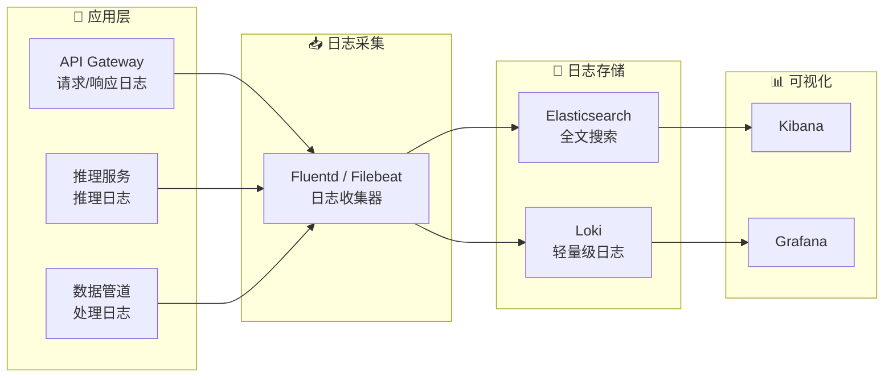

# 日志管理

## 概念说明

**日志管理**是 LLM 应用可观测性的重要组成部分，包括结构化日志记录、请求/响应日志、错误日志和日志聚合。良好的日志设计可以帮助快速定位问题、分析用户行为、满足审计合规要求。

### 日志架构



## 核心原理

### 1. 结构化日志

```python
import structlog
import logging

# 配置 structlog
structlog.configure(
    processors=[
        structlog.processors.TimeStamper(fmt="iso"),
        structlog.processors.add_log_level,
        structlog.processors.JSONRenderer(),
    ],
    wrapper_class=structlog.BoundLogger,
    logger_factory=structlog.PrintLoggerFactory(),
)

logger = structlog.get_logger()

# 结构化日志记录
logger.info(
    "llm_request",
    model="gpt-4o-mini",
    input_tokens=150,
    output_tokens=300,
    latency_ms=1200,
    status="success",
    user_id="user_123",
    request_id="req_abc",
)
# 输出: {"event": "llm_request", "model": "gpt-4o-mini", "input_tokens": 150, ...}
```

### 2. 请求日志中间件

```python
from fastapi import Request
import uuid
import time

async def request_logging_middleware(request: Request, call_next):
    """请求日志中间件"""
    request_id = str(uuid.uuid4())[:8]
    start_time = time.time()

    # 记录请求
    logger.info(
        "request_start",
        request_id=request_id,
        method=request.method,
        path=request.url.path,
        client_ip=request.client.host,
    )

    response = await call_next(request)
    duration = time.time() - start_time

    # 记录响应
    logger.info(
        "request_end",
        request_id=request_id,
        status_code=response.status_code,
        duration_ms=round(duration * 1000),
    )

    response.headers["X-Request-ID"] = request_id
    return response
```

### 3. 日志级别策略

| 级别 | 用途 | 示例 |
|------|------|------|
| **DEBUG** | 开发调试 | Prompt 内容、中间结果 |
| **INFO** | 正常操作 | 请求处理、模型加载 |
| **WARNING** | 潜在问题 | 延迟偏高、缓存未命中 |
| **ERROR** | 错误 | 推理失败、超时 |
| **CRITICAL** | 严重故障 | GPU OOM、服务不可用 |

### 4. 敏感信息处理

```python
class LogSanitizer:
    """日志脱敏处理"""

    SENSITIVE_FIELDS = ["api_key", "password", "token", "authorization"]

    @staticmethod
    def sanitize(data: dict) -> dict:
        """脱敏处理"""
        sanitized = {}
        for key, value in data.items():
            if any(sf in key.lower() for sf in LogSanitizer.SENSITIVE_FIELDS):
                sanitized[key] = "***REDACTED***"
            elif isinstance(value, str) and len(value) > 1000:
                sanitized[key] = value[:200] + f"...[truncated, total {len(value)} chars]"
            else:
                sanitized[key] = value
        return sanitized
```

### 5. 日志聚合方案对比

| 方案 | 特点 | 适用场景 | 成本 |
|------|------|----------|------|
| **ELK Stack** | 功能全面、全文搜索 | 大规模日志 | 高 |
| **Loki + Grafana** | 轻量、与 Grafana 集成 | 中小规模 | 低 |
| **CloudWatch** | AWS 原生 | AWS 环境 | 按量 |
| **Datadog** | SaaS、功能全面 | 企业级 | 高 |

## 代码示例

> 💻 完整可运行代码：[code-examples/05-ai-engineering/monitoring/01_prometheus_metrics.py](/code-examples/05-ai-engineering/monitoring/01_prometheus_metrics.py)
> 🐍 Python 版本：3.11+
> 📦 依赖：structlog>=23.0

## 实战要点

**日志设计原则：**
- 使用结构化日志（JSON 格式），方便机器解析
- 每条日志包含 request_id，支持请求链路追踪
- 敏感信息（API Key、用户数据）必须脱敏
- 日志级别合理使用，生产环境默认 INFO

**常见陷阱：**
- 日志中记录了完整的 Prompt 和响应（隐私风险 + 存储浪费）
- 没有 request_id 导致无法追踪请求链路
- 日志量太大导致存储成本高（设置保留策略）
- 错误日志没有包含足够的上下文信息

## 常见面试题

### Q1: LLM 应用的日志应该记录什么？

**难度**：⭐⭐ | **频率**：🔥🔥

**答题思路**：日志类型 → 记录内容 → 注意事项

**标准答案**：LLM 应用日志记录：(1) 请求日志——request_id、用户 ID、模型名称、输入 token 数、输出 token 数、延迟、状态码；(2) 推理日志——模型加载状态、GPU 利用率、KV Cache 使用率；(3) 错误日志——错误类型、堆栈信息、请求上下文；(4) 审计日志——用户操作、API Key 使用、敏感操作。注意：不要记录完整的 Prompt 和响应内容（隐私风险），只记录摘要或 hash。

**深入追问**：
- 如何处理日志中的敏感信息？（脱敏 + 分级存储）
- 日志保留策略如何设计？（热数据 7 天、温数据 30 天、冷数据 90 天）

## 推荐工具

> 📌 以下工具可帮助你更高效地学习和实践本知识点，详见 [模块 7：AI 使用与实践](/7-ai-tools/)

| 工具 | 用途 | 详情 |
|------|------|------|
| Cursor | 辅助编写日志代码 | [AI 编程辅助](/7-ai-tools/7.1-efficiency/ai-coding) |
| ChatGPT | 讨论日志策略 | [AI 对话助手](/7-ai-tools/7.1-efficiency/ai-chat) |
| Perplexity | 搜索日志管理方案 | [AI 搜索](/7-ai-tools/7.1-efficiency/ai-search) |

## 参考资料

- [structlog — Documentation](https://www.structlog.org/)
- [Grafana Loki — Documentation](https://grafana.com/docs/loki/)
- [ELK Stack — Getting Started](https://www.elastic.co/guide/en/elastic-stack-get-started/)
- [12 Factor App — Logs](https://12factor.net/logs)
