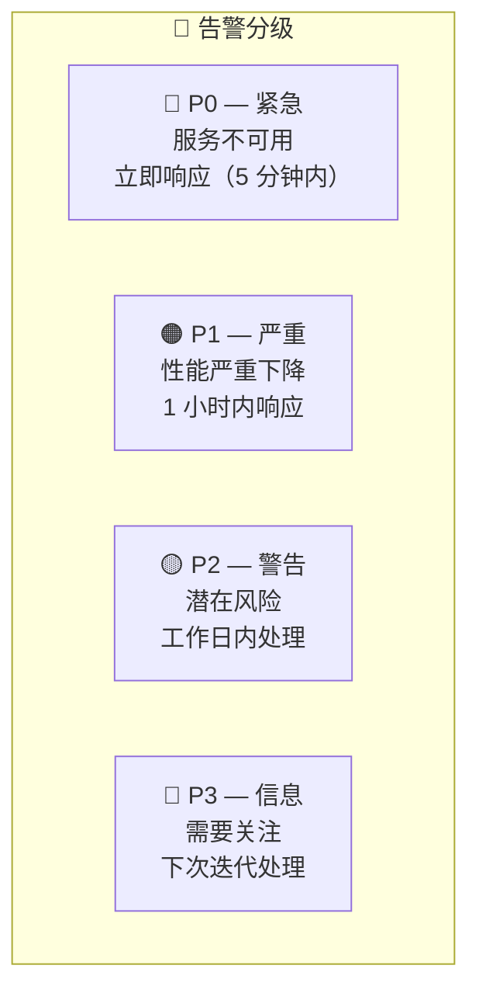
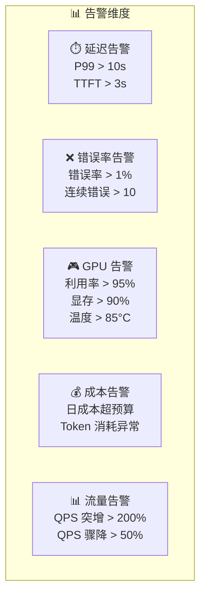
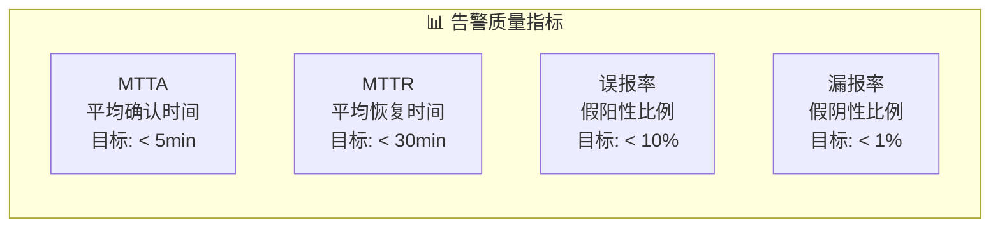

# 告警策略

## 概念说明

**告警策略**是生产监控的最后一环，当系统指标超过阈值时自动通知相关人员。LLM 推理服务的告警需要覆盖延迟、错误率、GPU 资源、成本等多个维度，并设计合理的分级和升级机制。

### 告警分级体系



### LLM 推理服务告警全景



## 核心原理

### 1. Prometheus 告警规则

```yaml
# alert_rules.yml
groups:
  - name: llm_alerts
    rules:
      # P0: 服务不可用
      - alert: LLMServiceDown
        expr: up{job="vllm"} == 0
        for: 1m
        labels:
          severity: critical
        annotations:
          summary: "LLM 推理服务不可用"
          description: "{{ $labels.instance }} 已停止响应超过 1 分钟"

      # P1: 延迟过高
      - alert: LLMHighLatency
        expr: histogram_quantile(0.99, rate(llm_request_duration_seconds_bucket[5m])) > 10
        for: 5m
        labels:
          severity: warning
        annotations:
          summary: "LLM P99 延迟超过 10 秒"
          description: "当前 P99 延迟: {{ $value }}s"

      # P1: 错误率过高
      - alert: LLMHighErrorRate
        expr: rate(llm_requests_total{status="error"}[5m]) / rate(llm_requests_total[5m]) > 0.01
        for: 5m
        labels:
          severity: warning
        annotations:
          summary: "LLM 错误率超过 1%"

      # P2: GPU 显存告警
      - alert: GPUMemoryHigh
        expr: gpu_memory_used_percent > 90
        for: 10m
        labels:
          severity: warning
        annotations:
          summary: "GPU 显存使用率超过 90%"
```

### 2. 告警通知渠道

```python
class AlertNotifier:
    """告警通知器 — 多渠道通知"""

    async def notify(self, alert: dict):
        severity = alert["severity"]

        if severity == "critical":
            # P0: 电话 + 短信 + 即时消息
            await self.send_phone_call(alert)
            await self.send_sms(alert)
            await self.send_slack(alert, channel="#incidents")

        elif severity == "warning":
            # P1: 即时消息
            await self.send_slack(alert, channel="#alerts")
            await self.send_email(alert)

        else:
            # P2/P3: 邮件
            await self.send_email(alert)
```

### 3. 告警抑制和静默

```yaml
# alertmanager.yml
route:
  group_by: ["alertname", "severity"]
  group_wait: 30s
  group_interval: 5m
  repeat_interval: 4h
  receiver: "default"

  routes:
    - match:
        severity: critical
      receiver: "pager"
      repeat_interval: 15m

    - match:
        severity: warning
      receiver: "slack"
      repeat_interval: 1h

inhibit_rules:
  # 服务不可用时抑制延迟告警
  - source_match:
      alertname: LLMServiceDown
    target_match:
      alertname: LLMHighLatency
    equal: ["instance"]
```

### 4. 告警 Runbook

| 告警 | 可能原因 | 处理步骤 |
|------|----------|----------|
| **服务不可用** | GPU OOM、进程崩溃 | 1. 检查 GPU 状态 2. 重启服务 3. 检查日志 |
| **延迟过高** | 并发过高、模型过大 | 1. 检查 QPS 2. 检查 GPU 利用率 3. 扩容 |
| **错误率过高** | 输入异常、模型问题 | 1. 检查错误日志 2. 检查输入数据 3. 回滚模型 |
| **GPU 显存高** | 并发过多、内存泄漏 | 1. 检查活跃请求数 2. 限制并发 3. 重启服务 |
| **成本超预算** | 流量突增、缓存失效 | 1. 检查流量来源 2. 启用降级 3. 限流 |

### 5. 告警质量评估



## 代码示例

> 💻 完整可运行代码：[code-examples/05-ai-engineering/monitoring/02_alerting.py](/code-examples/05-ai-engineering/monitoring/02_alerting.py)
> 🐍 Python 版本：3.11+

## 实战要点

**告警设计原则：**
- 每条告警都要有明确的处理步骤（Runbook）
- 告警分级要合理，避免所有告警都是 P0
- 设置告警抑制规则，避免告警风暴
- 定期回顾告警质量，调整阈值

**常见陷阱：**
- 告警太多导致"告警疲劳"（团队忽略告警）
- 阈值设置不合理（太敏感或太迟钝）
- 没有告警升级机制（P0 告警无人响应）
- 告警没有 Runbook（收到告警不知道怎么处理）

## 常见面试题

### Q1: 如何设计 LLM 推理服务的告警策略？

**难度**：⭐⭐⭐ | **频率**：🔥🔥

**答题思路**：告警维度 → 分级策略 → 通知机制

**标准答案**：告警策略设计：(1) 维度——延迟（P99 > 阈值）、错误率（> 1%）、GPU（利用率 > 95%、显存 > 90%）、成本（超预算）、可用性（服务不可用）；(2) 分级——P0 紧急（服务不可用，5 分钟响应）、P1 严重（性能下降，1 小时响应）、P2 警告（潜在风险，工作日处理）；(3) 通知——P0 电话+短信+即时消息、P1 即时消息+邮件、P2 邮件；(4) 抑制——上游告警触发时抑制下游告警，避免告警风暴。

**深入追问**：
- 如何避免告警疲劳？（合理阈值 + 告警聚合 + 定期回顾）
- MTTA 和 MTTR 分别是什么？（平均确认时间和平均恢复时间）

## 推荐工具

> 📌 以下工具可帮助你更高效地学习和实践本知识点，详见 [模块 7：AI 使用与实践](/7-ai-tools/)

| 工具 | 用途 | 详情 |
|------|------|------|
| Cursor | 辅助编写告警规则 | [AI 编程辅助](/7-ai-tools/7.1-efficiency/ai-coding) |
| ChatGPT | 讨论告警策略设计 | [AI 对话助手](/7-ai-tools/7.1-efficiency/ai-chat) |
| Perplexity | 搜索告警最佳实践 | [AI 搜索](/7-ai-tools/7.1-efficiency/ai-search) |

## 参考资料

- [Prometheus — Alerting Rules](https://prometheus.io/docs/prometheus/latest/configuration/alerting_rules/)
- [Alertmanager — Configuration](https://prometheus.io/docs/alerting/latest/configuration/)
- [PagerDuty — Incident Response](https://response.pagerduty.com/)
- [Google SRE — Alerting on SLOs](https://sre.google/workbook/alerting-on-slos/)
