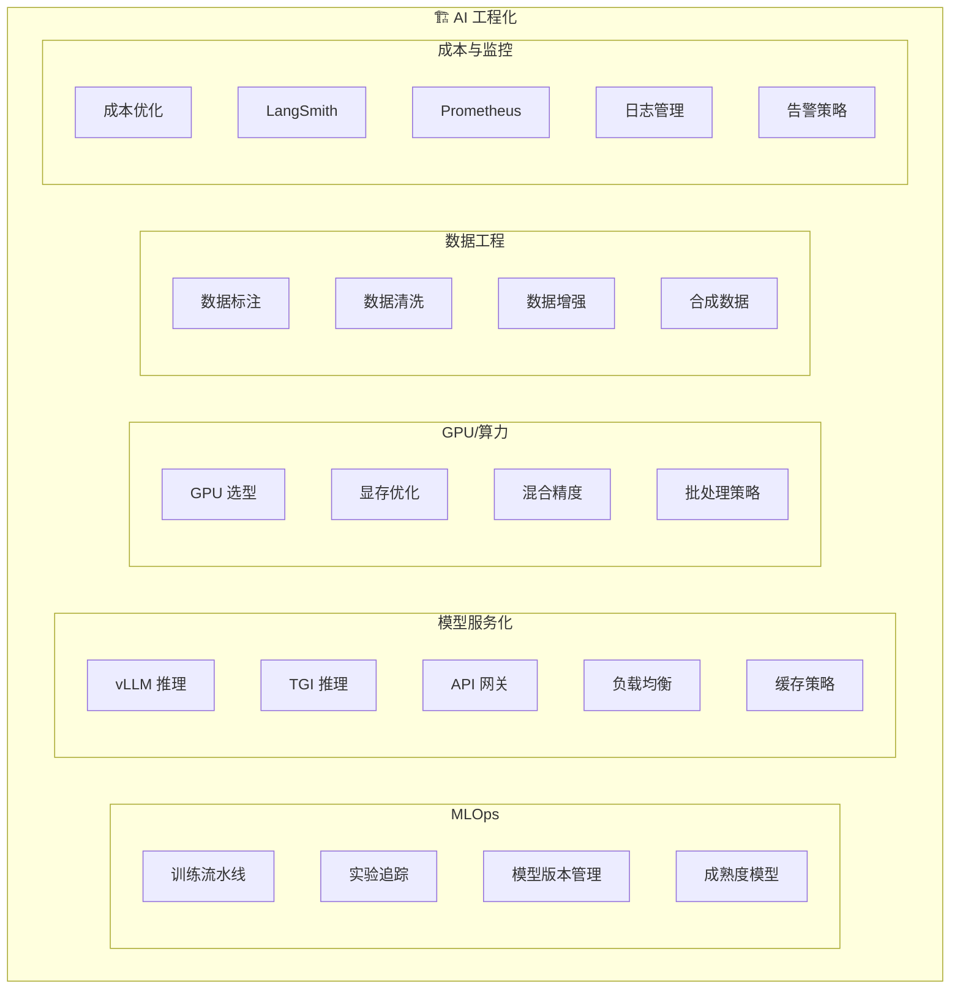

# 模块 5：AI 工程化

> 从实验到生产的完整工程化实践，覆盖 MLOps、模型服务化、GPU 优化、数据工程、成本控制和生产监控。

## 模块概览

本模块聚焦 AI 系统的工程化实践，帮助你将 ML 模型从实验环境部署到生产环境，并实现高效、可靠、可监控的运行。

## 知识点目录

### 📋 MLOps（任务 6.1-6.5）

| # | 知识点 | 文档 | 代码示例 | 难度 |
|---|--------|------|----------|------|
| 01 | [MLOps 训练流水线](./01-mlops-pipeline.md) | ✅ | [mlops/01_mlflow_tracking.py](/code-examples/05-ai-engineering/mlops/01_mlflow_tracking.py) | ⭐⭐⭐ |
| 02 | [实验追踪](./02-experiment-tracking.md) | ✅ | [mlops/02_wandb_experiment.py](/code-examples/05-ai-engineering/mlops/02_wandb_experiment.py) | ⭐⭐ |
| 03 | [模型版本管理](./03-model-registry.md) | ✅ | [mlops/03_model_registry.py](/code-examples/05-ai-engineering/mlops/03_model_registry.py) | ⭐⭐ |
| 04 | [MLOps 成熟度模型](./04-mlops-maturity.md) | ✅ | — | ⭐⭐ |

### 🚀 模型服务化（任务 6.6-6.11）

| # | 知识点 | 文档 | 代码示例 | 难度 |
|---|--------|------|----------|------|
| 05 | [vLLM 推理服务](./05-vllm-serving.md) | ✅ | [serving/01_vllm_config.py](/code-examples/05-ai-engineering/serving/01_vllm_config.py) | ⭐⭐⭐ |
| 06 | [TGI 推理服务](./06-tgi-serving.md) | ✅ | — | ⭐⭐⭐ |
| 07 | [API 网关](./07-api-gateway.md) | ✅ | [serving/02_fastapi_gateway.py](/code-examples/05-ai-engineering/serving/02_fastapi_gateway.py) | ⭐⭐ |
| 08 | [负载均衡](./08-load-balancing.md) | ✅ | [serving/03_load_balancer.py](/code-examples/05-ai-engineering/serving/03_load_balancer.py) | ⭐⭐ |
| 09 | [缓存策略](./09-caching-strategies.md) | ✅ | — | ⭐⭐⭐ |

### 🎮 GPU/算力（任务 6.12-6.16）

| # | 知识点 | 文档 | 代码示例 | 难度 |
|---|--------|------|----------|------|
| 10 | [GPU 选型](./10-gpu-selection.md) | ✅ | — | ⭐⭐ |
| 11 | [显存优化](./11-memory-optimization.md) | ✅ | [gpu_optimization/02_gradient_checkpoint.py](/code-examples/05-ai-engineering/gpu_optimization/02_gradient_checkpoint.py) | ⭐⭐⭐ |
| 12 | [混合精度训练](./12-mixed-precision.md) | ✅ | [gpu_optimization/01_mixed_precision.py](/code-examples/05-ai-engineering/gpu_optimization/01_mixed_precision.py) | ⭐⭐ |
| 13 | [批处理策略](./13-batching-strategies.md) | ✅ | — | ⭐⭐⭐ |

### 📊 数据工程（任务 6.17-6.21）

| # | 知识点 | 文档 | 代码示例 | 难度 |
|---|--------|------|----------|------|
| 14 | [数据标注](./14-data-labeling.md) | ✅ | [data_engineering/01_data_labeling.py](/code-examples/05-ai-engineering/data_engineering/01_data_labeling.py) | ⭐⭐ |
| 15 | [数据清洗](./15-data-cleaning.md) | ✅ | [data_engineering/02_data_cleaning.py](/code-examples/05-ai-engineering/data_engineering/02_data_cleaning.py) | ⭐⭐ |
| 16 | [数据增强](./16-data-augmentation.md) | ✅ | — | ⭐⭐ |
| 17 | [合成数据](./17-synthetic-data.md) | ✅ | [data_engineering/03_synthetic_data.py](/code-examples/05-ai-engineering/data_engineering/03_synthetic_data.py) | ⭐⭐⭐ |

### 💰 成本与监控（任务 6.22-6.27）

| # | 知识点 | 文档 | 代码示例 | 难度 |
|---|--------|------|----------|------|
| 18 | [成本优化](./18-cost-optimization.md) | ✅ | — | ⭐⭐⭐ |
| 19 | [LangSmith 生产监控](./19-langsmith-monitoring.md) | ✅ | — | ⭐⭐ |
| 20 | [Prometheus + Grafana](./20-prometheus-grafana.md) | ✅ | [monitoring/01_prometheus_metrics.py](/code-examples/05-ai-engineering/monitoring/01_prometheus_metrics.py) | ⭐⭐ |
| 21 | [日志管理](./21-logging.md) | ✅ | — | ⭐⭐ |
| 22 | [告警策略](./22-alerting.md) | ✅ | [monitoring/02_alerting.py](/code-examples/05-ai-engineering/monitoring/02_alerting.py) | ⭐⭐ |

## 辅助资源

| 资源 | 说明 |
|------|------|
| [面试指南](./interview.md) | MLOps/vLLM/GPU/成本等高频面试题 |
| [速查卡片](./cheatsheet.md) | 核心概念和常用命令速查 |

## 里程碑项目

| 项目 | 说明 | 代码 |
|------|------|------|
| 端到端 CI/CD 流水线 | 数据→训练→评估→部署自动化 | [cicd_pipeline/main.py](/code-examples/05-ai-engineering/milestone_projects/cicd_pipeline/main.py) |
| vLLM + 监控面板 | vLLM 推理 + Prometheus/Grafana | [vllm_monitoring/main.py](/code-examples/05-ai-engineering/milestone_projects/vllm_monitoring/main.py) |
| 自动化数据管道 | 采集→清洗→标注→增强→训练集 | [data_pipeline/main.py](/code-examples/05-ai-engineering/milestone_projects/data_pipeline/main.py) |

## 学习路径建议

1. **入门**：先学 MLOps 基础（01-04），理解训练流水线和实验管理
2. **服务化**：学习模型部署（05-09），掌握 vLLM 和 API 网关
3. **优化**：学习 GPU 优化（10-13），理解显存管理和批处理
4. **数据**：学习数据工程（14-17），掌握数据标注和合成数据
5. **生产**：学习成本和监控（18-22），建立生产级监控体系
6. **实战**：完成三个里程碑项目，综合运用所学知识

## 前置依赖

- [模块 0：前提准备](/0-prerequisites/) — Python 基础、FastAPI
- [模块 2：大语言模型 LLM](/2-llm/) — 模型原理、部署基础
- [模块 3：AI 应用开发](/3-ai-apps/) — LangChain、RAG 基础
