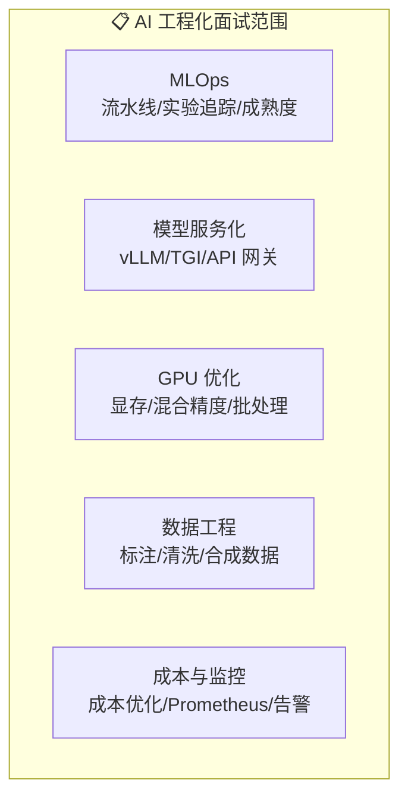

# AI 工程化面试指南

> 覆盖 MLOps、vLLM、GPU 优化、数据工程、成本控制等高频面试题，每道题包含难度标注、频率标注、答题思路和深入追问。

## 面试题总览

---

## 一、MLOps 流水线

### Q1: 请描述一个完整的 MLOps 训练流水线

**难度**：⭐⭐⭐ | **频率**：🔥🔥🔥 | **来源**：大厂 AI 平台岗

**答题思路**：按阶段展开 → 每个阶段的关键操作 → 工具选择

**标准答案**：完整的 MLOps 训练流水线包含四个核心阶段：(1) 数据准备——数据拉取、版本管理（DVC）、质量验证（Great Expectations）、特征工程；(2) 模型训练——超参数配置、分布式训练、实验追踪（MLflow/W&B）；(3) 模型评估——离线指标计算、与基准模型对比、质量门禁检查；(4) 模型注册——模型打包、版本注册、阶段推进（Staging → Production）。整个流水线由编排引擎（Airflow/Kubeflow）管理。

**深入追问**：
- 如何保证训练的可复现性？
  - 数据版本（DVC）+ 代码版本（Git）+ 环境版本（Docker）+ 随机种子固定
- Training-Serving Skew 如何避免？
  - 统一预处理 Pipeline + Feature Store + 端到端一致性测试
- 如何设计质量门禁？
  - 多维度评估（性能、延迟、公平性）+ 自动化检查 + 人工审批

### Q2: MLOps 成熟度模型的三个级别分别是什么？

**难度**：⭐⭐⭐ | **频率**：🔥🔥🔥 | **来源**：AI 架构师面试

**答题思路**：逐级描述 → 关键差异 → 升级路径

**标准答案**：Level 0（手动）——Notebook 开发、手动执行、无实验追踪、手动部署；Level 1（自动化训练）——流水线编排（Airflow）、实验追踪（MLflow）、持续训练、Model Registry；Level 2（自动化 CI/CD）——代码 CI/CD、自动化测试、自动部署、A/B 测试、持续监控。

**深入追问**：
- 你们团队目前在哪个级别？如何改进？
- 小团队应该追求哪个级别？（Level 1 足够，重点是可复现性）

---

## 二、模型服务化

### Q3: vLLM 的 PagedAttention 原理是什么？

**难度**：⭐⭐⭐⭐ | **频率**：🔥🔥🔥 | **来源**：LLM 推理优化岗

**答题思路**：类比操作系统 → 解决什么问题 → 性能提升

**标准答案**：PagedAttention 借鉴操作系统虚拟内存的分页机制管理 KV Cache。传统方式为每个请求预分配连续 KV Cache 空间，导致内存碎片和浪费（平均 60-80%）。PagedAttention 将 KV Cache 分成固定大小的 block，按需分配，不需要连续空间。优势：消除内存碎片、支持更多并发、支持 KV Cache 共享（beam search）。

**深入追问**：
- Continuous Batching 和 Static Batching 的区别？
  - 动态 vs 静态，请求完成即释放 vs 等所有请求完成
- vLLM 和 TGI 如何选择？
  - 追求极致性能 → vLLM；需要 HF 生态集成 → TGI

### Q4: 如何设计 LLM API 网关？

**难度**：⭐⭐⭐ | **频率**：🔥🔥🔥 | **来源**：后端架构面试

**答题思路**：核心功能 → 架构设计 → 关键实现

**标准答案**：LLM API 网关核心功能：(1) 认证鉴权——API Key/JWT 验证；(2) 速率限制——按用户/IP 限制 RPM 和 TPM；(3) 请求路由——按模型名称、用户等级路由到不同后端；(4) 缓存——精确缓存 + 语义缓存；(5) 可观测性——请求日志、延迟指标、成本统计；(6) 流量管理——优雅降级、熔断、Fallback。

**深入追问**：
- 如何实现 Token 级别的速率限制？
  - 预估输入 token 数 + 实际输出 token 数，Redis 原子操作
- 如何处理流式响应？
  - SSE + StreamingResponse + 关闭 proxy_buffering

### Q5: LLM 推理服务的负载均衡有什么特殊考虑？

**难度**：⭐⭐⭐ | **频率**：🔥🔥 | **来源**：SRE/运维面试

**答题思路**：与传统 Web 的区别 → 特殊需求 → 解决方案

**标准答案**：LLM 推理负载均衡的特殊考虑：(1) 请求处理时间长（秒级到分钟级），需要更长超时；(2) 请求异构性大（10 tokens vs 4096 tokens），简单轮询效果差；(3) GPU 资源约束，需要基于 GPU 指标的路由；(4) 流式响应需要关闭代理缓冲；(5) 模型加载时间长，新实例不能立即服务。推荐使用加权最少连接 + GPU 指标感知路由。

**深入追问**：
- 如何实现自动扩缩容？（基于 GPU 利用率的 HPA + 预测性扩容）
- 冷启动问题如何解决？（模型预加载、镜像预热）

---

## 三、GPU 优化

### Q6: 训练一个 7B 模型需要多少显存？如何优化？

**难度**：⭐⭐⭐⭐ | **频率**：🔥🔥🔥 | **来源**：AI 训练工程师面试

**答题思路**：显存组成分析 → 各部分占用 → 优化方案

**标准答案**：7B 模型全参数训练：权重 FP16 = 14GB + 梯度 FP16 = 14GB + Adam 优化器 FP32 = 56GB + 激活值 ≈ 10-30GB = 总计约 100GB+。优化方案：混合精度训练节省 30%；梯度检查点减少 60% 激活值；DeepSpeed ZeRO-2 分片梯度和优化器；QLoRA 只训练 0.1% 参数，16GB 即可微调。

**深入追问**：
- 为什么 Adam 需要这么多显存？（momentum + variance 各一份 FP32）
- DeepSpeed ZeRO 三个阶段分别优化什么？（优化器/梯度/参数）
- FSDP 和 DeepSpeed 如何选择？（PyTorch 生态选 FSDP，更多选项选 DeepSpeed）

### Q7: FP16 和 BF16 如何选择？

**难度**：⭐⭐⭐ | **频率**：🔥🔥🔥 | **来源**：深度学习工程师面试

**答题思路**：数值特性对比 → GPU 支持 → 选择建议

**标准答案**：FP16 精度更高但数值范围小（±65504），容易溢出需要 Loss Scaling；BF16 数值范围和 FP32 相同，训练更稳定不需要 Loss Scaling。选择：A100/H100 → BF16；旧 GPU → FP16；推理 → FP16；训练 → BF16。

**深入追问**：
- GradScaler 的工作原理？（Loss 放大 → 梯度放大 → 梯度缩小 → 动态调整缩放因子）
- FP8 训练的现状？（H100 支持，精度损失需验证）

---

## 四、数据工程

### Q8: LLM 训练数据清洗的关键步骤？

**难度**：⭐⭐⭐ | **频率**：🔥🔥🔥 | **来源**：数据工程师面试

**答题思路**：按步骤展开 → 每步的方法 → 质量评估

**标准答案**：(1) 格式标准化——统一编码、去除 HTML 标签；(2) 去重——精确去重（Hash）+ 模糊去重（MinHash LSH）；(3) 质量过滤——长度过滤、语言检测、困惑度过滤；(4) 敏感信息脱敏——PII 检测和替换；(5) 有害内容过滤——毒性检测、违规内容过滤。

**深入追问**：
- MinHash LSH 的原理？（局部敏感哈希，相似文档映射到同一桶）
- 困惑度过滤的原理？（PPL 过高说明文本不通顺）

### Q9: Self-Instruct 和 Evol-Instruct 的区别？

**难度**：⭐⭐⭐ | **频率**：🔥🔥🔥 | **来源**：LLM 数据工程面试

**答题思路**：方法对比 → 各自优势 → 适用场景

**标准答案**：Self-Instruct 从种子指令出发让 LLM 生成新指令和回答，重点是数量扩展；Evol-Instruct 对现有指令进行深度进化（添加约束、增加推理）和广度进化（改写、换领域），重点是质量和复杂度提升。Self-Instruct 适合快速扩充数据量，Evol-Instruct 适合生成高难度训练数据。

**深入追问**：
- 如何避免合成数据的模型坍缩？（强模型生成 + 混合真实数据）
- 如何评估合成数据质量？（准确性 + 多样性 + 下游效果）

---

## 五、成本与监控

### Q10: LLM 应用如何控制成本？

**难度**：⭐⭐⭐ | **频率**：🔥🔥🔥 | **来源**：AI 产品/架构面试

**答题思路**：成本构成 → 优化策略 → 监控机制

**标准答案**：(1) 模型路由——按任务复杂度选择模型，简单任务用小模型（成本降低 95%）；(2) 缓存——精确缓存 + 语义缓存，命中率 30-50%；(3) Prompt 优化——精简 Prompt 减少 Token；(4) Fallback——大模型超时降级到小模型；(5) 批处理——合并请求利用批量折扣；(6) 自部署——高流量时自部署更划算。

**深入追问**：
- API 和自部署的盈亏平衡点？（取决于模型大小和请求量）
- 如何设计 Fallback 机制？（触发条件 + 降级链 + 质量保障 + 自动恢复）

### Q11: LLM 应用需要监控哪些指标？

**难度**：⭐⭐⭐ | **频率**：🔥🔥🔥 | **来源**：SRE/运维面试

**答题思路**：按维度分类 → 每个指标的意义 → 告警策略

**标准答案**：四类指标：(1) 性能——延迟 P50/P95/P99、吞吐量 QPS、TTFT；(2) 质量——回答准确率、用户满意度、幻觉率；(3) 成本——Token 消耗、API 费用、GPU 利用率；(4) 可用性——错误率、超时率、SLA。每类指标设置告警阈值和升级策略。

**深入追问**：
- 如何监控 LLM 的幻觉率？（事实核查 + 用户反馈 + 自动评估）
- LangSmith 和 Prometheus 的区别？（LLM 应用层 vs 基础设施层）

### Q12: 什么是 KV Cache？为什么它对 LLM 推理很重要？

**难度**：⭐⭐⭐⭐ | **频率**：🔥🔥🔥 | **来源**：LLM 推理优化岗

**答题思路**：KV Cache 原理 → 为什么需要 → 优化方式

**标准答案**：KV Cache 缓存 Transformer 推理时已计算的 Key 和 Value 矩阵，避免重复计算。自回归生成中每生成一个 token 都需要 attention 计算，不缓存 KV 则复杂度从 O(n) 变成 O(n²)。优化方式：PagedAttention 分页管理、Prefix Caching 前缀复用、量化 KV Cache（FP8/INT8）、Multi-Query Attention 共享 KV。

**深入追问**：
- KV Cache 占用多少显存？（与模型大小、序列长度、并发数成正比）
- GQA 和 MQA 的区别？（GQA 分组共享 KV，MQA 所有 Query 共享一组 KV）

---

## 面试准备建议

1. **理解原理**：不要只背答案，理解每个技术的原理和权衡
2. **结合实践**：用自己的项目经验举例，比泛泛而谈更有说服力
3. **关注数字**：记住关键数字（7B 模型 14GB、A100 80GB、P99 延迟等）
4. **准备追问**：每个问题都准备 2-3 个追问的答案
5. **动手实践**：运行本模块的代码示例，加深理解
