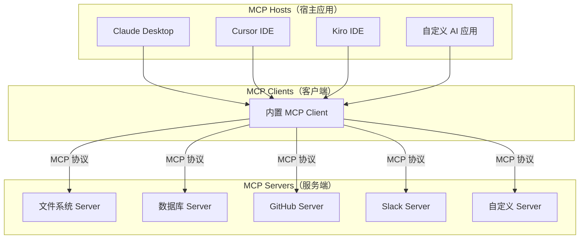
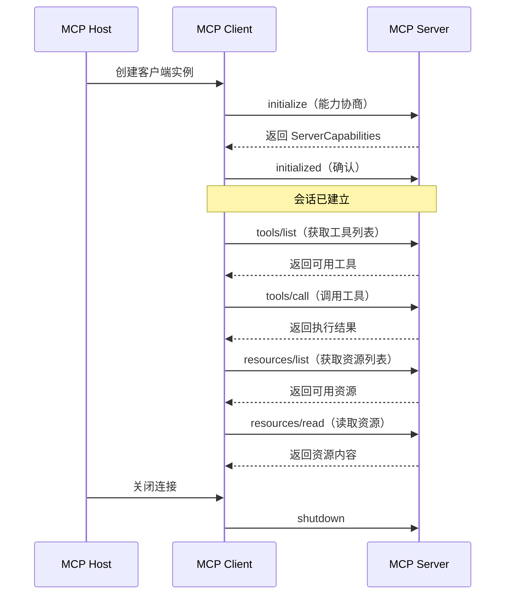
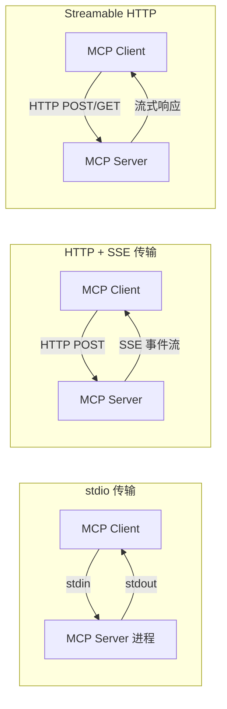
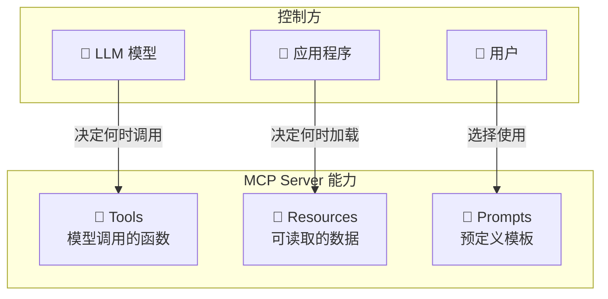

# MCP 协议原理

## 概念说明

**MCP（Model Context Protocol，模型上下文协议）** 是由 Anthropic 于 2024 年底发布的开放标准协议，旨在为 AI 模型（特别是 LLM）与外部工具、数据源之间建立统一的通信接口。MCP 的核心理念是"让 AI 模型像浏览器访问网页一样访问工具和数据"——通过标准化的协议规范，任何 AI 应用都可以无缝连接任何 MCP Server 提供的能力。

### 为什么需要 MCP？

在 MCP 出现之前，AI 应用集成外部工具面临 **M×N 问题**：

- M 个 AI 应用（ChatGPT、Claude、Cursor、Kiro 等）
- N 个工具/数据源（数据库、API、文件系统等）
- 需要 M×N 个定制集成，维护成本极高

MCP 将这个问题简化为 **M+N**：每个 AI 应用实现一个 MCP Client，每个工具实现一个 MCP Server，即可互联互通。

### MCP 与 Function Calling 的区别

| 维度 | Function Calling | MCP |
|------|-----------------|-----|
| 定义方 | 各 LLM 厂商自定义 | 开放标准协议 |
| 作用域 | 单次 API 调用 | 持久化连接 + 会话管理 |
| 工具发现 | 手动定义 JSON Schema | 动态能力协商 |
| 传输方式 | HTTP 请求/响应 | stdio / SSE / WebSocket |
| 生态兼容 | 厂商锁定 | 跨平台通用 |
| 资源访问 | 不支持 | 原生支持资源暴露 |

### MCP 生态全景



## 核心原理

### 1. 协议规范架构

MCP 基于 **JSON-RPC 2.0** 协议构建，采用客户端-服务端架构：



### 2. 消息格式

MCP 使用 JSON-RPC 2.0 消息格式，包含三种消息类型：

**请求消息（Request）：**
```json
{
  "jsonrpc": "2.0",
  "id": 1,
  "method": "tools/call",
  "params": {
    "name": "query_database",
    "arguments": {
      "sql": "SELECT * FROM users LIMIT 10"
    }
  }
}
```

**响应消息（Response）：**
```json
{
  "jsonrpc": "2.0",
  "id": 1,
  "result": {
    "content": [
      {
        "type": "text",
        "text": "查询返回 10 条记录..."
      }
    ]
  }
}
```

**通知消息（Notification）：**
```json
{
  "jsonrpc": "2.0",
  "method": "notifications/resources/updated",
  "params": {
    "uri": "file:///data/config.json"
  }
}
```

### 3. 传输层

MCP 支持多种传输方式，适应不同部署场景：

| 传输方式 | 适用场景 | 特点 |
|---------|---------|------|
| **stdio** | 本地进程通信 | 最简单，适合 IDE 集成 |
| **HTTP + SSE** | 远程服务 | 支持服务端推送，适合 Web 部署 |
| **Streamable HTTP** | 新一代远程传输 | 替代 SSE，更灵活的流式传输 |



### 4. 能力协商（Capability Negotiation）

MCP 连接建立时，客户端和服务端通过 `initialize` 方法交换能力声明：

```python
# 客户端发送的 initialize 请求
{
    "method": "initialize",
    "params": {
        "protocolVersion": "2024-11-05",
        "capabilities": {
            "roots": {"listChanged": True},
            "sampling": {}
        },
        "clientInfo": {
            "name": "my-ai-app",
            "version": "1.0.0"
        }
    }
}

# 服务端返回的能力声明
{
    "protocolVersion": "2024-11-05",
    "capabilities": {
        "tools": {"listChanged": True},
        "resources": {"subscribe": True, "listChanged": True},
        "prompts": {"listChanged": True}
    },
    "serverInfo": {
        "name": "database-server",
        "version": "0.1.0"
    }
}
```

### 5. MCP 三大核心原语

| 原语 | 控制方 | 说明 | 示例 |
|------|--------|------|------|
| **Tools（工具）** | 模型控制 | LLM 可调用的函数 | 查询数据库、发送邮件 |
| **Resources（资源）** | 应用控制 | 可读取的数据源 | 文件内容、数据库记录 |
| **Prompts（提示模板）** | 用户控制 | 预定义的交互模板 | 代码审查模板、SQL 生成模板 |



## 代码示例

> 💻 完整可运行代码：[code-examples/06-ai-frontier/mcp/01_mcp_server.py](/code-examples/06-ai-frontier/mcp/01_mcp_server.py)
> 🐍 Python 版本：3.11+
> 📦 依赖：标准库（模拟模式）

```python
# MCP 消息处理核心逻辑
class MCPServer:
    """MCP Server 基础实现"""

    def __init__(self, name: str, version: str):
        self.name = name
        self.version = version
        self.tools = {}
        self.resources = {}

    def register_tool(self, name, description, schema, handler):
        """注册工具"""
        self.tools[name] = {
            "description": description,
            "inputSchema": schema,
            "handler": handler,
        }

    async def handle_request(self, message: dict):
        """处理 JSON-RPC 请求"""
        method = message.get("method")
        if method == "initialize":
            return self._handle_initialize(message)
        elif method == "tools/list":
            return self._handle_tools_list()
        elif method == "tools/call":
            return await self._handle_tools_call(message)
```

## 实战要点

**MCP 开发最佳实践：**
- 工具命名使用 `snake_case`，描述清晰具体，帮助 LLM 理解何时调用
- 输入参数使用 JSON Schema 严格定义，包含 `description` 字段
- 错误处理要返回有意义的错误信息，而非通用错误码
- 资源 URI 使用标准格式（如 `file://`、`db://`），便于客户端解析
- 长时间操作使用进度通知（`notifications/progress`）

**常见陷阱：**
- 忘记处理 `initialize` 阶段的版本协商，导致协议不兼容
- 工具描述过于简略，LLM 无法准确判断何时调用
- 没有实现错误边界，单个工具异常导致整个 Server 崩溃
- stdio 传输模式下，日志输出到 stdout 干扰协议通信（应输出到 stderr）

## 常见面试题

### Q1: 请解释 MCP 协议的核心架构和三大原语

**难度**：⭐⭐⭐ | **频率**：🔥🔥🔥

**答题思路**：协议定位 → 架构组成 → 三大原语 → 与 Function Calling 对比

**标准答案**：MCP 是 Anthropic 发布的开放标准协议，基于 JSON-RPC 2.0 构建，采用 Client-Server 架构。三大核心原语：(1) Tools——模型可调用的函数，由 LLM 决定何时调用；(2) Resources——可读取的数据源，由应用程序控制加载；(3) Prompts——预定义的交互模板，由用户选择使用。MCP 解决了 AI 应用集成外部工具的 M×N 问题，将其简化为 M+N。

**深入追问**：
- MCP 的能力协商机制是如何工作的？
- stdio 和 SSE 两种传输方式各适用什么场景？
- MCP 如何保证通信安全性？

### Q2: MCP 与 OpenAI Function Calling 有什么本质区别？

**难度**：⭐⭐⭐⭐ | **频率**：🔥🔥🔥

**答题思路**：标准化 vs 私有 → 连接模型 → 能力范围 → 生态影响

**标准答案**：核心区别在于：(1) 标准化程度——MCP 是开放标准，Function Calling 是各厂商私有实现；(2) 连接模型——MCP 支持持久化连接和会话管理，Function Calling 是无状态的请求/响应；(3) 能力范围——MCP 支持工具、资源、提示模板三大原语，Function Calling 仅支持函数调用；(4) 工具发现——MCP 支持动态能力协商和工具列表变更通知，Function Calling 需要手动定义。MCP 的目标是成为 AI 工具集成的"USB 接口"。

**深入追问**：
- 在实际项目中，MCP 和 Function Calling 可以共存吗？
- MCP 的 Resources 原语解决了什么 Function Calling 无法解决的问题？

### Q3: 请描述 MCP 的连接建立和能力协商流程

**难度**：⭐⭐⭐⭐ | **频率**：🔥🔥

**答题思路**：三次握手类比 → initialize 请求 → 能力声明 → initialized 确认

**标准答案**：MCP 连接建立类似 TCP 三次握手：(1) Client 发送 `initialize` 请求，携带协议版本、客户端能力声明和客户端信息；(2) Server 返回响应，包含服务端能力声明（支持的原语类型、是否支持订阅等）和服务端信息；(3) Client 发送 `initialized` 通知确认连接建立。能力协商确保双方只使用对方支持的功能，实现向前兼容。

**深入追问**：
- 如果协议版本不兼容怎么处理？
- `listChanged` 能力的作用是什么？

## 推荐工具

> 📌 以下工具可帮助你更高效地学习和实践本知识点，详见 [模块 7：AI 使用与实践](/7-ai-tools/)

| 工具 | 用途 | 详情 |
|------|------|------|
| Cursor | 辅助编写 MCP Server/Client 代码 | [AI 编程辅助](/7-ai-tools/7.1-efficiency/ai-coding) |
| Perplexity | 搜索 MCP 协议最新规范 | [AI 搜索](/7-ai-tools/7.1-efficiency/ai-search) |
| ChatGPT | 讨论 MCP 协议设计细节 | [AI 对话助手](/7-ai-tools/7.1-efficiency/ai-chat) |

## 参考资料

- [MCP 官方规范](https://spec.modelcontextprotocol.io/)
- [MCP GitHub 仓库](https://github.com/modelcontextprotocol)
- [Anthropic MCP 发布博客](https://www.anthropic.com/news/model-context-protocol)
- [MCP Python SDK](https://github.com/modelcontextprotocol/python-sdk)
- [MCP Servers 社区仓库](https://github.com/modelcontextprotocol/servers)
