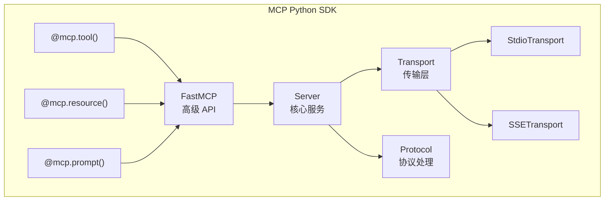
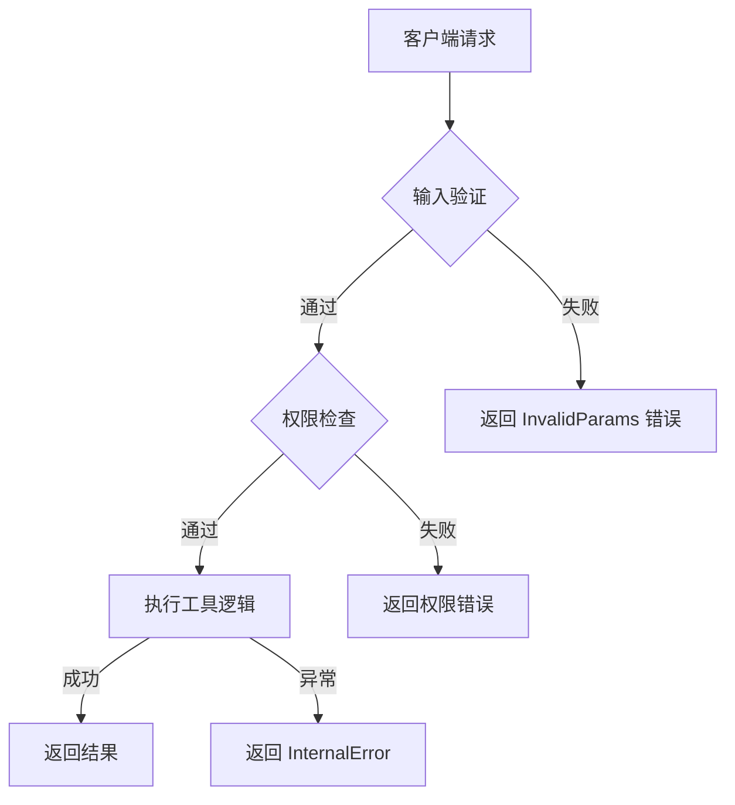

# MCP Server 开发

## 概念说明

**MCP Server** 是 MCP 协议中的服务提供方，负责向 AI 应用暴露工具（Tools）、资源（Resources）和提示模板（Prompts）。开发一个 MCP Server 就是将现有的 API、数据库、文件系统等能力封装为标准化的 MCP 接口，让任何支持 MCP 的 AI 应用都能直接使用。

### MCP Server 的核心职责

- **工具注册**：将函数封装为 LLM 可调用的工具，定义输入 Schema 和描述
- **资源暴露**：将数据源（文件、数据库、API）封装为可读取的资源
- **Prompt 模板**：提供预定义的交互模板，引导用户高效使用
- **生命周期管理**：处理连接建立、能力协商、会话维护和优雅关闭

### MCP Server 开发流程


## 核心原理

### 1. Python MCP SDK 架构



### 2. 工具注册详解

工具是 MCP Server 最核心的能力，LLM 通过工具描述决定何时调用：

```python
from mcp.server.fastmcp import FastMCP

mcp = FastMCP("demo-server")

@mcp.tool()
def query_database(sql: str, database: str = "main") -> str:
    """
    执行 SQL 查询并返回结果。

    Args:
        sql: 要执行的 SQL 查询语句（仅支持 SELECT）
        database: 目标数据库名称，默认为 main
    """
    # 安全检查：仅允许 SELECT 查询
    if not sql.strip().upper().startswith("SELECT"):
        return "错误：仅支持 SELECT 查询"
    # 执行查询逻辑...
    return f"查询结果: ..."
```

**工具设计原则：**
- 函数名使用 `snake_case`，清晰表达功能
- docstring 详细描述功能和参数，这是 LLM 理解工具的关键
- 参数类型注解完整，SDK 自动生成 JSON Schema
- 返回值为字符串或结构化数据

### 3. 资源暴露详解

资源让 AI 应用可以读取外部数据，使用 URI 标识：

```python
@mcp.resource("config://app/{name}")
def get_app_config(name: str) -> str:
    """获取应用配置"""
    configs = {
        "database": '{"host": "localhost", "port": 5432}',
        "redis": '{"host": "localhost", "port": 6379}',
    }
    return configs.get(name, "配置不存在")

@mcp.resource("file://logs/{date}")
def get_log_file(date: str) -> str:
    """获取指定日期的日志文件"""
    log_path = Path(f"/var/log/app/{date}.log")
    if log_path.exists():
        return log_path.read_text()
    return f"日志文件 {date} 不存在"
```

### 4. Prompt 模板详解

Prompt 模板为用户提供预定义的交互模式：

```python
@mcp.prompt()
def code_review(code: str, language: str = "python") -> str:
    """代码审查模板"""
    return f"""请审查以下 {language} 代码，关注：
1. 代码质量和可读性
2. 潜在的 Bug 和安全问题
3. 性能优化建议
4. 最佳实践遵循情况

代码：
```{language}
{code}
```"""
```

### 5. 错误处理与安全



### 6. 传输层配置

**stdio 模式（本地 IDE 集成）：**
```python
if __name__ == "__main__":
    mcp.run(transport="stdio")
```

**SSE 模式（远程服务）：**
```python
if __name__ == "__main__":
    mcp.run(transport="sse", host="0.0.0.0", port=8080)
```

### 7. MCP Server 项目结构

```
my-mcp-server/
├── pyproject.toml          # 项目配置
├── src/
│   └── my_server/
│       ├── __init__.py
│       ├── server.py       # MCP Server 主文件
│       ├── tools/          # 工具实现
│       │   ├── database.py
│       │   └── file_ops.py
│       └── resources/      # 资源实现
│           └── configs.py
└── tests/
    └── test_server.py
```

## 代码示例

> 💻 完整可运行代码：[code-examples/06-ai-frontier/mcp/01_mcp_server.py](/code-examples/06-ai-frontier/mcp/01_mcp_server.py)
> 🐍 Python 版本：3.11+
> 📦 依赖：标准库（模拟模式）、mcp>=1.0（生产模式）

```python
# MCP Server 核心实现示例
class MCPServer:
    def __init__(self, name, version):
        self.name = name
        self.tools = {}
        self.resources = {}

    def tool(self, func):
        """工具注册装饰器"""
        schema = self._generate_schema(func)
        self.tools[func.__name__] = {
            "description": func.__doc__,
            "inputSchema": schema,
            "handler": func,
        }
        return func

    async def handle_tools_call(self, name, arguments):
        """处理工具调用请求"""
        tool = self.tools.get(name)
        if not tool:
            raise ToolNotFoundError(name)
        return await tool["handler"](**arguments)
```

## 实战要点

**开发建议：**
- 使用 `FastMCP` 高级 API 快速开发，避免手动处理 JSON-RPC
- 工具的 docstring 是 LLM 理解工具的唯一依据，务必写清楚
- 使用 MCP Inspector 工具进行交互式调试
- 生产环境使用 SSE 传输，开发环境使用 stdio

**常见陷阱：**
- stdio 模式下 `print()` 会干扰协议通信，使用 `logging` 输出到 stderr
- 工具参数类型不支持复杂嵌套对象，保持参数简单
- 忘记处理工具执行超时，导致客户端长时间等待
- 资源 URI 模板中的参数名必须与函数参数名一致

## 常见面试题

### Q1: 如何开发一个 MCP Server？请描述核心步骤

**难度**：⭐⭐⭐ | **频率**：🔥🔥🔥

**答题思路**：SDK 选择 → 工具注册 → 资源暴露 → 传输配置 → 测试部署

**标准答案**：开发 MCP Server 的核心步骤：(1) 选择 SDK（Python 用 `mcp` 包，TypeScript 用 `@modelcontextprotocol/sdk`）；(2) 创建 Server 实例，使用 `FastMCP` 高级 API；(3) 用 `@mcp.tool()` 装饰器注册工具，定义清晰的 docstring 和类型注解；(4) 用 `@mcp.resource()` 暴露数据资源；(5) 配置传输层（stdio 用于本地，SSE 用于远程）；(6) 使用 MCP Inspector 调试；(7) 在 IDE 配置文件中注册 Server。

**深入追问**：
- 工具的 JSON Schema 是如何自动生成的？（从 Python 类型注解和 docstring 推断）
- 如何处理工具执行中的异常？（捕获异常，返回 MCP 错误响应）
- 如何实现工具的权限控制？（在 handler 中检查权限，或使用中间件）

### Q2: MCP Server 的三大原语（Tools/Resources/Prompts）分别适用什么场景？

**难度**：⭐⭐⭐⭐ | **频率**：🔥🔥

**答题思路**：各原语定义 → 控制方 → 典型场景 → 设计选择

**标准答案**：(1) Tools 适用于需要 LLM 自主决策调用的操作，如查询数据库、发送消息、执行计算，由模型控制调用时机；(2) Resources 适用于提供上下文数据，如配置文件、日志内容、数据库记录，由应用程序控制加载时机；(3) Prompts 适用于标准化的交互模式，如代码审查模板、SQL 生成模板，由用户主动选择。设计时的关键判断：如果是"做某事"用 Tool，如果是"读某物"用 Resource，如果是"按模板交互"用 Prompt。

**深入追问**：
- 一个功能既可以用 Tool 也可以用 Resource 实现，如何选择？
- Prompts 和 System Prompt 有什么区别？

## 推荐工具

> 📌 以下工具可帮助你更高效地学习和实践本知识点，详见 [模块 7：AI 使用与实践](/7-ai-tools/)

| 工具 | 用途 | 详情 |
|------|------|------|
| Kiro | MCP Server 开发和调试 | [AI 编程辅助](/7-ai-tools/7.1-efficiency/ai-coding) |
| Cursor | 辅助编写 MCP Server 代码 | [AI 编程辅助](/7-ai-tools/7.1-efficiency/ai-coding) |
| Perplexity | 搜索 MCP SDK 文档 | [AI 搜索](/7-ai-tools/7.1-efficiency/ai-search) |

## 参考资料

- [MCP Python SDK 文档](https://github.com/modelcontextprotocol/python-sdk)
- [MCP Server 开发指南](https://modelcontextprotocol.io/quickstart/server)
- [FastMCP API 参考](https://github.com/modelcontextprotocol/python-sdk/tree/main/src/mcp/server/fastmcp)
- [MCP Inspector 调试工具](https://github.com/modelcontextprotocol/inspector)
- [MCP Servers 社区示例](https://github.com/modelcontextprotocol/servers)
