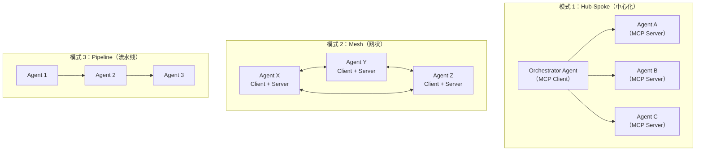
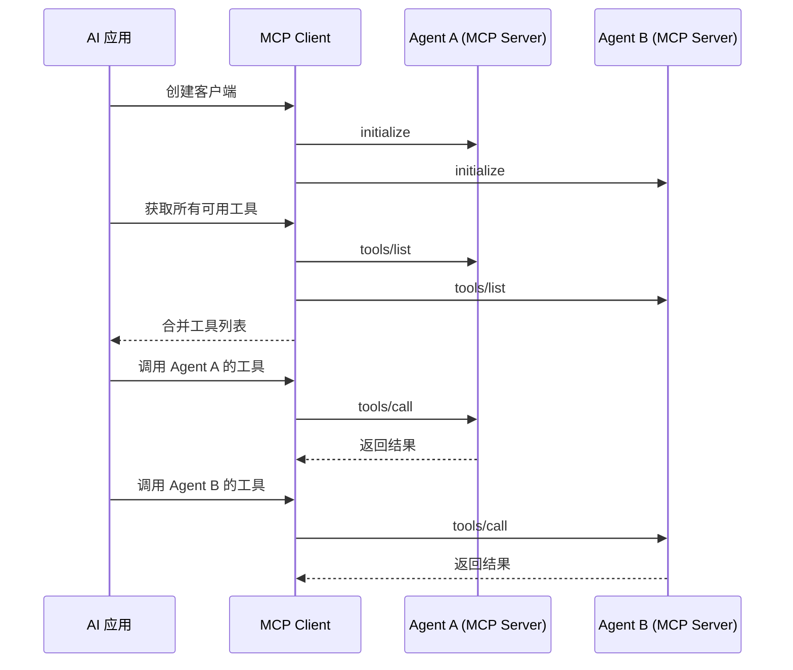
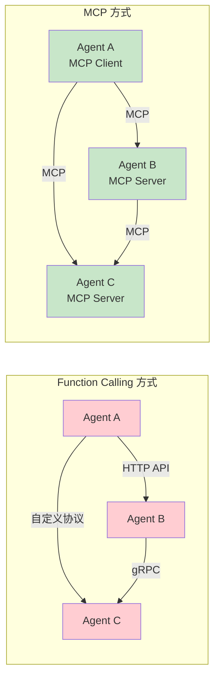
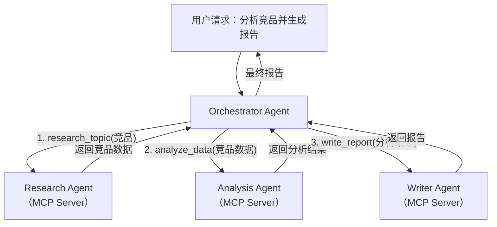

# Agent 间标准化通信

## 概念说明

**Agent 间标准化通信** 是指多个 AI Agent 通过统一的协议进行信息交换、任务协调和能力共享。MCP 协议为此提供了标准化的基础设施——每个 Agent 既可以作为 MCP Client 调用其他 Agent 的能力，也可以作为 MCP Server 暴露自己的能力，形成去中心化的 Agent 协作网络。

### 为什么需要标准化通信？

- **互操作性**：不同框架（LangGraph、AutoGen、CrewAI）构建的 Agent 可以互相协作
- **能力复用**：一个 Agent 的工具可以被其他 Agent 直接调用，避免重复开发
- **松耦合**：Agent 之间通过协议通信，不依赖具体实现，可独立升级
- **可扩展性**：新 Agent 加入网络只需实现 MCP 接口，无需修改现有 Agent

### 多 Agent 通信架构模式



## 核心原理

### 1. MCP 客户端集成

MCP Client 负责连接 MCP Server 并调用其能力：



### 2. Agent 作为 MCP Server

每个 Agent 将自己的能力封装为 MCP 工具：

```python
# 研究 Agent 暴露为 MCP Server
@mcp.tool()
def research_topic(query: str, max_results: int = 5) -> str:
    """搜索并总结指定主题的最新研究成果"""
    results = search_papers(query, max_results)
    summary = summarize_results(results)
    return summary

@mcp.tool()
def analyze_data(data: str, analysis_type: str) -> str:
    """对数据进行统计分析"""
    df = parse_data(data)
    return perform_analysis(df, analysis_type)
```

### 3. MCP vs Function Calling 在多 Agent 场景的对比



| 维度 | Function Calling | MCP 多 Agent |
|------|-----------------|-------------|
| 协议统一性 | 每对 Agent 可能不同 | 统一 MCP 协议 |
| 工具发现 | 手动配置 | 动态发现 |
| 能力变更 | 需要重新部署 | 实时通知 |
| 状态管理 | 无状态 | 会话级状态 |
| 资源共享 | 不支持 | Resources 原语 |

### 4. 多 Agent MCP 协作流程



### 5. 安全与权限控制

多 Agent 通信中的安全考量：

- **身份认证**：每个 Agent 需要验证对方身份
- **权限隔离**：Agent 只能访问被授权的工具和资源
- **输入验证**：防止恶意 Agent 注入有害指令
- **审计日志**：记录所有跨 Agent 调用，便于追溯

## 代码示例

> 💻 完整可运行代码：[code-examples/06-ai-frontier/mcp/02_mcp_client.py](/code-examples/06-ai-frontier/mcp/02_mcp_client.py)
> 🐍 Python 版本：3.11+
> 📦 依赖：标准库（模拟模式）

```python
# MCP 客户端集成示例
class MCPClient:
    def __init__(self):
        self.connections = {}

    async def connect(self, server_name, transport):
        """连接到 MCP Server"""
        session = await self._initialize(transport)
        self.connections[server_name] = session

    async def call_tool(self, server_name, tool_name, arguments):
        """调用指定 Server 的工具"""
        session = self.connections[server_name]
        return await session.call_tool(tool_name, arguments)

    async def get_all_tools(self):
        """获取所有已连接 Server 的工具列表"""
        all_tools = []
        for name, session in self.connections.items():
            tools = await session.list_tools()
            all_tools.extend(tools)
        return all_tools
```

## 实战要点

**多 Agent MCP 架构设计：**
- 优先使用 Hub-Spoke 模式，Orchestrator 统一调度，降低复杂度
- Agent 粒度要适中——太粗失去灵活性，太细增加通信开销
- 使用异步通信提高并发性能，避免 Agent 间串行等待
- 实现健康检查和故障转移，单个 Agent 故障不影响整体

**常见陷阱：**
- Agent 之间形成循环调用，导致死锁或无限递归
- 没有设置调用超时，单个 Agent 响应慢拖垮整个系统
- 忽略 Agent 间的数据格式转换，导致信息丢失
- 过度拆分 Agent，简单任务也要跨多个 Agent 完成

## 常见面试题

### Q1: 如何设计多 Agent 通过 MCP 协作的架构？

**难度**：⭐⭐⭐⭐ | **频率**：🔥🔥🔥

**答题思路**：架构模式选择 → Agent 角色划分 → 通信流程 → 容错设计

**标准答案**：推荐 Hub-Spoke 架构：(1) Orchestrator Agent 作为 MCP Client，负责任务分解和调度；(2) 各专业 Agent 作为 MCP Server，暴露特定领域的工具；(3) Orchestrator 通过 `tools/list` 发现所有可用能力，通过 `tools/call` 调用具体工具；(4) 使用异步调用提高并发，设置超时和重试机制；(5) 通过 MCP 的 `notifications` 机制实现事件驱动的协作。

**深入追问**：
- Hub-Spoke 和 Mesh 架构各有什么优缺点？
- 如何处理 Agent 间的数据一致性问题？
- 如何实现 Agent 的动态注册和注销？

### Q2: MCP 在多 Agent 场景中相比 Function Calling 有什么优势？

**难度**：⭐⭐⭐ | **频率**：🔥🔥

**答题思路**：标准化 → 动态发现 → 资源共享 → 生态兼容

**标准答案**：MCP 的核心优势：(1) 协议统一——所有 Agent 使用相同协议通信，无需为每对 Agent 定制接口；(2) 动态发现——新 Agent 上线后，其他 Agent 可自动发现其能力，无需手动配置；(3) 资源共享——通过 Resources 原语，Agent 可以共享数据上下文；(4) 能力变更通知——Agent 新增或移除工具时，通过 `listChanged` 通知客户端；(5) 跨框架兼容——LangGraph、AutoGen、CrewAI 构建的 Agent 都可以通过 MCP 互操作。

**深入追问**：
- MCP 的性能开销如何？适合高频调用场景吗？
- 如何在 MCP 之上实现 Agent 间的状态同步？

## 推荐工具

> 📌 以下工具可帮助你更高效地学习和实践本知识点，详见 [模块 7：AI 使用与实践](/7-ai-tools/)

| 工具 | 用途 | 详情 |
|------|------|------|
| Cursor | 辅助编写多 Agent 通信代码 | [AI 编程辅助](/7-ai-tools/7.1-efficiency/ai-coding) |
| ChatGPT | 讨论多 Agent 架构设计 | [AI 对话助手](/7-ai-tools/7.1-efficiency/ai-chat) |
| Perplexity | 搜索 Agent 通信最新进展 | [AI 搜索](/7-ai-tools/7.1-efficiency/ai-search) |

## 参考资料

- [MCP 协议规范 — 多 Server 支持](https://spec.modelcontextprotocol.io/)
- [Anthropic — Building Multi-Agent Systems](https://docs.anthropic.com/en/docs/agents)
- [LangGraph Multi-Agent 文档](https://langchain-ai.github.io/langgraph/)
- [AutoGen — Multi-Agent Conversation](https://microsoft.github.io/autogen/)
- [CrewAI — AI Agent 协作框架](https://docs.crewai.com/)
