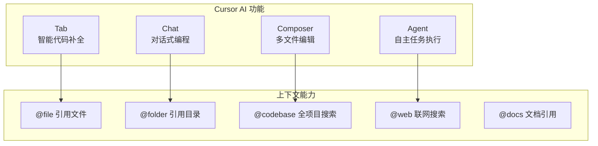
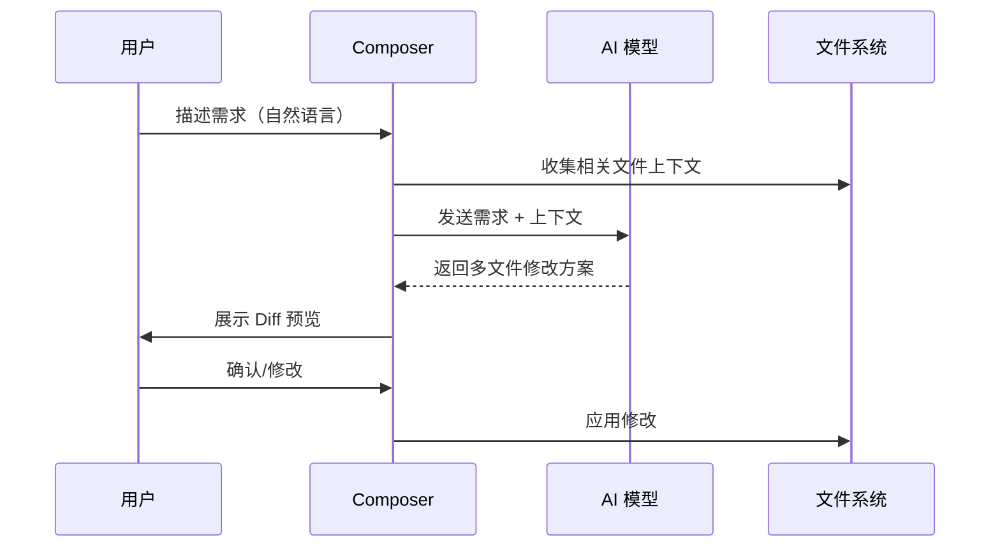
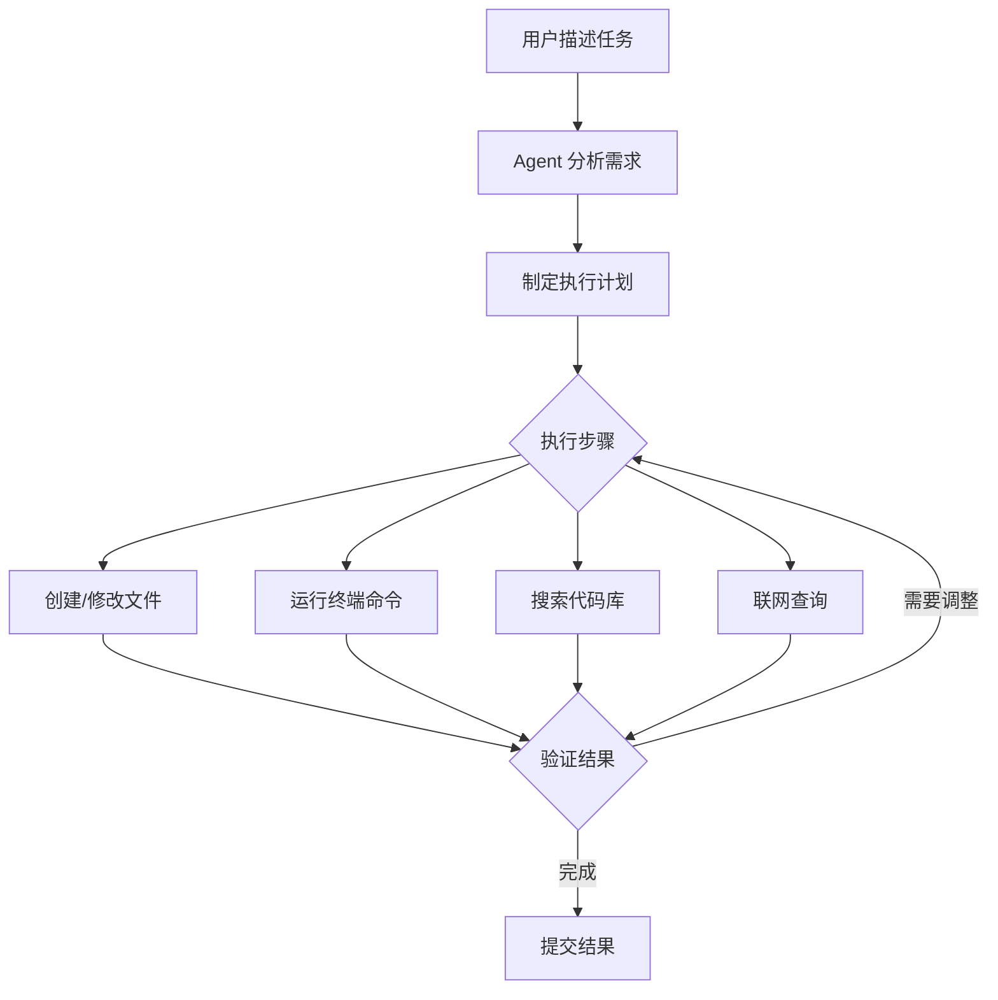

# Cursor AI IDE

## 概念说明

**Cursor** 是一款 AI-first 的代码编辑器，基于 VS Code 分支构建，将 AI 能力深度集成到编辑器的每个环节。与 Copilot 作为插件不同，Cursor 从底层重新设计了 AI 与编辑器的交互方式，提供 Composer（多文件编辑）、Chat（对话编程）、Tab（智能补全）等核心功能。

### Cursor 核心功能



## 核心原理

### 1. Composer 多文件编辑

Composer 是 Cursor 的杀手级功能，支持一次性修改多个文件：



**Composer 使用示例：**
```
用户：给这个 FastAPI 项目添加用户认证功能，
包括 JWT Token 生成、登录接口和中间件验证

Composer 会同时修改：
- models/user.py（用户模型）
- auth/jwt.py（JWT 工具）
- routes/auth.py（认证路由）
- middleware/auth.py（认证中间件）
- main.py（注册路由和中间件）
```

### 2. 上下文引用系统

| 引用方式 | 语法 | 说明 |
|---------|------|------|
| 文件引用 | `@filename` | 将指定文件加入上下文 |
| 目录引用 | `@folder` | 引用整个目录结构 |
| 代码库搜索 | `@codebase` | 语义搜索整个项目 |
| 联网搜索 | `@web` | 搜索最新信息 |
| 文档引用 | `@docs` | 引用官方文档 |
| Git 历史 | `@git` | 引用 Git 提交历史 |

### 3. Cursor Rules（项目级 AI 配置）

通过 `.cursorrules` 文件定制 AI 行为：

```markdown
# .cursorrules
你是一个 Python 后端开发专家。

## 代码规范
- 使用 Python 3.11+ 语法
- 所有函数必须有类型注解
- 使用 Pydantic v2 进行数据验证
- 异步函数优先使用 async/await

## 项目结构
- FastAPI 作为 Web 框架
- SQLAlchemy 2.0 作为 ORM
- Alembic 管理数据库迁移
```

### 4. Agent 模式（2025 新增）



### 5. Cursor 定价（2025）

| 计划 | 价格 | 功能 |
|------|------|------|
| Free | $0/月 | 有限补全和 Chat |
| Pro | $20/月 | 无限补全 + 500 次高级请求 |
| Business | $40/月/人 | 团队管理 + 隐私模式 |

## 代码示例

> 💻 完整评测代码：[code-examples/06-ai-frontier/milestone_projects/coding_benchmark/benchmark.py](/code-examples/06-ai-frontier/milestone_projects/coding_benchmark/benchmark.py)

```python
# Cursor Composer 典型使用场景
# 用户输入：创建一个带缓存的 API 客户端

import asyncio
from functools import lru_cache

class CachedAPIClient:
    """带缓存的 API 客户端 — Cursor Composer 一次性生成"""

    def __init__(self, base_url: str, cache_ttl: int = 300):
        self.base_url = base_url
        self.cache_ttl = cache_ttl
        self._cache: dict = {}

    async def get(self, endpoint: str) -> dict:
        """带缓存的 GET 请求"""
        cache_key = f"{self.base_url}{endpoint}"
        if cache_key in self._cache:
            return self._cache[cache_key]
        # 实际请求逻辑...
        result = {"data": "response"}
        self._cache[cache_key] = result
        return result
```

## 实战要点

**Cursor 高效使用技巧：**
- 善用 `@codebase` 让 AI 理解项目全貌
- 复杂任务用 Composer，简单修改用 Inline Chat
- 配置 `.cursorrules` 统一团队 AI 行为
- Agent 模式适合多步骤任务（创建项目、添加功能模块）

**Cursor vs Copilot 选择建议：**
- 需要多文件编辑 → Cursor Composer
- 需要项目级上下文 → Cursor @codebase
- 只需要行内补全 → 两者差异不大
- 团队已有 VS Code 生态 → Copilot 迁移成本低

## 常见面试题

### Q1: Cursor 的 Composer 功能与传统代码补全有什么区别？

**难度**：⭐⭐ | **频率**：🔥🔥

**答题思路**：单文件 vs 多文件 → 补全 vs 生成 → 上下文范围

**标准答案**：传统代码补全（如 Copilot Tab）在单文件内基于光标位置生成代码片段；Cursor Composer 支持跨多个文件的协调修改，用户用自然语言描述需求，AI 分析项目上下文后同时修改多个文件，并以 Diff 形式展示变更供用户确认。Composer 更接近"AI 结对编程"，而传统补全更像"智能自动完成"。

**深入追问**：
- Composer 如何保证多文件修改的一致性？
- 在大型项目中，Composer 的上下文窗口限制如何处理？

### Q2: 如何通过 .cursorrules 提升 AI 编码质量？

**难度**：⭐⭐⭐ | **频率**：🔥🔥

**答题思路**：规则定义 → 项目规范 → 技术栈约束 → 代码风格

**标准答案**：`.cursorrules` 文件定义项目级的 AI 行为规范：(1) 技术栈约束——指定语言版本、框架、库；(2) 代码规范——命名风格、注释要求、类型注解；(3) 架构约束——项目结构、设计模式、分层规范；(4) 安全要求——输入验证、错误处理、日志规范。好的 rules 文件能显著提升 AI 生成代码的质量和一致性。

**深入追问**：
- .cursorrules 和 System Prompt 有什么关系？
- 如何在团队中统一管理 .cursorrules？

## 推荐工具

> 📌 以下工具可帮助你更高效地学习和实践本知识点，详见 [模块 7：AI 使用与实践](/7-ai-tools/)

| 工具 | 用途 | 详情 |
|------|------|------|
| Cursor | AI-first IDE 体验 | [AI 编程辅助](/7-ai-tools/7.1-efficiency/ai-coding) |
| Perplexity | 搜索 Cursor 技巧 | [AI 搜索](/7-ai-tools/7.1-efficiency/ai-search) |

## 参考资料

- [Cursor 官方文档](https://docs.cursor.com/)
- [Cursor Changelog](https://changelog.cursor.com/)
- [Cursor Rules 最佳实践](https://cursor.directory/)
- [Cursor vs Copilot 对比](https://docs.cursor.com/faq)
