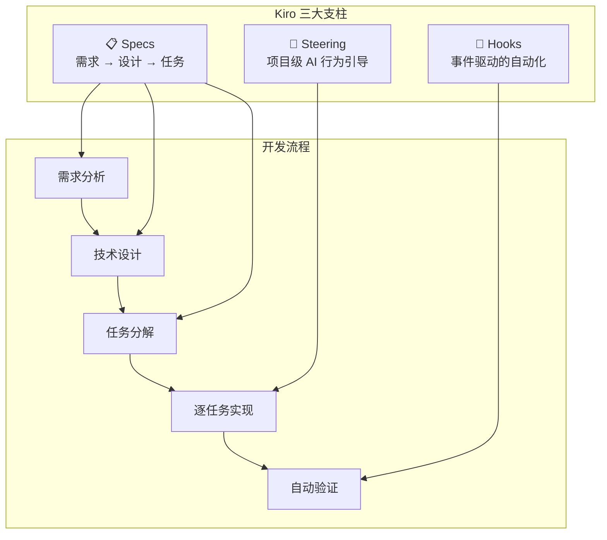
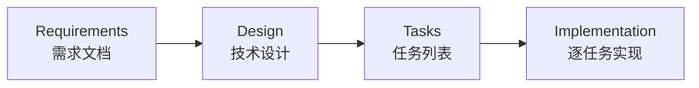
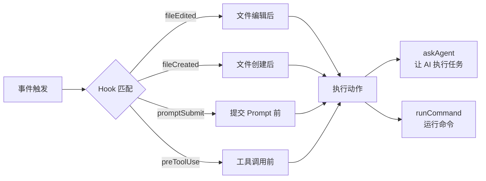
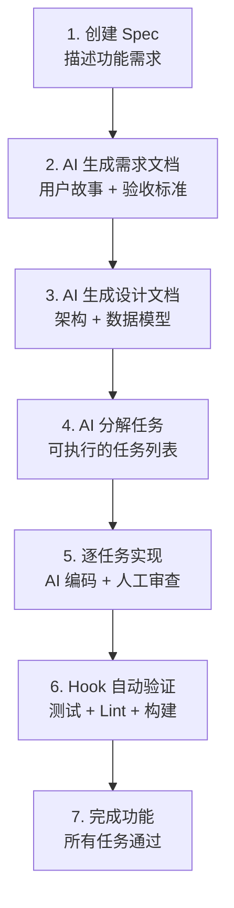

# AWS Kiro

## 概念说明

**Kiro** 是 AWS 推出的 AI 驱动开发环境（IDE），基于 VS Code 构建，核心理念是 **Spec 驱动开发（Spec-Driven Development）**。与 Copilot 和 Cursor 侧重"代码生成"不同，Kiro 强调从需求到设计到实现的全流程 AI 辅助，通过 Specs、Steering 和 Hooks 三大机制实现可控、可重复的 AI 编码。

### Kiro 的核心理念：AI Coding Harness

Kiro 将 AI 编码视为一个需要"驾驭"的过程，而非简单的代码生成：



### Kiro vs 其他 AI IDE

| 维度 | Copilot | Cursor | Kiro |
|------|---------|--------|------|
| 核心理念 | 代码补全 | AI-first 编辑 | Spec 驱动开发 |
| AI 模式 | 补全 + Chat | Composer + Agent | Spec + Steering + Hooks |
| 项目理解 | 文件级 | 项目级 | 需求级 |
| 可控性 | 低 | 中 | 高 |
| 适用场景 | 日常编码 | 快速开发 | 工程化项目 |

## 核心原理

### 1. Specs（规格说明）

Specs 是 Kiro 的核心概念，将软件开发分为三个阶段：



**Requirements（需求）：**
- 用户故事和验收标准
- AI 辅助生成，人工审核确认
- 使用 SHALL/WHEN/IF 等关键词定义行为

**Design（设计）：**
- 技术架构和数据模型
- 组件接口和交互流程
- Mermaid 图表辅助说明

**Tasks（任务）：**
- 从设计文档自动分解
- 每个任务有明确的输入输出
- 支持逐任务执行和验证

### 2. Steering（引导文件）

Steering 文件定义项目级的 AI 行为规范：

```markdown
# .kiro/steering/coding-standards.md
inclusion: auto

## 代码规范
- 使用 Python 3.11+ 语法
- 所有公共函数必须有 docstring
- 使用 Pydantic v2 进行数据验证

## 测试要求
- 每个功能模块必须有单元测试
- 测试覆盖率不低于 80%
```

**Steering 类型：**
| 类型 | inclusion | 说明 |
|------|-----------|------|
| 自动加载 | `auto` | 每次对话自动加入上下文 |
| 手动加载 | `manual` | 需要时手动激活 |

### 3. Hooks（事件钩子）

Hooks 实现事件驱动的自动化：



**Hook 示例：**
```yaml
# 文件保存后自动运行 lint
- event: fileEdited
  pattern: "**/*.py"
  action: runCommand
  command: "ruff check --fix"

# 创建新文件后自动添加头部注释
- event: fileCreated
  pattern: "**/*.py"
  action: askAgent
  prompt: "为新文件添加标准头部注释"
```

### 4. MCP 集成

Kiro 原生支持 MCP 协议，可以连接外部 MCP Server 扩展能力：

```json
// .kiro/settings/mcp.json
{
  "mcpServers": {
    "database": {
      "command": "python",
      "args": ["mcp_servers/database_server.py"],
      "transport": "stdio"
    }
  }
}
```

### 5. Kiro 开发工作流



## 代码示例

> 💻 完整评测代码：[code-examples/06-ai-frontier/milestone_projects/coding_benchmark/benchmark.py](/code-examples/06-ai-frontier/milestone_projects/coding_benchmark/benchmark.py)

```python
# Kiro Spec 驱动开发示例
# 1. 需求：实现用户注册功能
# 2. Kiro 生成设计文档和任务列表
# 3. 逐任务实现

# Task 1: 创建用户模型
from pydantic import BaseModel, EmailStr

class UserCreate(BaseModel):
    """用户注册请求模型"""
    username: str
    email: EmailStr
    password: str

# Task 2: 实现注册逻辑（Kiro 根据设计文档生成）
async def register_user(user: UserCreate) -> dict:
    """用户注册 — Kiro 根据 Spec 生成"""
    hashed_password = hash_password(user.password)
    # 存储用户...
    return {"id": "user_123", "username": user.username}
```

## 实战要点

**Kiro 适用场景：**
- 需要严格需求管理的工程化项目
- 团队协作开发，需要统一 AI 行为
- 需要可追溯的开发过程（需求 → 设计 → 代码）
- 与 AWS 生态深度集成的项目

**最佳实践：**
- 先写好 Spec 再开始编码，让 AI 有明确的目标
- Steering 文件保持简洁，避免过度约束
- 善用 Hooks 自动化重复性工作（lint、test、format）
- 利用 MCP 集成扩展 Kiro 的能力边界

## 常见面试题

### Q1: Kiro 的 Spec 驱动开发与传统 AI Coding 有什么区别？

**难度**：⭐⭐⭐ | **频率**：🔥🔥

**答题思路**：理念差异 → 流程对比 → 可控性 → 适用场景

**标准答案**：传统 AI Coding（Copilot/Cursor）侧重"代码生成"，用户直接描述代码需求，AI 生成代码片段。Kiro 的 Spec 驱动开发将 AI 辅助前移到需求和设计阶段：先生成需求文档和技术设计，再分解为可执行任务，最后逐任务实现。这种方式的优势是：(1) AI 有更完整的上下文；(2) 生成的代码更符合整体架构；(3) 开发过程可追溯；(4) 通过 Steering 和 Hooks 实现可控的 AI 编码。

**深入追问**：
- Spec 驱动开发的缺点是什么？（前期投入大，小任务过重）
- Steering 文件和 .cursorrules 有什么异同？

### Q2: 请解释 Kiro 的 Hooks 机制及其应用场景

**难度**：⭐⭐⭐ | **频率**：🔥🔥

**答题思路**：事件驱动 → 触发条件 → 动作类型 → 实际应用

**标准答案**：Hooks 是 Kiro 的事件驱动自动化机制，当特定事件发生时自动执行预定义的动作。支持的事件包括：文件编辑/创建/删除、Prompt 提交、工具调用前后等。动作类型有两种：`askAgent`（让 AI 执行任务）和 `runCommand`（运行命令）。典型应用：(1) 文件保存后自动 lint 和格式化；(2) 创建新文件后自动添加头部注释；(3) 提交 Prompt 前自动检查安全性；(4) 任务完成后自动运行测试。

**深入追问**：
- Hooks 和 CI/CD 的 Git Hooks 有什么区别？
- 如何避免 Hooks 之间的循环触发？

## 推荐工具

> 📌 以下工具可帮助你更高效地学习和实践本知识点，详见 [模块 7：AI 使用与实践](/7-ai-tools/)

| 工具 | 用途 | 详情 |
|------|------|------|
| Kiro | Spec 驱动 AI 开发 | [AI 编程辅助](/7-ai-tools/7.1-efficiency/ai-coding) |
| ChatGPT | 讨论 Spec 设计 | [AI 对话助手](/7-ai-tools/7.1-efficiency/ai-chat) |

## 参考资料

- [Kiro 官方文档](https://kiro.dev/docs/)
- [Kiro Specs 指南](https://kiro.dev/docs/specs/)
- [Kiro Steering 指南](https://kiro.dev/docs/steering/)
- [Kiro Hooks 指南](https://kiro.dev/docs/hooks/)
- [Kiro MCP 集成](https://kiro.dev/docs/mcp/)
