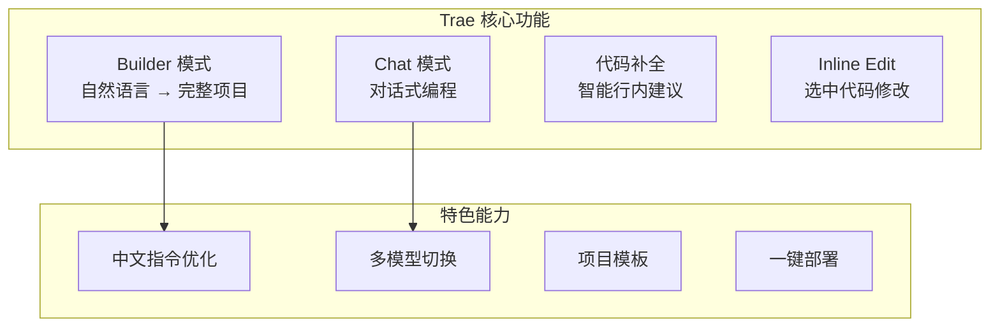
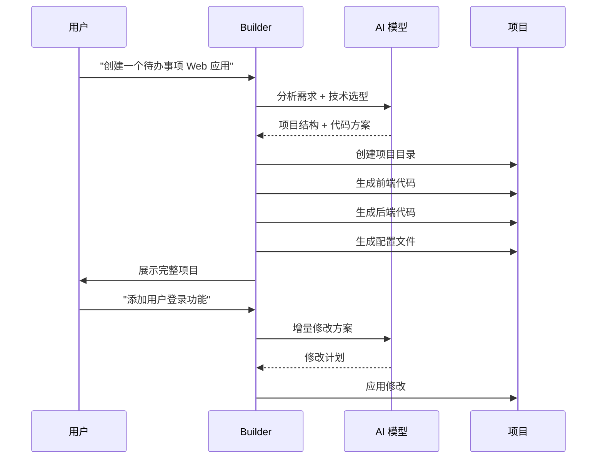
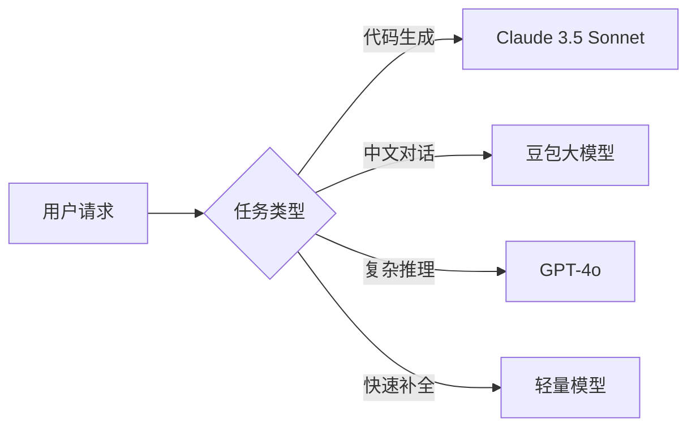

# Trae AI IDE

## 概念说明

**Trae** 是字节跳动推出的 AI 代码编辑器，同样基于 VS Code 构建，主打 **Builder 模式** 和 **中文优化**。Trae 的定位是让非专业开发者也能通过自然语言描述快速构建应用，同时为专业开发者提供高效的 AI 辅助编码体验。

### Trae 核心特点

- **Builder 模式**：从零开始，用自然语言描述需求，AI 自动生成完整项目
- **中文优化**：对中文指令的理解和代码注释生成优于其他 IDE
- **免费策略**：基础功能免费，降低 AI Coding 入门门槛
- **多模型支持**：支持 Claude、GPT-4o、豆包等多个模型

### Trae 功能架构



## 核心原理

### 1. Builder 模式详解

Builder 模式是 Trae 的核心差异化功能：



### 2. Trae vs Cursor 对比

| 维度 | Cursor | Trae |
|------|--------|------|
| 核心模式 | Composer + Agent | Builder + Chat |
| 目标用户 | 专业开发者 | 全栈 + 非专业开发者 |
| 中文支持 | 一般 | 优秀 |
| 定价 | $20/月起 | 基础免费 |
| 上下文引用 | @file/@codebase | 类似但较简化 |
| 项目生成 | 需要手动引导 | Builder 一键生成 |
| 模型选择 | Claude/GPT | Claude/GPT/豆包 |
| 生态成熟度 | 高 | 发展中 |

### 3. 中文优化能力

Trae 在中文场景下的优势：
- 中文指令理解更准确，减少歧义
- 生成的中文注释更自然流畅
- 支持中文变量名和函数名（虽然不推荐）
- 中文文档生成质量高

### 4. 多模型切换策略



## 代码示例

> 💻 完整评测代码：[code-examples/06-ai-frontier/milestone_projects/coding_benchmark/benchmark.py](/code-examples/06-ai-frontier/milestone_projects/coding_benchmark/benchmark.py)

```python
# Trae Builder 模式生成的典型项目结构
# 用户输入："创建一个 FastAPI 博客 API"

# Trae 自动生成的项目结构：
# blog-api/
# ├── main.py          # FastAPI 入口
# ├── models.py         # 数据模型
# ├── routes/
# │   ├── posts.py      # 文章路由
# │   └── users.py      # 用户路由
# ├── database.py       # 数据库配置
# └── requirements.txt  # 依赖

from fastapi import FastAPI
from pydantic import BaseModel

app = FastAPI(title="博客 API", description="Trae Builder 生成")

class Post(BaseModel):
    title: str
    content: str
    author: str
```

## 实战要点

**Trae 适用场景：**
- 快速原型开发（Builder 模式从零生成项目）
- 中文团队的日常编码（中文指令优化）
- AI Coding 入门学习（免费 + 低门槛）
- 非专业开发者的应用构建

**局限性：**
- 生态成熟度不如 Cursor 和 Copilot
- 插件市场相对较小
- 企业级功能（团队管理、审计）尚在完善
- Builder 模式生成的项目可能需要较多手动调整

## 常见面试题

### Q1: Trae 的 Builder 模式与 Cursor 的 Composer 有什么区别？

**难度**：⭐⭐ | **频率**：🔥

**答题思路**：定位差异 → 功能对比 → 适用场景

**标准答案**：Builder 模式面向"从零创建项目"，用户描述需求后 AI 自动生成完整项目结构和代码；Composer 面向"修改现有项目"，在已有代码基础上进行多文件编辑。Builder 更适合原型开发和非专业开发者，Composer 更适合专业开发者的日常编码。两者的共同点是都支持自然语言交互和多文件操作。

**深入追问**：
- Builder 模式生成的项目质量如何保证？
- 中文 AI IDE 在国际化项目中的适用性如何？

## 推荐工具

> 📌 以下工具可帮助你更高效地学习和实践本知识点，详见 [模块 7：AI 使用与实践](/7-ai-tools/)

| 工具 | 用途 | 详情 |
|------|------|------|
| Trae | 中文优化的 AI IDE | [AI 编程辅助](/7-ai-tools/7.1-efficiency/ai-coding) |
| Perplexity | 搜索 Trae 评测 | [AI 搜索](/7-ai-tools/7.1-efficiency/ai-search) |

## 参考资料

- [Trae 官方网站](https://www.trae.ai/)
- [Trae 文档](https://docs.trae.ai/)
- [Trae vs Cursor 对比评测](https://www.trae.ai/blog)
