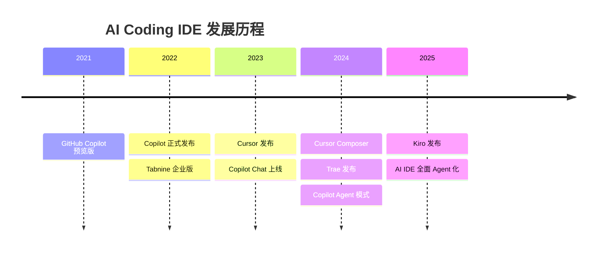
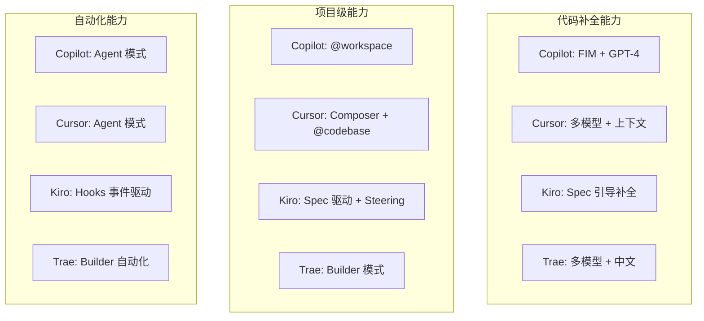
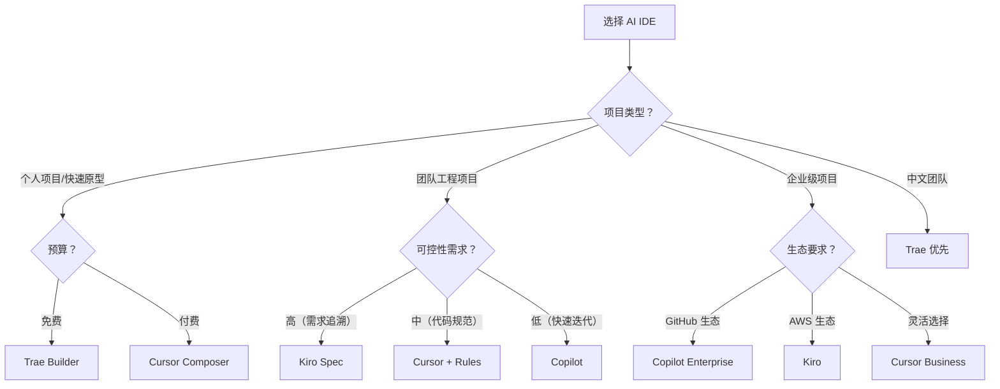
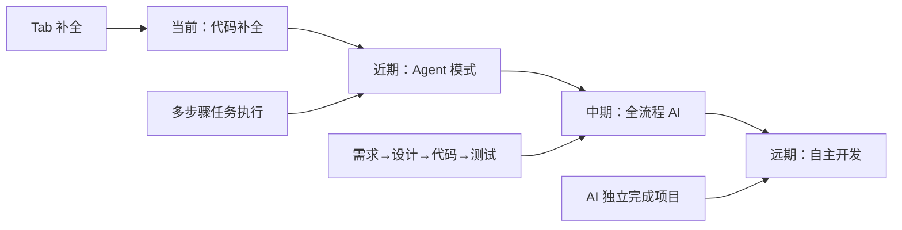

# IDE 选型对比

## 概念说明

AI Coding IDE 市场正在快速演进，从最初的代码补全插件发展到全流程 AI 辅助开发环境。选择合适的 AI IDE 需要综合考虑功能、定价、团队规模、项目类型等因素。本文提供系统化的对比分析，帮助开发者和团队做出明智的选型决策。

### AI IDE 发展时间线



## 核心原理

### 1. 全维度对比表

| 维度 | GitHub Copilot | Cursor | Kiro | Trae |
|------|---------------|--------|------|------|
| **开发商** | GitHub/Microsoft | Anysphere | AWS | 字节跳动 |
| **基础** | VS Code 插件 | VS Code 分支 | VS Code 分支 | VS Code 分支 |
| **核心模式** | 补全 + Chat + Agent | Composer + Agent | Spec + Steering + Hooks | Builder + Chat |
| **代码补全** | ⭐⭐⭐⭐ | ⭐⭐⭐⭐⭐ | ⭐⭐⭐⭐ | ⭐⭐⭐⭐ |
| **多文件编辑** | Agent 模式 | Composer | Spec 任务 | Builder |
| **项目理解** | @workspace | @codebase | Spec 上下文 | 项目分析 |
| **可控性** | 低 | 中（.cursorrules） | 高（Steering+Hooks） | 中 |
| **MCP 支持** | 有限 | 支持 | 原生支持 | 有限 |
| **中文支持** | 一般 | 一般 | 一般 | 优秀 |
| **免费版** | 有（有限） | 有（有限） | 有 | 有 |
| **Pro 价格** | $10/月 | $20/月 | 待定 | 免费/低价 |
| **企业版** | $19-39/月 | $40/月 | 待定 | 待定 |

### 2. 功能深度对比



### 3. 按场景选型指南



### 4. 按角色推荐

| 角色 | 推荐 IDE | 理由 |
|------|---------|------|
| **初级开发者** | Copilot | 学习曲线低，补全质量稳定 |
| **全栈开发者** | Cursor | Composer 多文件编辑效率高 |
| **架构师/Tech Lead** | Kiro | Spec 驱动确保架构一致性 |
| **非技术人员** | Trae | Builder 模式零代码起步 |
| **中文团队** | Trae | 中文指令理解最佳 |
| **开源贡献者** | Copilot | GitHub 生态深度集成 |

### 5. 成本对比（10 人团队/年）

| IDE | 免费版 | Pro 版 | 企业版 |
|-----|--------|--------|--------|
| Copilot | $0 | $1,200 | $2,280-4,680 |
| Cursor | $0 | $2,400 | $4,800 |
| Kiro | $0 | 待定 | 待定 |
| Trae | $0 | 低价/免费 | 待定 |

### 6. 未来趋势



## 代码示例

> 💻 完整评测代码：[code-examples/06-ai-frontier/milestone_projects/coding_benchmark/benchmark.py](/code-examples/06-ai-frontier/milestone_projects/coding_benchmark/benchmark.py)

```python
# AI IDE 评测框架示例
class IDEBenchmark:
    """AI Coding IDE 评测框架"""

    def __init__(self):
        self.tasks = [
            "实现快速排序算法",
            "创建 REST API 端点",
            "编写单元测试",
            "重构遗留代码",
            "修复并发 Bug",
        ]

    def evaluate(self, ide_name: str, results: list) -> dict:
        """评估 IDE 在各任务上的表现"""
        return {
            "ide": ide_name,
            "accuracy": sum(r["correct"] for r in results) / len(results),
            "avg_time": sum(r["time"] for r in results) / len(results),
            "code_quality": sum(r["quality"] for r in results) / len(results),
        }
```

## 实战要点

**选型决策框架：**
1. 明确核心需求（补全？多文件？项目管理？）
2. 评估团队规模和预算
3. 考虑现有工具链兼容性
4. 试用 2-3 个候选 IDE（各 1-2 周）
5. 基于实际体验做最终决策

**混合使用策略：**
- Copilot 作为基础补全（所有场景）
- Cursor Composer 用于复杂功能开发
- Kiro Spec 用于需求明确的工程项目
- Trae Builder 用于快速原型验证

## 常见面试题

### Q1: 如何为团队选择合适的 AI Coding IDE？

**难度**：⭐⭐⭐ | **频率**：🔥🔥

**答题思路**：需求分析 → 维度对比 → 试用评估 → 决策

**标准答案**：选型需要考虑：(1) 功能需求——是否需要多文件编辑、项目级理解、Spec 驱动；(2) 团队规模——小团队灵活选择，大团队需要企业管理功能；(3) 预算——从免费版开始试用，按需升级；(4) 技术栈——与现有工具链的兼容性；(5) 安全合规——代码隐私、数据驻留要求。建议先试用 2-3 个候选 IDE 各 1-2 周，基于实际体验决策。

**深入追问**：
- AI IDE 的代码隐私问题如何解决？
- 如何衡量 AI IDE 对团队效率的实际提升？

## 推荐工具

> 📌 以下工具可帮助你更高效地学习和实践本知识点，详见 [模块 7：AI 使用与实践](/7-ai-tools/)

| 工具 | 用途 | 详情 |
|------|------|------|
| Perplexity | 搜索 AI IDE 最新评测 | [AI 搜索](/7-ai-tools/7.1-efficiency/ai-search) |
| ChatGPT | 讨论选型策略 | [AI 对话助手](/7-ai-tools/7.1-efficiency/ai-chat) |

## 参考资料

- [GitHub Copilot 官方文档](https://docs.github.com/en/copilot)
- [Cursor 官方文档](https://docs.cursor.com/)
- [Kiro 官方文档](https://kiro.dev/docs/)
- [Trae 官方文档](https://docs.trae.ai/)
- [AI IDE 市场分析报告](https://www.gartner.com/)
