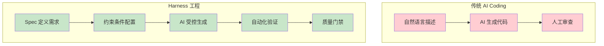
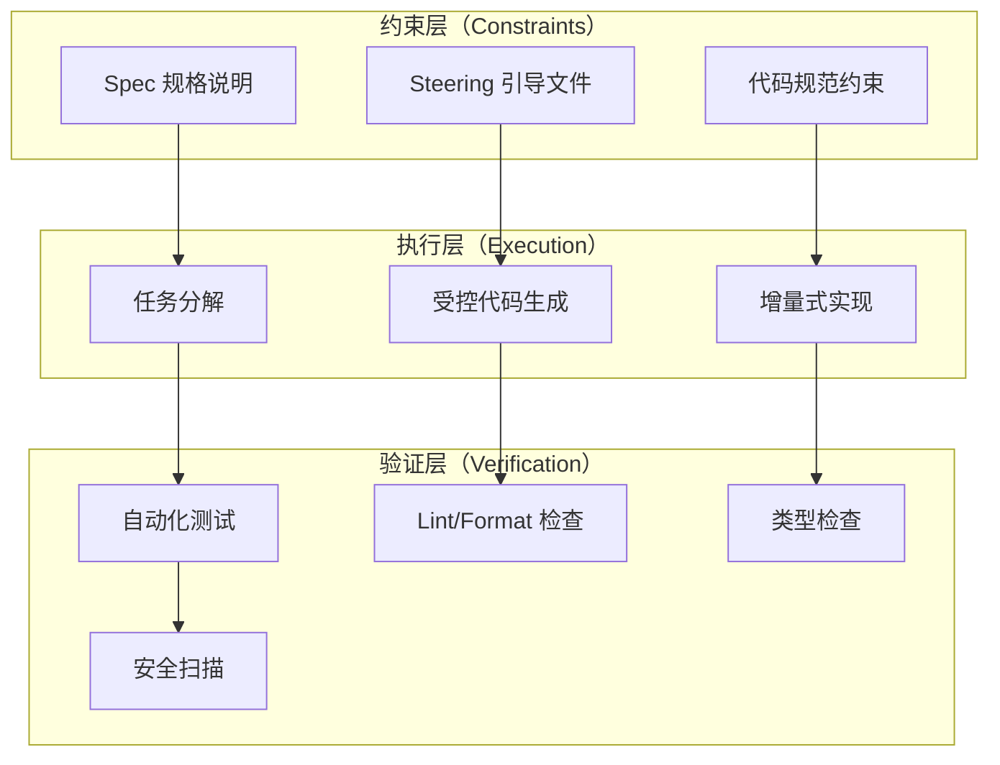
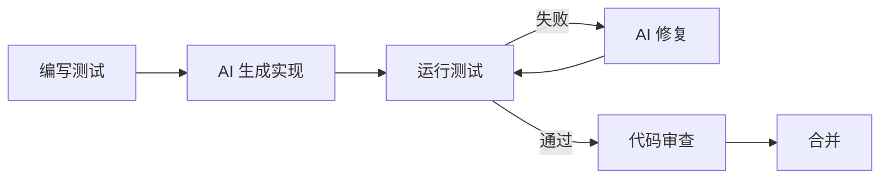

# Harness 工程概念

## 概念说明

**AI Coding Harness（AI 编码驾驭工程）** 是一种将 AI 代码生成过程变得可控、可重复、可验证的工程方法论。核心理念是：AI 生成代码不应该是"碰运气"，而应该像传统软件工程一样有规范、有约束、有验证。

### 为什么需要 Harness？

传统 AI Coding 的问题：
- **不可控**：同样的 Prompt 可能生成不同质量的代码
- **不可重复**：无法保证多次生成的一致性
- **不可验证**：缺乏自动化的质量检查机制
- **不可追溯**：无法回溯"为什么生成了这段代码"

Harness 工程的解决方案：



## 核心原理

### 1. Harness 三层架构



### 2. Spec 驱动开发流程

| 阶段 | 输入 | 输出 | 验证 |
|------|------|------|------|
| 需求 | 用户故事 | 验收标准 | 人工审核 |
| 设计 | 验收标准 | 技术方案 | 架构评审 |
| 任务 | 技术方案 | 任务列表 | 可行性检查 |
| 实现 | 单个任务 | 代码变更 | 自动化测试 |
| 验证 | 代码变更 | 质量报告 | 门禁检查 |

### 3. 约束与验证机制

**输入约束（Prompt 模板化）：**
```python
# 结构化 Prompt 模板
TASK_PROMPT = """
## 任务
{task_description}

## 约束条件
- 语言：Python 3.11+
- 框架：FastAPI
- 必须包含类型注解
- 必须包含 docstring
- 错误处理使用自定义异常

## 验收标准
{acceptance_criteria}

## 相关代码上下文
{code_context}
"""
```

**输出约束（代码审查自动化）：**
```python
# 自动化验证流水线
def verify_generated_code(code: str) -> dict:
    checks = {
        "syntax": check_syntax(code),
        "type_hints": check_type_annotations(code),
        "docstrings": check_docstrings(code),
        "security": check_security_patterns(code),
        "tests": run_tests(code),
    }
    return checks
```

### 4. 测试驱动 AI 编码（TDD + AI）



### 5. 可控 AI 编码实践清单

- ✅ 使用 Spec 定义需求和验收标准
- ✅ 配置 Steering/Rules 文件约束 AI 行为
- ✅ Prompt 模板化，减少随机性
- ✅ 输出约束：类型检查 + Lint + 安全扫描
- ✅ 自动化测试验证生成代码
- ✅ 代码审查流程（AI 生成 ≠ 免审查）
- ✅ 版本管理：记录 Prompt 和生成结果

## 代码示例

> 💻 完整可运行代码：[code-examples/06-ai-frontier/milestone_projects/coding_benchmark/benchmark.py](/code-examples/06-ai-frontier/milestone_projects/coding_benchmark/benchmark.py)

```python
# Harness 验证流水线示例
class HarnessValidator:
    """AI 生成代码的自动化验证器"""

    def __init__(self, rules: dict):
        self.rules = rules

    def validate(self, code: str) -> dict:
        results = {}
        for rule_name, checker in self.rules.items():
            results[rule_name] = checker(code)
        return results
```

## 实战要点

**Harness 工程适用场景：**
- 企业级项目，需要代码质量保证
- 团队协作，需要统一 AI 编码规范
- 安全敏感项目，需要自动化安全检查
- 长期维护项目，需要可追溯的开发过程

**渐进式采用策略：**
1. 第一步：配置 Steering/Rules 文件
2. 第二步：建立自动化测试和 Lint
3. 第三步：引入 Spec 驱动开发
4. 第四步：完善验证流水线

## 常见面试题

### Q1: 什么是 AI Coding Harness？它解决了什么问题？

**难度**：⭐⭐⭐ | **频率**：🔥🔥

**答题思路**：问题定义 → Harness 理念 → 三层架构 → 实践方法

**标准答案**：AI Coding Harness 是将 AI 代码生成变得可控、可重复、可验证的工程方法论。它解决传统 AI Coding 的三大问题：不可控（输出质量不稳定）、不可重复（同样输入不同输出）、不可验证（缺乏自动化检查）。通过三层架构实现：约束层（Spec + Steering）定义"做什么"和"怎么做"，执行层（任务分解 + 受控生成）控制"如何做"，验证层（测试 + Lint + 安全扫描）确保"做得对"。

**深入追问**：
- Harness 工程会不会降低 AI Coding 的效率？
- 如何平衡约束的严格程度和开发灵活性？

## 推荐工具

> 📌 以下工具可帮助你更高效地学习和实践本知识点，详见 [模块 7：AI 使用与实践](/7-ai-tools/)

| 工具 | 用途 | 详情 |
|------|------|------|
| Kiro | Harness 工程最佳实践 | [AI 编程辅助](/7-ai-tools/7.1-efficiency/ai-coding) |
| Cursor | .cursorrules 约束 | [AI 编程辅助](/7-ai-tools/7.1-efficiency/ai-coding) |

## 参考资料

- [Kiro — Spec 驱动开发](https://kiro.dev/docs/specs/)
- [AI Coding Best Practices](https://docs.github.com/en/copilot/using-github-copilot/best-practices-for-using-github-copilot)
- [Test-Driven Development with AI](https://martinfowler.com/articles/tdd-ai.html)
