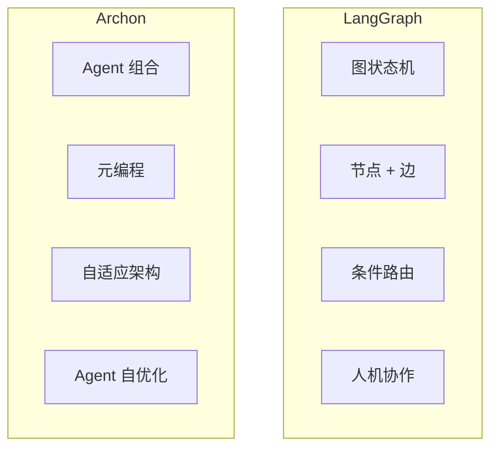
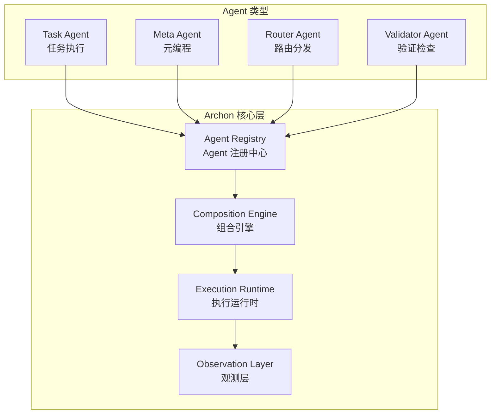
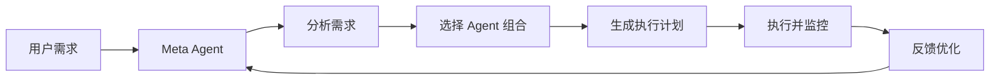

# Archon 框架

## 概念说明

**Archon** 是一个用于构建 AI Agent 系统的开源框架，专注于提供可组合、可扩展的 Agent 构建能力。Archon 的设计理念是"Agent 构建 Agent"——通过元编程的方式，让 AI 自身参与 Agent 系统的设计和优化。

### Archon 核心理念

- **可组合性**：Agent 能力可以像积木一样组合
- **元编程**：AI 参与 Agent 系统的设计和优化
- **标准化**：统一的 Agent 接口和通信协议
- **可观测性**：内置的追踪和监控能力

### Archon vs LangGraph 对比



| 维度 | LangGraph | Archon |
|------|-----------|--------|
| 核心抽象 | 图（Graph） | Agent 组合 |
| 设计理念 | 显式状态机 | 元编程 + 自适应 |
| 学习曲线 | 中等 | 较高 |
| 生态成熟度 | 高（LangChain 生态） | 发展中 |
| 适用场景 | 复杂工作流 | Agent 系统构建 |
| 可观测性 | LangSmith 集成 | 内置追踪 |

## 核心原理

### 1. Archon 架构



### 2. Agent 组合模式

```python
# Archon 风格的 Agent 组合
class AgentComposer:
    """Agent 组合器 — 将多个 Agent 组合为复杂系统"""

    def __init__(self):
        self.agents = {}
        self.pipelines = {}

    def register(self, name: str, agent):
        """注册 Agent"""
        self.agents[name] = agent

    def compose(self, name: str, steps: list):
        """组合 Agent 流水线"""
        self.pipelines[name] = steps

    async def execute(self, pipeline_name: str, input_data: dict):
        """执行组合流水线"""
        result = input_data
        for step in self.pipelines[pipeline_name]:
            agent = self.agents[step["agent"]]
            result = await agent.run(result)
        return result
```

### 3. 元编程能力

Archon 的独特之处在于 Meta Agent 可以分析和优化其他 Agent：



### 4. 与 MCP 的集成

Archon Agent 可以通过 MCP 协议暴露能力：

```python
# Archon Agent 暴露为 MCP Server
class ArchonMCPBridge:
    """将 Archon Agent 桥接为 MCP Server"""

    def __init__(self, agent_composer):
        self.composer = agent_composer

    def to_mcp_tools(self):
        """将 Agent 能力转换为 MCP 工具"""
        tools = []
        for name, agent in self.composer.agents.items():
            tools.append({
                "name": f"agent_{name}",
                "description": agent.description,
                "inputSchema": agent.input_schema,
            })
        return tools
```

## 代码示例

> 💻 完整可运行代码：[code-examples/06-ai-frontier/milestone_projects/mcp_multi_agent/main.py](/code-examples/06-ai-frontier/milestone_projects/mcp_multi_agent/main.py)

```python
# Archon 风格的 Agent 系统示例
composer = AgentComposer()
composer.register("researcher", ResearchAgent())
composer.register("analyzer", AnalysisAgent())
composer.register("writer", WriterAgent())

composer.compose("report_pipeline", [
    {"agent": "researcher", "config": {"max_sources": 5}},
    {"agent": "analyzer", "config": {"depth": "detailed"}},
    {"agent": "writer", "config": {"format": "markdown"}},
])

result = await composer.execute("report_pipeline", {"topic": "AI 趋势"})
```

## 实战要点

**Archon 适用场景：**
- 需要动态组合 Agent 能力的系统
- Agent 系统需要自适应和自优化
- 构建 Agent 开发平台或框架

**选型建议：**
- 简单工作流 → LangGraph
- 复杂 Agent 系统 → Archon
- 快速原型 → LangChain Agent
- 生产级部署 → LangGraph + LangSmith

## 常见面试题

### Q1: Archon 框架与 LangGraph 的核心区别是什么？

**难度**：⭐⭐⭐⭐ | **频率**：🔥

**答题思路**：抽象层次 → 设计理念 → 适用场景

**标准答案**：LangGraph 以图状态机为核心抽象，通过节点和边定义工作流，适合有明确流程的 Agent 系统。Archon 以 Agent 组合为核心抽象，支持元编程（Agent 构建 Agent），适合需要动态组合和自适应的复杂 Agent 系统。LangGraph 更成熟、生态更完善；Archon 更灵活、抽象层次更高。

**深入追问**：
- 元编程在 Agent 系统中有什么实际价值？
- 两个框架可以结合使用吗？

## 推荐工具

> 📌 以下工具可帮助你更高效地学习和实践本知识点，详见 [模块 7：AI 使用与实践](/7-ai-tools/)

| 工具 | 用途 | 详情 |
|------|------|------|
| Cursor | 辅助编写 Agent 框架代码 | [AI 编程辅助](/7-ai-tools/7.1-efficiency/ai-coding) |
| Perplexity | 搜索 Archon 文档 | [AI 搜索](/7-ai-tools/7.1-efficiency/ai-search) |

## 参考资料

- [Archon GitHub 仓库](https://github.com/coleam00/archon)
- [LangGraph 官方文档](https://langchain-ai.github.io/langgraph/)
- [Multi-Agent Systems 综述](https://arxiv.org/abs/2402.01680)
