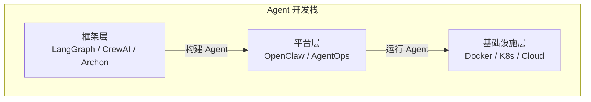
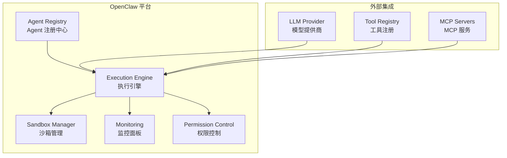
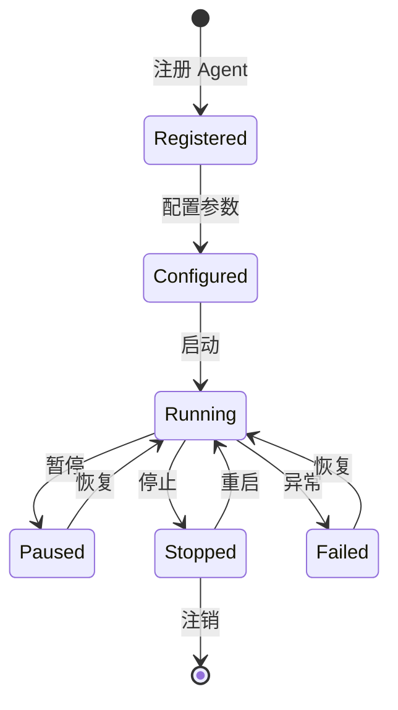

# OpenClaw

## 概念说明

**OpenClaw** 是一个开源的自主 Agent 平台，旨在提供可部署、可管理的 AI Agent 运行环境。与 LangGraph 等框架侧重"构建 Agent"不同，OpenClaw 侧重"运行和管理 Agent"——提供 Agent 的部署、监控、权限控制和生命周期管理能力。

### OpenClaw 定位



## 核心原理

### 1. OpenClaw 架构



### 2. Agent 生命周期管理



### 3. 沙箱隔离

OpenClaw 为每个 Agent 提供隔离的运行环境：

| 隔离维度 | 实现方式 | 说明 |
|---------|---------|------|
| 进程隔离 | Docker 容器 | 每个 Agent 独立容器 |
| 网络隔离 | 网络策略 | 限制 Agent 网络访问 |
| 文件隔离 | 挂载卷 | 限制文件系统访问 |
| 资源限制 | cgroups | CPU/内存/GPU 配额 |
| API 限制 | 速率限制 | 防止 Agent 滥用 API |

### 4. 部署与使用

```python
# OpenClaw Agent 注册示例
class OpenClawAgent:
    """OpenClaw 平台 Agent 定义"""

    def __init__(self, name: str, description: str):
        self.name = name
        self.description = description
        self.tools = []
        self.permissions = []

    def register_tool(self, tool):
        self.tools.append(tool)

    def set_permissions(self, permissions: list):
        self.permissions = permissions

    async def run(self, task: dict) -> dict:
        """执行任务"""
        # Agent 逻辑
        return {"status": "completed", "result": "..."}
```

## 代码示例

> 💻 完整可运行代码：[code-examples/06-ai-frontier/milestone_projects/mcp_multi_agent/main.py](/code-examples/06-ai-frontier/milestone_projects/mcp_multi_agent/main.py)

```python
# OpenClaw 平台集成示例
platform = OpenClawPlatform()
agent = OpenClawAgent("research-agent", "研究助手")
agent.set_permissions(["web_search", "file_read"])
platform.register(agent)
result = await platform.execute("research-agent", {"task": "分析 AI 趋势"})
```

## 实战要点

**OpenClaw 适用场景：**
- 需要管理多个 Agent 的企业环境
- 对 Agent 安全性有严格要求的场景
- 需要 Agent 监控和审计的合规场景

**与其他平台对比：**
| 平台 | 类型 | 特点 |
|------|------|------|
| OpenClaw | 开源自托管 | 完全控制，需要运维 |
| AgentOps | SaaS | 易用，依赖第三方 |
| LangSmith | 监控为主 | LangChain 生态 |

## 常见面试题

### Q1: Agent 平台需要提供哪些核心能力？

**难度**：⭐⭐⭐ | **频率**：🔥🔥

**答题思路**：生命周期 → 安全隔离 → 监控 → 扩展性

**标准答案**：Agent 平台的核心能力：(1) Agent 注册和生命周期管理（创建、启动、暂停、停止）；(2) 沙箱隔离（进程、网络、文件系统隔离）；(3) 权限控制（工具访问、API 调用、数据访问权限）；(4) 监控和可观测性（执行日志、性能指标、异常告警）；(5) 资源管理（CPU/内存/GPU 配额）；(6) 工具注册和管理（MCP 集成）。

**深入追问**：
- 如何防止 Agent 执行恶意操作？
- Agent 平台的水平扩展如何实现？

## 推荐工具

> 📌 以下工具可帮助你更高效地学习和实践本知识点，详见 [模块 7：AI 使用与实践](/7-ai-tools/)

| 工具 | 用途 | 详情 |
|------|------|------|
| Perplexity | 搜索 Agent 平台最新动态 | [AI 搜索](/7-ai-tools/7.1-efficiency/ai-search) |
| Cursor | 辅助编写平台集成代码 | [AI 编程辅助](/7-ai-tools/7.1-efficiency/ai-coding) |

## 参考资料

- [OpenClaw GitHub](https://github.com/openclaw)
- [AgentOps 文档](https://docs.agentops.ai/)
- [LangSmith 文档](https://docs.smith.langchain.com/)
- [AI Agent 安全最佳实践](https://owasp.org/www-project-top-10-for-large-language-model-applications/)
