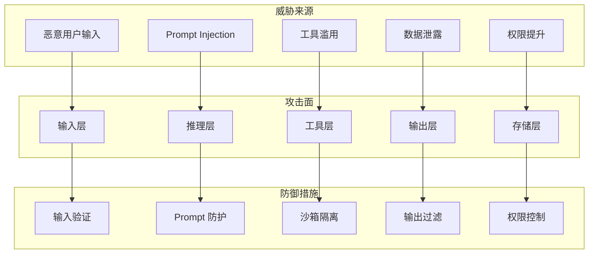
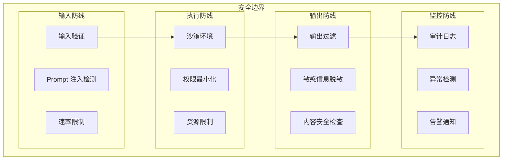
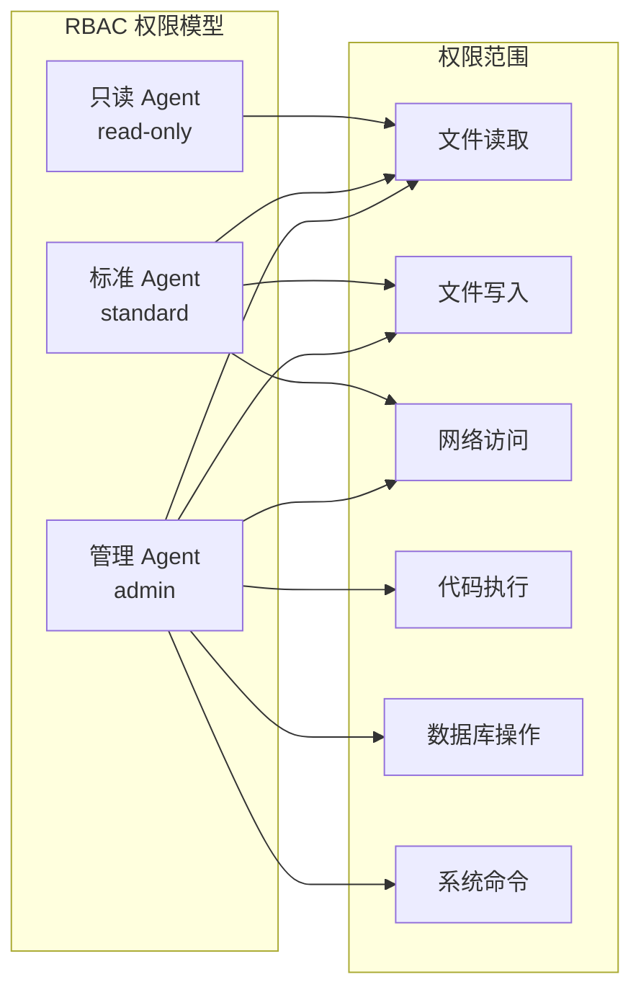
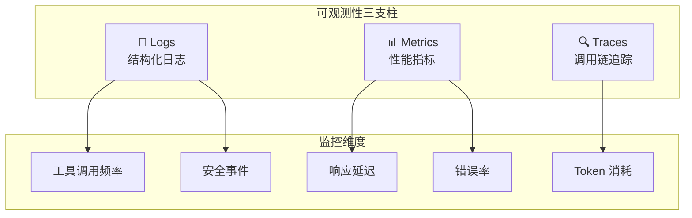

# Agent 架构与安全

## 概念说明

**Agent 安全** 是 AI Agent 系统设计中最关键的非功能性需求。当 Agent 具备工具调用、代码执行、网络访问等能力时，安全风险也随之放大。一个设计不当的 Agent 可能被恶意利用执行危险操作、泄露敏感数据或产生有害输出。

### Agent 安全威胁模型



## 核心原理

### 1. Agent 安全架构



### 2. 沙箱隔离

Agent 执行环境必须与宿主系统隔离：

```python
class AgentSandbox:
    """Agent 沙箱环境"""

    def __init__(self, agent_id: str, config: dict):
        self.agent_id = agent_id
        self.allowed_tools = config.get("allowed_tools", [])
        self.max_memory = config.get("max_memory", "512m")
        self.max_cpu = config.get("max_cpu", "1.0")
        self.network_policy = config.get("network", "restricted")
        self.timeout = config.get("timeout", 30)

    def validate_tool_call(self, tool_name: str, args: dict) -> bool:
        """验证工具调用是否在允许范围内"""
        if tool_name not in self.allowed_tools:
            raise PermissionError(f"工具 {tool_name} 未授权")
        return True
```

### 3. 权限控制模型



### 4. 输入验证与输出过滤

```python
class AgentSecurityMiddleware:
    """Agent 安全中间件"""

    def validate_input(self, user_input: str) -> str:
        """输入验证"""
        # 检测 Prompt Injection
        if self._detect_injection(user_input):
            raise SecurityError("检测到潜在的 Prompt Injection")
        # 长度限制
        if len(user_input) > 10000:
            raise ValueError("输入超过长度限制")
        # 敏感词过滤
        return self._sanitize(user_input)

    def filter_output(self, output: str) -> str:
        """输出过滤"""
        # 脱敏处理
        output = self._mask_sensitive_data(output)
        # 内容安全检查
        if self._detect_harmful_content(output):
            return "输出内容不符合安全策略"
        return output
```

### 5. Agent 可观测性



## 代码示例

> 💻 完整可运行代码：[code-examples/06-ai-frontier/security/01_prompt_injection.py](/code-examples/06-ai-frontier/security/01_prompt_injection.py)
> 🐍 Python 版本：3.11+

```python
# Agent 安全防护示例
sandbox = AgentSandbox("agent-001", {
    "allowed_tools": ["search", "calculate"],
    "network": "restricted",
    "timeout": 30,
})

middleware = AgentSecurityMiddleware()
safe_input = middleware.validate_input(user_input)
result = await agent.run(safe_input, sandbox=sandbox)
safe_output = middleware.filter_output(result)
```

## 实战要点

**Agent 安全设计原则：**
- **最小权限**：Agent 只拥有完成任务所需的最小权限
- **纵深防御**：多层安全防线，不依赖单一防护
- **默认拒绝**：未明确授权的操作默认拒绝
- **可审计**：所有操作都有日志记录
- **故障安全**：安全机制失效时，系统进入安全状态

**常见安全陷阱：**
- Agent 拥有过多权限（如 root 访问）
- 没有对工具调用参数进行验证
- 输出中包含敏感信息（API Key、密码）
- 缺乏速率限制，Agent 被滥用
- 日志中记录了敏感数据

## 常见面试题

### Q1: 如何设计一个安全的 AI Agent 系统？

**难度**：⭐⭐⭐⭐ | **频率**：🔥🔥🔥

**答题思路**：威胁模型 → 安全架构 → 防御措施 → 监控

**标准答案**：安全 Agent 系统设计包含四层防御：(1) 输入防线——输入验证、Prompt Injection 检测、速率限制；(2) 执行防线——沙箱隔离、最小权限、资源限制、工具调用白名单；(3) 输出防线——敏感信息脱敏、内容安全检查、输出格式验证；(4) 监控防线——审计日志、异常检测、安全告警。核心原则是最小权限和纵深防御。

**深入追问**：
- 如何防止 Agent 之间的权限提升攻击？
- Agent 的沙箱隔离有哪些实现方式？
- 如何检测 Agent 是否被 Prompt Injection 攻击？

### Q2: Agent 可观测性包含哪些维度？

**难度**：⭐⭐⭐ | **频率**：🔥🔥

**答题思路**：三支柱 → 关键指标 → 工具选择

**标准答案**：Agent 可观测性基于三支柱：(1) Logs——结构化日志记录每次工具调用、输入输出、错误信息；(2) Metrics——性能指标包括响应延迟、错误率、Token 消耗、工具调用频率；(3) Traces——调用链追踪记录完整的推理过程和工具调用链。工具选择：LangSmith（LangChain 生态）、Prometheus+Grafana（通用监控）、自定义日志系统。

**深入追问**：
- 如何在不影响性能的情况下实现全量追踪？
- Agent 的异常检测有哪些策略？

## 推荐工具

> 📌 以下工具可帮助你更高效地学习和实践本知识点，详见 [模块 7：AI 使用与实践](/7-ai-tools/)

| 工具 | 用途 | 详情 |
|------|------|------|
| Cursor | 辅助编写安全防护代码 | [AI 编程辅助](/7-ai-tools/7.1-efficiency/ai-coding) |
| Perplexity | 搜索 Agent 安全最佳实践 | [AI 搜索](/7-ai-tools/7.1-efficiency/ai-search) |

## 参考资料

- [OWASP Top 10 for LLM Applications](https://owasp.org/www-project-top-10-for-large-language-model-applications/)
- [Anthropic — Agent Safety](https://docs.anthropic.com/en/docs/agents)
- [LangSmith 监控文档](https://docs.smith.langchain.com/)
- [AI Agent Security Best Practices](https://www.microsoft.com/en-us/security/blog/)
