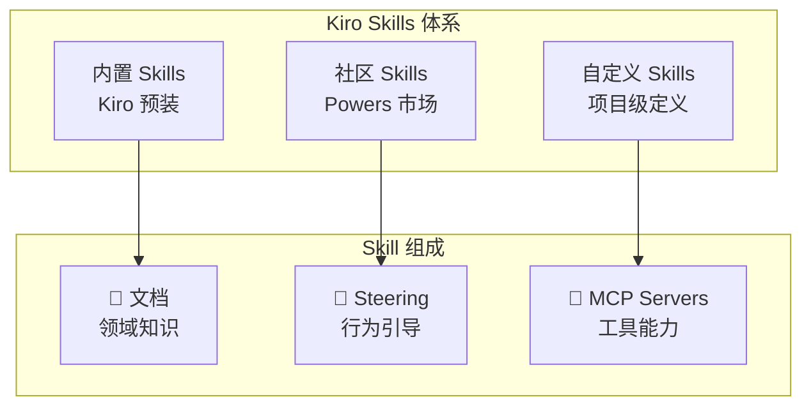
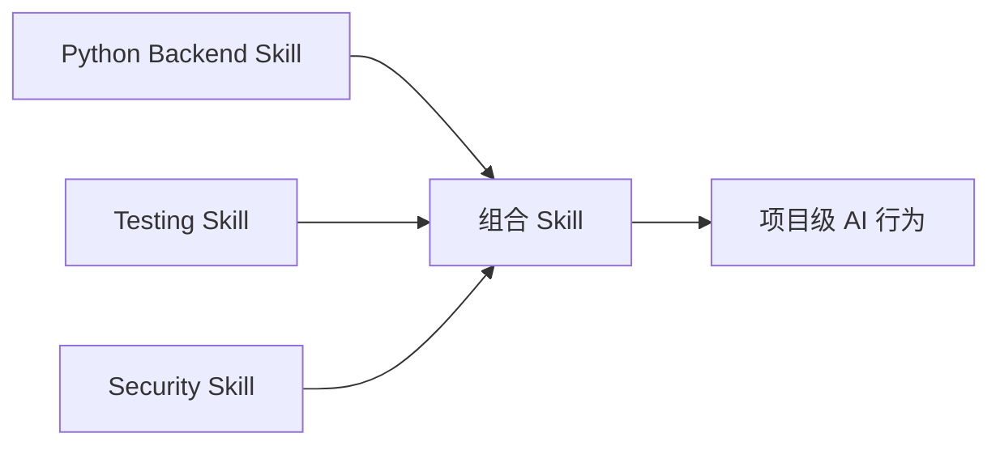

# Kiro Skills

## 概念说明

**Kiro Skills** 是 Kiro IDE 的能力扩展机制，允许开发者定义和组合可复用的 AI 行为模块。每个 Skill 封装了特定领域的知识、规范和工作流，让 AI 在特定场景下表现更专业。Skills 与 Steering 文件配合使用，形成完整的 AI 行为定制体系。

### Skills 体系架构



## 核心原理

### 1. Skill 定义结构

```
.kiro/skills/my-skill/
├── SKILL.md           # Skill 说明文档
├── steering/          # Steering 文件
│   ├── coding.md      # 编码规范
│   └── testing.md     # 测试规范
└── mcp.json           # MCP Server 配置（可选）
```

### 2. Steering 文件编写

```markdown
# .kiro/skills/python-backend/steering/coding.md
inclusion: auto

## Python 后端开发规范

### 代码风格
- 使用 Python 3.11+ 语法特性
- 类型注解覆盖所有公共接口
- docstring 使用 Google 风格

### 架构规范
- FastAPI 作为 Web 框架
- 分层架构：Router → Service → Repository
- 依赖注入使用 FastAPI Depends
```

### 3. Skill 组合模式



### 4. Powers（社区 Skills 市场）

Kiro Powers 是 Skills 的分发和管理机制：

| 功能 | 说明 |
|------|------|
| 浏览 | 在 Powers 面板浏览可用 Skills |
| 安装 | 一键安装社区 Skills |
| 配置 | 自定义 Skill 参数 |
| 更新 | 自动更新已安装 Skills |

## 代码示例

> 💻 完整可运行代码：[code-examples/06-ai-frontier/milestone_projects/mcp_multi_agent/main.py](/code-examples/06-ai-frontier/milestone_projects/mcp_multi_agent/main.py)

```python
# Skill 配置示例（模拟）
class KiroSkill:
    """Kiro Skill 定义"""

    def __init__(self, name: str, description: str):
        self.name = name
        self.description = description
        self.steering_files = []
        self.mcp_servers = []

    def add_steering(self, path: str, inclusion: str = "auto"):
        self.steering_files.append({"path": path, "inclusion": inclusion})

    def add_mcp_server(self, name: str, config: dict):
        self.mcp_servers.append({"name": name, **config})
```

## 实战要点

**Skill 开发最佳实践：**
- 每个 Skill 聚焦单一领域，保持职责清晰
- Steering 文件简洁明确，避免过度约束
- 通过 MCP Server 扩展工具能力
- 提供清晰的 SKILL.md 说明文档

## 常见面试题

### Q1: Kiro Skills 与传统 IDE 插件有什么区别？

**难度**：⭐⭐⭐ | **频率**：🔥

**答题思路**：定位差异 → 能力范围 → 使用方式

**标准答案**：传统 IDE 插件扩展编辑器功能（语法高亮、代码格式化），Kiro Skills 扩展 AI 行为——定义 AI 在特定领域的知识、规范和工作流。Skills 通过 Steering 文件引导 AI 行为，通过 MCP Server 扩展工具能力，让 AI 在特定场景下表现更专业。本质区别是：插件扩展"编辑器能力"，Skills 扩展"AI 能力"。

**深入追问**：
- Skills 和 .cursorrules 的区别是什么？（Skills 更结构化，支持 MCP 集成）
- 如何设计一个好的 Skill？

## 推荐工具

> 📌 以下工具可帮助你更高效地学习和实践本知识点，详见 [模块 7：AI 使用与实践](/7-ai-tools/)

| 工具 | 用途 | 详情 |
|------|------|------|
| Kiro | Skills 开发平台 | [AI 编程辅助](/7-ai-tools/7.1-efficiency/ai-coding) |

## 参考资料

- [Kiro Skills 文档](https://kiro.dev/docs/skills/)
- [Kiro Powers 市场](https://kiro.dev/powers/)
- [Kiro Steering 指南](https://kiro.dev/docs/steering/)
