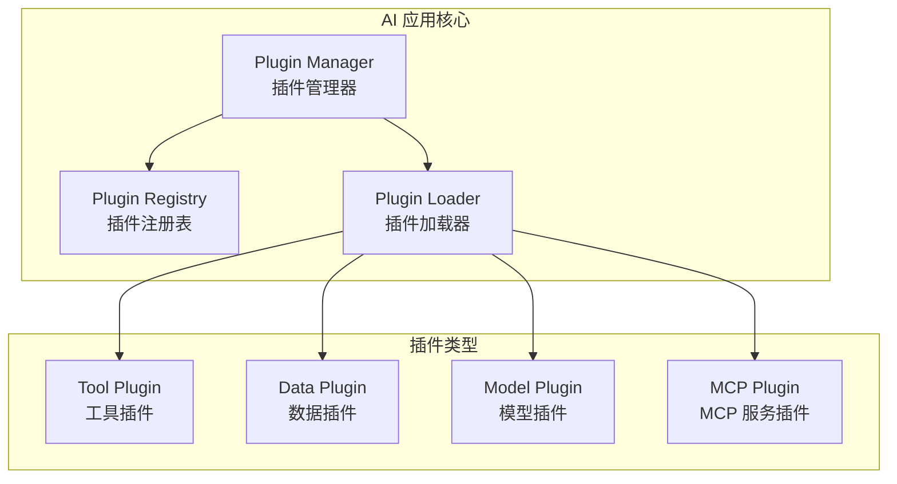
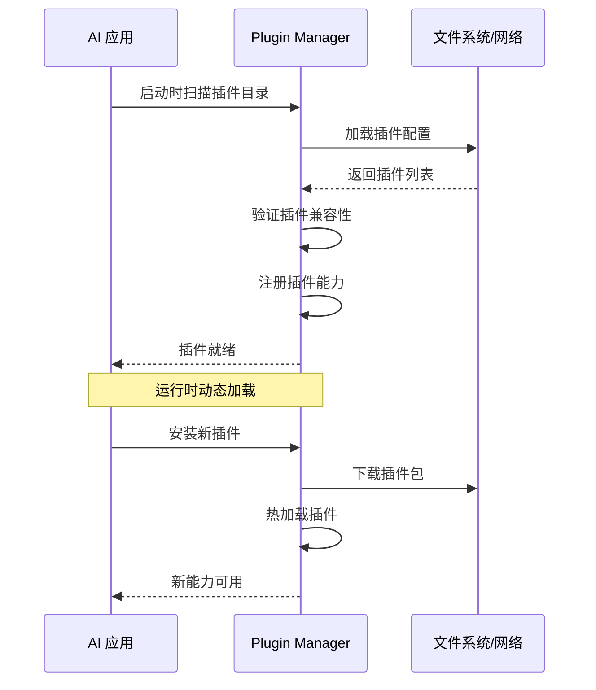

# 能力扩展模式

## 概念说明

**能力扩展模式** 是指 AI 系统通过插件化架构动态加载和管理外部能力的设计模式。随着 AI Agent 需要集成越来越多的工具和数据源，如何设计一个灵活、可扩展的能力管理系统成为关键挑战。MCP 协议的出现为此提供了标准化的解决方案。

### 能力扩展的演进


## 核心原理

### 1. 插件化架构设计



### 2. 工具注册模式

```python
class ToolRegistry:
    """工具注册中心"""

    def __init__(self):
        self._tools: dict = {}

    def register(self, name: str, description: str,
                 schema: dict, handler: callable):
        """注册工具"""
        self._tools[name] = {
            "description": description,
            "inputSchema": schema,
            "handler": handler,
        }

    def discover(self, query: str) -> list:
        """根据描述发现相关工具"""
        return [t for t in self._tools.values()
                if query.lower() in t["description"].lower()]

    def invoke(self, name: str, arguments: dict):
        """调用工具"""
        tool = self._tools.get(name)
        if not tool:
            raise ValueError(f"工具 {name} 未注册")
        return tool["handler"](**arguments)
```

### 3. 动态能力加载



### 4. MCP 工具集成

通过 MCP 协议集成外部工具是最标准化的方式：

```python
class MCPToolIntegration:
    """MCP 工具集成管理"""

    def __init__(self):
        self.servers = {}

    async def connect_server(self, name: str, config: dict):
        """连接 MCP Server"""
        client = MCPClient()
        await client.connect(config["command"], config["args"])
        tools = await client.list_tools()
        self.servers[name] = {"client": client, "tools": tools}

    async def get_all_tools(self) -> list:
        """获取所有 MCP Server 的工具"""
        all_tools = []
        for server in self.servers.values():
            all_tools.extend(server["tools"])
        return all_tools
```

### 5. 扩展模式对比

| 模式 | 优点 | 缺点 | 适用场景 |
|------|------|------|---------|
| 硬编码 | 简单直接 | 不灵活 | 原型开发 |
| 配置化 | 易修改 | 需重启 | 小型项目 |
| 插件化 | 灵活扩展 | 复杂度高 | 中大型项目 |
| MCP 标准化 | 跨平台通用 | 协议开销 | 生态集成 |

## 代码示例

> 💻 完整可运行代码：[code-examples/06-ai-frontier/mcp/01_mcp_server.py](/code-examples/06-ai-frontier/mcp/01_mcp_server.py)

```python
# 插件化工具注册示例
registry = ToolRegistry()
registry.register("search", "搜索网页", {...}, search_handler)
registry.register("calculate", "数学计算", {...}, calc_handler)
tools = registry.discover("搜索")
result = registry.invoke("search", {"query": "AI 趋势"})
```

## 实战要点

**设计原则：**
- 插件接口保持稳定，向后兼容
- 插件之间松耦合，互不依赖
- 提供插件生命周期管理（安装、启用、禁用、卸载）
- 插件沙箱隔离，防止恶意插件

## 常见面试题

### Q1: 如何设计 AI Agent 的能力扩展架构？

**难度**：⭐⭐⭐⭐ | **频率**：🔥🔥

**答题思路**：需求分析 → 架构选择 → 注册机制 → 安全考量

**标准答案**：推荐基于 MCP 协议的插件化架构：(1) 定义统一的工具接口（名称、描述、Schema、Handler）；(2) 实现工具注册中心，支持动态注册和发现；(3) 通过 MCP 协议集成外部工具，实现跨平台互操作；(4) 插件沙箱隔离，权限最小化；(5) 提供插件生命周期管理。关键是保持接口稳定性和向后兼容。

**深入追问**：
- 如何处理插件之间的依赖关系？
- 插件的版本管理如何实现？

## 推荐工具

> 📌 以下工具可帮助你更高效地学习和实践本知识点，详见 [模块 7：AI 使用与实践](/7-ai-tools/)

| 工具 | 用途 | 详情 |
|------|------|------|
| Cursor | 辅助编写插件架构代码 | [AI 编程辅助](/7-ai-tools/7.1-efficiency/ai-coding) |
| Perplexity | 搜索能力扩展模式 | [AI 搜索](/7-ai-tools/7.1-efficiency/ai-search) |

## 参考资料

- [MCP 协议规范](https://spec.modelcontextprotocol.io/)
- [Plugin Architecture Patterns](https://martinfowler.com/articles/plugin.html)
- [OpenAI Function Calling](https://platform.openai.com/docs/guides/function-calling)
