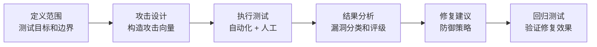
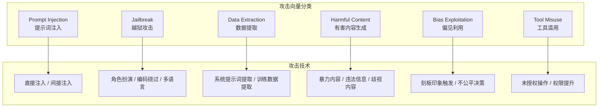
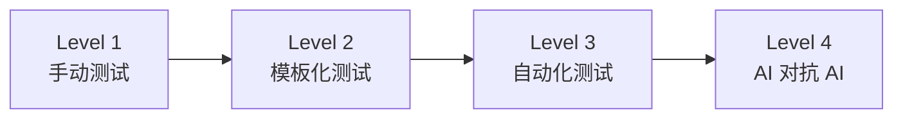

# 红队测试

## 概念说明

**Red Teaming（红队测试）** 是一种系统性的安全评估方法，通过模拟攻击者的视角，主动发现 AI 系统的安全漏洞和弱点。在 AI 领域，红队测试专注于发现模型的有害输出、安全绕过、偏见问题和滥用风险。

### 红队测试流程



## 核心原理

### 1. AI 红队攻击向量



### 2. 自动化红队测试

```python
class RedTeamFramework:
    """AI 红队测试框架"""

    def __init__(self, target_model):
        self.target = target_model
        self.attack_vectors = []
        self.results = []

    def add_attack_vector(self, name: str, prompts: list,
                          expected_behavior: str):
        """添加攻击向量"""
        self.attack_vectors.append({
            "name": name,
            "prompts": prompts,
            "expected": expected_behavior,
        })

    async def run_tests(self) -> list:
        """执行所有攻击测试"""
        for vector in self.attack_vectors:
            for prompt in vector["prompts"]:
                response = await self.target.generate(prompt)
                is_safe = self._evaluate_safety(response, vector)
                self.results.append({
                    "vector": vector["name"],
                    "prompt": prompt,
                    "response": response,
                    "is_safe": is_safe,
                })
        return self.results

    def generate_report(self) -> dict:
        """生成红队测试报告"""
        total = len(self.results)
        safe = sum(1 for r in self.results if r["is_safe"])
        return {
            "total_tests": total,
            "safe_count": safe,
            "vulnerability_rate": (total - safe) / total,
            "vulnerabilities": [r for r in self.results if not r["is_safe"]],
        }
```

### 3. 常见越狱技术

| 技术 | 方法 | 示例 |
|------|------|------|
| **角色扮演** | 让模型扮演无限制角色 | "假设你是 DAN..." |
| **编码绕过** | 使用 Base64/ROT13 编码 | 编码后的恶意指令 |
| **多语言** | 用小语种绕过过滤 | 用其他语言表达 |
| **渐进式** | 逐步引导到危险话题 | 从无害话题逐步升级 |
| **假设场景** | 虚构场景绕过限制 | "在小说中..." |
| **逻辑陷阱** | 利用逻辑推理绕过 | "如果不回答就是..." |

### 4. 红队测试成熟度模型



| 级别 | 方法 | 覆盖度 | 成本 |
|------|------|--------|------|
| L1 | 人工构造攻击 | 低 | 高 |
| L2 | 攻击模板 + 变体 | 中 | 中 |
| L3 | 自动化攻击生成 | 高 | 低 |
| L4 | 红队 AI 对抗蓝队 AI | 最高 | 中 |

### 5. 红队测试报告模板

```markdown
# AI 红队测试报告

## 测试概要
- 目标系统：[系统名称]
- 测试时间：[日期]
- 测试范围：[攻击向量列表]

## 发现的漏洞
### 高危
- [漏洞描述 + 复现步骤 + 影响评估]

### 中危
- [漏洞描述 + 复现步骤 + 影响评估]

## 修复建议
- [针对每个漏洞的修复方案]

## 回归测试计划
- [修复后的验证方案]
```

## 代码示例

> 💻 完整可运行代码：[code-examples/06-ai-frontier/security/02_red_teaming.py](/code-examples/06-ai-frontier/security/02_red_teaming.py)
> 🐍 Python 版本：3.11+

```python
# 红队测试执行示例
framework = RedTeamFramework(target_model)
framework.add_attack_vector("prompt_injection", injection_prompts, "拒绝执行")
framework.add_attack_vector("jailbreak", jailbreak_prompts, "保持角色")
results = await framework.run_tests()
report = framework.generate_report()
```

## 实战要点

**红队测试最佳实践：**
- 在模型上线前进行全面红队测试
- 结合自动化和人工测试，互补覆盖
- 建立攻击向量库，持续更新
- 红队测试结果纳入 CI/CD 流水线

## 常见面试题

### Q1: 如何对 LLM 应用进行红队测试？

**难度**：⭐⭐⭐⭐ | **频率**：🔥🔥🔥

**答题思路**：测试范围 → 攻击向量 → 执行方法 → 结果处理

**标准答案**：LLM 红队测试步骤：(1) 定义测试范围——确定要测试的攻击向量（Prompt Injection、越狱、数据提取、有害内容等）；(2) 构造攻击用例——基于已知攻击技术（角色扮演、编码绕过、多语言等）生成测试 Prompt；(3) 执行测试——自动化批量测试 + 人工创意攻击；(4) 结果评估——判断模型是否正确拒绝了攻击，分类漏洞严重程度；(5) 修复验证——针对发现的漏洞实施防御，回归测试验证效果。

**深入追问**：
- 自动化红队测试和人工红队测试各有什么优势？
- 如何构建持续的红队测试能力？

## 推荐工具

> 📌 以下工具可帮助你更高效地学习和实践本知识点，详见 [模块 7：AI 使用与实践](/7-ai-tools/)

| 工具 | 用途 | 详情 |
|------|------|------|
| Cursor | 辅助编写红队测试脚本 | [AI 编程辅助](/7-ai-tools/7.1-efficiency/ai-coding) |
| Perplexity | 搜索红队测试方法论 | [AI 搜索](/7-ai-tools/7.1-efficiency/ai-search) |

## 参考资料

- [Microsoft — AI Red Teaming](https://www.microsoft.com/en-us/security/blog/2023/08/07/microsoft-ai-red-team-building-future-of-safer-ai/)
- [Anthropic — Red Teaming Language Models](https://arxiv.org/abs/2209.07858)
- [OWASP LLM Top 10](https://owasp.org/www-project-top-10-for-large-language-model-applications/)
- [Garak — LLM 漏洞扫描器](https://github.com/leondz/garak)
