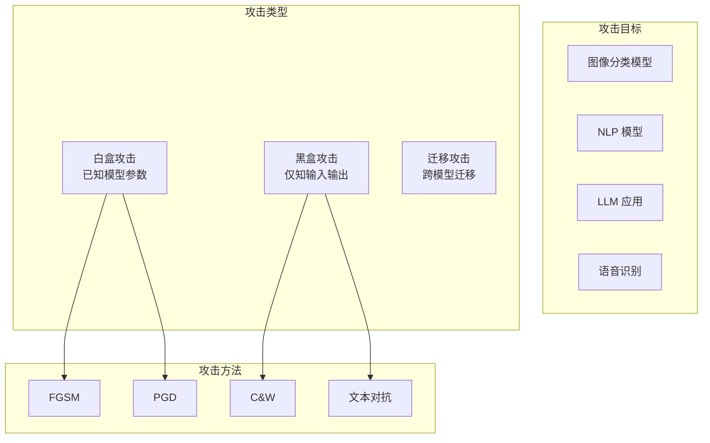
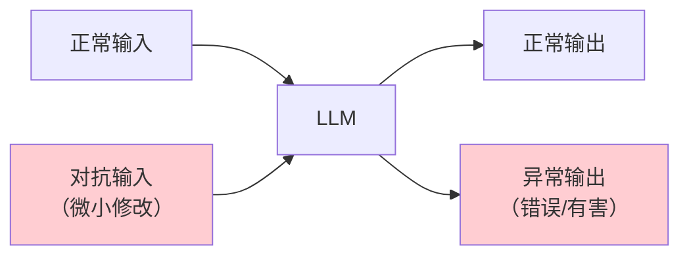
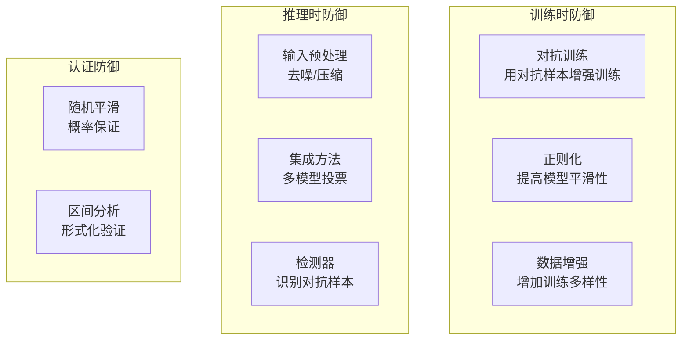

# 对抗攻击

## 概念说明

**对抗攻击（Adversarial Attacks）** 是通过对输入数据添加精心设计的微小扰动，使 AI 模型产生错误输出的攻击方式。对抗样本（Adversarial Examples）在人类看来与原始输入几乎无差别，但能导致模型做出完全错误的判断。

### 对抗攻击全景



## 核心原理

### 1. 图像对抗攻击

**FGSM（Fast Gradient Sign Method）：**

```python
def fgsm_attack(model, image, label, epsilon=0.03):
    """FGSM 对抗攻击"""
    image.requires_grad = True
    output = model(image)
    loss = F.cross_entropy(output, label)
    model.zero_grad()
    loss.backward()

    # 沿梯度方向添加扰动
    perturbation = epsilon * image.grad.sign()
    adversarial_image = image + perturbation
    adversarial_image = torch.clamp(adversarial_image, 0, 1)
    return adversarial_image
```

### 2. 文本对抗攻击

| 方法 | 技术 | 示例 |
|------|------|------|
| 字符替换 | 同形字/Unicode | "apple" → "аpple"（西里尔字母 а） |
| 词语替换 | 同义词替换 | "好的" → "不错的" |
| 句子改写 | 语义保持改写 | 改变句式但保持含义 |
| 添加噪声 | 插入不可见字符 | 零宽字符插入 |

### 3. LLM 对抗攻击



### 4. 防御方法



### 5. 鲁棒性评估

```python
class RobustnessEvaluator:
    """模型鲁棒性评估器"""

    def __init__(self, model, attack_methods: list):
        self.model = model
        self.attacks = attack_methods

    def evaluate(self, test_data: list) -> dict:
        """评估模型在各种攻击下的鲁棒性"""
        results = {}
        for attack in self.attacks:
            correct = 0
            total = len(test_data)
            for sample in test_data:
                adv_sample = attack.generate(self.model, sample)
                pred = self.model.predict(adv_sample)
                if pred == sample["label"]:
                    correct += 1
            results[attack.name] = {
                "robust_accuracy": correct / total,
                "attack_success_rate": 1 - correct / total,
            }
        return results
```

## 代码示例

> 💻 完整可运行代码：[code-examples/06-ai-frontier/security/02_red_teaming.py](/code-examples/06-ai-frontier/security/02_red_teaming.py)
> 🐍 Python 版本：3.11+

```python
# 鲁棒性评估示例
evaluator = RobustnessEvaluator(model, [FGSMAttack(), PGDAttack()])
results = evaluator.evaluate(test_data)
print(f"FGSM 鲁棒准确率: {results['fgsm']['robust_accuracy']:.2%}")
```

## 实战要点

**对抗防御最佳实践：**
- 对抗训练是最有效的防御方法，但会增加训练成本
- 多种防御方法组合使用，提高整体鲁棒性
- 定期进行鲁棒性评估，跟踪新攻击方法
- 在安全关键应用中，必须进行对抗鲁棒性测试

## 常见面试题

### Q1: 什么是对抗样本？FGSM 攻击的原理是什么？

**难度**：⭐⭐⭐⭐ | **频率**：🔥🔥

**答题思路**：定义 → FGSM 原理 → 数学公式 → 防御方法

**标准答案**：对抗样本是通过对输入添加微小扰动，使模型产生错误输出的样本。FGSM 是最经典的白盒攻击方法，原理是沿损失函数梯度的符号方向添加固定大小的扰动：x_adv = x + ε·sign(∇_x L(θ, x, y))。ε 控制扰动大小，sign 取梯度符号确保扰动方向最大化损失。防御方法包括对抗训练、输入预处理、集成方法等。

**深入追问**：
- PGD 攻击与 FGSM 有什么区别？（PGD 是多步迭代版本）
- 对抗训练为什么能提高鲁棒性？
- 对抗样本的可迁移性是什么？

### Q2: 如何评估 AI 模型的鲁棒性？

**难度**：⭐⭐⭐ | **频率**：🔥🔥

**答题思路**：评估维度 → 攻击方法 → 指标定义 → 工具选择

**标准答案**：鲁棒性评估包括：(1) 选择攻击方法——白盒（FGSM、PGD）和黑盒（迁移攻击、查询攻击）；(2) 定义评估指标——鲁棒准确率（对抗样本上的准确率）、攻击成功率、最小扰动量；(3) 多种攻击强度测试——不同 ε 值下的鲁棒性曲线；(4) 工具选择——Foolbox、ART（Adversarial Robustness Toolbox）。

**深入追问**：
- 鲁棒性和准确率之间是否存在权衡？
- 认证防御（Certified Defense）是什么？

## 推荐工具

> 📌 以下工具可帮助你更高效地学习和实践本知识点，详见 [模块 7：AI 使用与实践](/7-ai-tools/)

| 工具 | 用途 | 详情 |
|------|------|------|
| Cursor | 辅助编写对抗攻击代码 | [AI 编程辅助](/7-ai-tools/7.1-efficiency/ai-coding) |
| Perplexity | 搜索对抗攻击研究 | [AI 搜索](/7-ai-tools/7.1-efficiency/ai-search) |

## 参考资料

- [Adversarial Robustness Toolbox (ART)](https://github.com/Trusted-AI/adversarial-robustness-toolbox)
- [Foolbox — 对抗攻击库](https://github.com/bethgelab/foolbox)
- [Goodfellow et al. — Explaining and Harnessing Adversarial Examples](https://arxiv.org/abs/1412.6572)
- [Madry et al. — Towards Deep Learning Models Resistant to Adversarial Attacks](https://arxiv.org/abs/1706.06083)
