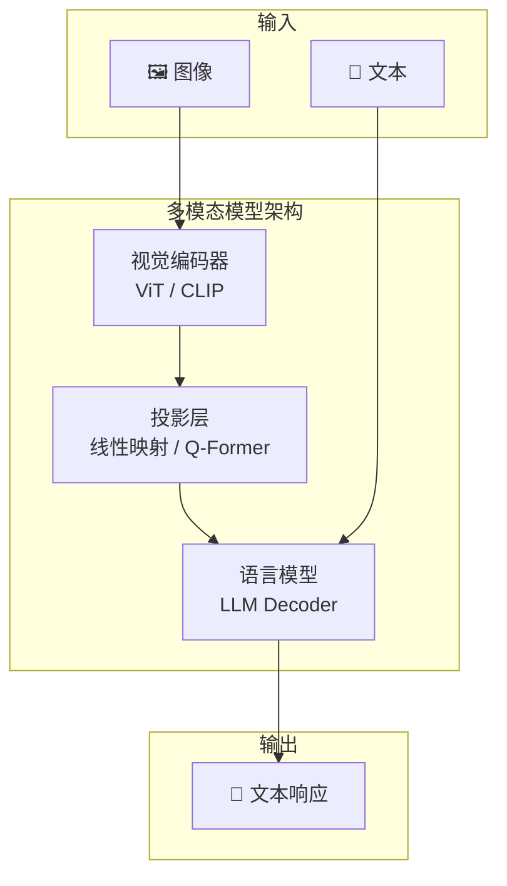
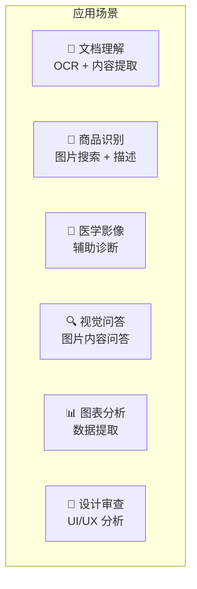
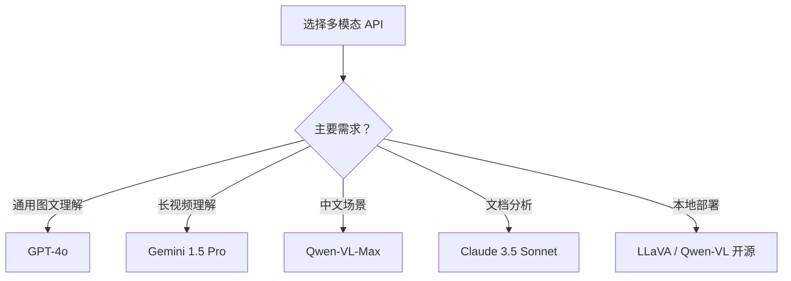

# 多模态 API 调用实战

## 概念说明

**多模态 AI** 是指能够同时处理和理解多种数据类型（文本、图像、音频、视频）的 AI 系统。2024-2025 年，主流 LLM 厂商纷纷推出多模态 API，开发者可以通过简单的 API 调用实现图文理解、视觉问答、文档分析等能力。

### 多模态模型架构概述



### 主流多模态模型对比

| 模型 | 厂商 | 图像理解 | 视频理解 | 中文支持 | API 价格 |
|------|------|---------|---------|---------|---------|
| GPT-4o | OpenAI | ⭐⭐⭐⭐⭐ | ⭐⭐⭐ | ⭐⭐⭐ | 中等 |
| Gemini 1.5 Pro | Google | ⭐⭐⭐⭐⭐ | ⭐⭐⭐⭐⭐ | ⭐⭐⭐ | 中等 |
| Claude 3.5 Sonnet | Anthropic | ⭐⭐⭐⭐ | ❌ | ⭐⭐⭐⭐ | 中等 |
| Qwen-VL-Max | 阿里 | ⭐⭐⭐⭐ | ⭐⭐⭐ | ⭐⭐⭐⭐⭐ | 低 |

## 核心原理

### 1. GPT-4V/GPT-4o API 调用

```python
import base64
from openai import OpenAI

client = OpenAI()

def analyze_image(image_path: str, question: str) -> str:
    """使用 GPT-4o 分析图像"""
    with open(image_path, "rb") as f:
        image_data = base64.b64encode(f.read()).decode()

    response = client.chat.completions.create(
        model="gpt-4o",
        messages=[{
            "role": "user",
            "content": [
                {"type": "text", "text": question},
                {"type": "image_url", "image_url": {
                    "url": f"data:image/jpeg;base64,{image_data}"
                }},
            ],
        }],
    )
    return response.choices[0].message.content
```

### 2. Gemini Vision API

```python
import google.generativeai as genai

genai.configure(api_key="YOUR_API_KEY")
model = genai.GenerativeModel("gemini-1.5-pro")

def gemini_analyze(image_path: str, prompt: str) -> str:
    """使用 Gemini 分析图像"""
    image = genai.upload_file(image_path)
    response = model.generate_content([prompt, image])
    return response.text
```

### 3. Qwen-VL API（中文优化）

```python
from openai import OpenAI

client = OpenAI(
    base_url="https://dashscope.aliyuncs.com/compatible-mode/v1",
    api_key="YOUR_DASHSCOPE_KEY",
)

def qwen_vl_analyze(image_url: str, question: str) -> str:
    """使用 Qwen-VL 分析图像（中文优化）"""
    response = client.chat.completions.create(
        model="qwen-vl-max",
        messages=[{
            "role": "user",
            "content": [
                {"type": "text", "text": question},
                {"type": "image_url", "image_url": {"url": image_url}},
            ],
        }],
    )
    return response.choices[0].message.content
```

### 4. 图文理解应用场景



### 5. 多模态 API 选型指南



## 代码示例

> 💻 完整可运行代码：[code-examples/06-ai-frontier/milestone_projects/](/code-examples/06-ai-frontier/milestone_projects/)
> 🐍 Python 版本：3.11+
> 📦 依赖：openai / google-generativeai

```python
# 多模态 API 统一调用接口
class MultimodalClient:
    def __init__(self, provider: str):
        self.provider = provider

    async def analyze(self, image, prompt: str) -> str:
        if self.provider == "openai":
            return await self._openai_analyze(image, prompt)
        elif self.provider == "gemini":
            return await self._gemini_analyze(image, prompt)
        elif self.provider == "qwen":
            return await self._qwen_analyze(image, prompt)
```

## 实战要点

**多模态 API 使用建议：**
- 图像分辨率影响理解质量，建议 512px 以上
- 中文场景优先考虑 Qwen-VL，性价比最高
- 长文档/多页 PDF 分析用 Gemini（支持长上下文）
- 生产环境实现多模型 Fallback 机制

## 常见面试题

### Q1: 多模态模型的架构是怎样的？

**难度**：⭐⭐⭐ | **频率**：🔥🔥🔥

**答题思路**：三大组件 → 信息流 → 训练方式

**标准答案**：主流多模态模型由三部分组成：(1) 视觉编码器（如 ViT/CLIP）将图像编码为特征向量；(2) 投影层（线性映射或 Q-Former）将视觉特征对齐到语言模型的嵌入空间；(3) 语言模型（LLM Decoder）接收视觉和文本 Token，生成文本响应。训练通常分两阶段：预训练阶段对齐视觉和语言表示，微调阶段在指令数据上训练。

**深入追问**：
- 视觉编码器和语言模型之间的对齐是如何实现的？
- 不同多模态模型在架构上有什么差异？

### Q2: 如何选择合适的多模态 API？

**难度**：⭐⭐⭐ | **频率**：🔥🔥

**答题思路**：需求分析 → 能力对比 → 成本考量 → 部署方式

**标准答案**：选型考虑：(1) 任务类型——通用理解用 GPT-4o，视频理解用 Gemini，中文场景用 Qwen-VL；(2) 成本——Qwen-VL 性价比最高，GPT-4o 能力最强但价格较高；(3) 部署方式——云 API 快速接入，本地部署（LLaVA/Qwen-VL 开源版）保护数据隐私；(4) 延迟要求——实时场景选择低延迟模型。

**深入追问**：
- 多模态模型的 Token 计费如何计算图像部分？
- 如何处理多模态 API 的速率限制？

## 推荐工具

> 📌 以下工具可帮助你更高效地学习和实践本知识点，详见 [模块 7：AI 使用与实践](/7-ai-tools/)

| 工具 | 用途 | 详情 |
|------|------|------|
| Cursor | 辅助编写多模态集成代码 | [AI 编程辅助](/7-ai-tools/7.1-efficiency/ai-coding) |
| Perplexity | 搜索多模态 API 文档 | [AI 搜索](/7-ai-tools/7.1-efficiency/ai-search) |

## 参考资料

- [OpenAI Vision API](https://platform.openai.com/docs/guides/vision)
- [Google Gemini API](https://ai.google.dev/gemini-api/docs)
- [Qwen-VL 文档](https://help.aliyun.com/zh/dashscope/developer-reference/qwen-vl-api)
- [LLaVA 论文](https://arxiv.org/abs/2304.08485)
