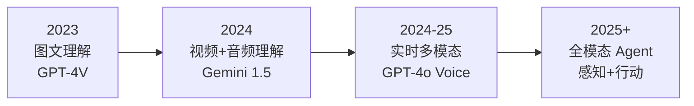
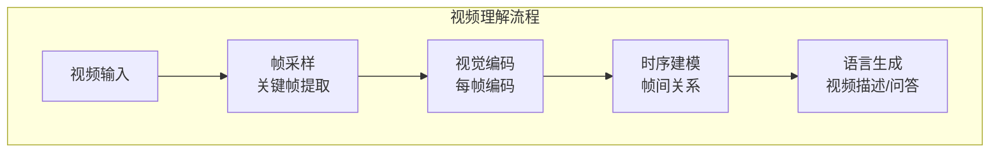
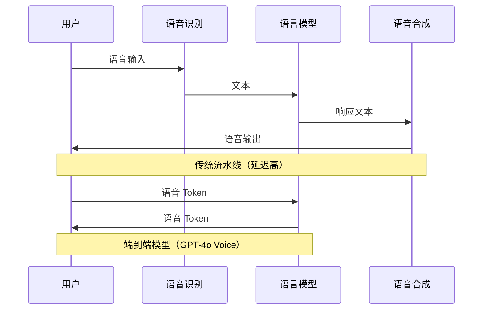
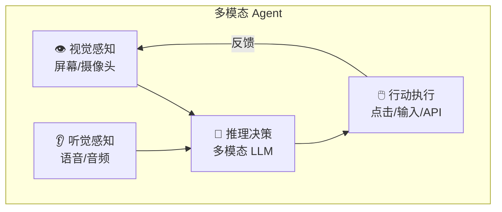
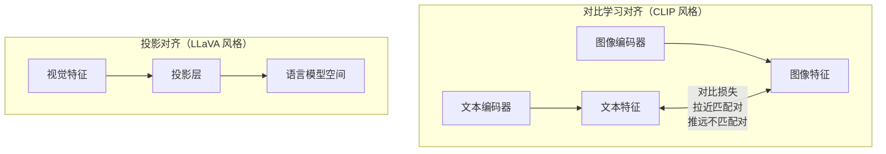

# 跨模态应用趋势

## 概念说明

**跨模态应用** 是指 AI 系统在多种数据模态（文本、图像、音频、视频）之间进行理解、转换和生成的应用。2024-2025 年，跨模态 AI 正从"单模态输入 + 文本输出"向"多模态输入 + 多模态输出"的全模态交互演进。

### 跨模态发展路线



## 核心原理

### 1. 视频理解



**主流视频理解模型：**
| 模型 | 能力 | 最大时长 | 特点 |
|------|------|---------|------|
| Gemini 1.5 Pro | 视频问答 | 1小时+ | 长视频理解最强 |
| GPT-4o | 视频帧分析 | 短视频 | 通用能力强 |
| Qwen-VL | 视频理解 | 中等 | 中文优化 |

### 2. 语音对话（Voice Mode）



### 3. 多模态 Agent

多模态 Agent 能够感知环境（视觉、听觉）并采取行动：



**应用场景：**
- **Computer Use Agent**：理解屏幕内容，操作电脑完成任务
- **机器人控制**：视觉感知 + 语言指令 → 机器人动作
- **智能客服**：语音 + 图片 → 多模态问题解答

### 4. 实时多模态交互

| 技术 | 延迟 | 体验 | 代表产品 |
|------|------|------|---------|
| 流水线（ASR+LLM+TTS） | 2-5秒 | 一般 | 传统语音助手 |
| 端到端语音模型 | 200-500ms | 自然 | GPT-4o Voice |
| 流式多模态 | <200ms | 实时 | 未来趋势 |

### 5. 跨模态对齐原理



## 代码示例

> 💻 完整可运行代码：[code-examples/06-ai-frontier/milestone_projects/](/code-examples/06-ai-frontier/milestone_projects/)

```python
# 跨模态应用示例 — 视频理解
class VideoAnalyzer:
    def __init__(self, model_provider: str):
        self.provider = model_provider

    def extract_keyframes(self, video_path: str, n_frames: int = 10):
        """提取视频关键帧"""
        # 均匀采样或基于场景变化采样
        pass

    async def analyze(self, video_path: str, question: str) -> str:
        """分析视频内容"""
        frames = self.extract_keyframes(video_path)
        # 将关键帧发送到多模态 API
        return await self._call_api(frames, question)
```

## 实战要点

**跨模态应用开发建议：**
- 视频理解优先使用 Gemini（长视频支持最好）
- 实时语音交互考虑 GPT-4o Voice Mode
- 多模态 Agent 开发注意安全边界（限制操作范围）
- 跨模态应用的延迟优化是关键挑战

## 常见面试题

### Q1: 跨模态对齐的核心技术是什么？

**难度**：⭐⭐⭐⭐ | **频率**：🔥🔥

**答题思路**：对齐目标 → 技术方法 → 代表模型

**标准答案**：跨模态对齐的目标是将不同模态的数据映射到统一的表示空间。核心技术：(1) 对比学习（CLIP 风格）——通过对比损失拉近匹配的图文对、推远不匹配对；(2) 投影对齐（LLaVA 风格）——通过线性投影层将视觉特征映射到语言模型的嵌入空间；(3) Q-Former（BLIP-2 风格）——使用可学习的查询 Token 从视觉特征中提取与语言相关的信息。

**深入追问**：
- CLIP 的对比学习具体是怎么训练的？
- 为什么需要投影层而不是直接拼接特征？

### Q2: 多模态 Agent 面临哪些技术挑战？

**难度**：⭐⭐⭐⭐ | **频率**：🔥🔥

**答题思路**：感知 → 推理 → 行动 → 安全

**标准答案**：多模态 Agent 的核心挑战：(1) 感知准确性——视觉理解的错误会导致错误决策；(2) 实时性——多模态处理延迟影响交互体验；(3) 行动安全——Agent 操作真实环境需要严格的安全边界；(4) 上下文管理——多模态信息的上下文窗口限制；(5) 评估困难——多模态 Agent 的评估缺乏标准化基准。

**深入追问**：
- Computer Use Agent 的安全风险有哪些？
- 如何评估多模态 Agent 的性能？

## 推荐工具

> 📌 以下工具可帮助你更高效地学习和实践本知识点，详见 [模块 7：AI 使用与实践](/7-ai-tools/)

| 工具 | 用途 | 详情 |
|------|------|------|
| Perplexity | 搜索跨模态 AI 进展 | [AI 搜索](/7-ai-tools/7.1-efficiency/ai-search) |
| ChatGPT | 讨论跨模态架构 | [AI 对话助手](/7-ai-tools/7.1-efficiency/ai-chat) |

## 参考资料

- [Google Gemini 多模态能力](https://deepmind.google/technologies/gemini/)
- [OpenAI GPT-4o](https://openai.com/index/hello-gpt-4o/)
- [CLIP 论文](https://arxiv.org/abs/2103.00020)
- [LLaVA 论文](https://arxiv.org/abs/2304.08485)
