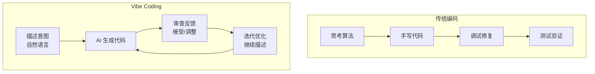
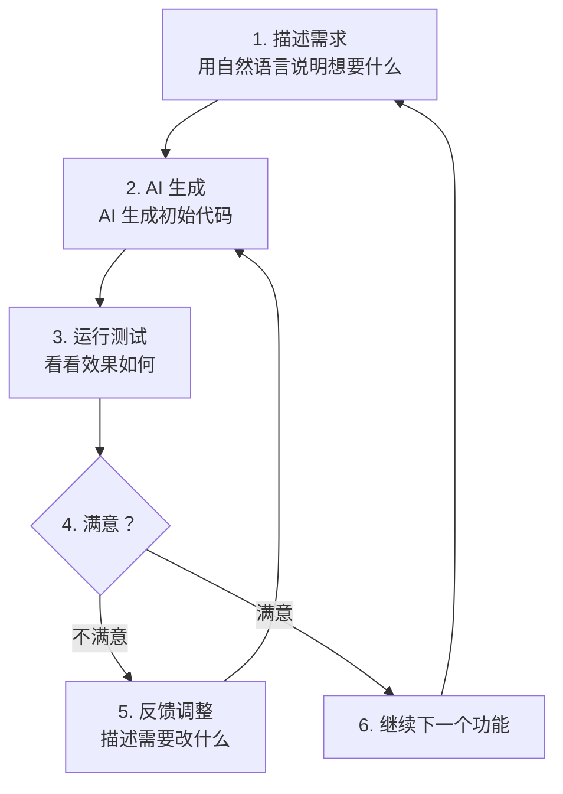
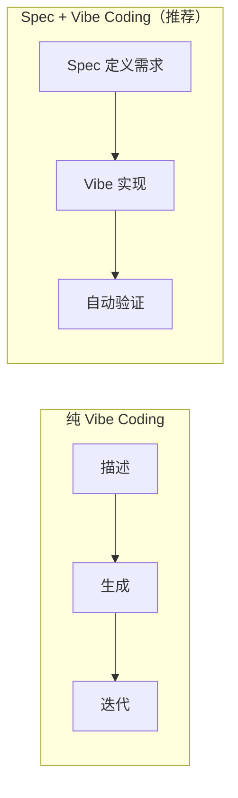
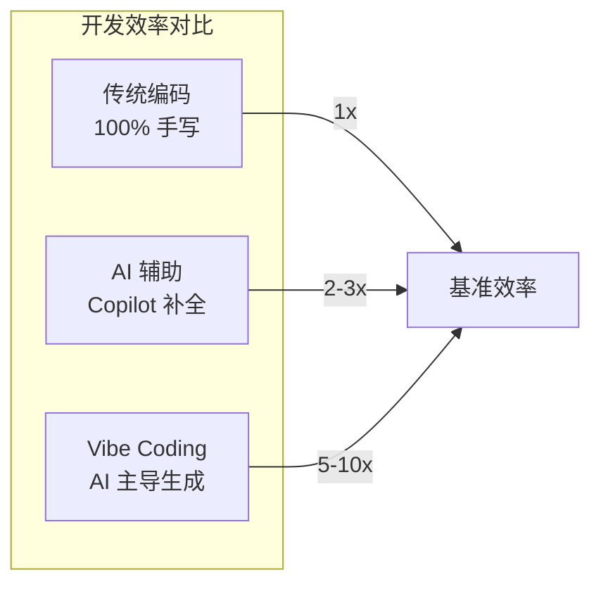

# Vibe Coding

## 概念说明

**Vibe Coding** 是由 Andrej Karpathy（前 Tesla AI 总监、OpenAI 联合创始人）在 2025 年初提出的概念，指一种全新的编程范式——开发者通过自然语言描述需求和意图（"vibes"），让 AI 生成和迭代代码，开发者主要负责审查和引导方向，而非手动编写每一行代码。

### Vibe Coding 的核心理念

> "There's a new kind of coding I call 'vibe coding', where you fully give in to the vibes, embrace exponentials, and forget that the code even exists." — Andrej Karpathy



### Vibe Coding 的适用范围

| 场景 | 适合度 | 说明 |
|------|--------|------|
| 快速原型 | ⭐⭐⭐⭐⭐ | 最佳场景，快速验证想法 |
| 个人项目 | ⭐⭐⭐⭐ | 效率极高 |
| 学习新技术 | ⭐⭐⭐⭐ | AI 辅助探索 |
| 团队项目 | ⭐⭐⭐ | 需要配合规范 |
| 安全关键系统 | ⭐⭐ | 需要严格审查 |
| 底层系统编程 | ⭐ | AI 理解有限 |

## 核心原理

### 1. Vibe Coding 工作流



### 2. 实际案例演示

**案例：用 Vibe Coding 构建一个 Todo API**

```
# 第 1 轮对话
用户：创建一个 FastAPI 的 Todo 应用，支持增删改查

# AI 生成完整的 CRUD API 代码

# 第 2 轮对话
用户：添加用户认证，使用 JWT Token

# AI 在现有代码基础上添加认证功能

# 第 3 轮对话
用户：添加 SQLite 数据库持久化，用 SQLAlchemy

# AI 替换内存存储为数据库

# 第 4 轮对话
用户：添加分页和搜索功能

# AI 添加分页参数和搜索接口
```

### 3. Vibe Coding 与 Spec 驱动的结合



Kiro 的 Spec 驱动开发可以看作"有约束的 Vibe Coding"——用 Spec 定义边界，用 Vibe 方式实现细节。

### 4. Vibe Coding 的风险与应对

| 风险 | 应对策略 |
|------|---------|
| 代码质量不可控 | 配合 Lint + 测试 |
| 安全漏洞 | 安全扫描 + Code Review |
| 技术债务 | 定期重构 |
| 过度依赖 AI | 保持基础编码能力 |
| 理解不深 | 审查 AI 生成的代码 |

### 5. Vibe Coding 效率对比



## 代码示例

> 💻 完整评测代码：[code-examples/06-ai-frontier/milestone_projects/coding_benchmark/benchmark.py](/code-examples/06-ai-frontier/milestone_projects/coding_benchmark/benchmark.py)

```python
# Vibe Coding 产出示例 — 用自然语言描述生成的代码
# 用户描述："创建一个简单的 URL 短链接服务"

from fastapi import FastAPI
import hashlib
import string

app = FastAPI(title="URL 短链接服务")
url_store: dict[str, str] = {}

@app.post("/shorten")
def shorten_url(url: str) -> dict:
    """生成短链接"""
    short_code = hashlib.md5(url.encode()).hexdigest()[:6]
    url_store[short_code] = url
    return {"short_url": f"http://localhost:8000/{short_code}"}

@app.get("/{code}")
def redirect(code: str):
    """重定向到原始 URL"""
    original = url_store.get(code)
    if not original:
        return {"error": "短链接不存在"}
    return {"redirect_to": original}
```

## 实战要点

**Vibe Coding 最佳实践：**
- 描述要具体：不说"做一个网站"，说"用 FastAPI 创建一个带 JWT 认证的 Todo API"
- 迭代式开发：每次只描述一个功能点，逐步构建
- 保持审查：AI 生成的代码必须理解后再接受
- 配合测试：让 AI 同时生成测试代码

## 常见面试题

### Q1: 什么是 Vibe Coding？它与传统编程有什么区别？

**难度**：⭐⭐ | **频率**：🔥🔥

**答题思路**：概念定义 → 工作方式 → 优劣势 → 适用场景

**标准答案**：Vibe Coding 是 Andrej Karpathy 提出的编程范式，开发者通过自然语言描述意图，让 AI 生成和迭代代码，开发者主要负责审查和引导。与传统编程的区别：(1) 输入方式——自然语言 vs 代码语法；(2) 开发者角色——审查者/引导者 vs 编写者；(3) 迭代方式——对话式反馈 vs 手动修改；(4) 效率——原型开发效率提升 5-10 倍。适合快速原型和个人项目，安全关键系统仍需传统方式。

**深入追问**：
- Vibe Coding 会让程序员失业吗？
- 如何在 Vibe Coding 中保证代码质量？

## 推荐工具

> 📌 以下工具可帮助你更高效地学习和实践本知识点，详见 [模块 7：AI 使用与实践](/7-ai-tools/)

| 工具 | 用途 | 详情 |
|------|------|------|
| Cursor | Vibe Coding 主要工具 | [AI 编程辅助](/7-ai-tools/7.1-efficiency/ai-coding) |
| Kiro | Spec 驱动的 Vibe Coding | [AI 编程辅助](/7-ai-tools/7.1-efficiency/ai-coding) |

## 参考资料

- [Andrej Karpathy — Vibe Coding](https://x.com/karpathy/status/1886192184808149383)
- [The Rise of Vibe Coding](https://www.cursor.com/blog)
- [AI-Assisted Software Development](https://github.blog/ai-and-ml/)
