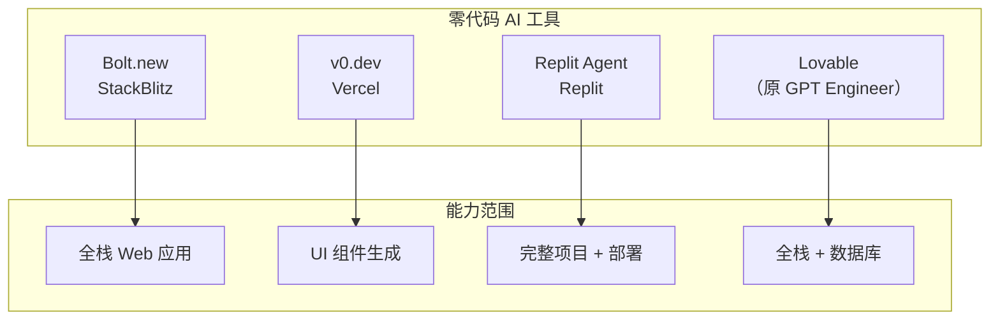
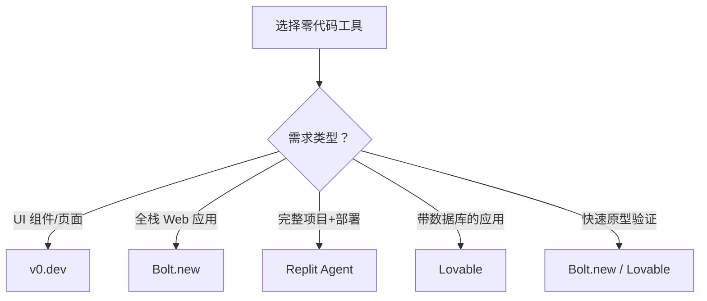

# 零代码 AI 开发工具

## 概念说明

**零代码 AI 开发工具** 是 Vibe Coding 理念的极致体现——用户完全通过自然语言描述需求，AI 自动生成完整的可运行应用，无需编写任何代码。这类工具正在降低软件开发的门槛，让非技术人员也能构建功能完整的应用。

### 主流零代码 AI 工具



## 核心原理

### 1. 工具全维度对比

| 维度 | Bolt.new | v0.dev | Replit Agent | Lovable |
|------|---------|--------|-------------|---------|
| **开发商** | StackBlitz | Vercel | Replit | Lovable |
| **核心能力** | 全栈 Web 应用 | UI 组件/页面 | 完整项目 | 全栈应用 |
| **技术栈** | React/Next.js/Node | React/Tailwind | 多语言 | React/Supabase |
| **部署** | 内置预览 | Vercel 部署 | Replit 托管 | 一键部署 |
| **数据库** | 支持 | 不支持 | 支持 | Supabase |
| **定价** | 免费+付费 | 免费+付费 | 免费+付费 | 免费+付费 |
| **中文支持** | 一般 | 一般 | 一般 | 一般 |
| **适合人群** | 全栈开发者 | 前端/设计师 | 初学者 | 产品经理 |

### 2. Bolt.new 使用流程


**Bolt.new 特点：**
- 基于 WebContainer 技术，浏览器内运行 Node.js
- 支持 npm 包安装和完整的开发环境
- 实时预览，修改即时生效
- 支持导出完整项目代码

### 3. v0.dev 使用流程


**v0.dev 特点：**
- 专注 UI 组件和页面生成
- 使用 shadcn/ui 组件库
- 生成的代码质量高，可直接用于生产
- 与 Vercel 生态深度集成

### 4. Replit Agent 使用流程


**Replit Agent 特点：**
- 支持多种编程语言（Python、JavaScript、Go 等）
- Agent 模式自主完成多步骤任务
- 内置数据库和部署能力
- 适合完整项目从零构建

### 5. 适用场景对比



### 6. 局限性与注意事项

| 局限性 | 说明 | 应对 |
|--------|------|------|
| 复杂逻辑 | 复杂业务逻辑生成质量不稳定 | 拆分为简单模块 |
| 性能优化 | 生成的代码可能不够优化 | 后续手动优化 |
| 定制化 | 高度定制化需求难以满足 | 导出代码后手动修改 |
| 维护性 | AI 生成的代码可维护性参差不齐 | 代码审查 + 重构 |
| 安全性 | 可能存在安全漏洞 | 安全扫描 |

## 代码示例

> 💻 完整评测代码：[code-examples/06-ai-frontier/milestone_projects/coding_benchmark/benchmark.py](/code-examples/06-ai-frontier/milestone_projects/coding_benchmark/benchmark.py)

```python
# 零代码工具评测框架
class ZeroCodeBenchmark:
    """零代码 AI 工具评测"""

    def __init__(self):
        self.tools = ["bolt.new", "v0.dev", "replit", "lovable"]
        self.tasks = [
            {"name": "Todo App", "complexity": "simple"},
            {"name": "Blog with Auth", "complexity": "medium"},
            {"name": "E-commerce", "complexity": "complex"},
        ]

    def evaluate(self, tool: str, task: dict) -> dict:
        return {
            "tool": tool,
            "task": task["name"],
            "generation_time": "...",
            "code_quality": "...",
            "functionality": "...",
        }
```

## 实战要点

**零代码工具使用建议：**
- 需求描述越具体，生成质量越高
- 复杂项目分步骤构建，每次只添加一个功能
- 生成后务必审查代码，特别是安全相关部分
- 导出代码后用专业 IDE 进行后续开发

## 常见面试题

### Q1: 零代码 AI 开发工具的优势和局限性是什么？

**难度**：⭐⭐ | **频率**：🔥🔥

**答题思路**：优势列举 → 局限性分析 → 适用场景

**标准答案**：优势：(1) 极大降低开发门槛，非技术人员也能构建应用；(2) 原型开发速度提升 10-50 倍；(3) 内置部署能力，从开发到上线一站式完成。局限性：(1) 复杂业务逻辑生成质量不稳定；(2) 高度定制化需求难以满足；(3) 生成代码的可维护性和安全性需要人工审查；(4) 对最新框架和 API 支持可能滞后。适合快速原型、MVP 验证和简单应用。

**深入追问**：
- 零代码工具会取代专业开发者吗？
- 如何评估零代码工具生成代码的质量？

## 推荐工具

> 📌 以下工具可帮助你更高效地学习和实践本知识点，详见 [模块 7：AI 使用与实践](/7-ai-tools/)

| 工具 | 用途 | 详情 |
|------|------|------|
| Perplexity | 搜索零代码工具评测 | [AI 搜索](/7-ai-tools/7.1-efficiency/ai-search) |
| ChatGPT | 讨论工具选型 | [AI 对话助手](/7-ai-tools/7.1-efficiency/ai-chat) |

## 参考资料

- [Bolt.new](https://bolt.new/)
- [v0.dev](https://v0.dev/)
- [Replit Agent](https://replit.com/agent)
- [Lovable](https://lovable.dev/)
